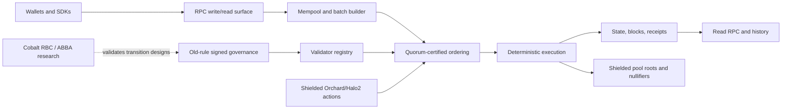

# PostFiat L1

> **Maturity:** controlled pre-testnet research software. This repository is
> not a production/mainnet release. Validator operation currently requires an
> explicit `--unsafe-devnet-file-signer` acknowledgement because HSM/remote
> signing is not implemented, and long-running validator/RPC services require
> `--unsafe-devnet-json-storage` because the bounded JSON/JSONL store is not a
> transactional indexed production engine. Do not place real-value keys or
> value on this controlled-devnet configuration.

PostFiat is a Rust Layer 1 settlement system for post-quantum, privacy-aware institutional value transfer: transparent accounts use ML-DSA authorization from genesis, shielded settlement is built around Orchard/Halo2-style proofs, and quorum certificates provide deterministic finality. The current candidate admits live governance only through distinct ML-DSA-65 authorizations from the active old-rule registry; unsigned legacy governance artifacts are historical-replay-only. Cobalt RBC/ABBA remain separately signed research primitives and are not the node's authoritative governance admission path.



## Key Features

- Post-quantum from genesis: ML-DSA account and validator authorization.
- Shielded settlement: Orchard/Halo2 proof verification with public nullifier and root checks.
- Halo2 dependency boundary: PostFiat does not reimplement Halo2. The privacy
  verifier uses Zcash's upstream `halo2_proofs 0.3.2` at an immutable commit,
  retained in-tree with a reproducibly verified compatibility patch for pinned
  verifying-key assembly loading. The patch does not intentionally change the
  proof algorithm, verifier equations, transcript, fields, curves, or proof
  encoding. See [Halo2 Dependency And Local Patch Boundary](docs/security/halo2-dependency.md).
- Signed governance admission: live amendments and registry changes require a
  quorum of distinct ML-DSA-65 authorizations from the active old-rule registry;
  unsigned legacy artifacts are replay-only.
- Versioned quorum-certified finality: legacy genesis retains the single-view fail-closed rule; networks with an explicit consensus-v2 activation height use durable prepare/precommit locks, signed timeout certificates, and deterministic proposer rotation.
- Multiple settlement lanes: consensus-ordered account and issued-asset
  transactions, W6 dual-authorized atomic swaps, FastPay single-owner payments,
  FastSwap dual-owner DvP, and Asset-Orchard private settlement.
- Fixed supply plus fee burn: transparent fees burn during deterministic execution.

## Implementation Status

| Capability | Current source status |
| --- | --- |
| Consensus v2 | Implemented with durable prepare/precommit state, timeout certificates, and view rotation when activated by network configuration/governance. |
| W6 atomic swap | Implemented as one consensus transaction with two owner authorizations and both-or-neither execution. |
| FastPay | Implemented for prefunded single-owner PFT objects with signed admission, distinct-validator certificates, durable apply, and ordered consume-or-cancel recovery. |
| FastSwap | Implemented for prefunded dual-owner objects with durable reservation, Confirm-or-Cancel certificates, conserved effects, catch-up, and restart recovery. Shared-network activation is a separate deployment decision. |
| Asset-Orchard | Implemented private ingress, transfer/swap, recovery, and egress path; legacy cleartext note actions are historical-replay-only. |
| Governance | Live mutation requires signed old-rule authorization. Cobalt trust-graph/RBC/ABBA machinery remains research and transition-validation work, not the node's live authorization oracle. |

See [Settlement Lanes](docs/architecture/settlement-lanes.md) for the protocol
boundaries and [Public Launch Boundary](docs/security/public-launch-boundary.md)
for what remains before real-value operation.

## Build From Source

Prerequisites:

- Rust toolchain, including `cargo`, `rustfmt`, and `clippy`
- `tmux` for local/devnet operations

```bash
scripts/check
scripts/node-init
scripts/node-run
```

Useful single-node commands:

```bash
scripts/node-status
scripts/node-faucet
scripts/node-transfer
scripts/node-account
```

## Run A Local Devnet

```bash
scripts/devnet-up
scripts/devnet-submit-transfer
scripts/devnet-status
scripts/devnet-down
```

## Documentation

- Whitepaper: [docs/whitepaper.md](docs/whitepaper.md)
- MkDocs site: [http://127.0.0.1:8088/](http://127.0.0.1:8088/) by default when served locally
- Engineering docs source: [docs/](docs/)
- MkDocs config: [mkdocs.yml](mkdocs.yml)

Run the docs site locally:

```bash
.venv-docs/bin/mkdocs serve
```

If you do not have the repo-local docs venv, install the docs requirements and run `mkdocs serve`.

## Contributing

See [CONTRIBUTING.md](CONTRIBUTING.md) for build, test, evidence, and PR expectations.

## License

Licensed under either MIT or Apache-2.0, at your option.
