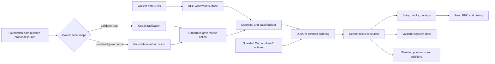

# PostFiat L1

> **Maturity:** controlled pre-testnet research software. This repository is
> not a production/mainnet release. Validator operation currently requires an
> explicit `--unsafe-devnet-file-signer` acknowledgement because HSM/remote
> signing is not implemented. Long-running legacy/JSONL services require
> `--unsafe-devnet-json-storage`; an authenticated transactional generation can
> satisfy the separate activation/readiness gate. Transactional storage does
> not remove the controlled-devnet maturity boundary. Do not place real-value
> keys or value on this configuration.

PostFiat is a Rust Layer 1 settlement system: transparent accounts use ML-DSA authorization, private Asset-Orchard actions use Orchard/Halo2, and Consensus v2 supplies activated block finality. Cobalt has a separate bounded validator-trust authority scope. The retained August 31 storage deployment receipt records activation at height 930 and six-validator continuation at 931. Earlier Cobalt drills through height 924 closed `KEEP_ACTIVE`. These are dated observations, not a fresh fleet-health query; current Git HEAD is not a running-release identity.

See [Current State](docs/status/chain-state-current.md) for the exact live observation, deployed release lineage, repository HEAD, adversarial campaign status, and freshness boundary.


```mermaid
flowchart LR
  Wallet[Wallets and SDKs] --> RPC[RPC write/read surface]
  RPC --> Mempool[Mempool and batch builder]
  Mempool --> Ordering[Quorum-certified ordering]
  Ordering --> Execution[Deterministic execution]
  Execution --> Storage[State, blocks, receipts]
  Storage --> Reads[Read RPC and history]

  Proposal[Foundation-administered proposal source] --> Scope{Governance scope}
  Scope -->|validator trust| Cobalt[Cobalt ratification]
  Scope -->|unrelated governance| Foundation[Foundation authorization]
  Cobalt --> GovAction[Authorized governance action]
  Foundation --> GovAction
  GovAction --> Mempool
  Execution --> Registry[Validator registry state]

  Shielded[Shielded Orchard/Halo2 actions] --> Ordering
  Execution --> Pool[Shielded pool roots and nullifiers]
```

## Key Features

- Post-quantum from genesis: ML-DSA account and validator authorization.
- Shielded settlement: Orchard/Halo2 proof verification with public nullifier and root checks.
- Halo2 dependency boundary: PostFiat does not reimplement Halo2. The privacy
  verifier uses Zcash's upstream `halo2_proofs 0.3.2` at an immutable commit,
  retained in-tree with a reproducibly verified compatibility patch for pinned
  verifying-key assembly loading. The patch does not intentionally change the
  proof algorithm, verifier equations, transcript, fields, curves, or proof
  encoding. See [Halo2 Dependency And Local Patch Boundary](docs/security/halo2-dependency.md).
- Versioned governance admission: Cobalt-authorized validator-trust updates require
  a key-bound RBC → ABBA → MVBA → DABC decision certificate. The controlled testnet
  activated this authority at height 916, committed its first validator-key
  rotation at height 917, and committed the adversarial drill rotation at height
  924 after the signed rollback/return pair. Mixed authority and new-set
  self-authorization are rejected.
- Versioned quorum-certified finality: legacy genesis retains the single-view fail-closed rule; networks with an explicit consensus-v2 activation height use durable prepare/precommit locks, signed timeout certificates, and deterministic proposer rotation.
- Multiple settlement lanes: consensus-ordered account and issued-asset
  transactions, W6 dual-authorized atomic swaps, FastPay single-owner payments,
  FastSwap dual-owner DvP, and Asset-Orchard private settlement.
- Fixed supply plus fee burn: transparent fees burn during deterministic execution.

## Implementation Status

| Capability | Current source status |
| --- | --- |
| Consensus v2 | Implemented with durable prepare/precommit state, timeout certificates, and view rotation when activated by network configuration/governance. |
| W6 atomic swap | Implemented as one consensus transaction with two owner authorizations and both-or-neither execution. |
| FastPay | Implemented for prefunded single-owner PFT objects with signed admission, distinct-validator certificates, durable apply, and ordered consume-or-cancel recovery. |
| FastSwap | Implemented for prefunded dual-owner objects with durable reservation, Confirm-or-Cancel certificates, conserved effects, catch-up, and restart recovery. Shared-network activation is a separate deployment decision. |
| Asset-Orchard | Implemented private ingress, transfer/swap, recovery, and egress path; legacy cleartext note actions are historical-replay-only. |
| Governance | The final E5 audit found Cobalt active for validator-trust evolution with all six nodes converged at height 924 after the signed rollback/return drills and legitimate validator-5 rotation. Consensus v2 remains the sole block-finality protocol. The deployed node binary SHA-256 was `d5e5ef63…c2696caf`; current source HEAD is a separate evidence plane. See [Current State](docs/status/chain-state-current.md), the [adversarial results](docs/governance/cobalt-adversarial-verification-results.md), and the [E5 packet](benchmarks/cobalt-adversarial-verification/e5/README.md). |
| Storage scaling | Transactional `redb` storage is implemented. The retained `storage-lease-af9b83c3` receipt records six-validator activation/continuation at heights 930/931 on August 31. Earlier `d0ae79f3`/`10dd9f20` failures remain historical disqualifications. Deployment does not close every public-testnet gate; see [Current State](docs/status/chain-state-current.md) and the [active milestone](docs/plans/active/storage-scaling-milestone.md). |

See [Settlement Lanes](docs/architecture/settlement-lanes.md) for the protocol
boundaries and [Public Launch Boundary](docs/security/public-launch-boundary.md)
for what remains before real-value operation.

## Build From Source

Prerequisites:

- Rust toolchain, including `cargo`, `rustfmt`, and `clippy`
- `tmux` for local/devnet operations

```bash
scripts/check
scripts/node-init
scripts/node-run
```

Useful single-node commands:

```bash
scripts/node-status
scripts/node-faucet
scripts/node-transfer
scripts/node-account
```

## Run A Local Devnet

```bash
scripts/devnet-up
scripts/devnet-submit-transfer
scripts/devnet-status
scripts/devnet-down
```

## Documentation

- Whitepaper: [docs/whitepaper.md](docs/whitepaper.md)
- Whitepaper overview and code alignment: [audit guide](docs/architecture/whitepaper-overview.md), [claim matrix](docs/architecture/whitepaper-alignment.md), [remaining gaps](docs/architecture/whitepaper-gaps.md)
- MkDocs site: [http://127.0.0.1:8088/](http://127.0.0.1:8088/) by default when served locally
- Engineering docs source: [docs/](docs/)
- MkDocs config: [mkdocs.yml](mkdocs.yml)

Run the docs site locally:

```bash
.venv-docs/bin/mkdocs serve
```

If you do not have the repo-local docs venv, install the docs requirements and run `mkdocs serve`.

## Contributing

See [CONTRIBUTING.md](CONTRIBUTING.md) for build, test, evidence, and PR expectations.

## License

Licensed under either MIT or Apache-2.0, at your option.
