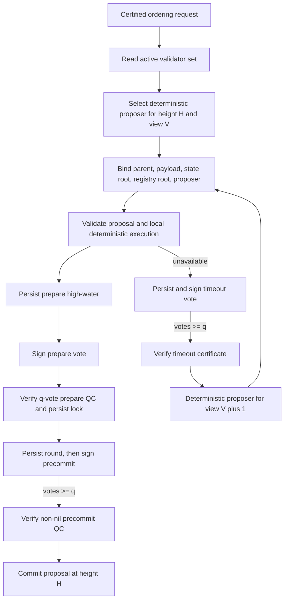

# Finality

PostFiat has two versioned finality modes. A genesis that omits
`consensus_v2_activation_height` retains the legacy single-view,
direct-certificate rule. A network that commits an activation height uses that
legacy rule below the boundary and consensus v2 at and above it. Consensus v2
is an explicit prepare/precommit protocol; it is not chained HotStuff.

For `n` active validators, `f = floor((n - 1) / 3)` and
`q = floor(2n / 3) + 1`. Every v2 artifact binds the chain/genesis/protocol,
committee epoch/root, height/view, parent, payload, resulting state root,
validator and phase. At each height:

- the deterministic proposer for `(height, view)` signs the exact proposal;
- validators verify deterministic execution, then atomically persist their
  highest prepare round before signing a prepare vote;
- `q` distinct prepare votes form a prepare QC, which becomes the durable lock;
- validators persist the lock/high-QC and precommit round before signing;
- `q` distinct precommit votes for the same non-nil block form the only commit QC.

A lone prepare QC and the legacy direct certificate have no commit authority
after activation. The committed block embeds its proposal, optional timeout
ancestry, prepare QC and precommit QC, so history replay does not trust an
in-memory cache. Snapshot v6 retains signer safety and verified-QC artifacts.

## View-change boundary

Before activation, nonzero views remain disabled. After activation, view
`V + 1` requires a signed timeout certificate for the same height at view `V`.
The certificate's high QC is a typed reference resolved against a fully verified
prepare QC graph; heterogeneous opaque legacy IDs fail closed. A later-view
proposal must carry that exact timeout ID and the same valid-QC reference. If it
is locked, the proposal must repropose the certified block rather than switch to
a conflicting state transition.

Timeout and vote high-water marks are persisted before signatures are returned.
The production transport uses these same types and store calls from
`crates/ordering_fast`; the ordering crate is no longer merely a disconnected
reference model for activated consensus v2.

Because existing network genesis is immutable and signed protocol governance is
not yet enabled, an existing single-view network cannot silently activate v2.
Its safe migration is a planned reset/new genesis, with the old history frozen
and replayed independently. New v2 networks may choose an activation height at
genesis and replay the legacy prefix followed by v2 blocks.

## Client finality

Clients must verify the certificate and the transaction receipt code. A
converged or certified block may contain a rejected transaction receipt, so
block finality alone is not transaction success. Full state replay remains an
out-of-band audit path.

## Source anchors

- `crates/node/src/block_finality.rs`
- `crates/node/src/batch_snapshot.rs`
- `crates/node/src/consensus_artifacts.rs`
- `crates/node/src/consensus_v2_finality.rs`
- `crates/node/src/consensus_v2_store.rs`
- `crates/ordering_fast/src/consensus_v2.rs`
- `crates/node/src/tests/consensus_history.rs`
