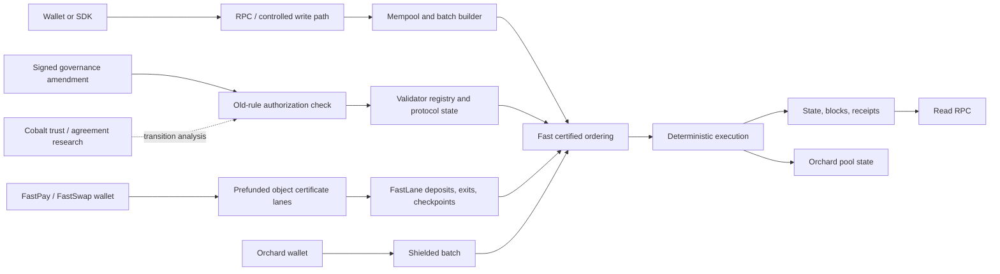

# Architecture Overview

PostFiat has four protocol planes:

1. consensus ordering for account, issued-asset, W6 atomic-swap, governance,
   bridge, and shielded batches;
2. prefunded object-certificate lanes for FastPay and FastSwap;
3. signed old-rule governance for live validator and protocol mutation, with
   Cobalt mechanics kept as a separate research/transition-validation layer;
4. privacy execution for Orchard/Halo2 shielded value.

## Core Crates

| Crate | Role |
| --- | --- |
| `crates/types` | Protocol data structures and IDs. |
| `crates/crypto_provider` | Signing and verification. |
| `crates/execution` | State transition. |
| `crates/ordering_fast` | Certified ordering path. |
| `crates/consensus_cobalt` | Cobalt trust-graph and agreement research mechanics. |
| `crates/fastpay-prototype` | FastPay safety and recovery models. |
| `crates/privacy_orchard` | PostFiat adapter over the upstream Rust/Zcash Orchard/Halo2 implementation. |
| `crates/storage` | Persistent state and snapshots. |
| `crates/node` | Node orchestration, CLI, RPC, wallet flows. |

## Crate Dependency Graph

Arrows point from a crate to the local crate it depends on.

```mermaid
flowchart TD
  types[crates/types<br/>protocol data structures]
  crypto[crates/crypto_provider<br/>signing and verification]

  bridge[crates/bridge<br/>bridge packet types]
  cobalt[crates/consensus_cobalt<br/>Cobalt governance]
  execution[crates/execution<br/>state transition]
  fastpay[crates/fastpay-prototype<br/>fast payment prototype]
  mempool[crates/mempool_dag<br/>mempool DAG]
  network[crates/network<br/>transport substrate]
  ordering[crates/ordering_fast<br/>certified ordering]
  privacy[crates/privacy<br/>privacy interfaces]
  orchard[crates/privacy_orchard<br/>Orchard/Halo2 adapter]
  proofs[crates/proofs<br/>proof abstractions]
  rpc[crates/rpc_sdk<br/>client RPC SDK]
  storage[crates/storage<br/>state and snapshots]

  node[crates/node<br/>node orchestration and CLI]
  bench[crates/bench_harness<br/>benchmark harness]
  fuzz[crates/fuzz_harness<br/>fuzz and adversarial harness]
  eth[crates/ethereum-contracts<br/>EVM bridge contracts]

  bridge --> crypto
  bridge --> types
  cobalt --> crypto
  cobalt --> types
  execution --> crypto
  execution --> types
  fastpay --> crypto
  fastpay --> types
  fastpay --> execution
  mempool --> crypto
  mempool --> types
  network --> crypto
  ordering --> crypto
  ordering --> mempool
  privacy --> crypto
  privacy --> proofs
  privacy --> types
  orchard --> crypto
  proofs --> crypto
  rpc --> crypto
  rpc --> types
  storage --> types

  node --> bridge
  node --> crypto
  node --> cobalt
  node --> execution
  node --> mempool
  node --> network
  node --> ordering
  node --> privacy
  node --> orchard
  node --> rpc
  node --> storage
  node --> types

  bench --> bridge
  bench --> crypto
  bench --> execution
  bench --> mempool
  bench --> ordering
  bench --> privacy
  bench --> proofs
  bench --> storage
  bench --> types

  fuzz --> bridge
  fuzz --> cobalt
  fuzz --> crypto
  fuzz --> execution
  fuzz --> mempool
  fuzz --> network
  fuzz --> ordering
  fuzz --> privacy
  fuzz --> orchard
  fuzz --> proofs
  fuzz --> types

  eth -. bridge ABI and withdrawal verification .-> bridge
```

## Design Principles

- Consensus data must be deterministic and replayable.
- Public inputs must be bounded before expensive verification.
- Governance changes must be signed, ordered, and replayable.
- Privacy claims must be tied to the real Orchard/Halo2 path, not debug proof
  scaffolding.
- Operator evidence must be machine-readable.

The lanes deliberately do not share one success rule. A consensus transaction
needs a valid block certificate and an accepted receipt code. FastPay and
FastSwap additionally require their lane-specific signed intent, certificate,
and durability rules. See [Settlement Lanes](settlement-lanes.md).
