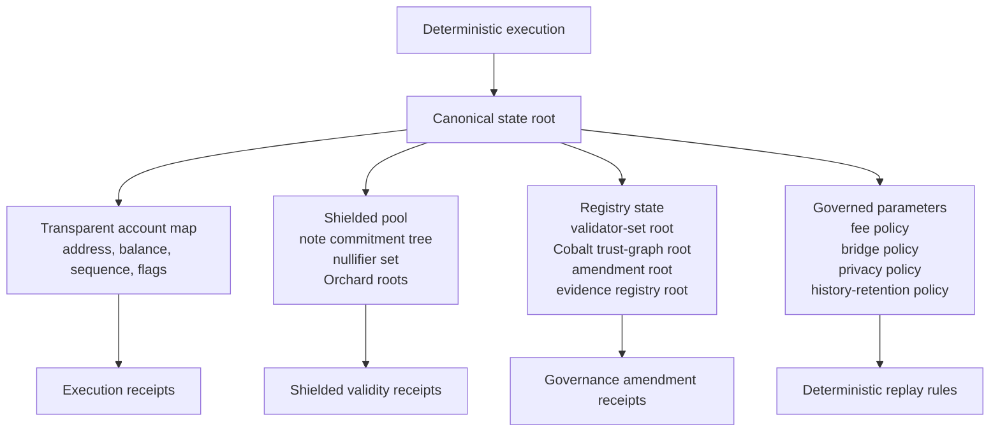
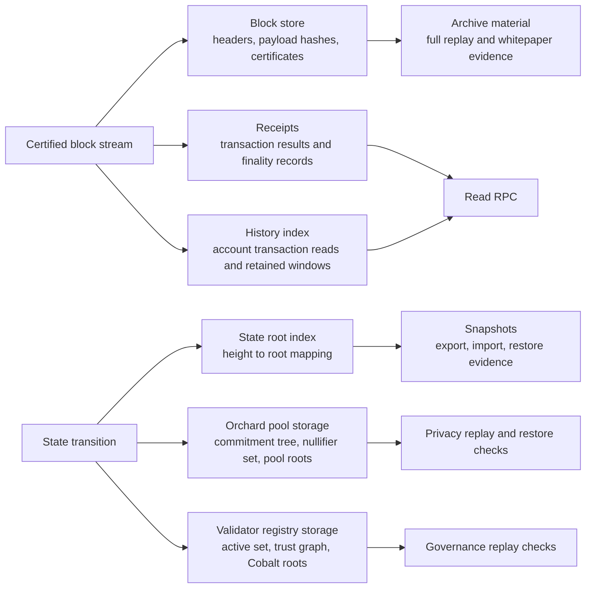
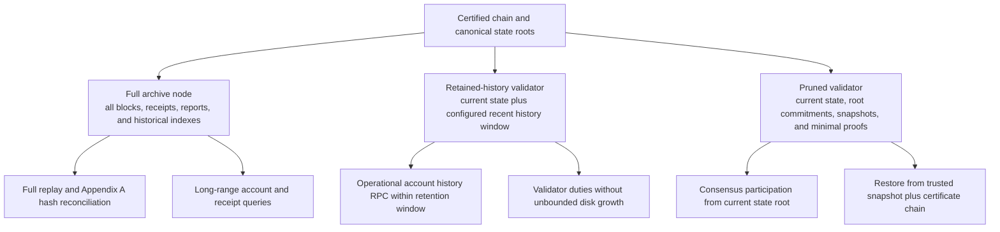

# State And Storage

PostFiat stores enough data to verify current state, serve account history, and
replay evidence without forcing every validator to retain every byte forever.

## State Objects

- accounts and balances;
- blocks and block headers;
- receipts and transaction finality records;
- validator registry and governance roots;
- Orchard pool roots, commitments, nullifiers, and public telemetry;
- retained-history indexes for account transaction reads;
- snapshots and archive material.

## Storage Layers

## Partial History

Validators can have history roles. Full archive behavior and retained-history
behavior are separated so ordinary validators can operate without unbounded
chain-size growth.

Important sources:

- `crates/storage/src/lib.rs`
- `crates/node/src/history.rs`
- `docs/runbooks/validator-history-retention.md`
- `docs/runbooks/account-tx-index.md`
- `docs/status/controlled-testnet-history-roles.json`

## Snapshot And Replay

Snapshot export/import is part of the operator evidence surface. Privacy
snapshot evidence verifies Orchard pool counters and roots after restore.
Governance replay evidence verifies Cobalt lifecycle and amendment bundles.
