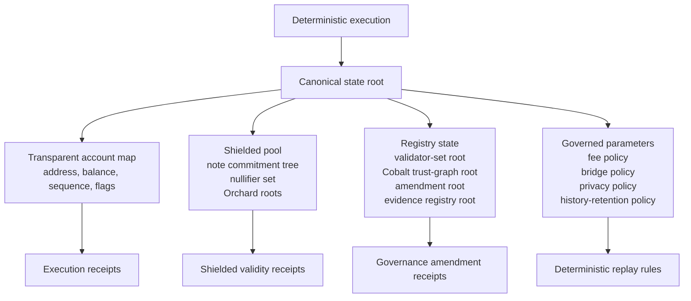
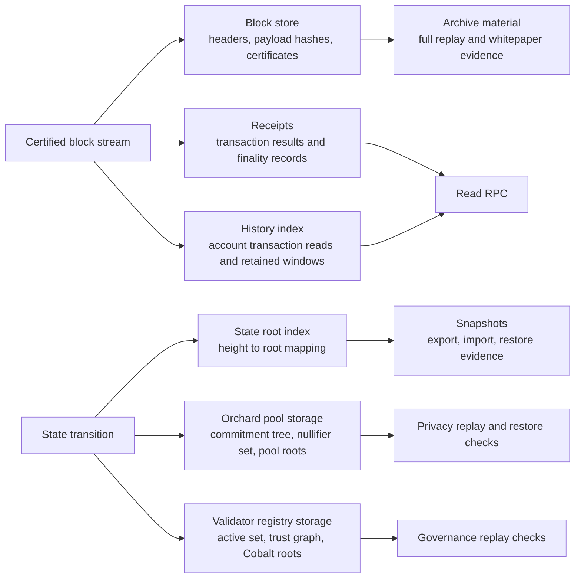
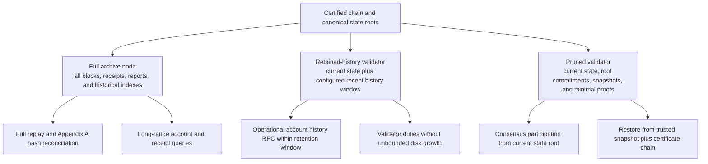

# State And Storage

PostFiat stores enough data to verify current state, serve account history, and
replay evidence without forcing every validator to retain every byte forever.

## State Objects

- accounts and balances;
- blocks and block headers;
- receipts and transaction finality records;
- validator registry and governance roots;
- Orchard pool roots, commitments, nullifiers, and public telemetry;
- retained-history indexes for account transaction reads;
- snapshots and archive material.


```mermaid
flowchart TB
  Execution[Deterministic execution] --> StateRoot[Canonical state root]

  StateRoot --> Accounts[Transparent account map<br/>address, balance, sequence, flags]
  StateRoot --> Shielded[Shielded pool<br/>note commitment tree<br/>nullifier set<br/>Orchard roots]
  StateRoot --> Registry[Registry state<br/>validator-set root<br/>Cobalt trust-graph root<br/>amendment root<br/>evidence registry root]
  StateRoot --> Parameters[Governed parameters<br/>fee policy<br/>bridge policy<br/>privacy policy<br/>history-retention policy]

  Accounts --> Receipts[Execution receipts]
  Shielded --> PrivacyReceipts[Shielded validity receipts]
  Registry --> GovernanceReceipts[Governance amendment receipts]
  Parameters --> ReplayRules[Deterministic replay rules]
```

## Storage Layers


```mermaid
flowchart LR
  CertifiedBlocks[Certified block stream] --> BlockStore[Block store<br/>headers, payload hashes, certificates]
  CertifiedBlocks --> ReceiptStore[Receipts<br/>transaction results and finality records]
  CertifiedBlocks --> HistoryIndex[History index<br/>account transaction reads and retained windows]

  Execution[State transition] --> StateRootIndex[State root index<br/>height to root mapping]
  Execution --> OrchardPool[Orchard pool storage<br/>commitment tree, nullifier set, pool roots]
  Execution --> ValidatorRegistry[Validator registry storage<br/>active set, trust graph, Cobalt roots]

  StateRootIndex --> Snapshots[Snapshots<br/>export, import, restore evidence]
  BlockStore --> Archive[Archive material<br/>full replay and whitepaper evidence]
  ReceiptStore --> ReadRPC[Read RPC]
  HistoryIndex --> ReadRPC
  OrchardPool --> PrivacyReplay[Privacy replay and restore checks]
  ValidatorRegistry --> GovernanceReplay[Governance replay checks]
```

## Transactional finality-path candidate

The active storage-scaling milestone selects an embedded transactional `redb`
store for finalized blocks, receipts, archived batches, ordered membership,
current state, history indexes, and chain-tip metadata. One finalized height is
committed in one write transaction with an expected-parent check. Proposal,
validation, state commitment, and finalized commit use a constant-size
ordered-history accumulator and indexed membership instead of materializing the
full ordered-batch history.

Authenticated JSONL v2 heads remain available for bounded legacy import, audit,
and comparison. Each transactional rebuild also emits a deterministic
`canonical-history.jsonl` audit export whose record count and SHA3-384 root are
verified against the authenticated database; missing, corrupted, or substituted
exports fail closed during independent verify-only. The export is never read or
written by proposal, voting, or finalized commit. The fixed-slot bitmap remains
a superseded bounded-work experiment; neither JSONL surface is the selected
primary finality-path store. Legacy heights retain their exact list-based state
roots, and the transactional generation can be rebuilt or verified offline
with:

```bash
postfiat-node storage-rebuild-transactional --data-dir PATH --output-dir PATH \
  --offline-confirmed
postfiat-node storage-rebuild-transactional --data-dir PATH --output-dir PATH \
  --expected-tip HASH --expected-state-root HASH --verify-only \
  --offline-confirmed
```

The verification form is strictly non-mutating. It requires existing source
and target directories plus the existing source integrity key, opens the
transactional database through `redb`'s read-only interface, and refuses a
pending source journal instead of recovering it. In-memory chain-tip
reconstruction is allowed, but chain-tip repair, JSONL v1-head upgrades,
crash-suffix truncation/checkpointing, manifest writes, and export writes are
not. Whole-directory mutation-sentinel tests cover successful verification and
each repair/refusal boundary.

This source is an undeployed development candidate. Canonical snapshot/restore,
rebuild, retained-history equality, exact height-915 replay, the closed 69-case
tamper/crash matrix, compatible two-binary rollback, and a development-only
height-501 six-clone migration rehearsal pass offline. Exact height 924,
clean-source existing-chain migration qualification, paired release-mode
six-validator performance, and the final packet remain open. See the [Storage Scaling Fix implementation specification](storage-scaling-fix-spec.md),
the [active milestone](../plans/active/storage-scaling-milestone.md), and
[development evidence](https://github.com/postfiatorg/postfiatl1v2/tree/main/benchmarks/storage-scaling).
Public testnet remains blocked.

## Partial History

Validators can have history roles. Full archive behavior and retained-history
behavior are separated so ordinary validators can operate without unbounded
chain-size growth.


```mermaid
flowchart TD
  Chain[Certified chain and canonical state roots] --> FullArchive[Full archive node<br/>all blocks, receipts, reports, and historical indexes]
  Chain --> Retained[Retained-history validator<br/>current state plus configured recent history window]
  Chain --> Pruned[Pruned validator<br/>current state, root commitments, snapshots, and minimal proofs]

  FullArchive --> FullReplay[Full replay and Appendix A hash reconciliation]
  FullArchive --> HistoricalQueries[Long-range account and receipt queries]

  Retained --> OperationalRPC[Operational account history RPC within retention window]
  Retained --> ValidatorDuties[Validator duties without unbounded disk growth]

  Pruned --> ConsensusParticipation[Consensus participation from current state root]
  Pruned --> RestoreFromSnapshot[Restore from trusted snapshot plus certificate chain]
```

Important sources:

- `crates/storage/src/lib.rs`
- `crates/node/src/history.rs`
- `docs/runbooks/validator-history-retention.md`
- `docs/runbooks/account-tx-index.md`
- `docs/status/controlled-testnet-history-roles.json`

## Snapshot And Replay

Snapshot export/import is part of the operator evidence surface. Privacy
snapshot evidence verifies Orchard pool counters and roots after restore.
Governance replay evidence verifies Cobalt lifecycle and amendment bundles.
