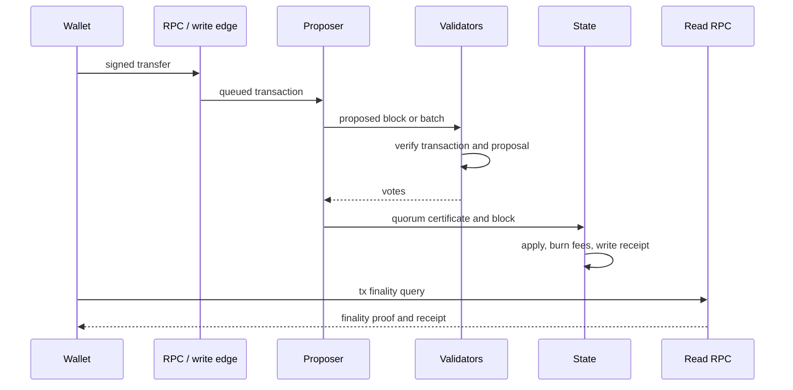

# Transaction Lifecycle

Transparent transfers follow a direct path from wallet signature to finality
receipt.

## Steps

1. The wallet signs a transaction using post-quantum account authorization.
2. The transaction enters a controlled write path or validator mempool.
3. A proposer forms a block or batch.
4. Validators verify the proposal and vote.
5. Quorum votes form a certificate.
6. The node commits the block, advances the state root, burns fees, and writes
   receipts.
7. Clients use read RPC to query `tx`, account state, receipts, and account
   history.

## Source Anchors

- `crates/types/src/lib.rs`
- `crates/execution/src/lib.rs`
- `crates/node/src/lib.rs`
- `crates/node/src/block_finality.rs`
- `crates/rpc_sdk/src/lib.rs`
