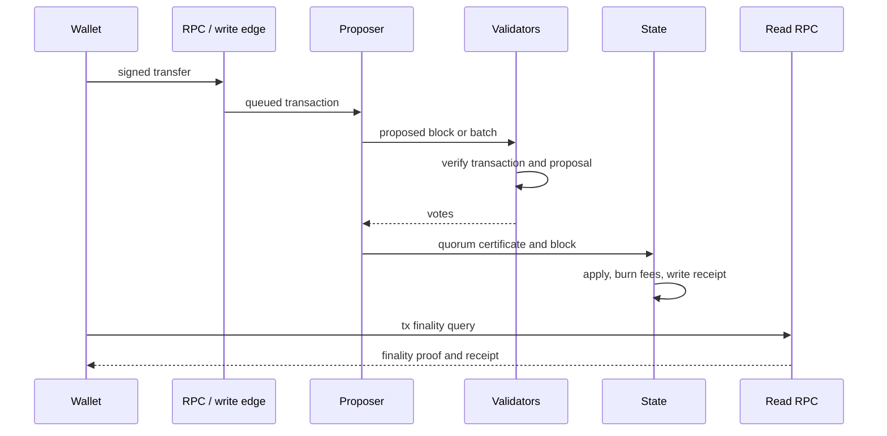

# Transaction Lifecycle

Consensus-ordered transactions follow a direct path from wallet signature to a
certified block and transaction receipt. FastPay, FastSwap, and Asset-Orchard
have additional lane-specific authorization and recovery rules described in
[Settlement Lanes](settlement-lanes.md).

## Steps

1. The wallet signs a transaction using post-quantum account authorization.
2. The transaction enters a controlled write path or validator mempool.
3. A proposer forms a block or batch.
4. Validators verify the proposal and vote.
5. Quorum votes form a certificate.
6. The node commits the block, advances the state root, burns fees, and writes
   receipts.
7. Clients use read RPC to query `tx`, account state, receipts, and account
   history.

Receipt semantics are mandatory: a committed block may contain a rejected
transaction. Wallets report success only when the finality proof verifies and
the matching receipt code is accepted.

## Atomic and object-lane paths

- A W6 atomic swap is one consensus transaction. Both owners sign one exact
  reciprocal intent; execution verifies quote/parent/freshness constraints and
  moves both legs atomically or rejects without partial value movement.
- A FastPay payment reserves one prefunded owned object after owner and live
  state validation, aggregates distinct-validator votes, and durably applies a
  certified transfer or unwrap. Ordered recovery resolves abandoned locks.
- A FastSwap intent contains two owner authorizations over one DvP. Validators
  atomically reserve all inputs, certify one Confirm-or-Cancel decision, and
  certify conserved terminal effects. Catch-up repairs replicas without
  changing quorum finality.
- Asset-Orchard verifies the proof, anchor, nullifiers, authorization, encrypted
  outputs, and public turnstile accounting before committing private effects.

## Source Anchors

- `crates/types/src/lib.rs`
- `crates/execution/src/lib.rs`
- `crates/node/src/lib.rs`
- `crates/node/src/block_finality.rs`
- `crates/types/src/transactions_mempool_receipts.rs`
- `crates/types/src/fastswap_types.rs`
- `crates/execution/src/owned_transfer.rs`
- `crates/execution/src/fastswap.rs`
- `crates/privacy_orchard/src/lib.rs`
- `crates/rpc_sdk/src/lib.rs`
