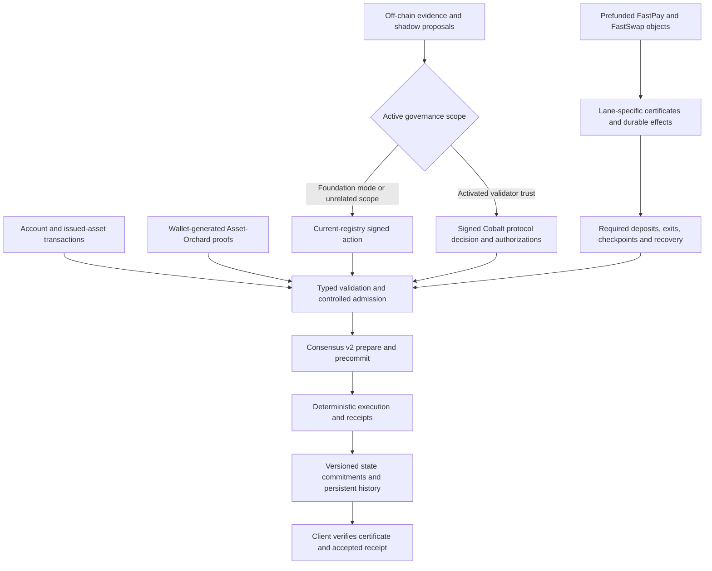

# Whitepaper overview and implementation guide

PostFiat is an authority-validated settlement ledger with several distinct settlement and governance paths. Its code supports substantially more than the whitepaper's July Cobalt boundary describes, while some of the paper's admission, privacy-containment and certificate-cost statements are broader than the implementation or retained evidence supports. This audit corrects those statements and records the remaining limits.

Read the [whitepaper](../whitepaper.md) for the protocol argument, the [73-claim alignment table](whitepaper-alignment.md) for source/test references, the [prioritized gaps](whitepaper-gaps.md) for follow-up work, and the [validation record](whitepaper-validation.md) for checks actually run. The [Cobalt and admission publication follow-up](cobalt-admission-publication-review.md) explains the expanded whitepaper and blog corrections. These documents do not certify mainnet readiness or current fleet health.

## Identity and reading order

| Input | Audited identity |
| --- | --- |
| Repository | `postfiatorg/postfiatl1v2` at `d351353e57b295368450a57866ace17b5e1ce6ad` |
| Canonical protocol candidate | `docs/whitepaper.md`, Version 3, June 2026; July 2026 implementation reconciliation |
| Original paper SHA-256 | `83fa0951a27d8278b0fa6435d49931e406941a6860adf13f28d376fea600cc98` |
| Original downloadable copy SHA-256 | `07263d9e45359dcc8d5e27b2dc113c80588a634a192bb2af3a86f2a89bf4578e`; stale before this patch |
| Commercial paper | `docs/business/whitepaper.md`; explicitly non-normative, not an alternate protocol specification |
| Method | Complete paper read; every numbered section/subsection, Abstract, E1–E8 and References inventoried; owning code and relevant retained tests inspected |
| Work boundary | Isolated documentation/tooling branch; unrelated main-checkout edits excluded; no runtime semantics or deployment changes |

The corrected paper is a descendant of the original hash above. The inventory deliberately retains original wording locators and baseline source links, so a later correction cannot erase what the audit found. **Divergent** in that table can therefore mean a documentation discrepancy fixed in this patch. Each row gives its disposition.

“Implemented-and-tested” means a relevant retained test supports the stated narrower behavior. It does not imply every cited test was run here. A test fixture, a source implementation, an archived fleet observation and a research proposition are different forms of evidence. The CLI checks inventory integrity; human review establishes the interpretation.

## How the system fits together



Consensus orders a block; execution decides whether each transaction succeeds. A valid block certificate can accompany a rejected receipt. FastPay and FastSwap have their own owned-object certificates and recovery conditions. Cobalt decides a bounded validator-trust action; it does not finalize blocks or choose trustworthy institutions from raw evidence. Asset-Orchard proofs protect a specific private-action boundary; public ingress and egress deliberately reveal more.

## Section-by-section guide

| Paper section | Meaning and audited implementation boundary |
| --- | --- |
| Abstract; §1 and §§1.1–1.2 | The thesis is known-operator settlement without native validator subsidies, with explicit trust evolution and privacy. Fail-closed and old-rules-first are engineering invariants; least machinery and natural-stakeholder economics are design principles. Missing model input holds in the controlled required-model profile, not in every imaginable policy. The canonical paper and evidence identities must remain separate. |
| §2 | The argument assumes a bounded Byzantine population, sufficient honest quorum, partial synchrony for liveness and unbroken cryptography. Code checks signatures, domains and arithmetic; it cannot prove operator independence or detect every correlated fault. ML-DSA account/validator authorization coexists with classical privacy, proof and external-chain assumptions. |
| §3 | State includes accounts, issued assets/trustlines, escrow/NFT/offer state, NAV/reserve/bridge records, FastLane/FastSwap, Orchard, governance and history. Native PFT supply is fixed and fees burn; issued assets can mint under their own rules. Family-specific fees exist, but the paper's complete resource-class tariff is unproven. Full FastLane state coverage and the indexed ordered-history accumulator have separate activation boundaries. |
| §4.1 | Genesis/governance activation selects legacy single-view finality or Consensus v2. V2 uses prepare then precommit, durable signer locks, verified timeout ancestry, distinct identities and deterministic proposer rotation. It is not chained HotStuff. The focused tests cover the exact domain/commit rule and bounded n=4/n=6 adversarial/restart models. |
| §§4.2–4.4 | Production inclusion uses fixed family order and within-family insertion order. Reference canonical ordering/admission receipts do not remove ingress or proposer power. No production threshold first-seen/omission accountability or automatic Negative-UNL quorum reduction was established. Loss of the normal quorum is a liveness failure. |
| §§5.1–5.2 | Natural exposure and accountability are the economic case for zero validator subsidy. This is a conditional recruitment/capture thesis, not a fact proved by a running controlled fleet. |
| §5.3 | The controlled admission selector checks supplied reliability/accountability/correlation fields and control groups, plus manifest/domain/linkedness flags. It does not independently verify all external facts or separately implement every exposure/attack term in the displayed formula. Reject reasons outrank holds. Its output is a candidate, not a live authorization. |
| §5.4 | The exact LaunchCertificate and seven-ratifier public-launch policy remain targets. Existing genesis bundles do not satisfy that exact object merely by containing some overlapping fields. |
| §§6.1–6.2 | A real versioned Cobalt handoff and scoped validator-trust certificate consumer now exist. The complete genesis/checker/profile/witness manifest and universal transition tuple remain broader targets. Foundation authority still governs unrelated scopes. |
| §§6.3–6.6 | Library code checks local inequalities, linkage under a supplied fault model, old/new intersection bounds and a derived bounded cover. The graph does not itself reveal Byzantine operators. A proposed witness cannot omit an unfavorable covered row. Empirical cover-size claims require their own input/output packet. |
| §§6.7–6.9 | The transition proposition is conditional on its stated cover, fault and signing assumptions. Retained adversarial evidence supports a bounded implementation, not the full open-network result. Signed forward authority rollback/return exists; the general emergency/availability-suspension design does not. |
| §§7.1–7.3 | Asset-Orchard private swaps hide note openings and raw private asset/value data. Ingress/egress have public amounts/assets/endpoints. Validators verify upstream-backed proofs and authorization; proving belongs outside validator services. RedPallas binds private actions; ShieldedActionBatch has no account ML-DSA outer envelope. Legacy/pre-repin archive handling is a separate, exact replay boundary. |
| §§7.4–7.6 | Per-asset turnstiles bound public withdrawals; counterfeit notes could still consume existing pool value. An underflow rejection does not automatically pause the pool or restore funds. Registry and nullifier state share commitments, but dedicated cross-boundary coverage needs care. Local disclosure works; archived assurance/metadata fixtures are not universal live privacy controls. Timing and public boundary fields remain visible; note encryption is classical. |
| §§8.1–8.2 | Model work stays in off-chain tooling. A parser/selector can convert supplied evidence into a candidate, but active authority must validate and order a live action. Later Task Node UNL work is shadow-only. The paper's old “current” pipeline omitted activated Cobalt and has been corrected. |
| §§8.3–8.4 | A root-shaped replay-certificate field is not verification of independent replay signatures. The complete replay-profile/quorum pipeline remains a target. The worked shared-control hold is illustrative; current selector policy rejects the explicit shared-control case. |
| §§8.5–8.6 | Repeatability is profile- and packet-specific. Original E5–E7 reports are absent here, and summaries of different Apple/GPU probes cannot be conflated. Model promotion is separate from admission and is not automatically within current Cobalt authority. |
| §§9.1–9.3 | ML-DSA-65 has 1,952-byte public keys and 3,309-byte signatures. V2 serializes public keys and multiple signed stages; the paper's 80,184/223,847-byte examples are simplified single-set arithmetic, not wire sizes. Original timing evidence is unavailable. No implemented SLH-DSA recovery commitment, alternate verifier or automatic migration was found. |
| §§10–11 | Recovery and non-claims must be stated per mechanism. Quorum loss, classification ambiguity, invalid transitions and a cryptographic break have different responses. Trusted genesis, undeclared social dependencies, metadata leakage and controlled-testnet limits remain. |
| §12; References | XRPL, Cobalt, SCP, BFT, Orchard and NIST supply context. PostFiat's bounded implementations must be evaluated separately from the source papers. Representative primary references were checked; no full comparative proof or literature review is claimed. |
| Appendix A | E4's five named admission fixtures are retained and rerun. E8 has identifiable current finality/governance tests. E1/E2/E3/E5/E6/E7 have incomplete original measurement provenance in this checkout; see the individual inventory rows. |

## Operational record versus source

The retained `deployments/storage-lease-20260831/deploy-receipt.json` records transactional activation at height 930 and six-validator continuation at height 931, with release `storage-lease-af9b83c3`, source `af9b83c355267f18cd2b1b173b25fed57553a8ed` and binary `383f4325…141a7a`. This supersedes the earlier failed-candidate/height-924 summaries as a **recorded storage observation**. The whitepaper audit did not query the fleet or independently reproduce that deployment.

Earlier Cobalt E5 observations record authority drills through height 924; they remain the evidence for those events. The [operational-state page](../status/chain-state-current.md) now presents the records in chronological order. Deployment is not closure of every public-testnet gate, and the audit's source commit is not a running binary identity.

## Use the audit from a terminal

From the repository root:

```bash
PYTHONPATH=python python3 -m postfiat_rpc.whitepaper_audit --section 6
PYTHONPATH=python python3 -m postfiat_rpc.whitepaper_audit --section 7.4 --json
PYTHONPATH=python python3 -m postfiat_rpc.whitepaper_audit --check
PYTHONPATH=python python3 -m postfiat_rpc.whitepaper_audit --markdown
```

The CLI is read-only and offline. It verifies the original paper hash through Git, declared section coverage, E1–E8 coverage, local source anchors at the pinned commit, the generated table and the copied whitepaper. A shallow checkout lacking the baseline commit fails with a clear missing-baseline error; obtain that commit before using the check. A successful check does not attest to the truth of a claim, current source conformance, or live deployment.

After editing the JSON inventory, use `--markdown` to regenerate `docs/architecture/whitepaper-alignment.md`. After changing the canonical whitepaper, synchronize `docs/assets/raw/whitepaper.md.txt`. The repository's existing Python-based MkDocs CLI builds and serves the reader interface with these same pages.

## Primary references and review limits

The standards identification was checked against [NIST FIPS 204](https://csrc.nist.gov/pubs/fips/204/final) and [FIPS 205](https://csrc.nist.gov/pubs/fips/205/final). The distinction between the open-network research construction and this bounded implementation follows the scope of [MacBrough's Cobalt paper](https://arxiv.org/abs/1802.07240). [ZIP 224](https://zips.z.cash/zip-0224) identifies the upstream Orchard protocol; PostFiat's application circuits and adapters require their own review.

The audit covers the complete whitepaper's material claims, with explicit unresolved classifications where evidence is absent. It is not an independent cryptographic audit, a machine-checked transition proof, a new performance campaign, an evaluation of the truth of every operator evidence packet, or a fresh deployment attestation. Those are concrete backlog items rather than implicit completion claims.
