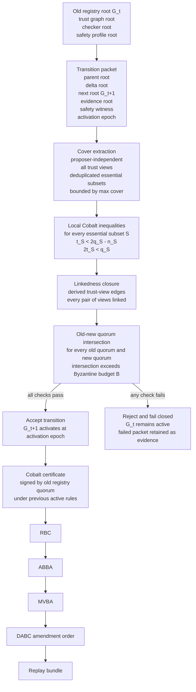
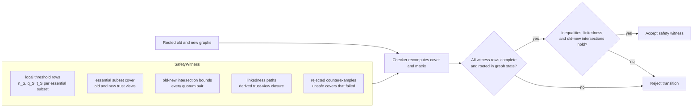

# Cobalt Implementation

The implementation lives in `crates/consensus_cobalt`.

## Core Mechanics

| Mechanic | Meaning |
| --- | --- |
| Trust view | A validator's local view of trusted validators and subsets. |
| Essential subset | A set with `t_S` and `q_S` thresholds. |
| Linkedness | Safety property checked before graph activation. |
| Non-uniform certificate | Certificate verified against local trust views rather than one global validator list. |
| RBC | Reliable broadcast for governance payloads. |
| ABBA | Binary agreement. |
| MVBA | Multi-valued agreement over candidate amendments. |
| DABC | Ordered democratic atomic broadcast for amendments. |

## Safety Witness Checker

`verify_cobalt_safety_witness` turns validator-registry transition safety into a
typed, hash-bound report. It validates the active parent graph, proposed child
graph, registry roots, activation height, challenge state, bounded
essential-subset cover, and every old/new subset intersection under the active
Byzantine budget.

`extract_cobalt_safety_cover` is the cover extractor used by the witness path.
It takes the old and new rooted trust graphs, derives every active essential
subset referenced by every trust view, deduplicates by subset id, rejects
inactive or conflicting rows, and emits a `CobaltCoverExtractionReport`. The
safety witness can be checked against that report with
`verify_cobalt_cover_extraction_matches_safety_witness`; an omitted cover row is
a deterministic verification failure.

The checker accepts a bounded one-validator rotation and rejects:

- stale parent roots;
- open challenge state;
- oversized essential-subset covers;
- a global Byzantine budget larger than the weakest covered subset's `t_S`;
- stale, inactive, or omitted cover rows;
- large simultaneous deltas whose old/new intersection can be entirely
  Byzantine, including the `A,B,C,D,E,F,G -> A,B,H,I,J,K,L` counterexample.

Run:

```bash
REPORT=reports/cobalt-safety-witness/20260526/cobalt-safety-witness-report.json \
REPORT_ROOT="$PWD" \
cargo run -p postfiat-consensus-cobalt --example cobalt_safety_witness
```

```bash
REPORT=reports/cobalt-cover-extractor-v1-report.json \
REPORT_ROOT="$PWD" \
cargo run -p postfiat-consensus-cobalt --example cobalt_cover_extractor
```

```bash
REPORT=reports/cobalt-cover-sizing-v1-report.json \
REPORT_ROOT="$PWD" \
cargo run -p postfiat-consensus-cobalt --example cobalt_cover_sizing
```

The sizing example checks grouped trust graphs: 35 validators with five groups
produce 12 old+new cover subsets, and 100 validators with ten groups produce
22, both under the current `max_cover_subsets=64` profile.

## Transition Safety Statement

An accepted transition preserves agreement and transition validity when:

- graph roots, registry roots, parent links, signatures, and challenge state
  verify under the old active rules;
- the extracted cover is complete and within the active cover bound;
- each active essential subset satisfies the local Cobalt inequalities;
- the active Byzantine budget is no larger than the smallest `t_S` in the
  covered old/new subsets;
- linkedness closure is safe for every signing view;
- every covered old quorum and new quorum intersects in more validators than
  the active Byzantine budget;
- correct validators do not sign conflicting roots for the same height, view,
  registry root, and transition root.

The proof obligation is mechanical: the old active checker derives the cover,
enumerates the old/new matrix, and accepts only if every cross-graph quorum pair
shares at least one validator that cannot be entirely Byzantine. A proposed
child graph cannot validate itself.

Adversarial bounded covers are handled by construction. Adding subsets increases
the matrix; conflicting subset ids fail validation; stale or inactive subset rows
fail extraction. Undeclared social or hosting correlation is handled as
validator evidence, not as a Cobalt cover edge, because Cobalt can only verify
declared protocol trust.

## Registry Evolution Flow

Validator-list changes are protocol state, not social coordination. Each
transition from `G_t` to `G_t+1` must pass the old active rules before the new
registry can activate.



## Safety Witness Schema



## Source Anchors

- `crates/consensus_cobalt/src/lib.rs`
- `crates/consensus_cobalt/src/lib_parts/cobalt_cover_extractor.rs`
- `crates/consensus_cobalt/src/lib_parts/trust_graph_governance.rs`
- `crates/consensus_cobalt/examples/cobalt_cover_extractor.rs`
- `crates/consensus_cobalt/examples/cobalt_cover_sizing.rs`
- `crates/consensus_cobalt/examples/cobalt_safety_witness.rs`
- `crates/consensus_cobalt/examples/current_trust_graph_root.rs`
- `scripts/testnet-cobalt-full-local-harness`
- `scripts/testnet-cobalt-full-remote-drill`
- `scripts/testnet-cobalt-controlled-readiness-gate`
- `docs/status/full-cobalt-burndown.md`

## Current Evidence

- `reports/testnet-cobalt-controlled-readiness-gate/amendment-replay-contract-clean-v0-20260519T145213Z/testnet-cobalt-controlled-readiness-gate.json`
- `reports/testnet-cobalt-gate-selection/amendment-replay-contract-clean-v0-20260519T145213Z/testnet-cobalt-gate-selection-self-test.json`
- `reports/testnet-cobalt-amendment-replay-bundle/cleanup-clean-v1-20260519T150324Z/testnet-cobalt-amendment-replay-bundle.json`
- `reports/cobalt-safety-witness/20260526/cobalt-safety-witness-report.json`
- `reports/cobalt-cover-extractor-v1-report.json`
- `reports/cobalt-cover-sizing-v1-report.json`
