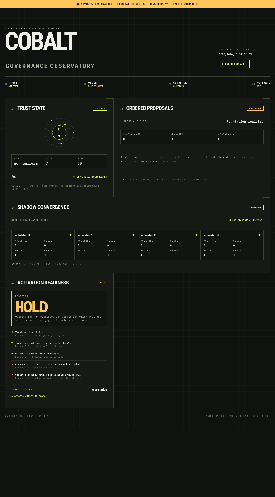

# Cobalt Governance

Cobalt is PostFiat's validator-trust governance lane. It does not order blocks,
finalize transactions, or replace consensus v2.

## Plain English

PostFiat validators may hold different local trust views. Cobalt checks whether
those views overlap safely and can agree on one ordered validator or trust-graph
change. An unsafe graph is rejected before it can gain authority.

The current authority rule is explicit:

1. A Cobalt shadow fleet may observe and agree on validator-trust changes, but
   shadow output has no live authority.
2. The active Foundation registry must sign one exact authority-transition
   record with a distinct ML-DSA-65 quorum.
3. Existing consensus v2 must order that record at its exact activation height.
4. Only then may the Cobalt lane authorize validator-trust updates. A new
   validator set cannot authorize itself.
5. Rollback is another signed, forward-moving transition. It cannot rewrite
   finalized history.

A Cobalt failure can therefore pause validator governance. It cannot create a
second block-finality protocol or change transaction success semantics.

## What Is Implemented

- non-identical trust views, essential subsets, linkedness, and bounded
  old/new safety witnesses;
- RBC, ABBA, MVBA, and DABC governance mechanics;
- a durable, authenticated, bounded four-node shadow service with production
  randomness and restart/replay fault drills;
- a versioned authority handoff binding the Cobalt lock, graph and registry
  roots, sequence, activation height, protocol version, scope, and old-registry
  ML-DSA-65 approvals;
- strict Foundation/Cobalt exclusivity, replay protection, and forward-only
  rollback;
- a Python CLI and read-only browser observatory backed by the real CLI and
  node state.

## Operator Interfaces

The CLI provides human-readable and JSON views:

```bash
PYTHONPATH=python python3 -m postfiat_rpc.cobalt trust-graph
PYTHONPATH=python python3 -m postfiat_rpc.cobalt transition-witness
PYTHONPATH=python python3 -m postfiat_rpc.cobalt protocol-replay
PYTHONPATH=python python3 -m postfiat_rpc.cobalt \
  --data-dir /path/to/shadow/validator-0 shadow-service-status
```

The browser interface requires a node data directory and a persisted shadow
fleet root:

```bash
PYTHONPATH=python python3 -m postfiat_rpc.cobalt_ui \
  --node-data-dir /path/to/node \
  --shadow-root /path/to/shadow-fleet
```

Open `http://127.0.0.1:8765`. The four surfaces show:

- verified trust state from the Cobalt CLI;
- recorded proposals and transitions from the node's MAC-validated
  `governance.json`;
- convergence from signed shadow-node status;
- an activation decision derived from all three sources.

The service has no governance mutation route. An empty node state is shown as
zero recorded proposals rather than being filled with sample data.



## Read Next

- [Implementation and verification](cobalt-implementation.md)
- [Validator Registry](validator-registry.md)
