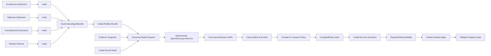
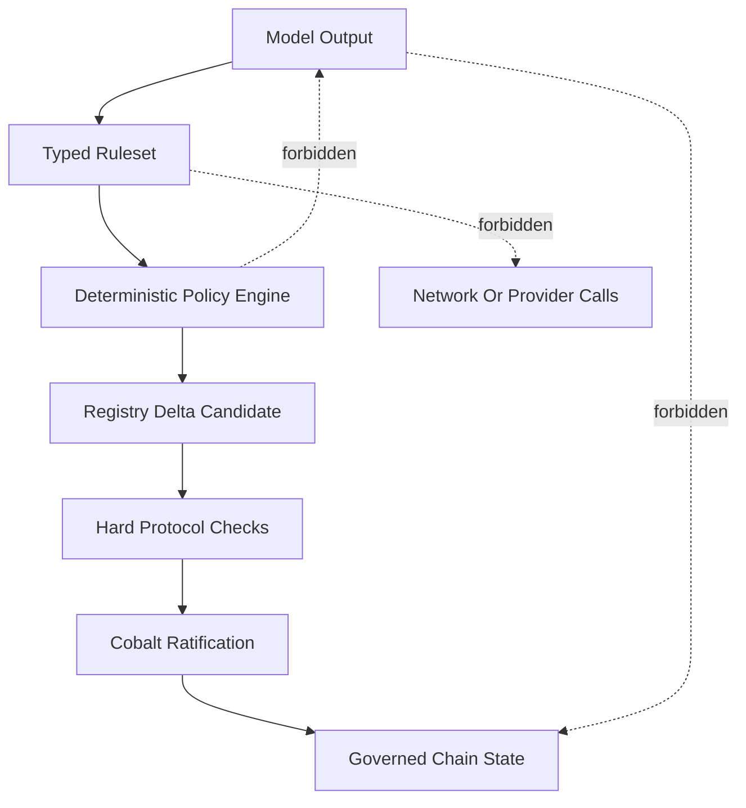
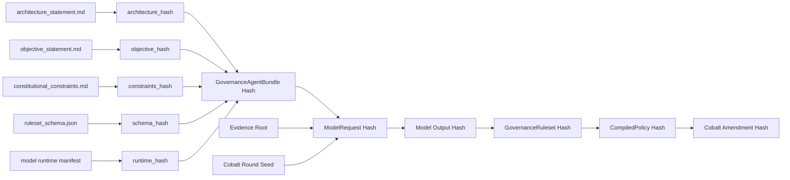
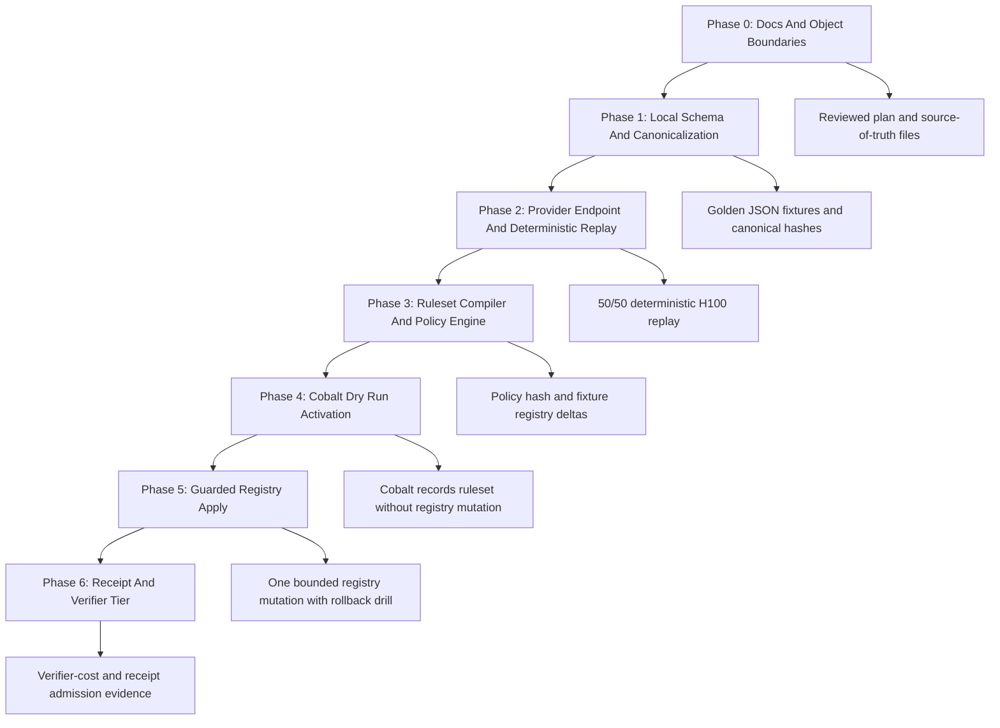
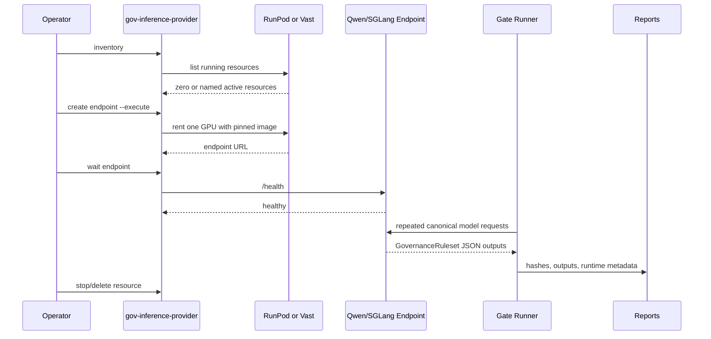
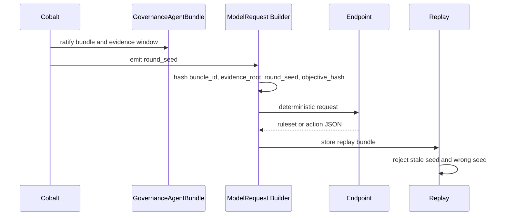
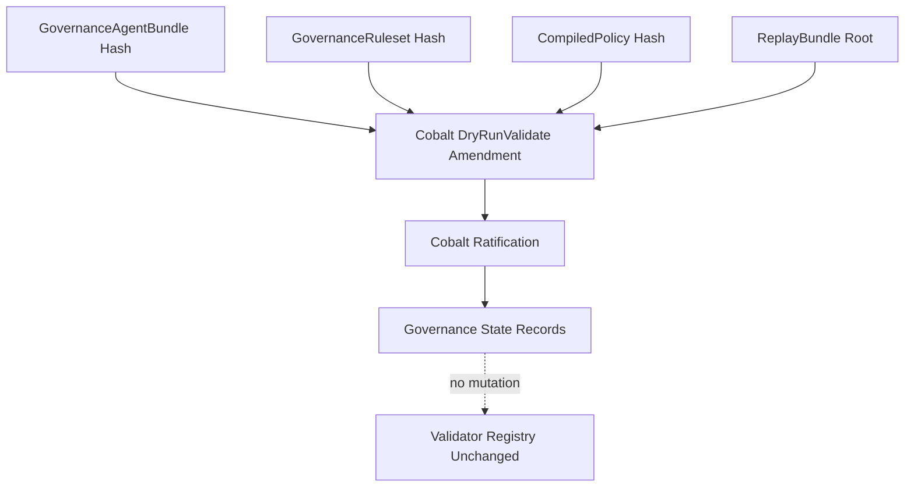
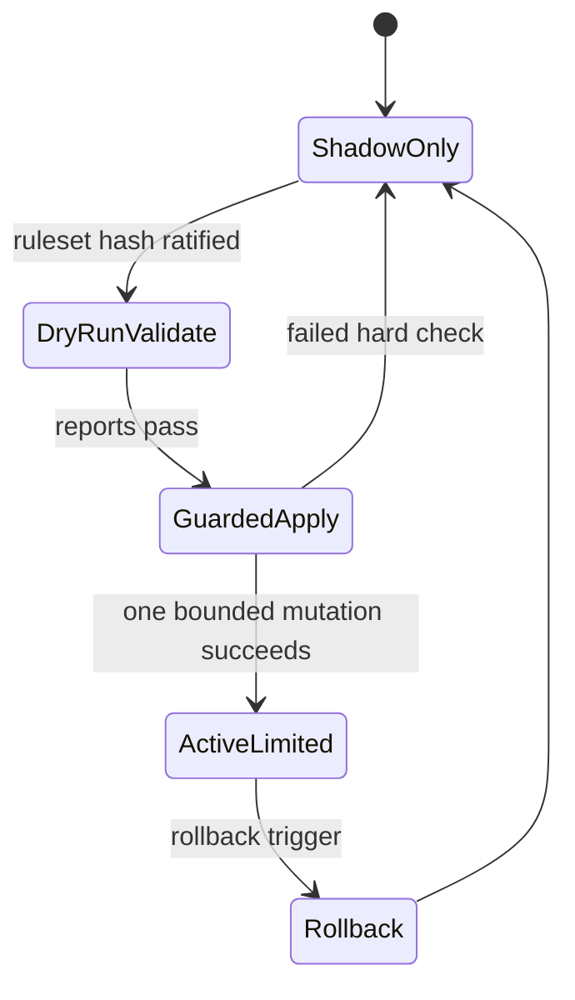
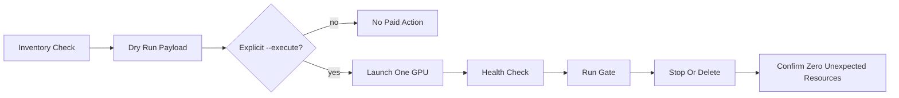

# Deterministic Governance Agent Plan

Status: execution plan, not live protocol behavior.

Working checklist: Deterministic Governance Agent Burndown.

This page explains how PostFiat moves from the current Cobalt controlled-testnet
implementation into a full deterministic governance-agent pipeline. The goal is
to make every step reviewable: what exists now, what must still be built, how
the pieces fit together, what evidence each gate must produce, and what the
finished system looks like.

The short version is this:

PostFiat already has the chain-side governance substrate. The next work is to
make the model-derived governance process an auditable, deterministic,
replayable, Cobalt-ratified object pipeline instead of a side process.

## Current State

The current repository is not starting from zero.

| Area | Current State | Status |
| --- | --- | --- |
| Rust L1 | Accounts, blocks, receipts, deterministic replay, state roots, fees, and RPC surfaces exist. | Built for controlled testnet |
| Cobalt governance | Validator registry, trust graph transitions, non-uniform certificates, RBC, ABBA, MVBA, DABC, stale replay rejection, and adversarial packets exist. | Built for controlled testnet |
| Validator registry | Registry transitions are already modeled as governed state rather than informal operator notes. | Built |
| Deterministic inference research | `docs/research-requests/heavy_redesign.md` defines the governance-agent direction and gates. | Planning source |
| Provider automation | `scripts/gov-inference-provider` can bootstrap RunPod/Vast tooling, verify inventory, and launch deterministic SGLang endpoints only when `--execute` is passed. | Ready |
| Provider access | Local RunPod and Vast access has been verified through the wrapper. Secret material stays outside docs and reports. | Ready for operator-controlled use |
| Live paid GPU state | RunPod inventory was reachable with zero running pods. Vast inventory was reachable with zero active instances. | Clean |
| Governance-agent ruleset | Architecture/objective/constraint files, JSON schema, generator, compiler, interpreter, and gate reports do not exist yet. | Not built |
| Cobalt activation of rulesets | Cobalt does not yet store `GovernanceAgentBundle`, `GovernanceRuleset`, `CompiledPolicy`, or replay roots as first-class governed objects. | Not built |
| Authority transfer | The foundation remains the operator for model-assisted governance experiments. Validator-side authority transfer is later work. | Not active |

## End State

The full state is a governed pipeline where the model does not mutate chain
state directly. It produces typed objects. Those objects are canonicalized,
hashed, replayed, compiled into deterministic policy, and then ratified through
Cobalt before anything can affect the validator registry.



In that end state:

- the model bundle is a governed object, not an operator preference;
- the objective statement is hash-addressed, not implied;
- model output is typed JSON, not prose;
- the generated ruleset cannot call the model, access the network, or mutate
  state directly;
- the ruleset interpreter produces registry deltas under hard constraints;
- Cobalt ratifies dry-run and guarded-apply transitions;
- every round emits a replay bundle and gate report;
- paid provider use is bounded, explicit, and cleaned up.

## What The Model Is Allowed To Do

The governance agent is a ruleset generator, not a governor.

| Allowed | Not Allowed |
| --- | --- |
| Generate a typed `GovernanceRuleset` from ratified inputs. | Directly add, remove, suspend, or rotate validators. |
| Explain rule intent in a hashed digest field if the schema permits it. | Expand its own authority or upgrade its own bundle. |
| Produce deterministic JSON under a pinned model/runtime profile. | Fetch outside evidence or call external services during policy execution. |
| Be replayed and compared against golden vectors. | Override Cobalt, linkedness checks, rollback policy, or emergency controls. |

This keeps the governance boundary clean:



## Object Model

The first implementation should introduce explicit objects with canonical
hashing. Names can change during implementation, but the responsibilities should
not blur.

| Object | Responsibility | Expected Location |
| --- | --- | --- |
| `ArchitectureStatement` | Describe PostFiat architecture and constraints in governed bytes. | `docs/governance/agent/architecture_statement.md` |
| `ObjectiveStatement` | State the optimization target for generated rules. | `docs/governance/agent/objective_statement.md` |
| `ConstitutionalConstraints` | Define hard prohibitions and scope boundaries. | `docs/governance/agent/constitutional_constraints.md` |
| `ruleset_schema.json` | Define the only acceptable model output shape. | `docs/governance/agent/ruleset_schema.json` |
| `GovernanceAgentBundle` | Bind statements, schema, model/runtime hashes, deterministic flags, activation epoch, and rollback policy. | Rust governance type plus JSON fixture |
| `ModelRequest` | Canonical prompt/request bytes submitted to the inference endpoint. | Gate report input |
| `GovernanceRuleset` | Model-generated typed rules. | Gate output |
| `CompiledPolicy` | Deterministic representation used by the chain-side interpreter. | Gate output and later Cobalt object |
| `EvidenceSnapshot` | Frozen evidence used by the policy engine. | Gate input |
| `RegistryDeltaCandidate` | Proposed validator registry change generated by policy. | Gate output |
| `ReplayBundle` | Complete replay package tying inputs, runtime manifest, model output, hashes, and policy output. | `reports/gov-inference-gate-*` |
| `CobaltAmendment` | Governance transition that ratifies bundle, ruleset, dry run, or guarded apply. | Existing Cobalt amendment machinery extended |

Object lineage should always be inspectable:



## Implementation Phases

The work should move in gates. A later gate should not be treated as live until
the earlier gate has a redaction-safe report.



### Phase 0: Documentation And Boundaries

Goal: make the governance-agent work legible before code changes begin.

Tasks:

1. Ratify this plan as the working engineering target.
2. Move the source statements into stable files under `docs/governance/agent/`.
3. Define what is current, what is experimental, and what is explicitly out of
   scope.
4. Keep public docs separate from raw internal research notes.
5. Keep provider keys outside reports and docs.

Exit criteria:

- this page is in the docs wiki navigation;
- `docs/status/gov-inference-provider-bringup-2026-05-23.md` records provider
  state;
- `scripts/gov-inference-provider check` is green;
- no paid provider resource is running unless a named test is active.

### Phase 1: Schema, Canonicalization, And Local Fixtures

Goal: prove the object model without renting a GPU.

Tasks:

1. Write `architecture_statement.md`.
2. Write `objective_statement.md`.
3. Write `constitutional_constraints.md`.
4. Write `ruleset_schema.json`.
5. Add a canonical JSON encoder for governance-agent artifacts.
6. Add sample `GovernanceRuleset` fixtures.
7. Add validation tests for schema rejection, hash stability, and forbidden
   fields.

Exit criteria:

| Check | Required Result |
| --- | --- |
| Same statement bytes | Same hash |
| One-byte statement edit | New hash |
| Valid sample ruleset | Accepted |
| Prose-only model output | Rejected |
| Unknown authority-expanding field | Rejected |
| Canonical JSON reorder | Same canonical hash |

Expected report:

```text
reports/gov-inference-gate-1_5-constitutional-prompt-bundle.json
```

### Phase 2: Deterministic Ruleset Generation

Goal: run the governed request against a pinned deterministic inference endpoint
and prove replay stability.

Provider path:

```text
scripts/gov-inference-provider inventory
scripts/gov-inference-provider runpod-create-sglang --gpu h100 --name postfiat-gov-agent-qwen36-sglang --execute
scripts/gov-inference-provider runpod-wait <pod_id>
```

Fallback path:

```text
scripts/gov-inference-provider vast-search --query 'rentable=true verified=true num_gpus=1 gpu_ram>=80 direct_port_count>=2' --limit 20 --output reports/gov-inference-provider/vast-offers-gpuram80-latest.json
scripts/gov-inference-provider vast-create-sglang <offer_id> --label postfiat-gov-agent-qwen36-sglang --execute
```

The first H100 gate should use:

| Setting | Value |
| --- | --- |
| Model | `Qwen/Qwen3.6-27B-FP8` |
| Runtime | SGLang |
| Tensor parallelism | `1` |
| Decode | Greedy, temperature `0` |
| Concurrency | `--max-running-requests 1` |
| Determinism | `--enable-deterministic-inference` |
| Preferred provider | RunPod H100 first, Vast fallback |

Sequence:



Exit criteria:

| Check | Required Result |
| --- | --- |
| Runs | Start with 50; later 100 and 1000 |
| JSON validity | 50/50 valid |
| Ruleset hash | 50/50 identical |
| Compiled policy hash | 50/50 identical |
| Explanatory digest hash | 50/50 identical if present |
| Malformed output count | Zero |
| Provider cleanup | Zero running untracked paid resources |

Expected report:

```text
reports/gov-inference-gate-3_5-deterministic-ruleset-generation.json
```

### Phase 3: Time-Locked Replay

Goal: prove the governance-agent output cannot be finalized before a Cobalt
round seed exists, while still replaying deterministically after the seed is
known.



Exit criteria:

- stale seed rejected;
- wrong seed rejected;
- missing evidence root rejected;
- same seed and inputs reproduce the same output hash;
- pre-seed finalization path does not exist.

Expected report:

```text
reports/gov-inference-gate-3_6-timelocked-governance-agent.json
```

### Phase 4: Ruleset Compiler And Policy Engine

Goal: convert model-generated JSON into deterministic policy execution.

The policy engine must be intentionally boring. It should have no network
access, no file access outside supplied inputs, no model calls, no unbounded
loops, and no direct write path to chain state.


Exit criteria:

| Check | Required Result |
| --- | --- |
| Same ruleset plus same evidence | Same registry delta |
| Malformed rule | Rejected |
| Non-terminating behavior | Impossible by construction |
| Network access | Impossible |
| Model access | Impossible |
| Direct state mutation | Impossible |
| Ambiguous evidence | `NoOp` |
| Linkedness failure | `NoOp` or rejection before Cobalt activation |

Expected reports:

```text
reports/gov-inference-gate-7_5-ruleset-compiler.json
reports/gov-inference-gate-7_6-ruleset-vs-llm-judgment.json
```

### Phase 5: Cobalt Dry-Run Activation

Goal: store the ruleset lineage in Cobalt governance state without letting it
change the validator registry.



Exit criteria:

- Cobalt ratifies the bundle/ruleset/policy/replay root;
- registry remains unchanged;
- stale ruleset rejected;
- ruleset generated from wrong bundle rejected;
- replay bundle retrievable;
- dry-run output appears in chain evidence without pretending to be live
  authority.

Expected report:

```text
reports/gov-inference-gate-8_5-cobalt-ruleset-dry-run.json
```

### Phase 6: Guarded Apply

Goal: allow the active generated ruleset to drive one tiny registry mutation
under hard limits.

Guardrails:

| Guardrail | Initial Limit |
| --- | --- |
| Adds | At most one per round |
| Routine removals | Zero |
| Emergency hard-failure remove | Explicit special path only |
| Evidence refs | Required and hash-bound |
| Concentration caps | Must pass |
| Trust graph linkedness | Must pass |
| Rollback | Required before activation |
| Human discretion | None after bundle and ruleset activation, except emergency rollback |



Expected report:

```text
reports/gov-inference-gate-9_5-generated-ruleset-guarded-apply.json
```

### Phase 7: Receipt And Verifier Tier

Goal: reduce trust in the inferencer by adding receipt and verifier machinery.

This should not block the first ruleset experiment. The first experiment proves
deterministic generation and Cobalt dry-run behavior. The later verifier tier
proves lower-cost independent verification.

Research targets:

- TensorCash-style receipt object for model execution;
- VeriLLM-style verification-cost benchmark on PostFiat-shaped prompts;
- TOPLOC or comparable compact activation commitment as a future option;
- TP-invariant kernels only after TP=1 H100 behavior is stable.

Expected reports:

```text
reports/gov-inference-gate-10_1-verillm-postfiat-benchmark.json
reports/gov-inference-gate-10_5-toploc-receipt-prototype.json
reports/gov-inference-gate-14-tp-invariant-verifier-admission.json
```

## End-To-End Gate Map

| Gate | Name | Purpose | State Now | Done When |
| --- | --- | --- | --- | --- |
| 1.5 | Constitutional prompt bundle | Make architecture, objective, constraints, and schema governed bytes. | Not built | Bundle hash is stable and schema tests pass. |
| 3.5 | Deterministic ruleset generation | Prove repeated H100 inference emits identical ruleset and policy hashes. | Provider ready | 50/50 replay passes and report is redaction-safe. |
| 3.6 | Time-locked replay | Bind output to a Cobalt round seed. | Not built | Wrong/stale/missing seed paths fail closed. |
| 7.5 | Ruleset compiler | Make generated rules executable. | Not built | Same ruleset plus same evidence produces same delta. |
| 7.6 | Ruleset versus direct LLM judgment | Compare generated rules to direct scorer behavior. | Not built | Ruleset handles high-confidence cases and no-ops ambiguous cases. |
| 8.5 | Cobalt dry-run activation | Ratify ruleset lineage without registry mutation. | Not built | Governance state records hashes and registry is unchanged. |
| 9.5 | Guarded apply | Let generated policy drive one bounded registry mutation. | Not built | One add or no-op path succeeds with rollback evidence. |
| 10.1 | VeriLLM benchmark | Measure verifier economics on PostFiat-shaped prompts. | Research-gated | Cost and correctness are measured, not assumed. |
| 10.5 | TOPLOC prototype | Explore compact receipt commitments. | Research-gated | Prototype report exists and is not consensus-critical. |
| 14 | TP-invariant verifier admission | Admit TP>1 only if deterministic across tensor-parallel shapes. | Later | Cross-TP hash agreement is demonstrated. |

## Repository Work Plan

The likely file layout should keep public docs, raw evidence, and code separate.

```text
docs/governance/deterministic-governance-agent-plan.md
  Public-facing plan and diagrams.

docs/governance/agent/
  architecture_statement.md
  objective_statement.md
  constitutional_constraints.md
  ruleset_schema.json

docs/status/
  Gate summaries, bringup notes, and remediation status.

reports/gov-inference-gate-*/
  Machine-readable gate reports and replay bundles.

scripts/gov-inference-provider
  Provider lifecycle wrapper for RunPod and Vast.

crates/node/src/governance.rs
crates/node/src/main.rs
crates/consensus_cobalt/src/lib.rs
  Likely extension points for Cobalt-governed object records and CLI hooks.

new or existing Rust module
  Canonicalization, schema validation, ruleset policy execution, and fixtures.
```

Final paths should follow the codebase after implementation begins. The
important point is that consensus-affecting data lives in typed Rust objects and
canonical encodings, while provider operations remain operator tooling.

## Operational Policy

Provider operations are allowed only as bounded experiments.



Required before paid launch:

1. `scripts/gov-inference-provider inventory`
2. dry-run payload inspection
3. named gate and report path
4. explicit `--execute`
5. cleanup command known before launch

Required after paid launch:

1. endpoint URL recorded in the private run log;
2. runtime metadata recorded in the redaction-safe report;
3. paid resource stopped or deleted;
4. final inventory captured;
5. no provider secret in reports, docs, shell history excerpts, or logs.

## Review Questions

These are the main decisions to review before implementation:

| Question | Default Recommendation |
| --- | --- |
| Is the first governed output a ruleset rather than direct registry action? | Yes. Generated executable rules are easier to audit than direct model judgment. |
| Does the first provider run require H100? | Yes for Gate 3.5, because the research target is Modal/SGLang H100-class determinism. Cheaper RTX PRO runs can be supplemental. |
| Does a generated ruleset become live immediately? | No. It must pass dry-run activation first. |
| Can the model upgrade itself? | No. Bundle upgrades require Cobalt ratification. |
| Can the policy engine call the model? | No. It runs only on supplied evidence. |
| Can Phase 2 verifier work block the first experiment? | No. Receipt/verifier work is important but later. |
| Can a failed memo, provider hiccup, or malformed model output mutate registry state? | No. Those paths must fail closed or no-op. |

## Definition Of Done

The full state is reached only when all of the following are true:

- `GovernanceAgentBundle` is a typed, hash-addressed object.
- Architecture, objective, constraints, schema, runtime, and model identifiers
  are bound into the bundle hash.
- The model emits only valid `GovernanceRuleset` JSON.
- Repeated deterministic inference produces identical ruleset and compiled
  policy hashes under the pinned profile.
- A ruleset compiler or interpreter runs on frozen evidence and produces
  deterministic `RegistryDeltaCandidate` output.
- Cobalt can ratify a dry-run ruleset activation without changing the registry.
- Cobalt can ratify one guarded registry mutation generated by the active
  ruleset under hard caps.
- Rollback has been drilled.
- Reports are redaction-safe and linked from the evidence model.
- Provider resources are cleaned up after every paid window.
- The docs clearly state that authority transfer and validator-side verifier
  operation are later phases unless and until those phases are actually live.

## Read Next

- [Plain English Cobalt](cobalt.md)
- [Validator Registry](validator-registry.md)
- [Cobalt Implementation](cobalt-implementation.md)
- Deterministic Governance Agent Burndown
- Source plan: `docs/research-requests/heavy_redesign.md`
- Provider bringup: `docs/status/gov-inference-provider-bringup-2026-05-23.md`
