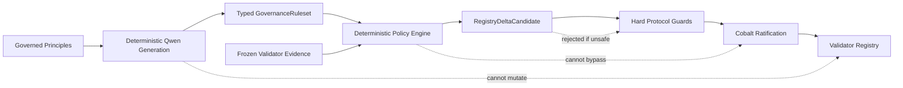
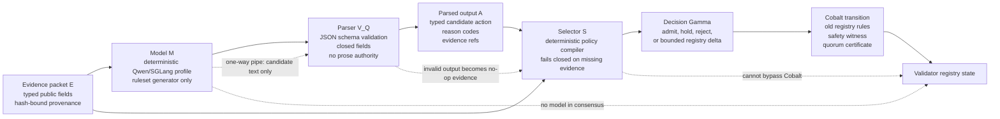
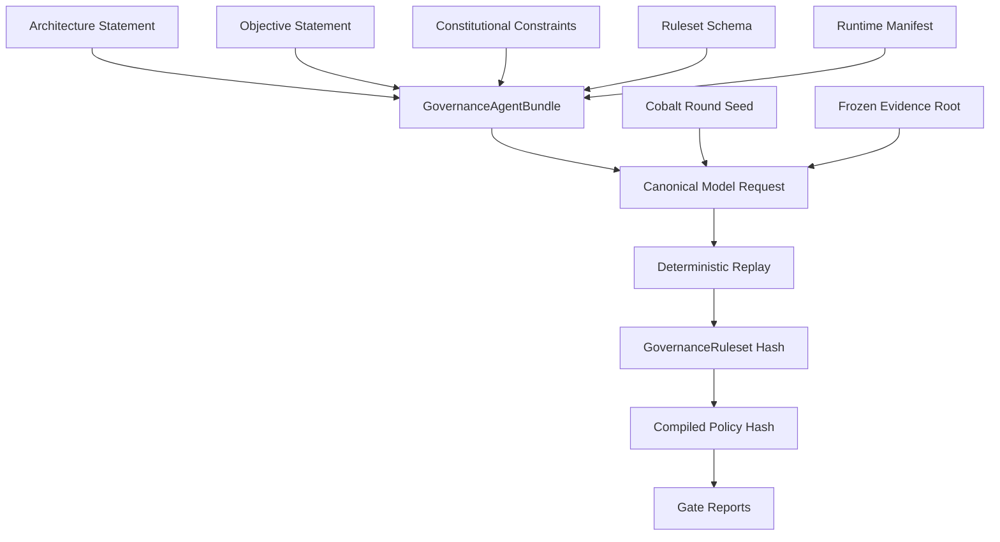
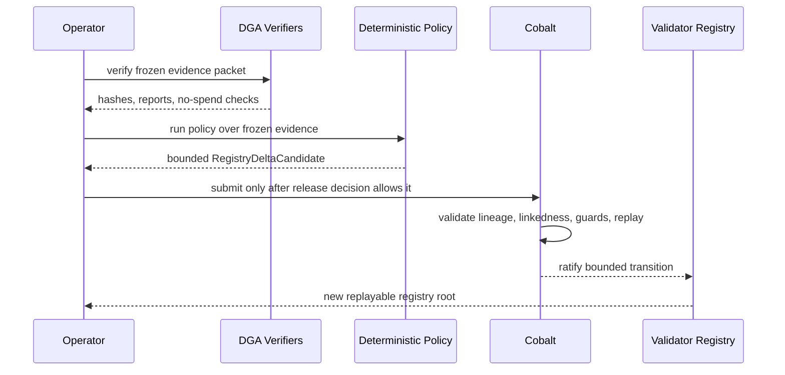

# Deterministic Governance Overview

Status: plain-English overview of the Cobalt plus DGA governance lane.
Date: 2026-05-23

PostFiat governance is trying to make qualitative validator judgment
deterministic, reviewable, and replayable.

The short version:

- Cobalt is the protocol mechanism for changing validator trust and registry
  state.
- The Deterministic Governance Agent, or DGA, is the model-generated policy
  pipeline that can eventually propose bounded validator-governance actions.
- Qwen/SGLang deterministic inference, currently `Qwen/Qwen3.6-27B-FP8`,
  is the active model profile used to generate typed governance rulesets from
  governed inputs.
- The model profile must be governable and replaceable; mainnet cannot depend
  on a centralized actor silently setting the model.
- The model never directly changes chain state.
- Every important object is hashed, verified, and moved through Cobalt-facing
  gates before it can matter.
- Foundation authority remains in place right now. Validator-side authority
  transfer is not live.

The design assumption is adversarial. Validator metadata, operator manifests,
public URLs, topology labels, provider outputs, automation state, and replay
artifacts must all be treated as potentially wrong, stale, misleading, or
malicious until deterministic validation proves otherwise.

## The Governance Idea

PostFiat starts from a simple position: validator governance should not depend
on private social judgment, private operator preference, or an unreviewable
foundation process forever.

The intended end state is a governance process where:

- the initial principles are simple and governed;
- the model can generate constitutional evidence requests from those
  principles;
- approved evidence packets answer those requests with typed, hash-bound facts;
- the model generates a ruleset or constitutional decision from approved
  evidence;
- the ruleset is typed JSON, not prose;
- the ruleset is replayed until its hash is stable;
- the ruleset is compiled into a deterministic policy;
- the policy reads frozen public evidence;
- the policy proposes bounded validator-registry actions;
- Cobalt ratifies the action before registry state changes;
- every artifact can be audited after the fact.

This is "human-free" in the narrow governance sense: human operators can start
or stop tools, review reports, and reject unsafe output, but discretionary
human taste is not supposed to be the authority that decides which validator
action is valid. The authority should come from governed inputs, deterministic
generation, typed policy execution, Cobalt ratification, and replayable
evidence.

The broader plan for applying this pattern across model selection, validator
evidence, Cobalt, privacy, ML-DSA authorization, monetary policy, storage,
RPC, operator security, and release authority is tracked in
[Verifiable Constitution Plan](verifiable-constitution-plan.md). That plan
adds an upstream Qwen-authored evidence-request lane: the model may propose
what evidence is needed to decide a protocol question, but the request itself
must be typed, replayed, reviewed, and accepted before it can shape
implementation.
The operator-facing summary of the current Verifiable Constitution readiness
state is tracked in
Verifiable Constitution Readiness Summary.
The attack-hardness summary that explains what has been proven about
cross-machine replay, non-validator generality, static and naive baselines,
challenge drills, and remaining limits is tracked in
Verifiable Constitution Attack-Hardness Readiness Summary.

## The Two Halves

There are two different systems being connected.

| System | What It Does | What It Does Not Do |
| --- | --- | --- |
| Cobalt governance | Orders and ratifies trust graph and validator-registry transitions. | Decide qualitative validator policy by itself. |
| DGA | Generates and verifies deterministic governance policy from governed inputs. | Directly mutate the validator registry. |

The important boundary is that DGA output is only evidence and policy until
Cobalt accepts a bounded action.

## Machine Classification Pipeline

The model can produce candidate policy artifacts, but it is outside consensus.
Only parsed, typed, replayed, and selected outputs can enter the Cobalt-facing
policy lane.

## What Cobalt Means Here

Cobalt is the trust-evolution layer. It is about how the network changes who it
trusts.

In this repo, Cobalt already models:

- non-identical validator trust views;
- linkedness and essential-subset checks;
- validator registry transitions;
- governance amendments;
- replay bundles;
- stale evidence rejection;
- rollback and supersession evidence;
- adversarial tests for unsafe governance behavior.

Plain English: Cobalt is the part that prevents "the model said so" or "an
operator said so" from becoming enough. A registry change has to pass protocol
checks and be ratified through the governance path.

## What DGA Means Here

DGA is the deterministic model-governance lane.

It takes governed source material such as:

- an architecture statement;
- an objective statement;
- constitutional constraints;
- a ruleset schema;
- runtime and model settings;
- frozen evidence;
- a Cobalt-bound round seed.

Then it produces and verifies:

- a canonical model request;
- deterministic model output;
- a typed `GovernanceRuleset`;
- a compiled policy hash;
- a policy output over frozen evidence;
- Cobalt dry-run evidence;
- guarded-apply evidence;
- verifier-tier and adversarial evidence.

The model is a ruleset generator. It is not the governor.

The validator evidence layer is the governed boundary between real validator
observations and model-generated rules. The sprint record for that boundary is
tracked in
Validator Evidence Design Sprint, and
the initial allowed field set is tracked in
[Validator Evidence Field Registry](validator-evidence-field-registry.md). The
first packet contract is tracked in
[Validator Evidence Packet Schema](validator-evidence-packet-schema.md), and
the first ruleset binding is tracked in
Validator Evidence Ruleset Binding.
The collector and Cobalt root-binding plan is tracked in
Validator Evidence Collector And Cobalt Integration.
The internal plan for proving repeated Qwen/evidence packet execution through
actual Cobalt dry-run and replay machinery is tracked in
Qwen Cobalt Internal Validation Plan.
The next lane for assembling fresh project-controlled collector evidence into
the same Qwen/Cobalt dry-run and replay path is tracked in
Qwen Cobalt Live Collector Assembly Plan.
The mainnet requirement for governed model upgrades, activation, and rollback
is tracked in
Model Selection Governance Requirement.
The dry-run plan for active-vs-candidate model comparison and rollback
evidence is tracked in
Qwen Cobalt Model Selection Comparison And Rollback Plan.
The operator-facing summary of what internal Qwen/Cobalt validation has and
has not proven is tracked in
Qwen Cobalt Operator Readiness Summary.
The operator-facing summary of what the project-controlled live collector lane
has and has not proven is tracked in
Qwen Cobalt Live Collector Readiness Summary.
The next lane for turning that live collector evidence into bounded, non-live
registry-delta candidate rehearsals is tracked in
Qwen Cobalt Bounded Registry Delta Plan.
The post-sprint defaults for URL/domain proof, operator manifest signing,
conflicts, freshness, field visibility, and Qwen authority are tracked in
Validator Evidence Open Question Disposition.
The delegated operator-accountability-key contract is tracked in
Validator Evidence Operator Manifest Delegation.
The deterministic conflict summary contract is tracked in
Validator Evidence Conflict Set.
The public-launch URL/domain proof gate is tracked in
Validator Evidence Public URL Domain Gate.
The model-selection field-weight boundary is tracked in
Validator Evidence Field Weight Policy.
The local redaction-safe collector writer is tracked in
Validator Evidence Collector Writer.
The collector source authorization boundary is tracked in
Validator Evidence Source Authorization.
The per-validator operator consent receipt boundary is tracked in
Validator Evidence Operator Consent Receipt.
The operator consent revocation check is tracked in
Validator Evidence Operator Consent Revocation Index.
The operator consent publication projection is tracked in
Validator Evidence Operator Consent Publication Manifest.
The prompt-facing Qwen summary projection is tracked in
Validator Evidence Qwen Public Summary Projection.
The no-spend Qwen prompt-input manifest is tracked in
Validator Evidence Qwen Prompt Input Manifest.
The prompt redaction audit is tracked in
Validator Evidence Qwen Prompt Redaction Audit.
The no-spend Qwen replay preflight is tracked in
Validator Evidence Qwen Replay Preflight.
The Qwen replay authorization packet is tracked in
Validator Evidence Qwen Replay Authorization.
The Qwen replay output manifest is tracked in
Validator Evidence Qwen Replay Output Manifest.
The Qwen replay output validation receipt is tracked in
Validator Evidence Qwen Replay Output Validation Receipt.
The Qwen replay promotion decision is tracked in
Validator Evidence Qwen Replay Promotion Decision.
The Qwen replay release-candidate gate is tracked in
Validator Evidence Qwen Replay Release Candidate Gate.
The Qwen replay operator-review gate is tracked in
Validator Evidence Qwen Replay Operator Review Gate.
The Qwen replay release-decision gate is tracked in
Validator Evidence Qwen Replay Release Decision Gate.
The Qwen replay governance-queue gate is tracked in
Validator Evidence Qwen Replay Governance Queue Gate.
The Qwen replay governance-queue decision gate is tracked in
Validator Evidence Qwen Replay Governance Queue Decision Gate.
The Qwen replay Cobalt-submission decision gate is tracked in
Validator Evidence Qwen Replay Cobalt Submission Decision Gate.
The Qwen replay registry-mutation decision gate is tracked in
Validator Evidence Qwen Replay Registry Mutation Decision Gate.
The Qwen replay authority-transfer decision gate is tracked in
Validator Evidence Qwen Replay Authority Transfer Decision Gate.
The Qwen replay foundation-exit-criteria gate is tracked in
Validator Evidence Qwen Replay Foundation Exit Criteria Gate.
The Qwen replay foundation-exit-criteria document gate is tracked in
Validator Evidence Qwen Replay Foundation Exit Criteria Document Gate.
The Qwen replay foundation-exit-criteria authorization gate is tracked in
Validator Evidence Qwen Replay Foundation Exit Criteria Authorization Gate.
The Qwen replay foundation-exit-criteria authorization request gate is tracked
in
Validator Evidence Qwen Replay Foundation Exit Criteria Authorization Request Gate.
The Qwen replay foundation-exit-criteria authorization receipt gate is tracked
in
Validator Evidence Qwen Replay Foundation Exit Criteria Authorization Receipt Gate.
The Qwen replay foundation-exit-criteria authorization decision gate is
tracked in
Validator Evidence Qwen Replay Foundation Exit Criteria Authorization Decision Gate.
The Qwen replay foundation-exit-criteria authorization approval gate is
tracked in
Validator Evidence Qwen Replay Foundation Exit Criteria Authorization Approval Gate.
The Qwen replay foundation-exit-criteria authorization grant gate is tracked
in
Validator Evidence Qwen Replay Foundation Exit Criteria Authorization Grant Gate.
The Qwen replay foundation-exit-criteria authoring-scope gate is tracked in
Validator Evidence Qwen Replay Foundation Exit Criteria Authoring Scope Gate.
The Qwen replay foundation-exit-criteria authoring-principal gate is tracked
in
Validator Evidence Qwen Replay Foundation Exit Criteria Authoring Principal Gate.
The Qwen replay foundation-exit-criteria authoring-lane gate is tracked in
Validator Evidence Qwen Replay Foundation Exit Criteria Authoring Lane Gate.
The Qwen replay foundation-exit-criteria authoring-output gate is tracked in
Validator Evidence Qwen Replay Foundation Exit Criteria Authoring Output Gate.
The Qwen replay foundation-exit-criteria document-authoring gate is tracked
in
Validator Evidence Qwen Replay Foundation Exit Criteria Document Authoring Gate.
The Qwen replay foundation-exit-criteria document-review gate is tracked in
Validator Evidence Qwen Replay Foundation Exit Criteria Document Review Gate.
The Qwen replay foundation-exit-criteria document-review-completion gate is
tracked in
Validator Evidence Qwen Replay Foundation Exit Criteria Document Review Completion Gate.
The Qwen replay foundation-exit-criteria document Cobalt-ratification gate is
tracked in
Validator Evidence Qwen Replay Foundation Exit Criteria Document Cobalt Ratification Gate.
The Qwen replay foundation-exit-criteria document-acceptance gate is tracked
in
Validator Evidence Qwen Replay Foundation Exit Criteria Document Acceptance Gate.
The Qwen replay foundation-exit-criteria satisfaction gate is tracked in
Validator Evidence Qwen Replay Foundation Exit Criteria Satisfaction Gate.
The Qwen replay foundation-exit-criteria authority-transfer readiness gate is
tracked in
Validator Evidence Qwen Replay Foundation Exit Criteria Authority Transfer Readiness Gate.
The Qwen replay foundation-exit-criteria authority-transfer plan gate is
tracked in
Validator Evidence Qwen Replay Foundation Exit Criteria Authority Transfer Plan Gate.
The Qwen replay foundation-exit-criteria authority-transfer rollback-plan gate
is tracked in
Validator Evidence Qwen Replay Foundation Exit Criteria Authority Transfer Rollback Plan Gate.
The Qwen replay foundation-exit-criteria authority-transfer operator-signoff
gate is tracked in
Validator Evidence Qwen Replay Foundation Exit Criteria Authority Transfer Operator Signoff Gate.
The Qwen replay foundation-exit-criteria authority-transfer shadow-convergence
gate is tracked in
Validator Evidence Qwen Replay Foundation Exit Criteria Authority Transfer Shadow Convergence Gate.
The Qwen replay foundation-exit-criteria authority-transfer final-precondition
gate is tracked in
Validator Evidence Qwen Replay Foundation Exit Criteria Authority Transfer Final Precondition Gate.
The Qwen replay foundation-exit-criteria authority-transfer execution-intent
gate is tracked in
Validator Evidence Qwen Replay Foundation Exit Criteria Authority Transfer Execution Intent Gate.
The Qwen replay foundation-exit-criteria authority-transfer execution
authorization gate is tracked in
Validator Evidence Qwen Replay Foundation Exit Criteria Authority Transfer Execution Authorization Gate.
The Qwen replay foundation-exit-criteria authority-transfer execution-schedule
gate is tracked in
Validator Evidence Qwen Replay Foundation Exit Criteria Authority Transfer Execution Schedule Gate.
The Qwen replay foundation-exit-criteria authority-transfer execution-window
gate is tracked in
Validator Evidence Qwen Replay Foundation Exit Criteria Authority Transfer Execution Window Gate.
The Qwen replay foundation-exit-criteria authority-transfer execution-cutover
gate is tracked in
Validator Evidence Qwen Replay Foundation Exit Criteria Authority Transfer Execution Cutover Gate.
The Qwen replay foundation-exit-criteria authority-transfer completion gate
is tracked in
Validator Evidence Qwen Replay Foundation Exit Criteria Authority Transfer Completion Gate.
The Qwen replay foundation-exit-criteria authority-transfer post-transfer
audit gate is tracked in
Validator Evidence Qwen Replay Foundation Exit Criteria Authority Transfer Post Transfer Audit Gate.
The Qwen replay foundation-exit-criteria authority-transfer archive gate is
tracked in
Validator Evidence Qwen Replay Foundation Exit Criteria Authority Transfer Archive Gate.
The Qwen replay foundation-exit-criteria authority-transfer archive-signoff
gate is tracked in
Validator Evidence Qwen Replay Foundation Exit Criteria Authority Transfer Archive Signoff Gate.
The Qwen replay foundation-exit-criteria authority-transfer
archive-finalization gate is tracked in
Validator Evidence Qwen Replay Foundation Exit Criteria Authority Transfer Archive Finalization Gate.
The Qwen replay foundation-exit-criteria authority-transfer
archive-publication gate is tracked in
Validator Evidence Qwen Replay Foundation Exit Criteria Authority Transfer Archive Publication Gate.
The Qwen replay foundation-exit-criteria authority-transfer
archive-availability gate is tracked in
Validator Evidence Qwen Replay Foundation Exit Criteria Authority Transfer Archive Availability Gate.
The Qwen replay foundation-exit-criteria authority-transfer archive-retention
gate is tracked in
Validator Evidence Qwen Replay Foundation Exit Criteria Authority Transfer Archive Retention Gate.
The Qwen replay foundation-exit-criteria authority-transfer archive-durability
gate is tracked in
Validator Evidence Qwen Replay Foundation Exit Criteria Authority Transfer Archive Durability Gate.
The Qwen replay foundation-exit-criteria authority-transfer archive-redundancy
gate is tracked in
Validator Evidence Qwen Replay Foundation Exit Criteria Authority Transfer Archive Redundancy Gate.
The Qwen replay foundation-exit-criteria authority-transfer archive-integrity
gate is tracked in
Validator Evidence Qwen Replay Foundation Exit Criteria Authority Transfer Archive Integrity Gate.
The Qwen replay foundation-exit-criteria authority-transfer
archive-authenticity gate is tracked in
Validator Evidence Qwen Replay Foundation Exit Criteria Authority Transfer Archive Authenticity Gate.
The Qwen replay foundation-exit-criteria authority-transfer
archive-provenance gate is tracked in
Validator Evidence Qwen Replay Foundation Exit Criteria Authority Transfer Archive Provenance Gate.
The Qwen replay foundation-exit-criteria authority-transfer archive-custody
gate is tracked in
Validator Evidence Qwen Replay Foundation Exit Criteria Authority Transfer Archive Custody Gate.
The Qwen replay foundation-exit-criteria authority-transfer archive-access
gate is tracked in
Validator Evidence Qwen Replay Foundation Exit Criteria Authority Transfer Archive Access Gate.
The Qwen replay foundation-exit-criteria authority-transfer archive-retrieval
gate is tracked in
Validator Evidence Qwen Replay Foundation Exit Criteria Authority Transfer Archive Retrieval Gate.

## Where We Are Now

As of the latest local docs and reports, PostFiat has completed the DGA
evidence and release-lane work through bounded final-release decision, plus
the validator-evidence open-question disposition and first operator-manifest
delegation sidecar contract, the conflict-set sidecar contract, and the
public-launch URL/domain proof gate sidecar, plus the design-only
field-weight policy sidecar, local collector-writer fixture implementation,
source-authorization contract, operator-consent receipt contract,
operator-consent revocation-index contract, and operator-consent
publication-manifest contract, Qwen public-summary projection contract, Qwen
prompt-input manifest contract, Qwen prompt redaction audit contract, and Qwen
replay preflight contract, Qwen replay authorization contract, Qwen replay
output-manifest contract, Qwen replay output validation-receipt contract, and
Qwen replay promotion-decision contract, Qwen replay release-candidate gate
contract, Qwen replay operator-review gate contract, and Qwen replay
release-decision gate contract, and Qwen replay governance-queue gate
contract, Qwen replay governance-queue decision gate contract, and Qwen
replay Cobalt-submission decision gate contract, and Qwen replay
registry-mutation decision gate contract, and Qwen replay authority-transfer
decision gate contract, and Qwen replay foundation-exit-criteria gate
contract, and Qwen replay foundation-exit-criteria document gate contract,
and Qwen replay foundation-exit-criteria authorization gate contract, and
Qwen replay foundation-exit-criteria authorization request gate contract, and
Qwen replay foundation-exit-criteria authorization receipt gate contract, and
Qwen replay foundation-exit-criteria authorization decision gate contract, and
Qwen replay foundation-exit-criteria authorization approval gate contract, and
Qwen replay foundation-exit-criteria authorization grant gate contract, and
Qwen replay foundation-exit-criteria authoring-scope gate contract, and Qwen
replay foundation-exit-criteria authoring-principal gate contract, and Qwen
replay foundation-exit-criteria authoring-lane gate contract, and Qwen replay
foundation-exit-criteria authoring-output gate contract, and Qwen replay
foundation-exit-criteria document-authoring gate contract, document-review
gate contract, document-review-completion gate contract, document
Cobalt-ratification gate contract, document-acceptance gate contract, and
foundation-exit satisfaction gate contract, and authority-transfer readiness
gate contract, authority-transfer plan gate contract, and authority-transfer
rollback-plan gate contract, and authority-transfer operator-signoff gate
contract, authority-transfer shadow-convergence gate contract, and
authority-transfer final-precondition gate contract, and authority-transfer
execution-intent gate contract, and authority-transfer execution-authorization
gate contract, authority-transfer execution-schedule gate contract, and
authority-transfer execution-window gate contract, and authority-transfer
execution-cutover gate contract, authority-transfer completion gate contract,
authority-transfer post-transfer audit gate contract, and authority-transfer
archive gate contract, authority-transfer archive-signoff gate contract, and
authority-transfer archive-finalization gate contract, and authority-transfer
archive-publication gate contract, and authority-transfer archive-availability
gate contract, authority-transfer archive-retention gate contract, and
authority-transfer archive-durability gate contract, and authority-transfer
archive-redundancy gate contract, and authority-transfer archive-integrity
gate contract, authority-transfer archive-authenticity gate contract, and
authority-transfer archive-provenance gate contract, and authority-transfer
archive-custody gate contract, authority-transfer archive-access gate
contract, and authority-transfer archive-retrieval gate contract.

Current state:

| Area | State |
| --- | --- |
| Cobalt substrate | Built for controlled testnet and covered by local tests. |
| DGA governed inputs | Built and hash-addressed. |
| Deterministic replay | Gate 3.5 has historical 50-run paid replay evidence for the earlier prompt bundle and accepted 50-run lineaged replay evidence for the current validator-evidence input contract. |
| Policy engine | Built as a deterministic allowlisted Rust interpreter. |
| Cobalt dry run | Built and verified without registry mutation. |
| Guarded apply drill | Built with one bounded local mutation and rollback drill. |
| Verifier tier | Built as shadow evidence, not live authority. |
| Adversarial governance probes | Built and fail closed. |
| Operator gate pack | Built as a no-spend verifier bundle. |
| Release lane | Bounded evidence release accepted and closed by final-release decision. |
| Validator evidence packet | First draft schema and valid/invalid fixtures exist for DGA rule binding. |
| Validator evidence ruleset binding | Ruleset decisions now cite registered evidence fields and closed evidence semantics. |
| Validator evidence collector/Cobalt plan | Draft integration plan exists for freezing collector output and recording packet roots without live registry mutation. |
| Validator evidence fixture contract | Collector-run and Cobalt binding schemas, positive fixtures, negative fixtures, and focused validation exist. |
| Validator evidence DGA binding | Frozen DGA evidence snapshots and Gate 8.5 replay/report paths now carry `validator_evidence_packet_root`. |
| Validator evidence input contract | The governed ruleset schema, valid no-op fixture, and prompt-facing model request now expose `validator_evidence_packet` as a required input for packet-bound rules. |
| Validator evidence input omission | JSON Schema, Rust ruleset validation, and focused fixtures reject rulesets that cite validator evidence while omitting required `validator_evidence_packet`. |
| Validator evidence prompt lineage | The prompt-facing model request now binds the validator evidence packet schema and field registry by hash in `governed_inputs` and prompt text. |
| Validator evidence report lineage | Gate 3.5, Gate 3.6, Gate 10.1, Gate 10.5, Gate 14, and Gate 15 reports surface the same packet-schema and field-registry hashes for review. |
| Validator evidence open questions | Conservative defaults are recorded for URL/domain proof, manifest signing, conflict handling, freshness, field visibility, and Qwen authority boundaries. |
| Validator evidence operator manifest delegation | A sidecar schema and fixtures bind routine operator manifests to a delegated operator accountability key without changing current packet-schema hashes. |
| Validator evidence conflict set | A sidecar schema and fixtures bind deterministic conflict summaries to the current packet root and force unresolved conflicts to hold/no-op. |
| Validator evidence public URL/domain gate | A sidecar schema and fixtures require HTTPS URL fetch and proved key-domain binding for public claims while not blocking controlled testnet. |
| Validator evidence field-weight policy | A sidecar schema and fixtures require model-selection decision evidence before field weights can change, and Qwen cannot edit weights directly. |
| Validator evidence collector writer | A local fixture writer emits redaction-safe packet artifacts outside the repo and records a schema-validated writer report. |
| Validator evidence source authorization | A design-only schema and fixture bind approved source kinds, consent basis, visibility, and emitted fields to the collector-run manifest. |
| Validator evidence operator consent receipt | A design-only schema and fixture bind per-validator operator consent to approved sources, registered fields, and delegated operator keys. |
| Validator evidence operator consent revocation index | A design-only schema and fixture bind consent receipt usability to a redaction-safe `not_revoked` status. |
| Validator evidence operator consent publication manifest | A design-only schema and fixture project only permitted, not-revoked fields into Qwen-visible public summaries. |
| Validator evidence Qwen public-summary projection | A design-only schema and fixture bind future prompt-visible summaries to the publication manifest without provider spend or raw values. |
| Validator evidence Qwen prompt-input manifest | A design-only schema and fixture bind prompt-visible summaries to the current dry-run model request without provider spend or generated model output. |
| Validator evidence Qwen prompt redaction audit | A design-only schema and fixture scan prompt-facing artifacts for raw keys and secret-bearing values without provider spend or generated model output. |
| Validator evidence Qwen replay preflight | A design-only schema and fixture bind prompt redaction to deterministic runtime and future replay requirements without provider spend or generated model output. |
| Validator evidence Qwen replay authorization | A design-only schema and fixture bind the replay preflight to the current `not_authorized` decision: zero spend, zero live model requests, and zero replay execution. |
| Validator evidence Qwen replay output manifest | A design-only schema and fixture bind replay authorization to the current zero-output state: no accepted output hashes, no retained output paths, and no generated model output. |
| Validator evidence Qwen replay output validation receipt | A design-only schema and fixture bind the output manifest to no-output validation: no candidate ruleset, no compiled policy, and no accepted replay output. |
| Validator evidence Qwen replay promotion decision | A design-only schema and fixture bind output validation to non-promotion: no release candidate, no promoted ruleset, no Cobalt submission, and no registry mutation. |
| Validator evidence Qwen replay release-candidate gate | A design-only schema and fixture bind non-promotion to a not-created release candidate: no candidate packet, no candidate ruleset, no operator pack update, no Cobalt submission, and no registry mutation. |
| Validator evidence Qwen replay operator-review gate | A design-only schema and fixture bind the not-created candidate state to not-requested review: no reviewer quorum, no operator approval, no release decision, no Cobalt submission, and no registry mutation. |
| Validator evidence Qwen replay release-decision gate | A design-only schema and fixture bind not-requested review to not-requested release decision: no release packet, no release approval, no governance queue submission, no Cobalt submission, and no registry mutation. |
| Validator evidence Qwen replay governance-queue gate | A design-only schema and fixture bind not-requested release decision to not-submitted governance queue: no queue receipt, no queue decision, no Cobalt submission, and no registry mutation. |
| Validator evidence Qwen replay governance-queue decision gate | A design-only schema and fixture bind not-submitted queue state to not-requested queue decision: no queue acceptance, no Cobalt submission, and no registry mutation. |
| Validator evidence Qwen replay Cobalt-submission decision gate | A design-only schema and fixture bind not-requested queue decision to not-requested Cobalt-submission decision: no dry-run binding, no submission package, no amendment, and no registry mutation. |
| Validator evidence Qwen replay registry-mutation decision gate | A design-only schema and fixture bind not-requested Cobalt submission to not-requested registry mutation: no registry delta candidate, no guarded apply plan, no mutation receipt, and no registry mutation. |
| Validator evidence Qwen replay authority-transfer decision gate | A design-only schema and fixture bind not-requested registry mutation to not-requested authority transfer: no sidecar activation, no commit-reveal activation, no TP>1 admission, and foundation authority retained. |
| Validator evidence Qwen replay foundation-exit-criteria gate | A design-only schema and fixture bind not-requested authority transfer to not-defined foundation-exit criteria: no convergence report, no signoff, no rollback plan, and foundation authority retained. |
| Validator evidence Qwen replay foundation-exit-criteria document gate | A design-only schema and fixture bind not-defined foundation-exit criteria to a not-authored criteria document: no criteria items, no document hash, no review, no Cobalt ratification, and foundation authority retained. |
| Validator evidence Qwen replay foundation-exit-criteria authorization gate | A design-only schema and fixture bind the not-authored criteria document state to not-requested criteria authoring authorization: no authorization hash, no authoring scope, no authoring principal, no authoring lane, and foundation authority retained. |
| Validator evidence Qwen replay foundation-exit-criteria authorization request gate | A design-only schema and fixture bind not-requested criteria authoring authorization to a not-submitted request: no request hash, no requester, no authoring scope, no requested principal, no requested review path, and no requested Cobalt path. |
| Validator evidence Qwen replay foundation-exit-criteria authorization receipt gate | A design-only schema and fixture bind the not-submitted request state to a not-issued receipt: no receipt hash, no authorization decision, no issuer, no receipt scope, no authorization grant, and no authoring lane. |
| Validator evidence Qwen replay foundation-exit-criteria authorization decision gate | A design-only schema and fixture bind the not-issued receipt state to a not-decided authorization state: no decision hash, no decision issuer, no decision scope, no decision result, no authorization grant, and no authoring lane. |
| Validator evidence Qwen replay foundation-exit-criteria authorization approval gate | A design-only schema and fixture bind the not-decided authorization state to a not-approved state: no approval hash, no approver, no approval scope, no approval result, no authorization grant, and no authoring lane. |
| Validator evidence Qwen replay foundation-exit-criteria authorization grant gate | A design-only schema and fixture bind the not-approved authorization state to a not-granted state: no grant hash, no grantee, no grant scope, no grant result, no authorization hash, and no authoring lane. |
| Validator evidence Qwen replay foundation-exit-criteria authoring-scope gate | A design-only schema and fixture bind the not-granted authorization state to a not-defined authoring-scope state: no scope hash, no scope result, no scope reason, no authoring principal, and no authoring lane. |
| Validator evidence Qwen replay foundation-exit-criteria authoring-principal gate | A design-only schema and fixture bind the not-defined authoring-scope state to a not-assigned authoring-principal state: no principal hash, no principal result, no principal reason, no criteria document, and no authoring lane. |
| Validator evidence Qwen replay foundation-exit-criteria authoring-lane gate | A design-only schema and fixture bind the not-assigned authoring-principal state to a closed authoring-lane state: no authoring authorization, no lane hash, no session, no draft document, and no authoring output. |
| Validator evidence Qwen replay foundation-exit-criteria authoring-output gate | A design-only schema and fixture bind the closed authoring-lane state to no authoring output: no output hash, no validation, no acceptance, no document authoring, and no accepted criteria document. |
| Validator evidence Qwen replay foundation-exit-criteria document-authoring gate | A design-only schema and fixture bind the no-output state to not-started document authoring: no document-authoring hash, no review hash, no document acceptance, and no authority transfer. |
| Validator evidence Qwen replay foundation-exit-criteria document-review gate | A design-only schema and fixture bind not-started document authoring to not-started review: no review completion, no Cobalt ratification, no document acceptance, and no authority transfer. |
| Validator evidence Qwen replay foundation-exit-criteria document-review-completion gate | A design-only schema and fixture bind not-started review to not-completed review completion: no Cobalt ratification, no document acceptance, no satisfaction receipt, and no authority transfer. |
| Validator evidence Qwen replay foundation-exit-criteria document Cobalt-ratification gate | A design-only schema and fixture bind not-completed review completion to not-submitted Cobalt ratification: no ratification hash, no document acceptance, no satisfaction receipt, and no authority transfer. |
| Validator evidence Qwen replay foundation-exit-criteria document-acceptance gate | A design-only schema and fixture bind not-submitted Cobalt ratification to not-accepted document acceptance: no acceptance hash, no satisfaction receipt, and no authority transfer. |
| Validator evidence Qwen replay foundation-exit-criteria satisfaction gate | A design-only schema and fixture bind not-accepted document acceptance to not-satisfied foundation exit: no satisfaction receipt and no authority transfer. |
| Validator evidence Qwen replay foundation-exit-criteria authority-transfer readiness gate | A design-only schema and fixture bind not-satisfied foundation exit to not-ready authority transfer: no readiness hash, no readiness result, no readiness execution, and no authority transfer. |
| Validator evidence Qwen replay foundation-exit-criteria authority-transfer plan gate | A design-only schema and fixture bind not-ready authority transfer to a not-created authority-transfer plan: no plan hash, no plan result, no plan execution, and no authority transfer. |
| Validator evidence Qwen replay foundation-exit-criteria authority-transfer rollback-plan gate | A design-only schema and fixture bind the not-created authority-transfer plan state to a not-created rollback-plan state: no rollback-plan hash, no rollback-plan result, no rollback-plan execution, and no authority transfer. |
| Validator evidence Qwen replay foundation-exit-criteria authority-transfer operator-signoff gate | A design-only schema and fixture bind the not-created rollback-plan state to a not-collected operator-signoff state: no operator-signoff hash, no signoff result, no signoff execution, and no authority transfer. |
| Validator evidence Qwen replay foundation-exit-criteria authority-transfer shadow-convergence gate | A design-only schema and fixture bind the not-collected operator-signoff state to a not-recorded shadow-convergence state: no convergence report hash, no convergence result, no convergence execution, and no authority transfer. |
| Validator evidence Qwen replay foundation-exit-criteria authority-transfer final-precondition gate | A design-only schema and fixture bind the not-recorded shadow-convergence state to a not-satisfied final-precondition state: no final-precondition hash, no final-precondition result, no final-precondition execution, and no authority transfer. |
| Validator evidence Qwen replay foundation-exit-criteria authority-transfer execution-intent gate | A design-only schema and fixture bind the not-satisfied final-precondition state to a not-declared execution-intent state: no execution-intent hash, no execution-intent result, no execution-intent execution, and no authority transfer. |
| Validator evidence Qwen replay foundation-exit-criteria authority-transfer execution-authorization gate | A design-only schema and fixture bind the not-declared execution-intent state to a not-authorized execution-authorization state: no execution-authorization hash, no execution-authorization result, no execution-authorization execution, and no authority transfer. |
| Validator evidence Qwen replay foundation-exit-criteria authority-transfer execution-schedule gate | A design-only schema and fixture bind the not-authorized execution-authorization state to a not-scheduled execution state: no execution-schedule hash, no execution-schedule result, no execution-schedule execution, and no authority transfer. |
| Validator evidence Qwen replay foundation-exit-criteria authority-transfer execution-window gate | A design-only schema and fixture bind the not-scheduled execution state to a not-opened execution-window state: no execution-window hash, no execution-window result, no execution-window execution, and no authority transfer. |
| Validator evidence Qwen replay foundation-exit-criteria authority-transfer execution-cutover gate | A design-only schema and fixture bind the not-opened execution-window state to a not-executed execution-cutover state: no execution-cutover hash, no execution-cutover result, no execution-cutover execution, and no authority transfer. |
| Validator evidence Qwen replay foundation-exit-criteria authority-transfer completion gate | A design-only schema and fixture bind the not-executed execution-cutover state to a not-completed authority-transfer state: no completion hash, no completion result, no completion execution, and no authority transfer. |
| Validator evidence Qwen replay foundation-exit-criteria authority-transfer post-transfer audit gate | A design-only schema and fixture bind the not-completed authority-transfer state to a not-recorded post-transfer audit state: no post-transfer audit hash, no audit result, no audit recording, and no authority transfer. |
| Validator evidence Qwen replay foundation-exit-criteria authority-transfer archive gate | A design-only schema and fixture bind the not-recorded post-transfer audit state to a not-recorded archive state: no archive hash, no archive result, no archive recording, and no authority transfer. |
| Validator evidence Qwen replay foundation-exit-criteria authority-transfer archive-signoff gate | A design-only schema and fixture bind the not-recorded archive state to a not-recorded archive-signoff state: no archive-signoff hash, no archive-signoff result, no archive-signoff recording, and no authority transfer. |
| Validator evidence Qwen replay foundation-exit-criteria authority-transfer archive-finalization gate | A design-only schema and fixture bind the not-recorded archive-signoff state to a not-recorded archive-finalization state: no archive-finalization hash, no archive-finalization result, no archive-finalization recording, and no authority transfer. |
| Validator evidence Qwen replay foundation-exit-criteria authority-transfer archive-publication gate | A design-only schema and fixture bind the not-recorded archive-finalization state to a not-recorded archive-publication state: no archive-publication hash, no archive-publication result, no archive-publication recording, and no authority transfer. |
| Validator evidence Qwen replay foundation-exit-criteria authority-transfer archive-availability gate | A design-only schema and fixture bind the not-recorded archive-publication state to a not-recorded archive-availability state: no archive-availability hash, no archive-availability result, no archive-availability recording, and no authority transfer. |
| Validator evidence Qwen replay foundation-exit-criteria authority-transfer archive-retention gate | A design-only schema and fixture bind the not-recorded archive-availability state to a not-recorded archive-retention state: no archive-retention hash, no archive-retention result, no archive-retention recording, and no authority transfer. |
| Validator evidence Qwen replay foundation-exit-criteria authority-transfer archive-durability gate | A design-only schema and fixture bind the not-recorded archive-retention state to a not-recorded archive-durability state: no archive-durability hash, no archive-durability result, no archive-durability recording, and no authority transfer. |
| Validator evidence Qwen replay foundation-exit-criteria authority-transfer archive-redundancy gate | A design-only schema and fixture bind the not-recorded archive-durability state to a not-recorded archive-redundancy state: no archive-redundancy hash, no archive-redundancy result, no archive-redundancy recording, and no authority transfer. |
| Validator evidence Qwen replay foundation-exit-criteria authority-transfer archive-integrity gate | A design-only schema and fixture bind the not-recorded archive-redundancy state to a not-recorded archive-integrity state: no archive-integrity hash, no archive-integrity result, no archive-integrity recording, and no authority transfer. |
| Validator evidence Qwen replay foundation-exit-criteria authority-transfer archive-authenticity gate | A design-only schema and fixture bind the not-recorded archive-integrity state to a not-recorded archive-authenticity state: no archive-authenticity hash, no archive-authenticity result, no archive-authenticity recording, and no authority transfer. |
| Validator evidence Qwen replay foundation-exit-criteria authority-transfer archive-provenance gate | A design-only schema and fixture bind the not-recorded archive-authenticity state to a not-recorded archive-provenance state: no archive-provenance hash, no archive-provenance result, no archive-provenance recording, and no authority transfer. |
| Validator evidence Qwen replay foundation-exit-criteria authority-transfer archive-custody gate | A design-only schema and fixture bind the not-recorded archive-provenance state to a not-recorded archive-custody state: no archive-custody hash, no archive-custody result, no archive-custody recording, and no authority transfer. |
| Validator evidence Qwen replay foundation-exit-criteria authority-transfer archive-access gate | A design-only schema and fixture bind the not-recorded archive-custody state to a not-recorded archive-access state: no archive-access hash, no archive-access result, no archive-access recording, and no authority transfer. |
| Validator evidence Qwen replay foundation-exit-criteria authority-transfer archive-retrieval gate | A design-only schema and fixture bind the not-recorded archive-access state to a not-recorded archive-retrieval state: no archive-retrieval hash, no archive-retrieval result, no archive-retrieval recording, and no authority transfer. |
| Validator evidence lineage drift | Gate 15 adversarial probes reject drifted Gate 10.5 and Gate 14 packet-schema or field-registry hashes before downstream acceptance. |
| Validator evidence lineage audit | `postfiat-node governance-agent-evidence-lineage-audit` summarizes request/report hashes and exits nonzero on missing, malformed, or drifted lineage. |
| Validator evidence operator pack gate | The no-spend operator gate pack embeds the lineage audit and blocks release packaging unless required report lineage matches the request. |
| Lineaged Gate 3.5 replay lane | `reports/gov-inference-gate-3_5/dga-gate-3_5-validator-evidence-lineage-v1/gov-inference-gate-3_5-deterministic-ruleset-generation.json` verifies the current provider replay. |
| Lineaged Gate 3.5 replay verifier | `reports/gov-inference-gate-3_5/dga-gate-3_5-validator-evidence-lineage-v1/lineaged-verify.json` verifies replay evidence, provider cleanup, retained-artifact redaction, lineage, and operator-pack readiness. |
| Live validator authority transfer | Not active. |

No automatic DGA continuation remains after DGA-344. Any live release, live
collector deployment, registry mutation, Cobalt amendment, sidecar activation,
commit-reveal activation, TP>1 admission, criteria authoring authorization,
criteria authoring authorization request, criteria authoring receipt issuance,
criteria authoring authorization decision, criteria authoring authorization
approval, criteria authoring authorization grant, criteria authoring scope
definition, criteria authoring principal assignment, criteria document
authoring, criteria authoring lane activation, criteria authoring output,
criteria authoring output validation, criteria authoring output acceptance,
criteria document review, criteria document review completion, criteria
document Cobalt ratification, criteria document acceptance,
foundation-exit satisfaction, authority-transfer readiness recording,
authority-transfer plan recording, authority-transfer rollback-plan recording,
authority-transfer operator-signoff recording, shadow verification convergence
report recording, authority-transfer final-precondition recording,
authority-transfer execution-intent recording, authority-transfer
execution-authorization recording, authority-transfer execution-schedule
recording, authority-transfer execution-window recording,
authority-transfer execution-cutover recording, authority-transfer completion
recording, post-transfer audit recording, authority-transfer archive
recording, authority-transfer archive-signoff recording,
authority-transfer archive-finalization recording,
authority-transfer archive-publication recording,
authority-transfer archive-availability recording,
authority-transfer archive-retention recording, authority-transfer
archive-durability recording, authority-transfer archive-redundancy
recording, authority-transfer archive-integrity recording,
authority-transfer archive-authenticity recording, authority-transfer
archive-provenance recording, authority-transfer archive-custody recording,
authority-transfer archive-access recording, authority-transfer
archive-retrieval recording, authority transfer, expanded replay, or
remediation packet requires a new explicitly authorized lane.

## What The Overnight Session Did

The overnight work did not launch a live governance takeover. It built the
release machinery around the DGA evidence packet.

In plain English, it made the project write down:

- which evidence reports are part of the DGA release packet;
- which hashes freeze those reports;
- which commands verify the packet;
- what signoff pages reviewers should use;
- what final bounded decision closed the evidence lane;
- what must remain forbidden until explicitly authorized.

The lane now says:

```mermaid
flowchart LR
  Pack[Operator Gate Pack] --> Handoff[Release Handoff]
  Handoff --> Review[Review Signoff]
  Review --> Queue[Governance Queue]
  Queue --> Auth[Implementation Authorization]
  Auth --> Exec[Implementation Execution Evidence]
  Exec --> Packet[Bounded Release Packet]
  Packet --> Disposition[Release Disposition]
  Disposition --> FinalHandoff[Final Release Handoff]
  FinalHandoff --> FinalSignoff[Final Release Signoff]
  FinalSignoff --> Next[Bounded Final Release Decision]
  Next --> Closed[Bounded Evidence Release Closed]

  Pack:::done
  Handoff:::done
  Review:::done
  Queue:::done
  Auth:::done
  Exec:::done
  Packet:::done
  Disposition:::done
  FinalHandoff:::done
  FinalSignoff:::done
  Next:::done
  Closed:::done
  classDef done fill:#d9f7e5,stroke:#1f7a3f,color:#111
```

The latest completed control page is
bounded final-release decision.
The active working tracker is the
Governance Agent Burndown.

## What Is Not Live

This distinction matters.

The completed gates do not mean:

- the validator registry changed;
- a live Cobalt amendment was submitted;
- generated policy now has validator-side authority;
- sidecars are live;
- commit-reveal is live;
- tensor parallelism greater than one is admitted;
- a criteria authoring authorization request is submitted;
- a criteria authoring authorization receipt is issued;
- a criteria authoring authorization decision is recorded;
- a criteria authoring authorization approval is recorded;
- a criteria authoring authorization grant is recorded;
- a criteria authoring scope is defined;
- a criteria authoring principal is assigned;
- criteria authoring is authorized;
- a criteria authoring lane is opened;
- criteria authoring output is recorded;
- criteria authoring output is validated or accepted;
- criteria document authoring is started;
- a foundation-exit criteria document is authored, reviewed, or ratified;
- a foundation-exit criteria document is accepted;
- foundation-exit criteria are satisfied;
- authority-transfer readiness is recorded;
- an authority-transfer plan is recorded;
- an authority-transfer rollback plan is recorded;
- authority-transfer operator signoff is recorded;
- authority-transfer shadow-convergence evidence is recorded;
- authority-transfer final preconditions are satisfied;
- authority-transfer execution intent is declared or recorded;
- authority-transfer execution authorization is granted or recorded;
- authority-transfer execution schedule is recorded;
- authority transferred away from the foundation;
- paid replay evidence itself changed validator authority;
- provider resources remain running after the replay window.

The docs repeatedly preserve this boundary because the point is to make the
eventual transition auditable. The current system is evidence-rich and
release-ready for the next decision gate, not already decentralized governance.

## How A Future Live Change Should Happen

A future live validator-governance change should follow this path:

No future live step should skip the packet, signoff, decision, Cobalt, and
rollback path. If a check fails, the expected behavior is no-op: leave registry,
Cobalt, provider, replay, sidecar, commit-reveal, tensor-parallel, and
authority state unchanged.

## The Mental Model

Think of the system as four layers.

| Layer | Question It Answers |
| --- | --- |
| Principles | What is PostFiat trying to optimize, and what is forbidden? |
| Deterministic generation | Can a pinned model produce the same typed governance rules from the same inputs? |
| Policy verification | Does the generated policy behave safely on frozen evidence? |
| Cobalt ratification | Can the network accept a bounded registry transition with replay and rollback evidence? |

The release lane exists because moving between those layers is risky. Each gate
reduces the chance that model output, stale evidence, hidden operator action,
or social discretion silently becomes validator authority.

## Current Reading Order

Read these in order:

1. [Plain English Cobalt](cobalt.md)
2. [Validator Registry](validator-registry.md)
3. [Deterministic Governance Agent Plan](deterministic-governance-agent-plan.md)
4. Validator Evidence Design Sprint
5. [Validator Evidence Field Registry](validator-evidence-field-registry.md)
6. [Validator Evidence Packet Schema](validator-evidence-packet-schema.md)
7. Validator Evidence Ruleset Binding
8. Validator Evidence Collector And Cobalt Integration
9. Validator Evidence Open Question Disposition
10. Validator Evidence Operator Manifest Delegation
11. Validator Evidence Conflict Set
12. Validator Evidence Public URL Domain Gate
13. Validator Evidence Field Weight Policy
14. Validator Evidence Collector Writer
15. Validator Evidence Source Authorization
16. Validator Evidence Operator Consent Receipt
17. Validator Evidence Operator Consent Revocation Index
18. Validator Evidence Operator Consent Publication Manifest
19. Validator Evidence Qwen Public Summary Projection
20. Validator Evidence Qwen Prompt Input Manifest
21. Validator Evidence Qwen Prompt Redaction Audit
22. Validator Evidence Qwen Replay Preflight
23. Validator Evidence Qwen Replay Authorization
24. Validator Evidence Qwen Replay Output Manifest
25. Validator Evidence Qwen Replay Output Validation Receipt
26. Validator Evidence Qwen Replay Promotion Decision
27. Validator Evidence Qwen Replay Release Candidate Gate
28. Validator Evidence Qwen Replay Operator Review Gate
29. Validator Evidence Qwen Replay Release Decision Gate
30. Validator Evidence Qwen Replay Governance Queue Gate
31. Validator Evidence Qwen Replay Governance Queue Decision Gate
32. Validator Evidence Qwen Replay Cobalt Submission Decision Gate
33. Validator Evidence Qwen Replay Registry Mutation Decision Gate
34. Validator Evidence Qwen Replay Authority Transfer Decision Gate
35. Validator Evidence Qwen Replay Foundation Exit Criteria Gate
36. Validator Evidence Qwen Replay Foundation Exit Criteria Document Gate
37. Validator Evidence Qwen Replay Foundation Exit Criteria Authorization Gate
38. Validator Evidence Qwen Replay Foundation Exit Criteria Authorization Request Gate
39. Validator Evidence Qwen Replay Foundation Exit Criteria Authorization Receipt Gate
40. Validator Evidence Qwen Replay Foundation Exit Criteria Authorization Decision Gate
41. Validator Evidence Qwen Replay Foundation Exit Criteria Authorization Approval Gate
42. Validator Evidence Qwen Replay Foundation Exit Criteria Authorization Grant Gate
43. Validator Evidence Qwen Replay Foundation Exit Criteria Authoring Scope Gate
44. Validator Evidence Qwen Replay Foundation Exit Criteria Authoring Principal Gate
45. Validator Evidence Qwen Replay Foundation Exit Criteria Authoring Lane Gate
46. Validator Evidence Qwen Replay Foundation Exit Criteria Authoring Output Gate
47. Validator Evidence Qwen Replay Foundation Exit Criteria Document Authoring Gate
48. Validator Evidence Qwen Replay Foundation Exit Criteria Document Review Gate
49. Validator Evidence Qwen Replay Foundation Exit Criteria Document Review Completion Gate
50. Validator Evidence Qwen Replay Foundation Exit Criteria Document Cobalt Ratification Gate
51. Validator Evidence Qwen Replay Foundation Exit Criteria Document Acceptance Gate
52. Validator Evidence Qwen Replay Foundation Exit Criteria Satisfaction Gate
53. Validator Evidence Qwen Replay Foundation Exit Criteria Authority Transfer Readiness Gate
54. Validator Evidence Qwen Replay Foundation Exit Criteria Authority Transfer Plan Gate
55. Validator Evidence Qwen Replay Foundation Exit Criteria Authority Transfer Rollback Plan Gate
56. Validator Evidence Qwen Replay Foundation Exit Criteria Authority Transfer Operator Signoff Gate
57. Validator Evidence Qwen Replay Foundation Exit Criteria Authority Transfer Shadow Convergence Gate
58. Validator Evidence Qwen Replay Foundation Exit Criteria Authority Transfer Final Precondition Gate
59. Validator Evidence Qwen Replay Foundation Exit Criteria Authority Transfer Execution Intent Gate
60. Validator Evidence Qwen Replay Foundation Exit Criteria Authority Transfer Execution Authorization Gate
61. Validator Evidence Qwen Replay Foundation Exit Criteria Authority Transfer Execution Schedule Gate
62. Validator Evidence Qwen Replay Foundation Exit Criteria Authority Transfer Execution Window Gate
63. Validator Evidence Qwen Replay Foundation Exit Criteria Authority Transfer Execution Cutover Gate
64. Validator Evidence Qwen Replay Foundation Exit Criteria Authority Transfer Completion Gate
65. Validator Evidence Qwen Replay Foundation Exit Criteria Authority Transfer Post Transfer Audit Gate
66. Validator Evidence Qwen Replay Foundation Exit Criteria Authority Transfer Archive Gate
67. Validator Evidence Qwen Replay Foundation Exit Criteria Authority Transfer Archive Signoff Gate
68. Validator Evidence Qwen Replay Foundation Exit Criteria Authority Transfer Archive Finalization Gate
69. Validator Evidence Qwen Replay Foundation Exit Criteria Authority Transfer Archive Publication Gate
70. Validator Evidence Qwen Replay Foundation Exit Criteria Authority Transfer Archive Availability Gate
71. Validator Evidence Qwen Replay Foundation Exit Criteria Authority Transfer Archive Retention Gate
72. Validator Evidence Qwen Replay Foundation Exit Criteria Authority Transfer Archive Durability Gate
73. Validator Evidence Qwen Replay Foundation Exit Criteria Authority Transfer Archive Redundancy Gate
74. Validator Evidence Qwen Replay Foundation Exit Criteria Authority Transfer Archive Integrity Gate
75. Validator Evidence Qwen Replay Foundation Exit Criteria Authority Transfer Archive Authenticity Gate
76. Validator Evidence Qwen Replay Foundation Exit Criteria Authority Transfer Archive Provenance Gate
77. Validator Evidence Qwen Replay Foundation Exit Criteria Authority Transfer Archive Custody Gate
78. Validator Evidence Qwen Replay Foundation Exit Criteria Authority Transfer Archive Access Gate
79. Validator Evidence Qwen Replay Foundation Exit Criteria Authority Transfer Archive Retrieval Gate
80. Governance Agent Burndown
81. Bounded Final Release Signoff
82. Bounded Final Release Decision

For the current operational state, the burndown is the source of truth. For the
conceptual model, this page is the short version.
