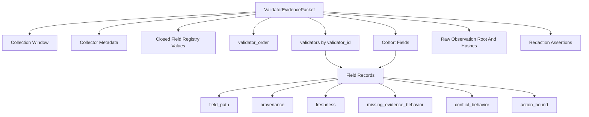

# Validator Evidence Packet Schema

Status: first draft packet contract for DGA validator evidence.
Date: 2026-05-23

This page explains the first validator evidence packet schema. The schema is a
design artifact, not live validator authority.

The packet is the frozen object that future Qwen-generated governance rules may
read. If a fact is not in this packet shape, a DGA rule should not rely on it.

## Repository Artifacts

| Artifact | Purpose |
| --- | --- |
| [validator_evidence_packet_schema.json](https://github.com/agticorp/postfiatl1v2/blob/main/docs/governance/agent/validator_evidence_packet_schema.json) | Draft JSON Schema for `postfiat-validator-evidence-packet-v1`. |
| [validator_evidence_collector_run_manifest_schema.json](https://github.com/agticorp/postfiatl1v2/blob/main/docs/governance/agent/validator_evidence_collector_run_manifest_schema.json) | Draft JSON Schema for collector-run manifests that freeze packet roots and source roots. |
| [validator_evidence_cobalt_binding_schema.json](https://github.com/agticorp/postfiatl1v2/blob/main/docs/governance/agent/validator_evidence_cobalt_binding_schema.json) | Draft JSON Schema for Cobalt dry-run packet-root bindings. |
| [validator_evidence_collector_writer_report_schema.json](https://github.com/agticorp/postfiatl1v2/blob/main/docs/governance/agent/validator_evidence_collector_writer_report_schema.json) | JSON Schema for local collector-writer reports that prove redaction-safe packet output. |
| [validator_evidence_source_authorization_schema.json](https://github.com/agticorp/postfiatl1v2/blob/main/docs/governance/agent/validator_evidence_source_authorization_schema.json) | JSON Schema for design-only collector source authorization. |
| [validator_evidence_operator_consent_receipt_schema.json](https://github.com/agticorp/postfiatl1v2/blob/main/docs/governance/agent/validator_evidence_operator_consent_receipt_schema.json) | JSON Schema for design-only operator consent receipts bound to source authorization. |
| [validator_evidence_operator_consent_revocation_index_schema.json](https://github.com/agticorp/postfiatl1v2/blob/main/docs/governance/agent/validator_evidence_operator_consent_revocation_index_schema.json) | JSON Schema for design-only consent revocation indexes bound to operator consent receipts. |
| [validator_evidence_operator_consent_publication_manifest_schema.json](https://github.com/agticorp/postfiatl1v2/blob/main/docs/governance/agent/validator_evidence_operator_consent_publication_manifest_schema.json) | JSON Schema for design-only consent publication manifests that project redaction-safe public summaries. |
| [validator_evidence_qwen_public_summary_projection_schema.json](https://github.com/agticorp/postfiatl1v2/blob/main/docs/governance/agent/validator_evidence_qwen_public_summary_projection_schema.json) | JSON Schema for design-only Qwen public-summary projections bound to publication manifests. |
| [validator_evidence_qwen_prompt_input_manifest_schema.json](https://github.com/agticorp/postfiatl1v2/blob/main/docs/governance/agent/validator_evidence_qwen_prompt_input_manifest_schema.json) | JSON Schema for design-only Qwen prompt-input manifests bound to the projection and dry-run model request. |
| [validator_evidence_qwen_prompt_redaction_audit_schema.json](https://github.com/agticorp/postfiatl1v2/blob/main/docs/governance/agent/validator_evidence_qwen_prompt_redaction_audit_schema.json) | JSON Schema for design-only Qwen prompt redaction audits over prompt-facing artifacts. |
| [validator_evidence_qwen_replay_preflight_schema.json](https://github.com/agticorp/postfiatl1v2/blob/main/docs/governance/agent/validator_evidence_qwen_replay_preflight_schema.json) | JSON Schema for design-only Qwen replay preflights bound to prompt redaction and runtime settings. |
| [validator_evidence_qwen_replay_authorization_schema.json](https://github.com/agticorp/postfiatl1v2/blob/main/docs/governance/agent/validator_evidence_qwen_replay_authorization_schema.json) | JSON Schema for design-only Qwen replay authorization packets bound to replay preflight. |
| [validator_evidence_qwen_replay_output_manifest_schema.json](https://github.com/agticorp/postfiatl1v2/blob/main/docs/governance/agent/validator_evidence_qwen_replay_output_manifest_schema.json) | JSON Schema for design-only Qwen replay output manifests bound to replay authorization. |
| [validator_evidence_qwen_replay_output_validation_receipt_schema.json](https://github.com/agticorp/postfiatl1v2/blob/main/docs/governance/agent/validator_evidence_qwen_replay_output_validation_receipt_schema.json) | JSON Schema for design-only Qwen replay output validation receipts bound to output manifests. |
| [validator_evidence_qwen_replay_promotion_decision_schema.json](https://github.com/agticorp/postfiatl1v2/blob/main/docs/governance/agent/validator_evidence_qwen_replay_promotion_decision_schema.json) | JSON Schema for design-only Qwen replay promotion decisions bound to output validation receipts. |
| [validator_evidence_qwen_replay_release_candidate_gate_schema.json](https://github.com/agticorp/postfiatl1v2/blob/main/docs/governance/agent/validator_evidence_qwen_replay_release_candidate_gate_schema.json) | JSON Schema for design-only Qwen replay release-candidate gates bound to promotion decisions. |
| [validator_evidence_qwen_replay_operator_review_gate_schema.json](https://github.com/agticorp/postfiatl1v2/blob/main/docs/governance/agent/validator_evidence_qwen_replay_operator_review_gate_schema.json) | JSON Schema for design-only Qwen replay operator-review gates bound to release-candidate gates. |
| [validator_evidence_qwen_replay_release_decision_gate_schema.json](https://github.com/agticorp/postfiatl1v2/blob/main/docs/governance/agent/validator_evidence_qwen_replay_release_decision_gate_schema.json) | JSON Schema for design-only Qwen replay release-decision gates bound to operator-review gates. |
| [validator_evidence_qwen_replay_governance_queue_gate_schema.json](https://github.com/agticorp/postfiatl1v2/blob/main/docs/governance/agent/validator_evidence_qwen_replay_governance_queue_gate_schema.json) | JSON Schema for design-only Qwen replay governance-queue gates bound to release-decision gates. |
| [validator_evidence_qwen_replay_governance_queue_decision_gate_schema.json](https://github.com/agticorp/postfiatl1v2/blob/main/docs/governance/agent/validator_evidence_qwen_replay_governance_queue_decision_gate_schema.json) | JSON Schema for design-only Qwen replay governance-queue decision gates bound to governance-queue gates. |
| [operator_manifest_delegation_schema.json](https://github.com/agticorp/postfiatl1v2/blob/main/docs/governance/agent/operator_manifest_delegation_schema.json) | Sidecar JSON Schema for delegated operator-accountability-key manifests. |
| [validator_evidence_conflict_set_schema.json](https://github.com/agticorp/postfiatl1v2/blob/main/docs/governance/agent/validator_evidence_conflict_set_schema.json) | Sidecar JSON Schema for deterministic conflict summaries bound to a packet root. |
| [validator_evidence_public_url_domain_gate_schema.json](https://github.com/agticorp/postfiatl1v2/blob/main/docs/governance/agent/validator_evidence_public_url_domain_gate_schema.json) | Sidecar JSON Schema for public-launch URL/domain proof gates bound to a packet root. |
| [validator_evidence_field_weight_policy_schema.json](https://github.com/agticorp/postfiatl1v2/blob/main/docs/governance/agent/validator_evidence_field_weight_policy_schema.json) | Sidecar JSON Schema for model-selection-governed field-weight profiles bound to registered fields. |
| [valid_packet.json](https://github.com/agticorp/postfiatl1v2/blob/main/docs/governance/agent/fixtures/validator_evidence/valid_packet.json) | Positive fixture with registry, URL, performance, Cobalt, topology, quality, and cohort fields. |
| [changed_packet.json](https://github.com/agticorp/postfiatl1v2/blob/main/docs/governance/agent/fixtures/validator_evidence/changed_packet.json) | Positive changed-evidence fixture for Qwen/Cobalt replay testing; only public registered fields change, including URL fetch status, uptime, missed votes, Cobalt vote count, and topology host group. |
| [changed_evidence_snapshot.json](https://github.com/agticorp/postfiatl1v2/blob/main/docs/governance/agent/fixtures/changed_evidence_snapshot.json) | Positive DGA frozen-evidence snapshot bound to the changed packet root for Gate 8.5 dry-run and replay validation. |
| [collector_run_manifest.json](https://github.com/agticorp/postfiatl1v2/blob/main/docs/governance/agent/fixtures/validator_evidence/collector_run_manifest.json) | Positive collector-run manifest fixture that references the valid packet and its source roots. |
| [collector_writer fixtures](https://github.com/agticorp/postfiatl1v2/tree/main/docs/governance/agent/fixtures/validator_evidence/collector_writer) | Positive and invalid fixtures for redaction-safe collector-writer reports. |
| [source_authorization fixtures](https://github.com/agticorp/postfiatl1v2/tree/main/docs/governance/agent/fixtures/validator_evidence/source_authorization) | Positive fixture for collector source authorization bound to the manifest. |
| [operator_consent_receipt fixtures](https://github.com/agticorp/postfiatl1v2/tree/main/docs/governance/agent/fixtures/validator_evidence/operator_consent_receipt) | Positive fixture for operator consent receipt validation. |
| [operator_consent_revocation_index fixtures](https://github.com/agticorp/postfiatl1v2/tree/main/docs/governance/agent/fixtures/validator_evidence/operator_consent_revocation_index) | Positive fixture for consent revocation-index validation. |
| [operator_consent_publication_manifest fixtures](https://github.com/agticorp/postfiatl1v2/tree/main/docs/governance/agent/fixtures/validator_evidence/operator_consent_publication_manifest) | Positive fixture for consent publication-manifest validation. |
| [qwen_public_summary_projection fixtures](https://github.com/agticorp/postfiatl1v2/tree/main/docs/governance/agent/fixtures/validator_evidence/qwen_public_summary_projection) | Positive fixture for Qwen public-summary projection validation. |
| [qwen_prompt_input_manifest fixtures](https://github.com/agticorp/postfiatl1v2/tree/main/docs/governance/agent/fixtures/validator_evidence/qwen_prompt_input_manifest) | Positive fixture for Qwen prompt-input manifest validation. |
| [qwen_prompt_redaction_audit fixtures](https://github.com/agticorp/postfiatl1v2/tree/main/docs/governance/agent/fixtures/validator_evidence/qwen_prompt_redaction_audit) | Positive fixture for Qwen prompt redaction audit validation. |
| [qwen_replay_preflight fixtures](https://github.com/agticorp/postfiatl1v2/tree/main/docs/governance/agent/fixtures/validator_evidence/qwen_replay_preflight) | Positive fixture for Qwen replay preflight validation. |
| [qwen_replay_authorization fixtures](https://github.com/agticorp/postfiatl1v2/tree/main/docs/governance/agent/fixtures/validator_evidence/qwen_replay_authorization) | Positive fixture for Qwen replay authorization validation. |
| [qwen_replay_output_manifest fixtures](https://github.com/agticorp/postfiatl1v2/tree/main/docs/governance/agent/fixtures/validator_evidence/qwen_replay_output_manifest) | Positive fixture for Qwen replay output-manifest validation. |
| [qwen_replay_output_validation_receipt fixtures](https://github.com/agticorp/postfiatl1v2/tree/main/docs/governance/agent/fixtures/validator_evidence/qwen_replay_output_validation_receipt) | Positive fixture for Qwen replay output validation-receipt validation. |
| [qwen_replay_promotion_decision fixtures](https://github.com/agticorp/postfiatl1v2/tree/main/docs/governance/agent/fixtures/validator_evidence/qwen_replay_promotion_decision) | Positive fixture for Qwen replay promotion-decision validation. |
| [qwen_replay_release_candidate_gate fixtures](https://github.com/agticorp/postfiatl1v2/tree/main/docs/governance/agent/fixtures/validator_evidence/qwen_replay_release_candidate_gate) | Positive fixture for Qwen replay release-candidate gate validation. |
| [qwen_replay_operator_review_gate fixtures](https://github.com/agticorp/postfiatl1v2/tree/main/docs/governance/agent/fixtures/validator_evidence/qwen_replay_operator_review_gate) | Positive fixture for Qwen replay operator-review gate validation. |
| [qwen_replay_release_decision_gate fixtures](https://github.com/agticorp/postfiatl1v2/tree/main/docs/governance/agent/fixtures/validator_evidence/qwen_replay_release_decision_gate) | Positive fixture for Qwen replay release-decision gate validation. |
| [qwen_replay_governance_queue_gate fixtures](https://github.com/agticorp/postfiatl1v2/tree/main/docs/governance/agent/fixtures/validator_evidence/qwen_replay_governance_queue_gate) | Positive fixture for Qwen replay governance-queue gate validation. |
| [qwen_replay_governance_queue_decision_gate fixtures](https://github.com/agticorp/postfiatl1v2/tree/main/docs/governance/agent/fixtures/validator_evidence/qwen_replay_governance_queue_decision_gate) | Positive fixture for Qwen replay governance-queue decision gate validation. |
| [cobalt_binding.json](https://github.com/agticorp/postfiatl1v2/blob/main/docs/governance/agent/fixtures/validator_evidence/cobalt_binding.json) | Positive Cobalt dry-run binding fixture for `validator_evidence_packet_root`. |
| [operator_manifest_delegation fixtures](https://github.com/agticorp/postfiatl1v2/tree/main/docs/governance/agent/fixtures/validator_evidence/operator_manifest_delegation) | Positive and invalid fixtures for delegated operator manifest signing. |
| [conflict_set fixtures](https://github.com/agticorp/postfiatl1v2/tree/main/docs/governance/agent/fixtures/validator_evidence/conflict_set) | Positive and invalid fixtures for deterministic conflict summaries. |
| [public_url_domain_gate fixtures](https://github.com/agticorp/postfiatl1v2/tree/main/docs/governance/agent/fixtures/validator_evidence/public_url_domain_gate) | Positive and invalid fixtures for public-launch URL/domain proof gates. |
| [field_weight_policy fixtures](https://github.com/agticorp/postfiatl1v2/tree/main/docs/governance/agent/fixtures/validator_evidence/field_weight_policy) | Positive and invalid fixtures for governed field-weight policy. |
| [canonical_hashes.json](https://github.com/agticorp/postfiatl1v2/blob/main/docs/governance/agent/fixtures/validator_evidence/canonical_hashes.json) | SHA-384 canonical JSON hash vectors for the baseline and changed packet fixtures. |
| [validator_evidence fixtures](https://github.com/agticorp/postfiatl1v2/tree/main/docs/governance/agent/fixtures/validator_evidence) | Invalid fixtures for unknown fields, unknown provenance, malformed URL proof, duplicate validator order, missing-behavior drift, private collector fields, mismatched Cobalt roots, and nonzero dry-run mutation. |

## Shape



Validator entries are keyed by validator id, and `validator_order` is a
unique ordered list. That gives the packet a deterministic order for hashing
and makes duplicate validator ids fail closed at the ordering layer.

Each field record carries:

- a registered `field_path`;
- a declared `value_type`;
- one or more closed provenance values;
- a closed freshness class;
- a closed missing-evidence behavior;
- a closed conflict behavior;
- a closed action bound;
- an observation timestamp;
- a source hash or explicit null;
- a redaction flag.

## Closed Values

The schema closes the same values defined in the
[Validator Evidence Field Registry](validator-evidence-field-registry.md):

| Category | Closed Values |
| --- | --- |
| Provenance | `chain_derived`, `registry_derived`, `operator_signed`, `collector_observed`, `network_observed`, `self_asserted`, `third_party_attested` |
| Freshness | `same_packet`, `recent_24h`, `recent_7d`, `recent_30d`, `epoch_bound`, `historical` |
| Missing behavior | `reject_packet`, `reject_validator_entry`, `hold`, `neutral`, `stale` |
| Conflict behavior | `reject_packet`, `reject_validator_entry`, `hold` |
| Action bound | `informational_only`, `score_adjustment`, `admission_gate`, `hold_only`, `suspend_candidate`, `remove_candidate`, `no_action` |

Unknown field paths, provenance values, freshness classes, missing behaviors,
conflict behaviors, and action bounds are schema-invalid.

## Hashing

The first fixture hash vector uses SHA-384 over canonical JSON:

```text
json.dumps(sort_keys=True,separators=(',',':'),ensure_ascii=True)
```

Current valid fixture hash:

```text
7f146e261443b04f443764468e94343f81a1dd87ec30a122b267b3d2050d43321ea6b122cb2b19efbe57b1728a6e4cea
```

This hash proves byte-stable packet replay for the fixture. It does not prove
that a live collector has produced those observations.

## Fail-Closed Coverage

The invalid fixtures cover the first fail-closed cases:

| Fixture | Expected Failure |
| --- | --- |
| `invalid_unknown_field_path.json` | A rule-relevant field path is not registered. |
| `invalid_unknown_provenance.json` | A provenance value is outside the closed enum. |
| `invalid_unknown_missing_behavior.json` | Missing evidence cannot invent punitive behavior. |
| `invalid_duplicate_validator_order.json` | Validator ordering cannot contain duplicate ids. |
| `invalid_malformed_url.json` | URL proof must use HTTPS URL shape. |
| `invalid_private_collector_field.json` | Collector metadata cannot carry private material. |
| `invalid_cobalt_binding_mismatched_root.json` | Cobalt binding cannot cite a packet root that does not match the validated packet. |
| `invalid_cobalt_binding_nonzero_mutation.json` | Cobalt dry-run binding cannot carry a nonzero registry mutation. |

## Validation Command

Focused schema validation can be run locally with:

```bash
scripts/validator-evidence-fixtures-validate
```

The validator recomputes the packet root, validates the collector-run manifest,
validates the DGA frozen-evidence packet-root binding, checks that the governed
ruleset schema and prompt-facing request expose `validator_evidence_packet`,
validates the operator-manifest delegation sidecar contract,
validates the conflict-set sidecar contract,
validates the public URL/domain gate sidecar contract,
validates the field-weight policy sidecar contract,
validates the collector-writer report contract,
validates the collector source-authorization contract,
validates the operator-consent receipt contract,
validates the operator-consent revocation-index contract,
validates the operator-consent publication-manifest contract,
validates the Qwen public-summary projection contract,
validates the Qwen prompt-input manifest contract,
validates the Qwen prompt redaction audit contract,
validates the Qwen replay preflight contract,
validates the Qwen replay authorization contract,
validates the Qwen replay output-manifest contract,
validates the Qwen replay output validation-receipt contract,
validates the Qwen replay promotion-decision contract,
validates the Qwen replay release-candidate gate contract,
validates the Qwen replay operator-review gate contract,
validates the Qwen replay release-decision gate contract,
validates the Qwen replay governance-queue gate contract,
validates the Qwen replay governance-queue decision gate contract,
checks that the prompt-facing request binds the current packet-schema and
field-registry hashes,
checks that a missing `validator_evidence_packet` input fixture is rejected by
JSON Schema and by the redundant Rust ruleset validation,
validates the Cobalt dry-run binding, and proves that missing or mismatched
packet roots and nonzero dry-run mutation fail closed.

## Boundary

This schema does not launch validator-side governance, sidecars,
commit-reveal, or authority transfer. It only defines what the DGA may inspect
when future rules are bound to validator evidence.

The operator-manifest delegation sidecar is documented in
Validator Evidence Operator Manifest Delegation.
It does not change the current packet-schema hash.
The conflict-set sidecar is documented in
Validator Evidence Conflict Set. It also
does not change the current packet-schema hash.
The public-launch URL/domain proof gate is documented in
Validator Evidence Public URL Domain Gate.
It also does not change the current packet-schema hash.
The field-weight policy sidecar is documented in
Validator Evidence Field Weight Policy.
It also does not change the current packet-schema hash or give Qwen authority
to edit field weights.
The local collector-writer implementation is documented in
Validator Evidence Collector Writer.
It writes redaction-safe fixture artifacts outside the repo and does not change
the current packet-schema hash.
The source authorization contract is documented in
Validator Evidence Source Authorization.
It also does not change the current packet-schema hash.
The operator consent receipt contract is documented in
Validator Evidence Operator Consent Receipt.
It narrows approved sources to operator-approved public summaries and also does
not change the current packet-schema hash.
The operator consent revocation-index contract is documented in
Validator Evidence Operator Consent Revocation Index.
It binds receipt validity to a redaction-safe revocation status and also does
not change the current packet-schema hash.
The operator consent publication-manifest contract is documented in
Validator Evidence Operator Consent Publication Manifest.
It projects only permitted public summary fields and also does not change the
current packet-schema hash.
The Qwen public-summary projection contract is documented in
Validator Evidence Qwen Public Summary Projection.
It binds future prompt-visible summaries to the publication manifest and also
does not change the current packet-schema hash.
The Qwen prompt-input manifest contract is documented in
Validator Evidence Qwen Prompt Input Manifest.
It binds those summaries to the current dry-run model request hash without
provider spend, model output, or packet-schema hash changes.
The Qwen prompt redaction audit contract is documented in
Validator Evidence Qwen Prompt Redaction Audit.
It scans prompt-facing artifacts for raw keys and secret-bearing values without
provider spend, model output, or packet-schema hash changes.
The Qwen replay preflight contract is documented in
Validator Evidence Qwen Replay Preflight.
It binds that audit to deterministic runtime settings and future replay
requirements without provider spend, model output, or packet-schema hash
changes.
The Qwen replay authorization contract is documented in
Validator Evidence Qwen Replay Authorization.
It records the current non-authorization decision and fails closed if spend,
execution, or replay count becomes nonzero without a future explicit lane.
The Qwen replay output-manifest contract is documented in
Validator Evidence Qwen Replay Output Manifest.
It records the current zero-output state and fails closed if generated model
outputs or retained output artifacts appear without a future explicit lane.
The Qwen replay output validation-receipt contract is documented in
Validator Evidence Qwen Replay Output Validation Receipt.
It records the current no-output validation status and fails closed if a
ruleset candidate or compiled policy is accepted without a future explicit
lane.
The Qwen replay promotion-decision contract is documented in
Validator Evidence Qwen Replay Promotion Decision.
It records the current non-promotion decision and fails closed if a release
candidate, promoted ruleset, Cobalt submission, registry mutation, or authority
transfer appears without a future explicit lane.
The Qwen replay release-candidate gate contract is documented in
Validator Evidence Qwen Replay Release Candidate Gate.
It records the current not-created candidate state and fails closed if a
candidate packet, candidate ruleset, operator pack update, Cobalt submission,
registry mutation, or authority transfer appears without a future explicit
lane.
The Qwen replay operator-review gate contract is documented in
Validator Evidence Qwen Replay Operator Review Gate.
It records the current not-requested review state and fails closed if operator
review, operator approval, release decisioning, Cobalt submission, registry
mutation, or authority transfer appears without a future explicit lane.
The Qwen replay release-decision gate contract is documented in
Validator Evidence Qwen Replay Release Decision Gate.
It records the current not-requested release-decision state and fails closed if
release packets, governance queue submission, operator pack updates, Cobalt
submission, registry mutation, or authority transfer appears without a future
explicit lane.
The Qwen replay governance-queue gate contract is documented in
Validator Evidence Qwen Replay Governance Queue Gate.
It records the current not-submitted queue state and fails closed if queue
submission, queue decision, Cobalt submission, registry mutation, or authority
transfer appears without a future explicit lane.
The Qwen replay governance-queue decision gate contract is documented in
Validator Evidence Qwen Replay Governance Queue Decision Gate.
It records the current not-requested queue-decision state and fails closed if
queue acceptance, Cobalt submission, registry mutation, or authority transfer
appears without a future explicit lane.

The DGA ruleset binding slice is now documented in
Validator Evidence Ruleset Binding.
