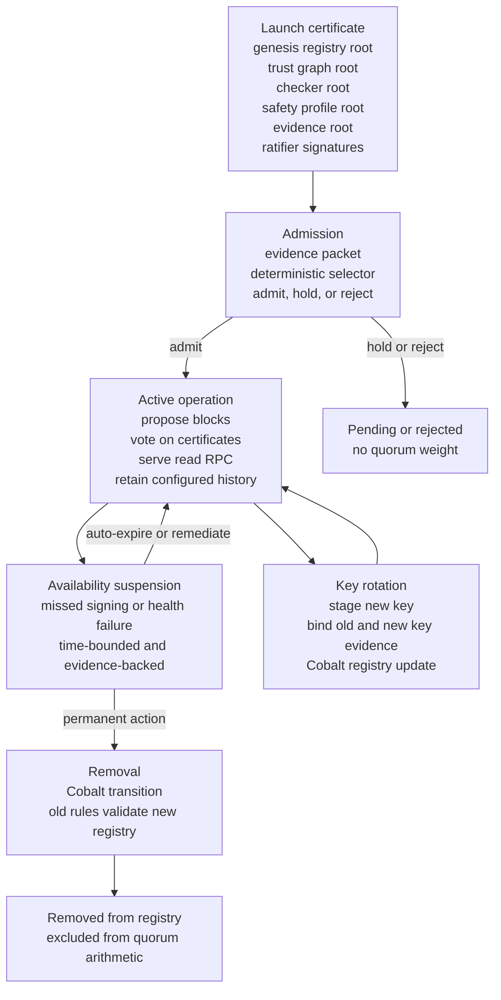

# Validator Registry

The validator registry is governed state. It is not an informal side channel.

## Responsibilities

- bind validator identities to protocol keys;
- track validator registry roots;
- support registry transitions through Cobalt;
- reject stale membership artifacts after activation;
- make governance history replayable.

## Transition Rules

Validator changes must be:

1. proposed as governance state;
2. checked against trust graph requirements;
3. ratified through Cobalt mechanics;
4. activated at a valid height;
5. replayable from ordered lifecycle records.

## Validator Lifecycle



## Admission Policy V1

Validator admission now has an executable deterministic policy in
`postfiat-consensus-cobalt`. It is a pure selector: it does not call a model,
the network, the clock, or a private committee.

Input:

```text
ValidatorAdmissionEvidencePacket {
  registry_root,
  candidate,
  active_validators,
  evidence_refs,
  model_output
}
```

Output:

```text
ValidatorAdmissionDecision {
  action: admit | hold | reject,
  reason_codes,
  failed_fields,
  correlation_cluster,
  required_followup_evidence,
  registry_delta_candidate
}
```

The controlled-testnet v1 floors are:

| Gate | Rule |
| --- | --- |
| Reliability | `validator.performance.uptime_window_bps >= 9950` |
| Accountability | `validator.admission.accountability_score >= 70` |
| Correlation | `validator.admission.rho_score <= 0` |
| Control groups | no shared operator, release-manager, key-management, or funding-source group |
| Domain/accountability | signed operator manifest and proved key-domain binding |
| Cobalt | `validator.cobalt.linkedness_safe == true` |
| Model input | replay-bound `operator_independence_classification` may hold, never admit by itself |

Missing or stale required evidence holds. Conflicting required evidence holds.
Values below floors or above caps reject. Unknown model-cited fields hold. Only
a clean pass emits an `add` registry-delta candidate.

The fixture report is generated with:

```bash
REPORT=reports/validator-admission-policy-v1-report.json \
  cargo run -q -p postfiat-consensus-cobalt --example validator_admission_policy
```

Current report hash:

```text
f635501520fdce00602528f82b2daf6874af12adb2273a4922826442bea3904cf5d476b66f9ad340a0d45920cd24057b
```

The report covers: clean independent admit, shared-control reject,
missing-domain hold, contradictory-evidence hold, and unknown model-field hold.

## Qwen/Cobalt Controlled Live-Effect Drill

The Qwen/Cobalt path now has one controlled internal live-effect drill:

```bash
scripts/qwen-cobalt-live-registry-authority-drill --verify-report
```

That drill starts a local project-controlled chain, admits `validator-3`
through a validator-registry governance batch, stages and validates its key,
then applies an `authority_mode` governance amendment from `0` (`foundation`)
to `1` (`cobalt-ratified`). The report is:

```text
reports/verifiable-constitution/vc-110-qwen-cobalt-live-registry-authority-drill-report.json
```

This proves the implementation path can perform a governed local registry
mutation and controlled authority transfer. It does not mutate public testnet,
mainnet, or external validator state.

## Public Topology Evidence

Controlled testnet can run on project-controlled hosts and reused machines.
Public launch requires stronger placement evidence across hosts, operators,
legal domains, jurisdictions, and funding domains.

The strict topology gate exists to make that public launch requirement
machine-checkable. It is not the same thing as controlled-testnet Cobalt
correctness.

## Sources

- `docs/governance/full-cobalt-shipping-plan.md`
- `docs/examples/controlled-testnet-placement-manifest.example.json`
- `docs/status/controlled-testnet-placement-manifest.json`
- `scripts/testnet-cobalt-topology-diversity-gate`
- `scripts/testnet-cobalt-placement-preflight`
