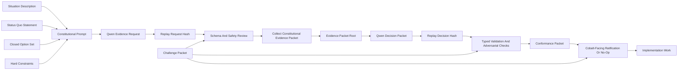

# Verifiable Constitution Plan

Status: design plan for replayable Qwen-authored protocol decisions.
Date: 2026-05-24

The Verifiable Constitution is the next governance layer above the current
Qwen/Cobalt validator-evidence lane. The goal is to make the major protocol
choices in PostFiat replayable decisions instead of private project judgment.

Plain English: for each protocol vector, PostFiat should provide Qwen with a
bounded situation description, the current status quo, a closed option set, and
an evidence request. Qwen then emits a typed decision packet: which option it
selects, which evidence it needs, which evidence it used, why it selected that
option, what implementation changes follow, and what would invalidate the
decision. The result is replayed until hashes converge, then routed through
deterministic validation, implementation mapping, Cobalt-facing review, and
explicit challenge paths.

This does not mean humans disappear from the system. Humans still define the
initial situation, collect evidence, implement code, and reject unsafe output.
The point is that the core protocol decisions become public, typed,
hash-bound, replayable, and challengeable. Once a decision packet passes the
replay and validation gates, PostFiat should conform to it by default unless a
specific challenge packet identifies a bad input, missing option, invalid
constraint, failed replay, unsafe implementation, or failed Cobalt gate.

The most important property is not that no human chose the initial rules.
Every protocol has initial rules. The important property is that once those
rules are shipped as code, manifests, prompts, schemas, selector functions,
model profiles, and Cobalt amendment paths, deviation from them becomes
mechanically visible. If an operator publishes a validator list, parameter
change, model output, or protocol decision that does not match the replayed
pipeline, the mismatch is a public artifact: wrong packet root, wrong prompt
hash, wrong model profile, wrong output hash, wrong selector result, wrong
conformance packet, or missing Cobalt/release gate. The system does not depend
on guessing whether someone privately changed their mind. It makes going
against the process detectable.

## Scope

The Verifiable Constitution covers protocol-shaping decisions, not routine
implementation details.

Initial vectors:

| Vector | Examples Of Questions |
| --- | --- |
| Model governance | Which model profile is active? What replay threshold is enough? How are model upgrades admitted or rolled back? |
| Validator governance | What evidence fields should exist? Which fields may affect UNL selection? What selector caps and thresholds are justified? |
| Cobalt governance | Which validator-registry transitions require Cobalt ratification? Which trust-graph safety checks are constitutional? |
| Privacy | Which shielded protocol path is active? What disclosure, scanning, nullifier, and audit boundaries are required? |
| Post-quantum authorization | Which ML-DSA parameter set, certificate shape, migration path, and key-rotation requirements are constitutional? |
| Monetary policy | Which supply, burn, fee, and no-validator-reward rules are locked? What changes are prohibited? |
| Storage and history | What history-retention, current-state validation, and archive-node obligations are required? |
| RPC and edge policy | Which public RPC methods, write policies, rate limits, and privacy boundaries are constitutional? |
| Operator security | Which validator key, operator manifest, delegation, revocation, and redaction rules are mandatory? |
| Release authority | Which gates must pass before controlled testnet, public testnet, mainnet, guarded apply, or authority transfer? |

## Core Objects

The lane introduces five object types.

| Object | Purpose |
| --- | --- |
| `ConstitutionalQuestion` | Defines one bounded protocol question, the status quo, available options, hard constraints, and forbidden outputs. |
| `ConstitutionalEvidenceRequest` | Qwen-authored proposal for what evidence is needed to answer the question, including field paths, provenance, freshness, and action bounds. |
| `ConstitutionalEvidencePacket` | Collector-built packet containing the actual evidence requested and approved for the question. |
| `ConstitutionalDecisionPacket` | Qwen-authored decision over the evidence packet: selected option, rationale, rejected options, implementation consequences, invalidation criteria, and confidence. |
| `ConformancePacket` | Deterministic mapping from accepted decision to code/docs/tests/gates, plus explicit challenge and rollback paths. |

The evidence request is the key new part. Today Qwen can score or reason over
an existing validator-evidence packet, but it cannot define that packet. The
Verifiable Constitution adds a separate upstream lane where Qwen may propose
the packet request itself. That proposal is not live authority. It becomes a
candidate request that must pass schema validation, adversarial review,
redaction checks, replay convergence, and governance acceptance before any
collector or implementation conforms to it.

## Replay Flow



The process has two Qwen calls:

1. Evidence-request generation. Qwen answers: "What evidence should decide
   this question?"
2. Decision generation. Qwen answers: "Given the approved evidence packet,
   which option should PostFiat select?"

Both calls are replayed under the pinned deterministic model profile. Both
produce typed JSON. Both fail closed if the output is malformed, cites hidden
evidence, expands scope, or attempts live mutation.

## Prompt Shape

Every constitutional prompt should use the same structure.

```text
You are producing a replayable constitutional governance artifact for PostFiat.

Situation:
  <bounded description of the protocol question>

Status quo:
  <current implementation, current docs, current evidence roots>

Available options:
  A. Preserve status quo
  B. Adopt option B
  C. Adopt option C
  D. Defer/no-op pending missing evidence

Hard constraints:
  - no live registry mutation
  - no hidden evidence
  - no secret material
  - cite only packet fields
  - prefer no-op when evidence is missing or ambiguous
  - emit JSON only

Task 1:
  Propose the evidence packet fields needed to decide this question.

Task 2:
  After an approved evidence packet is supplied, select exactly one option,
  justify it from packet fields, state rejected options, state implementation
  consequences, and state invalidation criteria.
```

The prompt must include a closed option set. Qwen may recommend adding an
option, but that recommendation becomes a new question packet. It cannot
silently expand the active decision.

## Evidence Request Output

The evidence request output should be typed JSON.

```json
{
  "schema": "postfiat-constitutional-evidence-request-v1",
  "question_id": "vc-model-selection-001",
  "request_scope": "model_governance",
  "requested_fields": [
    {
      "field_path": "model.active.model_id",
      "value_type": "string",
      "required_provenance": ["governance_documented"],
      "freshness": "epoch_bound",
      "missing_evidence_behavior": "hold",
      "action_bound": "decision_input",
      "rationale": "The active model identity must be explicit before upgrade comparison."
    },
    {
      "field_path": "model.candidate.replay_convergence_count",
      "value_type": "integer",
      "required_provenance": ["replay_derived"],
      "freshness": "same_packet",
      "missing_evidence_behavior": "hold",
      "action_bound": "decision_input",
      "rationale": "The candidate model must prove deterministic replay under the declared profile."
    }
  ],
  "forbidden_fields": [
    "provider.private_api_key",
    "operator.private_notes",
    "unregistered_reputation_claim"
  ],
  "minimum_packet_checks": {
    "schema_valid": true,
    "field_registry_bound": true,
    "redaction_passed": true,
    "secret_scan_passed": true
  },
  "fallback": "no_op_until_packet_approved"
}
```

This is how Qwen can help author the evidence packet without granting it live
authority. The model proposes what should be measured. Deterministic code and
governance review decide whether that request is safe, collectible, and
complete.

## Decision Output

The decision output should also be typed JSON.

```json
{
  "schema": "postfiat-constitutional-decision-packet-v1",
  "question_id": "vc-model-selection-001",
  "evidence_packet_root": "example-root",
  "selected_option": "preserve_qwen_sglang_tp1_until_candidate_passes_replay",
  "decision": "hold",
  "rationale_refs": [
    "model.active.model_id",
    "model.active.runtime_profile_hash",
    "model.candidate.replay_convergence_count",
    "model.candidate.adversarial_failure_count"
  ],
  "rejected_options": [
    {
      "option": "activate_candidate_model_now",
      "reason": "candidate replay evidence is missing"
    }
  ],
  "implementation_consequences": [
    "keep current model profile active",
    "create candidate replay packet before promotion",
    "reject silent provider or model swap"
  ],
  "invalidation_criteria": [
    "active model output drifts on frozen prompt",
    "candidate model passes replay and adversarial comparison",
    "runtime profile changes without governance packet"
  ],
  "fallback": "no_op"
}
```

## Default Conformance Rule

The Verifiable Constitution should create a default-conform rule:

1. If a constitutional decision packet is schema-valid, replay-converged,
   evidence-bound, adversarially checked, and accepted through the named
   governance lane, implementation should conform to it.
2. If a contributor or operator disagrees, they should submit a
   `ChallengePacket`.
3. A challenge must identify a concrete failure: bad situation framing, missing
   option, bad evidence request, missing evidence, stale evidence, hidden
   evidence, invalid model profile, replay drift, unsafe selector, unsafe
   Cobalt effect, impossible implementation, or failed test.
4. If the challenge is accepted, the decision is held, superseded, or rolled
   back.
5. If no accepted challenge exists, human disagreement alone should not
   override the accepted decision packet.

This is the practical meaning of "without our judgments." Human judgment still
exists, but it must take the form of a governed input, evidence packet,
implementation proof, or challenge packet. It should not be an invisible veto.

## Commitment Device

The Verifiable Constitution is a commitment device. It binds the project and
later validators to a published procedure by making deviation cheaper to detect
than to hide.

Genesis authorship is not the trust claim. Satoshi chose Bitcoin's initial
block interval and supply schedule; that fact does not mean Satoshi controls
Bitcoin today. The relevant question is whether the operating network can
change or ignore its rules without the network noticing. PostFiat's answer is
that constitutional decisions should be encoded as replayable artifacts so that
the project cannot quietly do something else after publication.

For each accepted constitutional decision, the following must be true:

- the accepted question, prompt, evidence request, evidence packet, model
  profile, decision packet, selector or policy result, conformance packet, and
  Cobalt/release gate are all hash-bound;
- an implementation that conforms to the decision can cite those hashes;
- an implementation that does not conform produces a visible mismatch;
- a proposed change to the prompt, schema, selector, model profile, evidence
  fields, or conformance rule is itself a new constitutional or Cobalt-facing
  governance event;
- a challenge packet can halt or supersede an accepted decision, but only by
  naming a concrete defect.

This is why the process is meaningfully different from private publisher
discretion. A private publisher can go against its own unstated criteria
without leaving a machine-checkable trail. A Verifiable Constitution round
turns that kind of deviation into a public failure: the replayed output,
selector output, or conformance packet does not match what was published or
implemented.

The operating trust property is therefore:

```text
trustless_governance_claim =
  public_rules
  + replayable_execution
  + detectable_deviation
  + quorum_or_release_gate_to_reject_deviation
  + challenge_packet_path
```

The initial designer still chose the first version of the rules. The protocol
claim is that after those rules are active, the designer is bound like everyone
else. They can propose an amendment, submit a challenge, or publish a new
constitutional question. They cannot silently override the accepted process
without producing evidence of the override.

## Vector Packet Matrix

Each vector gets a constitutional question packet and a tailored evidence
request.

| Vector | Status Quo Input | Likely Options | Evidence Packet Contents |
| --- | --- | --- | --- |
| Model governance | Current Qwen/SGLang TP=1 profile and replay reports. | Keep active profile, admit candidate, freeze model, roll back model, no-op. | Model ID, image/runtime hash, tokenizer/template hash, deterministic flags, replay counts, raw-output hashes, parsed-output hashes, adversarial reports, cost/throughput data. |
| Validator evidence | Current packet schema and field registry. | Preserve registry, add fields, remove unsafe fields, change freshness/missing semantics, no-op. | Field path inventory, provenance classes, collector availability, redaction checks, hostile input cases, Cobalt binding reports. |
| UNL selection | Current Cobalt-bound validator governance lane. | Keep advisory scoring, enable bounded candidate, adjust thresholds, hold for missing evidence, no-op. | Validator packet roots, score outputs, selector thresholds, topology concentration, Cobalt dry-run, rollback references. |
| Cobalt | Current trust-graph and amendment mechanics. | Preserve gates, tighten linkedness, change thresholds, change rollback/supersession behavior, no-op. | Trust graph fixtures, essential-subset checks, adversarial packet results, replay bundles, liveness/safety reports. |
| Privacy | Orchard/Halo2-style shielded flow. | Preserve current path, change disclosure defaults, require extra audit packet, defer production claims, no-op. | Circuit IDs, parameter hashes, nullifier behavior, scan/disclose reports, privacy audit packets, redaction proofs. |
| ML-DSA authorization | Current post-quantum account and validator signature path. | Preserve parameter set, change certificate shape, alter key-rotation policy, defer migration feature, no-op. | Signature parameter IDs, size/latency reports, verification tests, key-rotation fixtures, compatibility reports. |
| Monetary policy | Fixed 100B supply, fee burn, no native validator reward. | Preserve, alter fee burn accounting, add explicit prohibited-change rule, no-op. | Genesis config hash, fee accounting tests, supply invariant tests, reward schedule absence proofs. |
| Storage/history | Current-state and partial-history validation design. | Preserve, require archive role, alter pruning windows, no-op. | History retention configs, restart/replay reports, archive proofs, state-root verification tests. |
| RPC/edge | Bounded public RPC and wallet tooling. | Preserve, restrict writes, add rate limits, expose new method, no-op. | RPC method inventory, auth/write policy, load reports, redaction checks, abuse cases. |
| Release authority | Current controlled-testnet gates. | Keep foundation authority, open guarded apply, enable sidecars, authorize authority transfer, no-op. | Gate reports, operator signoff, rollback plan, shadow convergence, Cobalt ratification evidence. |

## Verification Rules

Every accepted constitutional decision requires:

- canonical request bytes and request hash;
- pinned model/runtime profile hash;
- prompt template hash;
- evidence-request output hash;
- evidence-request replay convergence report;
- approved evidence packet root;
- decision output hash;
- decision replay convergence report;
- parsed decision hash;
- schema validation report;
- adversarial prompt-injection and hidden-evidence checks;
- conformance packet mapping decision to implementation;
- rollback or supersession path;
- Cobalt dry-run or explicit statement that no Cobalt action is in scope.

## Model Receipt Generality

The Verifiable Constitution must prove that replayable AI validation is not a
validator-specific trick. Validator evidence is only one application. The same
machinery should work for privacy choices, ML-DSA authorization choices,
monetary-policy invariants, model-selection decisions, RPC policy, storage
policy, and release authority.

The proof target is a model receipt, not a validator score. A model receipt
binds:

- the constitutional question hash;
- the status-quo statement hash;
- the closed option-set hash;
- the evidence-request or evidence-packet root;
- the model artifact, tokenizer, runtime image, deterministic flags, and
  hardware class;
- the raw output bytes;
- the parsed typed JSON output;
- the full-logit, full-logprob, or fixed-point full-distribution root when the
  runtime exposes it;
- the replay count, replay roots, and divergence policy.

This gives PostFiat a direct way to answer the "this is only about validators"
critique. A privacy decision, ML-DSA parameter decision, fee-burn decision, or
model-selection decision can be run through the same receipt flow. The output
may be a hold, no-op, or selected option, but the replay object is the same:
typed prompt, pinned model, typed evidence, full-output commitment, parsed
decision, and challenge path.

Cross-machine replay should be measured at the strongest level available:

1. exact full-logit or fixed-point full-distribution equality across machines;
2. if full equality fails, exact parsed-decision equality plus stable
   hardware-class roots;
3. if parsed decisions diverge, fail closed and do not admit the profile.

The first target is preferred because it directly refutes the claim that
governance replay only works as a validator-specific JSON hash trick. If the
same constitutional request produces the same full distribution on different
machines under a pinned profile, PostFiat has evidence that the validation
primitive is general model execution replay. If different hardware produces
different stable roots, the correct fallback is hardware-class admission, not a
universal determinism claim.

## Cross-Machine Qwen Verification Plan

The cross-machine lane should actually rent or use different machine types. A
local-only repeat test is not enough.

Minimum initial matrix:

| Class | Purpose | Required Evidence |
| --- | --- | --- |
| Same-class, different host | Prove repeatability is not one lucky machine. | Two separate hosts with the same GPU class, same image, same model, same prompt, same deterministic flags, same output roots. |
| Different datacenter GPU class | Measure whether roots remain exact across class boundaries. | At least one A100-class or equivalent and one H100/H200-class or equivalent host, with hardware-class labels and output roots. |
| Provider boundary | Measure provider/runtime packaging risk. | At least two provider or host sources where available, each with instance manifest, image digest, driver/CUDA/runtime metadata, and cleanup proof. |
| CPU/local verifier path | Prove local code can validate receipts and hashes without trusting the rented host. | Local recomputation of canonical request hashes, parsed-output hashes, receipt roots, and report roots from downloaded artifacts. |

The first pass should use one non-validator constitutional question such as
model-governance or monetary-policy activation. The prompt should be small
enough to run repeatedly, but rich enough to emit a typed evidence request and
decision packet. After that, the matrix should expand to privacy, ML-DSA
authorization, storage, and RPC policy.

Each machine run must publish a redaction-safe `MachineReplayPacket` with:

- provider or host label;
- machine type and GPU class;
- driver, CUDA, runtime, container/image digest, Python package lock, tokenizer
  hash, model artifact hash or content address where available;
- deterministic flags, tensor parallelism, batching policy, prompt hash,
  request hash, and model profile hash;
- raw output hash;
- parsed JSON hash;
- full-logit, full-logprob, or fixed-point full-distribution root where
  available;
- stderr/stdout hashes with secret scan passed;
- start/stop timestamps;
- provider resource cleanup proof for any rented machine.

The verifier should then build a `CrossMachineReplayReport`:

```text
CrossMachineReplayReport =
  canonical_question_hash
  + prompt_hash
  + model_profile_hash
  + machine_replay_packet_hashes
  + raw_output_hash_set
  + parsed_output_hash_set
  + full_output_root_set
  + hardware_class_root_map
  + divergence_classification
  + cleanup_proof_hashes
```

Passing standards are intentionally strict:

- **Green:** exact raw output, parsed JSON, and full-output roots match across
  all hosts.
- **Yellow:** parsed JSON matches, but full-output roots differ by stable
  hardware class; admit only class-bound roots and do not claim universal
  equality.
- **Red:** parsed JSON diverges, roots drift within the same class, artifacts
  are incomplete, provider cleanup is missing, or deterministic flags differ.

This lane is allowed to spend on providers when explicitly enabled by the
operator, but spend is part of the evidence. Every run must include pre-run
inventory, post-run inventory, artifact download hashes, and resource cleanup.

## Live Cross-Machine Receipt Result

VC-021 and VC-022 now have a provider-backed receipt result for a non-validator
constitutional prompt. The question was `vc-privacy-architecture-001`, which
asks whether PostFiat should preserve the current Orchard/Halo2 privacy
baseline, adopt attestation-style privacy, adopt a hybrid, or hold/no-op. This
prompt contains no validator evidence fields.

The accepted live runs used Vast-hosted `NVIDIA H100 NVL` and `NVIDIA H200 NVL`
machines under the pinned `Qwen/Qwen3.6-27B-FP8` SGLang TP=1 deterministic
profile. Each machine produced five OpenAI-compatible chat completions, and
each machine also produced one SGLang `/generate` full-vocabulary logprob
receipt over the same prompt manifest. The local verifier recomputes receipt
roots, parsed-output hashes, top-logprob commitment roots, full-vocabulary
vector roots, and the cross-machine report root from downloaded artifacts.

Observed result:

| Check | Result |
| --- | --- |
| JSON decision convergence | H100 and H200 each produced 5/5 identical parsed outputs. |
| Cross-machine parsed output | H100 and H200 matched parsed-output hash `29b94f774e6a827b2461146472349527d2ce7c5b12e875668bd7465d3a854022518980e178787c753f01ed5df2b14cbf`. |
| Cross-machine top-logprob root | H100 and H200 matched top-logprob commitment root `f168514f56ee4e10bf1bbb2f634804bf956c68699fca2fd08b77ac146298223f6b1f8038286fbbfd17ccc8acf5db9d1a`. |
| Cross-machine full-vocabulary root | H100 and H200 matched the 248,320-entry fixed-point full-vocabulary logprob vector root `47937e0f19da588d92d46b677de95070134d1203575272add0f2af9d024361bc`. |
| Classification | `green-full-vocab-universal`. |
| Cross-machine receipt root | `ea19d6788e18f947b0f4156b0df7ffae2a38915a1b154f20a5c7632a968c99cddc91ce5e69f36c3ad296b12d5051b724`. |
| Provider cleanup | RunPod failed attempts were deleted; Vast A100 failed closed after no API listener; Vast H100 and H200 were destroyed after artifact capture; final inventory showed zero RunPod running pods and zero Vast instances. |

Qwen selected `hold-no-op` with high confidence. The rationale was that the
current evidence packet did not include comparative privacy evidence strong
enough to replace the Orchard/Halo2 baseline. It requested future
`privacy_architecture_comparative_analysis` evidence before any architectural
change. This is exactly the desired safe behavior for a constitutional prompt:
when the packet is missing evidence for a change, the model should not invent
authority or mutate the protocol.

Verification commands:

```bash
scripts/verifiable-constitution-live-model-receipt --verify-report --report reports/verifiable-constitution/vc-021-live-model-receipt-h100-report.json
scripts/verifiable-constitution-live-model-receipt --verify-report --report reports/verifiable-constitution/vc-021-live-model-receipt-h200-report.json
scripts/verifiable-constitution-full-vocab-receipt --verify-report --report reports/verifiable-constitution/vc-022-full-vocab-receipt-h100-report.json
scripts/verifiable-constitution-full-vocab-receipt --verify-report --report reports/verifiable-constitution/vc-022-full-vocab-receipt-h200-report.json
scripts/verifiable-constitution-cross-machine-receipts --verify-report --report reports/verifiable-constitution/vc-022-cross-machine-model-receipts-report.json
```

## Attack-Hardness Claim

The AI validation claim should be proven as an attack-surface comparison, not
as a slogan that "AI is good."

The target claim is:

> A replayed, evidence-bound AI decision is harder to attack than private
> committee judgment when the attacker must corrupt or forge registered
> evidence, pass typed schema validation, converge under deterministic replay,
> survive adversarial checks, produce a conformance packet, and pass Cobalt or
> release gates before the decision has effect.

This is an attack-cost claim under explicit assumptions. It is not a claim that
Qwen is inherently wise, politically legitimate, or impossible to fool.

The proof should compare three decision processes:

| Process | Attack Surface | What Must Be Corrupted |
| --- | --- | --- |
| Private committee | Private persuasion, unstated criteria, off-record exceptions, unlogged vetoes. | People, private context, or opaque publication authority. |
| Static rule table | Fixed fields and thresholds, brittle edge cases, known gaming target. | Measured fields or thresholds; borderline cases can be optimized against a known rule. |
| Evidence-bound AI validation | Public evidence packet, prompt, model profile, typed output, replay hashes, adversarial checks, conformance packet, Cobalt/release gate. | Evidence sources, prompt/request lineage, model/runtime profile, replay output, schema validation, conformance mapping, and gate ratification. |

The AI lane is stronger only when it forces the attacker to win at several
public checkpoints instead of one private social checkpoint. The evidence to
prove this should include:

- adversarial packet fixtures for fake identity, fake uptime, fake topology,
  prompt injection, hidden instructions, stale evidence, hash substitution,
  model/runtime drift, and missing options;
- paired runs against a naive untyped prompt and the typed constitutional
  prompt, showing that the typed lane rejects or holds cases the naive lane
  would accept;
- paired runs against a static rule table, showing where static thresholds can
  be gamed and where the AI lane demands additional evidence or emits hold;
- an attack graph that counts the independent artifacts an attacker must
  corrupt before a live effect is possible;
- a challenge drill proving that a bad Qwen decision can be held or superseded
  through a concrete challenge packet.

The desired proof is not "the model got a nice answer." The desired proof is
that the easiest attack changes from private persuasion to public evidence
forgery, replay drift, schema violation, or Cobalt-gate failure. That is a
meaningful hardening of governance because those failures are observable and
can be rejected.

## Reviewer Rebuttal Targets

The plan must produce evidence strong enough to answer the obvious hostile
review, not merely describe the intended architecture.

| Objection | Required Rebuttal Evidence | Passing Standard |
| --- | --- | --- |
| "Humans chose the prompt, schema, model, and selector, so the foundation still controls the result." | Activation packet showing those objects are fixed by hash after acceptance, plus an override simulation where a changed prompt/schema/model/selector produces a public mismatch or requires a new amendment. | The report proves the designer can propose a change, but cannot silently change an accepted process without producing a detectable hash or gate failure. |
| "Replay only proves the foundation got the answer it wanted." | End-to-end replay packet where the model output, selector result, conformance packet, and implementation mapping are independently recomputed from frozen inputs. | The accepted output is reproducible by any verifier with the packet. A different output cannot be substituted without a root mismatch. |
| "This is validator-specific." | Non-validator constitutional prompt matrix covering privacy, ML-DSA authorization, monetary policy, storage, RPC, and model governance. | At least three non-validator vectors produce replayed evidence-request and decision packets with no validator fields in scope. |
| "Determinism was shown on one prompt only." | Prompt-space replay matrix across vectors, packet sizes, option shapes, and adversarial cases. | Report records exact raw-output, parsed-output, and model-receipt roots for every run; divergences fail closed and are classified. |
| "Temperature-zero text equality is weak." | Full-logit, full-logprob, or fixed-point full-distribution receipts where the runtime exposes them. | At least one non-validator constitutional prompt converges at the strongest available output-distribution level across independent machines or provider hosts; if not, hardware-class roots are recorded and universal equality is not claimed. |
| "AI validation is decorative; a rule table could do the same thing." | Static-rule baseline comparison over borderline and adversarial cases. | The report identifies cases where static rules are preferable, and cases where the AI lane demands additional evidence, emits hold, or produces a better challengeable rationale than fixed thresholds. |
| "AI is easier to attack because the prompt can be gamed." | Naive-prompt baseline plus typed-lane adversarial fixtures for prompt injection, hidden instructions, fake topology, stale evidence, missing options, and hash substitution. | Naive prompt fixtures demonstrate unsafe acceptance or ambiguity; typed lane rejects, holds, or no-ops with cited guards. |
| "A replay-converged bad answer is still bad." | Challenge-packet drill against a deliberately bad but replay-converged decision. | The bad decision is held, superseded, or rolled back through a concrete challenge packet. Replay is proven necessary for accountability, not sufficient for correctness. |
| "The foundation can still publish something else." | Deviation detector that compares published artifact roots against replayed roots and conformance roots. | Any mismatch becomes a named failure: wrong evidence root, prompt hash, model profile, output hash, selector result, conformance packet, or missing Cobalt/release gate. |

The final rebuttal artifact should be a single `VerifiableConstitutionRebuttal`
report that links every row above to machine-checkable evidence. The report
should not argue that Qwen is inherently legitimate. It should prove a narrower
and stronger claim:

```text
accepted_ai_validation_is_harder_to_attack =
  exact_or_class-bound_model_receipts
  + typed_evidence_requests
  + approved_evidence_packets
  + deterministic_decision_replay
  + deterministic_selector_or_conformance_execution
  + public_deviation_detection
  + challenge_packet_supersession
  + Cobalt_or_release_gate_binding
```

That is the direct answer to the claim that the model is decorative. The model
is not trusted because it is a model. It is used because, once surrounded by
typed evidence, replay, receipts, conformance checks, deviation detectors, and
challenge packets, the cheapest successful attack moves away from private
persuasion and toward public artifact corruption.

## Verifiable Constitution Rebuttal Report

VC-039 materializes that final rebuttal artifact as a local report generator.
The report links each hostile-review objection to verified evidence: accepted
process activation, silent-override detection, foundation override simulation,
cross-machine model receipts, non-validator scope coverage, prompt-space
coverage, attack-hardness readiness, static-rule comparison, naive-prompt
exploit baseline, model-receipt conformance, and the bad-decision challenge
drill.

The report intentionally makes the narrow claim only. It does not say Qwen is
inherently legitimate, that replay is correctness, or that live governance
authority has transferred. It says the current accepted lane makes the cheapest
successful attack public and machine-checkable under the listed artifact and
gate assumptions.

Verify with:

```bash
scripts/verifiable-constitution-rebuttal-report --verify-report
```

## Reviewer-Facing Proof Summary

VC-040 turns the rebuttal report into a docs-facing proof table. Each hostile
objection is shown with a bounded status, artifact links, SHA3-384 report
hashes, verifier commands, and a remaining caveat. The summary is intentionally
reviewer-friendly, but it is still report-backed: no row may claim
`proven-current-lane` unless the linked report is verified and the exact
artifact hash and verifier command are present in the table.

This is still a no-live-effect artifact. It does not mark mainnet authority,
model promotion, validator-enforced scoring, registry mutation, Cobalt
submission, or authority transfer as complete.

Verify with:

```bash
scripts/verifiable-constitution-proof-summary --verify-report
```

## Validator Evidence Constitutional Question

VC-041 adds the first validator-governance constitutional question for the
Verifiable Constitution lane. The question does not score validators and does
not publish a UNL. It asks which evidence-request path should govern future
AI-assisted UNL selection fields and deterministic selector constraints.

The active packet offers four closed options: preserve the current
validator-evidence contract, ask Qwen to author a replayable
`ConstitutionalEvidenceRequest` over already registered fields, require a
future field-registry revision first, or hold/no-op. It binds the question to
the current validator-evidence field registry, packet schema, ruleset binding,
field-weight policy sidecar, open-question disposition, and Qwen/Cobalt
internal validation plan. It explicitly keeps URL/domain proof optional for
controlled testnet unless a later governed lane makes it required, and it
forbids invented fields, private reputation, selector self-upgrade, field
weight activation, live validator-registry mutation, live UNL publication,
live Cobalt submission, and authority transfer.

Verify with:

```bash
scripts/verifiable-constitution-validator-evidence-question --verify-report
```

## Protocol Architecture Constitutional Question

VC-042 materializes the initial protocol-architecture queue item. The question
asks whether PostFiat should preserve the current Rust L1 architecture, fully
fork XRPL/rippled, add a bounded XRPL compatibility layer, or hold/no-op.

There is one compatibility boundary: the initial context packet has a
`protocol_architecture` queue scope, while the current constitutional question
schema does not include `protocol_architecture` as a question scope. The active
question therefore uses `release_authority` and binds back to the context
queue's `protocol_architecture` item by `question_id`, closed options, fallback,
and no-live-authority checks.

The packet treats the Rust L1 as the status quo. Full XRPL/rippled fork and
hybrid compatibility-layer options are future-authorized only; they require
new evidence and cannot import rippled code, rewrite consensus, activate a
migration, submit a live Cobalt amendment, or authorize mainnet release from
this question.

Verify with:

```bash
scripts/verifiable-constitution-protocol-architecture-question --verify-report
```

## Protocol Architecture Evidence Request

VC-043 adds the typed evidence request for that architecture question. It does
not answer the question and does not authorize implementation work. It defines
the fields a later evidence packet must provide before Qwen can select between
Rust L1 preservation, full XRPL/rippled fork, bounded XRPL compatibility
layer, or hold/no-op.

The request is schema-valid under the current evidence-request scope enum by
using `release_authority`, while every requested field is explicitly prefixed
with `protocol_architecture`. The required fields bind the Rust L1 status quo,
current Rust implementation surface, XRPL/rippled fork delta, XRPL
compatibility requirements, ML-DSA and Orchard/Halo2 integration cost, Cobalt
governance fit, operator migration impact, and release-gate readiness.

The request forbids private provider keys, private operator notes, unregistered
reputation claims, live registry mutation authorization, live Cobalt amendment
submission, authority-transfer claims, hidden migration plans, and private
rippled patchsets. Missing or conflicting evidence holds before effect.

Verify with:

```bash
scripts/verifiable-constitution-protocol-architecture-evidence-request --verify-report
```

## Protocol Architecture Evidence Packet

VC-044 collects the requested protocol-architecture evidence into a
schema-valid evidence packet. The packet is still no-live-effect: it gives a
later decision lane actual fields to consume, but it does not select an
architecture option, rewrite code, import rippled, activate compatibility, move
operators, submit Cobalt, mutate mainnet, or transfer authority.

The packet binds eight hash fields: Rust L1 status quo, Rust implementation
surface, XRPL/rippled fork delta, XRPL compatibility requirements, ML-DSA and
Orchard/Halo2 integration cost, Cobalt governance fit, operator migration
impact, and release-gate readiness. Each field is backed by repo-bound source
refs with SHA3-384 hashes. Missing or conflicting evidence still holds before
effect, and source hash drift is a verifier failure.

Verify with:

```bash
scripts/verifiable-constitution-protocol-architecture-evidence-packet --verify-report
```

## Protocol Architecture Decision Packet

VC-045 consumes the approved protocol-architecture evidence packet and records
the first bounded architecture decision fixture. The packet selects
`preserve-rust-l1` as the no-code-change planning baseline because the current
evidence supports preserving the Rust L1 status quo while later replay,
conformance, challenge, and release gates are built. It rejects the full
XRPL/rippled fork and bounded compatibility-layer options for missing evidence,
and keeps hold/no-op as the fallback if packet hashes, source hashes, replay,
hidden-evidence checks, or live-action boundaries fail.

The decision packet is not a live Qwen run and does not authorize a code
rewrite, rippled import, compatibility activation, operator migration, live
Cobalt submission, mainnet mutation, or authority transfer. It is the typed
decision surface that the next replay prompt must reproduce or challenge before
any implementation consequence can become authoritative.

Verify with:

```bash
scripts/verifiable-constitution-protocol-architecture-decision --verify-report
```

## Protocol Architecture Replay Prompt Fixture

VC-046 adds the replay-prompt fixture for the protocol-architecture decision.
The verifier renders the prompt from the bounded architecture question, approved
evidence packet, decision schema, closed option set, and pinned Qwen/SGLang TP=1
profile. The accepted VC-045 decision hash is recorded only as a local replay
target outside the model prompt, so the prompt does not hand Qwen the answer it
is supposed to reproduce or challenge.

The prompt fixture grants no provider spend, no live model request, no code
rewrite, no rippled import, no compatibility activation, no operator migration,
no Cobalt submission, no mainnet mutation, and no authority transfer. It proves
the prompt surface is deterministic and ready for later live Qwen replay before
any conformance or release gate consumes the architecture decision.

Verify with:

```bash
scripts/verifiable-constitution-protocol-architecture-replay-prompt --verify-report
```

## Protocol Architecture Live Replay Readiness Gate

VC-047 stages the provider-backed replay gate for the protocol-architecture
decision without executing it. The gate consumes the VC-046 prompt hash, prompt
payload hash, target decision hash, evidence packet hash, and evidence root. It
then defines the minimum real-run manifest: pinned Qwen/SGLang TP=1 runtime,
two or more machine/provider runs when available, prompt-manifest capture, raw
response hashing, parsed decision validation, parsed-output hash comparison,
top-logprob/full-vocabulary roots where available, pre-run inventory, and
post-run cleanup proving no created resources remain.

Execution remains disabled in this slice. The gate authorizes no provider
spend, no live model request, no model output, no code rewrite, no rippled
import, no compatibility activation, no operator migration, no Cobalt
submission, no mainnet mutation, and no authority transfer. A later explicit
provider-backed replay slice must consume this gate before any live Qwen replay
is run.

Verify with:

```bash
scripts/verifiable-constitution-protocol-architecture-live-replay-readiness --verify-report
```

## Protocol Architecture Live Replay Execution

VC-048 executes the VC-047 provider-backed replay gate against the VC-046
protocol-architecture prompt. The execution lane captures redaction-safe
per-machine receipts: prompt hash, prompt payload hash, chat request hash, raw
response hash, parsed decision hash when parsing succeeds, top-logprob root
when the endpoint returns logprobs, and provider cleanup evidence. Full
vocabulary roots are not claimed by this chat-completions lane; they remain a
separate `/generate` proof path.

The replay result is not live authority. If the live parsed decision hash
matches the VC-045 target decision hash, the report classifies the run as a
target reproduction. If it differs, fails schema validation, or fails to
converge, the lane opens a challenge packet and holds the decision instead of
treating replay as correctness. The execution still authorizes no rippled code
import, no consensus rewrite, no XRPL compatibility activation, no operator
migration, no Cobalt submission, no mainnet mutation, and no authority transfer.

Verify with:

```bash
scripts/verifiable-constitution-protocol-architecture-live-replay-execution --verify-report
```

## Protocol Architecture Replay Disposition

VC-049 consumes the VC-048 live replay result and records the conservative
disposition for the first protocol-architecture mismatch. The H100 and H200
runs converged on the same schema-valid parsed Qwen decision, selected
`preserve-rust-l1`, and shared the same top-logprob root. They did not
reproduce the earlier VC-045 target decision hash, and the chat-completions
lane did not claim a full-vocabulary root.

The disposition therefore holds the challenge open and requests an additional
full-vocabulary replay or an explicit sufficiency gate before any conformance
mapping. It does not accept the old target as reproduced, does not immediately
supersede it with the live parsed packet, and grants no code rewrite, rippled
import, compatibility activation, Cobalt submission, mainnet mutation,
conformance mapping, or authority transfer.

Verify with:

```bash
scripts/verifiable-constitution-protocol-architecture-replay-disposition --verify-report
```

## Protocol Architecture Full-Vocabulary Sufficiency Gate

VC-050 consumes the VC-049 disposition and chooses the stricter branch: the
protocol-architecture challenge may not be superseded on chat-completions
evidence alone. The H100/H200 parsed decision convergence and shared
top-logprob root are useful replay evidence, but the architecture lane must
produce a full-vocabulary `/generate` receipt before a superseding replayed
decision packet or conformance map can be considered.

The gate rejects `accept_chat_sufficiency_for_supersede`, keeps the challenge
route on hold, and defines the next execution packet as a provider-backed
SGLang `/generate` full-vocabulary replay over the same VC-046 prompt. That
future packet must capture prompt and request hashes, raw response hashes,
parsed decision hashes, top-logprob roots, full-vocabulary vector roots, vector
file hashes, hardware classes, and provider cleanup proof.

VC-050 itself executes no provider spend, no live model request, no code
rewrite, no rippled import, no compatibility activation, no Cobalt submission,
no mainnet mutation, no conformance mapping, no superseding decision, and no
authority transfer.

Verify with:

```bash
scripts/verifiable-constitution-protocol-architecture-full-vocab-sufficiency-gate --verify-report
```

## Canonical Packet Suite

The first Verifiable Constitution packet suite is validated as one hash-bound
surface, not as loose prose files. `scripts/verifiable-constitution-packet-suite-validate`
loads the question, evidence request, evidence packet, decision packet, and
challenge packet; validates each fixture against its schema; recomputes canonical
SHA3-384 fixture hashes; recomputes the evidence packet root; verifies the prior
per-packet reports still match; and self-tests that unknown fields and
hidden-evidence guard mutations fail closed. The resulting suite root is the
stable commitment later replay and conformance packets must cite.

## Evidence-Request Replay Harness

The first evidence-request replay harness is local and no-spend. It renders the
same prompt from the bounded situation, status quo, closed options, hard
constraints, forbidden outputs, evidence-request schema, and pinned
Qwen/SGLang TP=1 profile, then verifies that the accepted evidence-request
fixture is the single parsed-output hash for fixture replay. It does not claim
that a live model endpoint was called. VC-015 expands this into a 50-run
internal Cobalt evidence-request replay gate. Provider-backed, cross-machine
model receipt work is handled by later cross-machine receipt milestones.

## Decision Replay Harness

The first decision replay harness is also local and no-spend. It renders the
decision-generation prompt from the closed constitutional question, the approved
evidence packet, the decision schema, and the pinned Qwen/SGLang TP=1 profile.
It then verifies that the accepted decision fixture is the single parsed-output
hash for fixture replay. This proves the decision prompt is bound to the
evidence packet and closed option set, not that a live model endpoint generated
the decision. VC-016 expands this into a 50-run internal Cobalt decision replay
gate over an approved evidence packet. Provider-backed repeated Qwen decision
replay remains a later cross-machine receipt milestone, not a live authority
claim.

## Internal Decision Replay

The first internal decision replay selects the same Cobalt-governance vector as
VC-015. It builds an approved Cobalt evidence packet from public, repo-bound
artifacts and then validates a candidate decision packet that preserves the
current Cobalt hard gates. The verifier renders the decision prompt 50 times
from the selected Cobalt question, approved evidence packet, decision schema,
and pinned Qwen/SGLang TP=1 profile, then verifies one parsed decision hash.

The report fails closed if the evidence packet is not approved, the evidence
root does not recompute, the decision cites fields outside the packet, the
selected option is outside the closed Cobalt option set, fewer than 50 replays
are configured, the prompt hash drifts, more than one parsed decision hash
appears, or the decision attempts live registry mutation, live Cobalt
submission, sidecar activation, model promotion, or authority transfer.

## Conformance Packet

The first conformance packet maps the internal Cobalt decision into docs,
tests, reports, and a future-governance gate. This is deliberately a hold/no-op
live effect: the accepted mapping preserves the current Cobalt hard gates and
requires the local verifier commands to pass, but it does not mutate the
validator registry, submit a live Cobalt amendment, activate sidecars, promote
a model, or transfer authority.

The report fails closed if the target decision hash does not match, the
decision boundary is not closed, the challenge schema reference drifts, any
implementation mapping claims live effect, required verifier commands are
missing, the conformance root does not recompute, or the prior Cobalt question
and decision reports no longer verify. The point is to make "default conform"
machine-checkable while preserving the rule that live governance effects need a
separate future-authorized gate.

## Cobalt Dry-Run Binding

The first Cobalt dry-run binding connects the accepted Cobalt constitutional
decision and conformance packet to the existing Gate 8.5 dry-run/replay
evidence. It is still a no-live-action artifact: it does not mutate the
validator registry, submit a live Cobalt amendment, promote a model, activate
sidecars, start commit-reveal, or transfer authority.

VC-019 binds the decision hash, conformance root, Qwen/Cobalt dry-run report
root, Gate 8.5 report root, replay-bundle root, and before/after registry roots
into `dry_run_binding_root`
`d1aa85ed76db76a57c2b099f3cd08eabd997bbc496f8875ee1ef53f6654730b2064fdf238aeafbe282a0b5ba19618355`.
The bound decision hash is
`b292b88fc4143ef9d34327997ba1d107c6bb47bdd1837a15a20af684b9939e7758d3c6cfa55f8723debac79b9f91a396`;
the conformance root is
`cf009773d72984faae280b4baf4656ca3c57f092e04c6c4676eab3f4a5557a5ce74b23ce7e05de41ee6a955c10afa373`;
and the replay-bundle root is
`999ca9fcad4b5f8ebe606464a2f501b5ffae0519c670e6096fa5be4d635ce42987d2478fdefeeee3e38aee9069d94238`.

The verifier fails closed if any packet root drifts, the replay bundle root no
longer recomputes, the Cobalt dry-run packet/ruleset/compiled-policy hashes no
longer match the replay bundle, the registry root changes, `registry_mutation_count`
is nonzero, or either the decision or conformance packet opens live authority.
The current report records `registry_mutation_count=0`; both registry roots are
the same frozen dry-run root; and the self-test proves nonzero mutation, live
Cobalt submission, and replay-bundle-root substitution are rejected.

Verify with:

```bash
scripts/verifiable-constitution-cobalt-dry-run-binding --verify-report
```

## Operator Readiness Summary

VC-020 publishes the operator-facing readiness boundary for the current
Verifiable Constitution lane. It separates three things:

- proven internal evidence, such as typed packet schemas, canonical roots,
  replay harnesses, the 50-run Cobalt evidence-request and decision reports,
  conformance mapping, adversarial rejection cases, dry-run Cobalt binding, and
  existing H100/H200 constitutional model receipts;
- advisory boundaries, including no mainnet launch, no live validator-registry
  mutation, no live Cobalt amendment submission, no sidecar activation, no
  commit-reveal activation, no validator-enforced scoring, no model promotion,
  and no authority transfer;
- remaining live-effect gates, including accepted-process activation, silent
  override detection, challenge drills, model receipt roots in conformance,
  governed model-selection dry-run, a named Cobalt or release authorization
  gate, guarded-apply rehearsal, operator signoff, and rollback packets.

The summary does not grant live authority. It is a redaction-safe checklist for
operators and reviewers to understand exactly what has been proven and what
must still happen before default conformance can affect live governance.

## Silent Override Detector

VC-032 turns the accepted-process activation packet into a concrete drift
detector. It builds the accepted replay snapshot from the current activation
packet, Cobalt dry-run gate, model/conformance bindings, evidence root, and
decision output hash. The unchanged replayed snapshot is accepted. A changed
prompt, schema, model profile, selector or conformance binding, evidence root,
decision output, or missing Cobalt/release gate is rejected with a named
machine-checkable mismatch.

This is the operational commitment-device claim in plain terms: after an
accepted process exists, the founder, foundation, or any operator can still
propose a governed change, but they cannot silently publish a different process
as if it were the accepted one. The detector makes that difference visible
without granting live authority.

Verify with:

```bash
scripts/verifiable-constitution-readiness-summary --verify-report
scripts/verifiable-constitution-silent-override-detector --verify-report
```

## Foundation Override Simulation

VC-033 simulates the hostile version of the founder/foundation objection. It
does not assume good faith. It tries three silent paths: publish a validator-list
effect that does not match the accepted decision, publish changed process
parameters as if they were current, and implement a decision without the bound
conformance/Cobalt gate. Those paths fail as named mismatches.

The same simulation also covers the allowed paths: a parameter change can be
introduced only as a new governed activation or amendment event, and a bad but
replay-converged decision can be attacked only through the challenge route. In
plain English, the founder can propose a change or challenge a result, but
cannot silently pretend the accepted process said something else.

Verify with:

```bash
scripts/verifiable-constitution-foundation-override-simulation --verify-report
```

## Full-Distribution Reproduction Lane

VC-034 binds the strongest committed Qwen Constitution replay evidence into a
single lane report. It uses the existing privacy constitutional prompt because
that prompt is non-validator governance, not UNL scoring. The lane verifies the
H100 and H200 full-vocabulary receipts, recomputes the stored vector files
locally, checks that the 248,320-entry fixed-point full-vocabulary root matches
across both datacenter GPU classes, and binds the provider cleanup proof.

The report is careful about what is not proven. H100/H200 cross-class equality
is green. Provider-run separation and cleanup are green. Local recomputation is
green. Same-class different-host coverage remains yellow until a future run
captures two independent hosts for the same hardware class. That gap is tracked
explicitly rather than being silently rolled into the stronger claim.

Verify with:

```bash
scripts/verifiable-constitution-full-distribution-reproduction-lane --verify-report
```

## Prompt-Space Coverage Matrix

VC-035 hardens the earlier prompt-space replay work into a reviewer-facing
coverage matrix. It inventories each governed fixture prompt by scope, prompt
kind, option count, packet size, raw-output hash, parsed-output hash, and replay
count. It binds the VC-034 full-distribution lane for the one prompt where a
provider-backed full-vocabulary receipt exists, and it classifies adversarial
cases as fail-closed divergences instead of treating them as missing data.

This is the answer to the "one prompt only" criticism at the artifact level:
the lane is not claiming every prompt has live full-distribution evidence. It
does claim that multiple constitutional vectors have stable typed replay hashes,
that packet and option shapes are inventoried, that adversarial drift cases
fail closed, and that the one currently available full-output root is linked to
the wider prompt matrix without overclaiming the fixture-only cases.

Verify with:

```bash
scripts/verifiable-constitution-prompt-space-coverage-matrix --verify-report
```

## Non-Validator Rebuttal Packet

VC-036 turns the "this is validator-specific" objection into a packet-backed
check. The packet covers six non-validator protocol surfaces:

- privacy;
- post-quantum authorization;
- monetary policy;
- storage;
- RPC;
- model governance.

Privacy, post-quantum authorization, and monetary policy are green full-flow
targets because VC-023 already materializes each one as a
`ConstitutionalEvidenceRequest`, `ConstitutionalEvidencePacket`, and
`ConstitutionalDecisionPacket`, then replays each request and decision 50 times
to one output hash. Storage and RPC are prompt-exercised but intentionally not
claimed as full-flow complete yet. Model governance is question/request
exercised through VC-009, but not claimed as a full evidence-packet to decision
flow in this row.

The rebuttal packet fails closed if the six target scopes are missing, fewer
than three non-validator targets complete the full replay flow, any full-flow
target introduces validator evidence fields, or the packet/report opens live
authority. The point is narrow: Verifiable Constitution is a general protocol
governance lane, not just a validator-list lane.

Verify with:

```bash
scripts/verifiable-constitution-non-validator-rebuttal-packet --verify-report
```

## Non-Validator Flow

VC-023 proves the Verifiable Constitution lane is not just a validator or Cobalt
artifact. It runs the evidence-request, evidence-packet, and decision-packet
flow for three non-validator protocol vectors:

- privacy, selecting `preserve-orchard-halo2`;
- post-quantum authorization, selecting `preserve-ml-dsa-baseline`;
- monetary policy, selecting `preserve-fixed-supply-fee-burn`.

Each vector gets a typed `ConstitutionalEvidenceRequest`, a typed
`ConstitutionalEvidencePacket`, and a typed `ConstitutionalDecisionPacket`.
The request and decision outputs are replayed 50 times as fixture-output
replay with one output hash per vector. The prompts are hash-bound to the
question, closed option set, status quo, packet root, schemas, and current
Qwen/SGLang TP=1 model profile, but the flow records no live model execution,
no provider spend, no live collection, no live mutation, no model promotion,
and no authority transfer.

The generated non-validator evidence fields are deliberately protocol fields,
not validator fields:

```text
privacy.status_quo_hash
privacy.implementation_refs_hash
privacy.evidence_refs_hash
privacy.closed_option_set_hash
post_quantum_authorization.status_quo_hash
post_quantum_authorization.implementation_refs_hash
post_quantum_authorization.evidence_refs_hash
post_quantum_authorization.closed_option_set_hash
monetary_policy.status_quo_hash
monetary_policy.implementation_refs_hash
monetary_policy.evidence_refs_hash
monetary_policy.closed_option_set_hash
```

The report fails closed if any generated packet violates its schema, a decision
selects an option outside its question, a packet root no longer recomputes, a
replay hash diverges, any evidence field path contains validator evidence, or
any decision opens live authority.

Verify with:

```bash
scripts/verifiable-constitution-non-validator-flow --verify-report
```

## Prompt-Space Replay Matrix

VC-024 expands the Verifiable Constitution replay surface beyond one governed
request. The matrix covers Cobalt governance, privacy, post-quantum
authorization, and monetary policy. For each vector it renders both an
evidence-request prompt and a decision prompt, then replays each fixture output
50 times to prove stable prompt hashes, raw-output hashes, and parsed-output
hashes under the pinned Qwen/SGLang TP=1 profile.

The fixture matrix is not a fresh provider run. It records no provider spend,
no live model execution, no live evidence collection, no live mutation, no model
promotion, and no authority transfer. It binds the existing VC-022 live
cross-machine privacy receipt as the full-output case where a full-vocabulary
root is already available: H100 and H200 both produced full-vocabulary root
`47937e0f19da588d92d46b677de95070134d1203575272add0f2af9d024361bc`.

The report also carries fail-closed probes for unregistered decision fields,
closed-option violations, unpinned TP=2 model profile changes, and attempted
live authority inside a decision packet. All reject.

Verify with:

```bash
scripts/verifiable-constitution-prompt-space-replay-matrix --verify-report
```

## Attack-Surface Comparison

VC-025 compares three governance surfaces:

- private committee judgment;
- static rule-table selection;
- evidence-bound AI validation through typed constitutional packets.

The report does not claim Qwen is inherently correct. It makes a narrower
security claim: under the current packet and gate assumptions, evidence-bound
AI validation is harder to silently attack because more public, machine-
checkable artifacts must be corrupted before any accepted decision can affect
implementation or governance.

The comparison covers silent criteria changes, hidden evidence, stale or forged
evidence, threshold gaming, model or prompt drift, bad but replay-converged
decisions, live authority escalation, and implementation mapping bypass. For
each attack, it records the artifacts an attacker must corrupt under private
committee, static rule-table, and evidence-bound AI governance. The evidence-
bound path points at concrete packet artifacts: question, evidence request,
evidence packet, model profile and prompt, model receipt when available,
decision packet, challenge packet, conformance packet, and the later Cobalt or
release gate.

Verify with:

```bash
scripts/verifiable-constitution-attack-surface-comparison --verify-report
```

## Naive Prompt Baseline

VC-026 pairs the typed constitutional lane against a deliberately unsafe naive
prompt baseline. The naive baseline has no JSON schema, no closed-option
enforcement, no registered evidence-field whitelist, no source-hash
recomputation, no evidence-root recomputation, no hidden-evidence rejection, no
authority boundary, and no challenge-packet route.

The paired cases cover fake identity, fake uptime, fake topology, prompt
injection, hidden instructions, stale evidence, hash substitution, and missing
closed options. In each case, the typed lane must reject or hold through a
machine-checkable reason such as unrequested fields, mismatched provenance,
freshness drift, source-hash mismatch, evidence-root mismatch, prompt-injection
markers, or closed-option violation. The naive baseline is recorded only as an
unsafe fixture contract; it does not execute a live model request and it does
not authorize governance effect.

Verify with:

```bash
scripts/verifiable-constitution-naive-prompt-baseline --verify-report
```

## Naive Prompt Exploit Baseline

VC-038 turns the unsafe naive prompt baseline into explicit exploit fixtures.
It answers the direct objection "why not just ask an LLM?" by showing the
untyped prompt path for fake evidence, prompt injection, hidden instructions,
missing closed options, and source-hash substitution.

The exploit packet consumes VC-026 as the paired case source. For each exploit
class, the naive path records the prompt shape an attacker would use and the
missing controls that prevent machine rejection. The typed constitutional lane
must reject or hold the paired case through schema checks, registered evidence
fields, packet-root recomputation, source-hash recomputation, prompt-injection
detection, closed-option enforcement, authority boundaries, or challenge routes.

This slice does not execute a new live model request. It is a local baseline
showing why direct natural-language model judgment is not the governance
mechanism. No provider spend, live evidence collection, registry mutation,
Cobalt submission, model promotion, or authority transfer is authorized.

Verify with:

```bash
scripts/verifiable-constitution-naive-prompt-exploit-baseline --verify-report
```

## Static-Rule Baseline

VC-027 pairs the typed constitutional lane against a deterministic static-rule
baseline. The baseline uses explicit threshold rules for identity score,
uptime, topology region count, source-hash presence, closed-option membership,
and registry mutation count.

The result is intentionally not "AI beats rules." Static deterministic rules
are preferable for exact binary invariants such as zero registry mutations,
source-hash equality, and closed-option membership. The typed AI lane is useful
where a visible threshold can be gamed: borderline identity evidence, favorable
uptime windows, cosmetic geography or topology labels, stale high scores, and
forged source references. In those cases, the lane must hold, reject, demand
additional registered evidence, or produce a challengeable rationale before any
live effect can occur.

Verify with:

```bash
scripts/verifiable-constitution-static-rule-baseline --verify-report
```

## Static-Rule Comparison Packet

VC-037 turns the static-rule baseline into the direct answer to "why not just
use a deterministic quant score?" The answer is compositional, not anti-rule:
exact binary invariants stay deterministic, while evidence-bound model judgment
is used only after typed packet checks pass and only for adversarial or
borderline evidence that a scalar threshold can game.

The comparison packet divides the surface into three buckets:

- static rules preferred: exact checks such as zero registry mutations,
  closed-option membership, evidence-root recomputation, and source-hash
  equality;
- typed AI lane preferred: threshold-gaming and evidence-completeness cases
  where identity, uptime, topology, freshness, or source references need a
  hold, rejection, additional evidence request, or challengeable rationale;
- joint no-op required: missing evidence, closed-option violations, replay or
  hash drift, and missing Cobalt/release gates.

The report consumes VC-027 as the primary case source and fails closed unless
at least two static-preferred binary-invariant cases, at least five
typed-lane-preferred borderline/adversarial cases, and at least four joint
no-op gates are present. No live model request, evidence collection, registry
mutation, Cobalt submission, model promotion, or authority transfer is
authorized.

Verify with:

```bash
scripts/verifiable-constitution-static-rule-comparison --verify-report
```

## Bad Decision Challenge Drill

VC-028 proves that deterministic replay is not treated as correctness. The
drill creates a deliberately bad but replay-converged Cobalt decision packet:
the packet records 50 identical replay hashes, but selects
`alter-trust-graph-thresholds` from evidence that only supports preserving the
current hard gates or requiring future authorization.

A typed `ChallengePacket` then targets that exact bad decision hash. The
challenge cites concrete packet fields, records the missing future threshold
evidence, and selects `supersede` while preserving `hold`, `rollback`, and
`reject_challenge` as explicit routes. The superseding decision is the existing
preserve-Cobalt-hard-gates decision. No live registry mutation, Cobalt
submission, sidecar activation, model promotion, or authority transfer is
authorized by the drill.

Verify with:

```bash
scripts/verifiable-constitution-bad-decision-challenge-drill --verify-report
```

## Model Receipt Conformance Binding

VC-029 binds the available H100/H200 constitutional model receipt evidence into
the Cobalt conformance packet. The conformance packet now records the VC-022
cross-machine receipt root, the shared parsed-output hash, the shared
top-logprob commitment root, the shared full-vocabulary vector root, and the
per-machine VC-021/VC-022 report hashes and receipt roots.

The binding also ties those model receipt roots to the accepted Cobalt decision
root, the conformance root, implementation mappings, verifier commands,
challenge/rollback path, and the VC-019 Cobalt dry-run binding. It is still a
no-live-effect artifact: it does not promote a model, mutate a validator
registry, submit a Cobalt amendment, activate sidecars, or transfer authority.

Verify with:

```bash
scripts/verifiable-constitution-model-receipt-conformance-binding --verify-report
```

## Attack-Hardness Readiness Summary

VC-030 publishes the reviewer-facing attack-hardness boundary for accepted
evidence-bound AI validation. It aggregates the reports that now exist for
cross-machine model receipts, non-validator generality, prompt-space replay,
private/static/typed attack-surface comparison, naive prompting, static-rule
gaming, bad replay-converged decisions, and model-receipt conformance binding.

The report makes a narrow claim: accepted evidence-bound AI validation is
harder to silently attack than private judgment under the current artifact and
gate assumptions. It does not claim Qwen is inherently correct, does not treat
replay as correctness, and does not grant live governance authority. The
summary explains that the cheap attack path moves from private persuasion to
public artifact corruption, replay drift, schema failure, challenge failure, or
missing Cobalt/release authorization.

Verify with:

```bash
scripts/verifiable-constitution-attack-hardness-readiness-summary --verify-report
```

## Accepted Process Activation Packet

VC-031 turns the current Verifiable Constitution lane from a collection of
compatible artifacts into one accepted-process activation packet. The packet
does not create live chain authority. It pins the accepted process by hash:
prompt hashes, packet schemas, the active model profile, the evidence-request
schema, the challenge schema, the conformance binding, and the dry-run
Cobalt/release gate.

Plain English: after this packet, a founder, operator, or automation job can
still propose a different prompt, schema, model profile, selector, conformance
root, or gate. What they cannot do is silently call that substituted object the
accepted process. Verification either reproduces the same activation root or
names the mismatch; live effect still requires a later authorized Cobalt or
release gate.

Verify with:

```bash
scripts/verifiable-constitution-accepted-process-activation --verify-report
```

## Adversarial Constitutional Cases

The first adversarial constitutional harness mutates otherwise valid packets in
memory and proves the lane fails closed. The covered cases are missing closed
options, hidden-evidence weakening, prompt-injection text inside evidence,
unknown schema expansion, model self-upgrade, and unsafe live-action attempts.
The report records only hashes and verdicts for the hostile mutations; it does
not turn any hostile packet into an accepted fixture.

The report fails closed if any required attack case is missing, if any mutated
packet is accepted as live authority, if prompt-injection text is not detected,
if schema expansion is not rejected, if model self-upgrade is not rejected, if
unsafe live-action authorization is not rejected, or if the base packet suite
and conformance reports no longer verify.

## Model Governance Question

The first model-governance constitutional question is now a verified packet
rather than an informal roadmap sentence. It asks whether the current
`Qwen/Qwen3.6-27B-FP8` SGLang TP=1 profile remains active while candidate-model
promotion evidence is missing. The paired evidence request names the fields a
candidate promotion must later provide: candidate model identity, replay
convergence, adversarial failures, cross-machine receipt root, and rollback
plan. The packet does not authorize model promotion, live Cobalt submission,
registry mutation, or authority transfer.

## Initial Context Packet

High-level protocol questions need a shared context packet before Qwen answers
them. Otherwise the model can drift between unstated premises such as "this is
an XRP fork," "this is a new Rust L1," "privacy means Orchard," or "privacy
means attestation." The initial context packet freezes PostFiat's current
premises: Rust L1, XRP-inspired settlement ergonomics, Cobalt governance,
ML-DSA authorization, Orchard/Halo2 privacy baseline, fixed supply, and
replayable model-assisted governance. It also queues the first protocol Q&A
targets, including new Rust L1 versus full XRPL fork and Orchard/Halo2 versus
attestation-style privacy.

## Privacy Question

The first privacy constitutional question is scoped to architecture, not live
privacy-parameter mutation. It asks whether PostFiat should preserve the
current Orchard/Halo2 shielded-flow baseline, replace it with attestation-style
privacy, adopt a hybrid Orchard plus attestation disclosure layer, or hold/no-op.
The question is bound to the initial context packet and current privacy docs so
future Qwen evidence requests cannot silently reinterpret the status quo.

## ML-DSA Authorization Question

The first post-quantum authorization question is scoped to account and validator
authorization posture, not live key-policy mutation. It asks whether PostFiat
should preserve the current ML-DSA-style baseline, alter certificate and
key-rotation policy, defer post-quantum authorization, or hold/no-op. The
question is bound to the initial context packet, current quantum authorization
docs, signature-size/certificate docs, wallet implications, and threat model so
future Qwen evidence requests cannot silently weaken the genesis authorization
premise.

## Monetary Policy Question

The first monetary-policy question is scoped to the fixed-supply and fee-burn
premise, not live supply or reward mutation. It asks whether PostFiat should
preserve fixed supply, fee burn, and no native validator rewards; alter
fee-burn accounting; add a native validator reward; or hold/no-op. The question
is bound to the initial context packet, whitepaper, docs front door, execution
fee-burn code path, fee/reserve smoke scripts, and fuzz supply invariant so
future Qwen evidence requests cannot silently add inflation or redirect burned
fees.

## Cobalt Governance Question

The first Cobalt-governance question is scoped to hard trust-graph and
validator-registry transition gates, not live Cobalt amendment submission. It
asks whether PostFiat should preserve linkedness, essential-subset thresholds,
registry-transition rules, stale replay rejection, dry-run no-mutation checks,
and replay bundles as hard requirements; alter trust-graph thresholds; alter
registry-transition gates; or hold/no-op. The question is bound to the initial
context packet, Cobalt docs, validator-registry docs, Qwen/Cobalt internal
validation plan, adversarial coverage, and whitepaper so future Qwen evidence
requests cannot silently bypass Cobalt before governance state changes.

## Internal Evidence-Request Replay

The first internal evidence-request replay selects the Cobalt-governance vector
because it is the place where validator-registry authority would become most
dangerous if the process drifted. VC-015 does not claim a live provider call or
live Qwen authority. It deterministically renders the Cobalt question, the
evidence-request schema, and the pinned Qwen/SGLang TP=1 model profile into the
same prompt 50 times, then validates the accepted Cobalt evidence-request
fixture as the single parsed-output hash.

The report fails closed if the selected question hash changes, the prompt hash
drifts, the accepted request no longer references the Cobalt question, the
request schema no longer rejects live-action authority, fewer than 50 replays
are configured, or more than one parsed-output hash appears. This creates the
local verifier shape needed before a later provider-backed Qwen run replaces
the fixture-output replay with captured raw model output.

## Burndown

| ID | Status | Work | Acceptance |
| --- | --- | --- | --- |
| VC-001 | Done | Define `ConstitutionalQuestion` schema and fixture. | [VC-001 constitutional question report](https://github.com/agticorp/postfiatl1v2/blob/main/reports/verifiable-constitution/vc-001-constitutional-question-report.json) verifies `docs/governance/agent/constitutional_question_schema.json` and `docs/governance/agent/fixtures/verifiable_constitution/valid_constitutional_question.json` accept one bounded question with status quo, closed option set, hard constraints, forbidden outputs, and no-op fallback. Verified with `scripts/verifiable-constitution-question-validate --verify-report`. |
| VC-002 | Done | Define `ConstitutionalEvidenceRequest` schema and fixture. | [VC-002 constitutional evidence request report](https://github.com/agticorp/postfiatl1v2/blob/main/reports/verifiable-constitution/vc-002-constitutional-evidence-request-report.json) verifies `docs/governance/agent/constitutional_evidence_request_schema.json` and `docs/governance/agent/fixtures/verifiable_constitution/valid_constitutional_evidence_request.json` let Qwen propose requested fields, provenance, freshness, missing/conflict behavior, action bounds, forbidden fields, and minimum packet checks without collecting evidence, changing the question, authorizing live action, requesting secrets, or transferring authority. Verified with `scripts/verifiable-constitution-evidence-request-validate --verify-report`. |
| VC-003 | Done | Define `ConstitutionalEvidencePacket` schema and fixture. | [VC-003 constitutional evidence packet report](https://github.com/agticorp/postfiatl1v2/blob/main/reports/verifiable-constitution/vc-003-constitutional-evidence-packet-report.json) verifies `docs/governance/agent/constitutional_evidence_packet_schema.json` and `docs/governance/agent/fixtures/verifiable_constitution/valid_constitutional_evidence_packet.json` bind every requested field to present or missing evidence, source hashes, redaction checks, missing-evidence behavior, and computed packet root. Verified with `scripts/verifiable-constitution-evidence-packet-validate --verify-report`. |
| VC-004 | Done | Define `ConstitutionalDecisionPacket` schema and fixture. | [VC-004 constitutional decision packet report](https://github.com/agticorp/postfiatl1v2/blob/main/reports/verifiable-constitution/vc-004-constitutional-decision-packet-report.json) verifies `docs/governance/agent/constitutional_decision_packet_schema.json` and `docs/governance/agent/fixtures/verifiable_constitution/valid_constitutional_decision_packet.json` select a valid option, reject alternatives with evidence refs, bind implementation consequences and invalidation criteria to packet fields, keep fallback as no-op, and close live authority. Verified with `scripts/verifiable-constitution-decision-packet-validate --verify-report`. |
| VC-005 | Done | Define `ChallengePacket` schema and fixture. | [VC-005 constitutional challenge packet report](https://github.com/agticorp/postfiatl1v2/blob/main/reports/verifiable-constitution/vc-005-constitutional-challenge-packet-report.json) verifies `docs/governance/agent/constitutional_challenge_packet_schema.json` and `docs/governance/agent/fixtures/verifiable_constitution/valid_constitutional_challenge_packet.json` cite a concrete defect, bind challenge evidence to decision/evidence packet fields, and route through hold, supersede, rollback, or reject-challenge dispositions without live authority. Verified with `scripts/verifiable-constitution-challenge-packet-validate --verify-report`. |
| VC-006 | Done | Build canonical hash and validation script for all packet types. | [VC-006 packet suite report](https://github.com/agticorp/postfiatl1v2/blob/main/reports/verifiable-constitution/vc-006-packet-suite-report.json) verifies `scripts/verifiable-constitution-packet-suite-validate` validates all current constitutional packet fixtures, computes stable canonical roots, rejects top-level and nested unknown fields, fails closed on hidden-evidence guard mutations, and binds the resulting packet suite root. Verified with `scripts/verifiable-constitution-packet-suite-validate --verify-report`. |
| VC-007 | Done | Build replay harness for evidence-request generation. | [VC-007 evidence-request replay harness report](https://github.com/agticorp/postfiatl1v2/blob/main/reports/verifiable-constitution/vc-007-evidence-request-replay-harness-report.json) verifies `scripts/verifiable-constitution-evidence-request-replay-harness` deterministically renders the same situation/status/options prompt under the pinned Qwen/SGLang TP=1 profile, binds the evidence-request schema and prior suite root, validates the accepted evidence-request fixture as the single parsed-output hash, and records no live model execution or live authority. Verified with `scripts/verifiable-constitution-evidence-request-replay-harness --verify-report`. |
| VC-008 | Done | Build replay harness for decision generation. | [VC-008 decision replay harness report](https://github.com/agticorp/postfiatl1v2/blob/main/reports/verifiable-constitution/vc-008-decision-replay-harness-report.json) verifies `scripts/verifiable-constitution-decision-replay-harness` deterministically renders the decision prompt from the closed question, approved evidence packet, decision schema, and pinned Qwen/SGLang TP=1 profile; validates the accepted decision fixture as the single parsed-output hash; and records no live model execution or live authority. Verified with `scripts/verifiable-constitution-decision-replay-harness --verify-report`. |
| VC-009 | Done | Add first model-governance constitutional question. | [VC-009 model-governance question report](https://github.com/agticorp/postfiatl1v2/blob/main/reports/verifiable-constitution/vc-009-model-governance-question-report.json) verifies the active `vc-model-governance-001` question asks whether the current Qwen/SGLang TP=1 profile remains active, keeps candidate admission future-authorized and evidence-gated, binds the pinned dry-run model request, and confirms the paired evidence request names candidate model identity, replay convergence, adversarial failure, cross-machine receipt, and rollback fields without live authority. Verified with `scripts/verifiable-constitution-model-governance-question --verify-report`. |
| VC-010 | Done | Define initial protocol context packet. | [VC-010 initial context packet report](https://github.com/agticorp/postfiatl1v2/blob/main/reports/verifiable-constitution/vc-010-initial-context-packet-report.json) verifies `docs/governance/agent/constitutional_context_packet_schema.json` and `docs/governance/agent/fixtures/verifiable_constitution/initial_context_packet.json` freeze the initial PostFiat premises and queue protocol questions for new Rust L1 versus full XRPL fork, Orchard/Halo2 versus attestation privacy, evidence-bound AI governance, Cobalt hard gates, ML-DSA authorization, and monetary policy. Verified with `scripts/verifiable-constitution-context-packet-validate --verify-report`. |
| VC-011 | Done | Add first privacy constitutional question. | [VC-011 privacy question report](https://github.com/agticorp/postfiatl1v2/blob/main/reports/verifiable-constitution/vc-011-privacy-question-report.json) verifies `docs/governance/agent/fixtures/verifiable_constitution/privacy_constitutional_question.json` asks whether current Orchard/Halo2 privacy boundaries and disclosure defaults remain constitutional, keeps attestation-style privacy and hybrid designs future-authorized and evidence-gated, binds the initial context packet, and closes live privacy mutation, Cobalt submission, and authority transfer. Verified with `scripts/verifiable-constitution-privacy-question --verify-report`. |
| VC-012 | Done | Add first ML-DSA authorization constitutional question. | [VC-012 PQ authorization question report](https://github.com/agticorp/postfiatl1v2/blob/main/reports/verifiable-constitution/vc-012-pq-authorization-question-report.json) verifies `docs/governance/agent/fixtures/verifiable_constitution/pq_authorization_constitutional_question.json` asks whether current ML-DSA-style account and validator authorization choices remain constitutional, keeps certificate/key-rotation changes and PQ deferral future-authorized and evidence-gated, binds the initial context packet and quantum authorization docs, and closes live authorization mutation, Cobalt submission, and authority transfer. Verified with `scripts/verifiable-constitution-pq-authorization-question --verify-report`. |
| VC-013 | Done | Add first monetary-policy constitutional question. | [VC-013 monetary-policy question report](https://github.com/agticorp/postfiatl1v2/blob/main/reports/verifiable-constitution/vc-013-monetary-policy-question-report.json) verifies `docs/governance/agent/fixtures/verifiable_constitution/monetary_policy_constitutional_question.json` asks whether fixed supply, fee burn, and no native validator rewards remain constitutional, keeps fee-accounting changes and native validator rewards future-authorized and evidence-gated, binds the initial context packet, whitepaper, execution fee-burn path, fee smoke scripts, and fuzz supply invariant, and closes live supply mutation, fee-burn mutation, reward activation, Cobalt submission, and authority transfer. Verified with `scripts/verifiable-constitution-monetary-policy-question --verify-report`. |
| VC-014 | Done | Add first Cobalt constitutional question. | [VC-014 Cobalt question report](https://github.com/agticorp/postfiatl1v2/blob/main/reports/verifiable-constitution/vc-014-cobalt-question-report.json) verifies `docs/governance/agent/fixtures/verifiable_constitution/cobalt_constitutional_question.json` asks which trust-graph and validator-registry transition gates remain constitutional hard requirements, keeps trust-threshold and registry-transition gate changes future-authorized and evidence-gated, binds the initial context packet, Cobalt overview, Cobalt implementation docs, adversarial coverage, validator-registry docs, Qwen/Cobalt internal validation plan, and whitepaper, and closes live trust-graph mutation, registry mutation, Cobalt submission, and authority transfer. Verified with `scripts/verifiable-constitution-cobalt-question --verify-report`. |
| VC-015 | Done | Generate first internal Qwen evidence-request replay report. | [VC-015 internal evidence-request replay report](https://github.com/agticorp/postfiatl1v2/blob/main/reports/verifiable-constitution/vc-015-internal-evidence-request-replay-report.json) verifies `scripts/verifiable-constitution-internal-evidence-request-replay` renders the selected Cobalt constitutional question through the pinned Qwen/SGLang TP=1 evidence-request prompt 50 times, validates `docs/governance/agent/fixtures/verifiable_constitution/cobalt_constitutional_evidence_request.json` as the single parsed-output hash, confirms the request references the selected Cobalt question and closes live authority, and records no live model execution. Verified with `scripts/verifiable-constitution-internal-evidence-request-replay --verify-report`. |
| VC-016 | Done | Generate first internal Qwen decision replay report. | [VC-016 internal decision replay report](https://github.com/agticorp/postfiatl1v2/blob/main/reports/verifiable-constitution/vc-016-internal-decision-replay-report.json) verifies `scripts/verifiable-constitution-internal-decision-replay` renders the selected Cobalt constitutional question and approved Cobalt evidence packet through the pinned Qwen/SGLang TP=1 decision prompt 50 times, validates `docs/governance/agent/fixtures/verifiable_constitution/cobalt_constitutional_decision_packet.json` as the single parsed decision hash, confirms the decision cites only approved packet fields and preserves Cobalt hard gates, and records no live model execution or live authority. Verified with `scripts/verifiable-constitution-internal-decision-replay --verify-report`. |
| VC-017 | Done | Add conformance mapping for an accepted no-op or hold decision. | [VC-017 conformance packet report](https://github.com/agticorp/postfiatl1v2/blob/main/reports/verifiable-constitution/vc-017-conformance-packet-report.json) verifies `docs/governance/agent/constitutional_conformance_packet_schema.json` and `docs/governance/agent/fixtures/verifiable_constitution/cobalt_constitutional_conformance_packet.json` map the Cobalt decision to docs/tests/report gates and a future authorization gate while closing live registry mutation, live Cobalt submission, sidecar activation, model promotion, and authority transfer. Verified with `scripts/verifiable-constitution-conformance-packet-validate --verify-report`. |
| VC-018 | Done | Add adversarial constitutional cases. | [VC-018 adversarial cases report](https://github.com/agticorp/postfiatl1v2/blob/main/reports/verifiable-constitution/vc-018-adversarial-cases-report.json) verifies missing closed options, hidden-evidence weakening, prompt injection, schema expansion, model self-upgrade, and unsafe live-action attempts reject or hold with no live effect. Verified with `scripts/verifiable-constitution-adversarial-cases --verify-report`. |
| VC-019 | Done | Add Cobalt dry-run binding for constitutional decisions that touch governance state. | [VC-019 Cobalt dry-run binding report](https://github.com/agticorp/postfiatl1v2/blob/main/reports/verifiable-constitution/vc-019-cobalt-dry-run-binding-report.json) verifies the accepted Cobalt decision hash `b292b88fc4143ef9d34327997ba1d107c6bb47bdd1837a15a20af684b9939e7758d3c6cfa55f8723debac79b9f91a396`, conformance root `cf009773d72984faae280b4baf4656ca3c57f092e04c6c4676eab3f4a5557a5ce74b23ce7e05de41ee6a955c10afa373`, Gate 8.5 dry-run report root `5f00c468635dead425e56329f6bb1c8597d9a151313ee42b18b3553d42e59257940ef114afb2558a443aae3502404eaf`, replay-bundle root `999ca9fcad4b5f8ebe606464a2f501b5ffae0519c670e6096fa5be4d635ce42987d2478fdefeeee3e38aee9069d94238`, and unchanged registry roots into dry-run binding root `d1aa85ed76db76a57c2b099f3cd08eabd997bbc496f8875ee1ef53f6654730b2064fdf238aeafbe282a0b5ba19618355`; it records `registry_mutation_count=0` and no live validator-registry mutation, no live Cobalt amendment submission, no model promotion, no sidecar activation, and no authority transfer. Verified with `scripts/verifiable-constitution-cobalt-dry-run-binding --verify-report`. |
| VC-020 | Done | Publish operator-facing Verifiable Constitution readiness summary. | [VC-020 readiness summary report](https://github.com/agticorp/postfiatl1v2/blob/main/reports/verifiable-constitution/vc-020-readiness-summary-report.json) verifies Verifiable Constitution Readiness Summary states what is proven now, what remains advisory, and what must happen before default conformance can affect live governance; it confirms VC-001 through VC-019 reports exist and verify, includes current VC-021/VC-022 live receipt evidence as available evidence without making it live authority, and keeps mainnet mutation, live validator-registry mutation, live Cobalt amendment submission, sidecar activation, commit-reveal activation, TP>1 admission, validator-enforced scoring activation, model promotion, and authority transfer false. Verified with `scripts/verifiable-constitution-readiness-summary --verify-report`. |
| VC-021 | Done | Define `ConstitutionalModelReceipt` schema and live receipt verifier. | [VC-021 H100 live model receipt](https://github.com/agticorp/postfiatl1v2/blob/main/reports/verifiable-constitution/vc-021-live-model-receipt-h100-report.json) and [VC-021 H200 live model receipt](https://github.com/agticorp/postfiatl1v2/blob/main/reports/verifiable-constitution/vc-021-live-model-receipt-h200-report.json) verify `docs/governance/agent/constitutional_model_receipt_schema.json`, `docs/governance/agent/fixtures/verifiable_constitution/valid_constitutional_model_receipt.json`, and `scripts/verifiable-constitution-live-model-receipt` bind the constitutional question hash, model/runtime profile, hardware class, raw response hash, parsed JSON hash, and top-logprob root for live Vast H100/H200 Qwen runs. Verified with `scripts/verifiable-constitution-live-model-receipt --verify-report`. |
| VC-022 | Done | Reproduce cross-machine full-output replay for a non-validator constitutional prompt. | [VC-022 cross-machine report](https://github.com/agticorp/postfiatl1v2/blob/main/reports/verifiable-constitution/vc-022-cross-machine-model-receipts-report.json) verifies the same privacy constitutional prompt ran on Vast H100 and H200 provider hosts and classified `green-full-vocab-universal`: parsed output hash `29b94f774e6a827b2461146472349527d2ce7c5b12e875668bd7465d3a854022518980e178787c753f01ed5df2b14cbf`, top-logprob root `f168514f56ee4e10bf1bbb2f634804bf956c68699fca2fd08b77ac146298223f6b1f8038286fbbfd17ccc8acf5db9d1a`, and 248,320-entry full-vocabulary vector root `47937e0f19da588d92d46b677de95070134d1203575272add0f2af9d024361bc` matched across both machines. [Provider cleanup report](https://github.com/agticorp/postfiatl1v2/blob/main/reports/verifiable-constitution/vc-022-provider-cleanup-report.json) records zero remaining RunPod pods and zero Vast instances. Verified with `scripts/verifiable-constitution-full-vocab-receipt --verify-report` and `scripts/verifiable-constitution-cross-machine-receipts --verify-report`. |
| VC-023 | Done | Prove the lane is not validator-specific. | [VC-023 non-validator flow report](https://github.com/agticorp/postfiatl1v2/blob/main/reports/verifiable-constitution/vc-023-non-validator-flow-report.json) verifies privacy, post-quantum authorization, and monetary-policy flows each have typed evidence-request, evidence-packet, and decision-packet fixtures; each request and decision fixture replays 50 times to one output hash; every packet validates against the constitutional schemas; no generated evidence field path contains validator evidence; and live model execution, provider spend, live evidence collection, live validator-registry mutation, live Cobalt amendment submission, model promotion, sidecar activation, commit-reveal activation, and authority transfer remain false. Verified with `scripts/verifiable-constitution-non-validator-flow --verify-report`. |
| VC-024 | Done | Expand prompt-space replay beyond one governed request. | [VC-024 prompt-space replay matrix report](https://github.com/agticorp/postfiatl1v2/blob/main/reports/verifiable-constitution/vc-024-prompt-space-replay-matrix-report.json) verifies eight fixture replay cases across Cobalt governance, privacy, post-quantum authorization, and monetary policy: evidence-request and decision prompts each replay 50 times to one prompt hash, one raw-output hash, and one parsed-output hash. It records the existing VC-022 H100/H200 full-vocabulary privacy root `47937e0f19da588d92d46b677de95070134d1203575272add0f2af9d024361bc` where full-output evidence already exists, and confirms unregistered fields, closed-option violations, TP=2 profile drift, and attempted live authority fail closed. Verified with `scripts/verifiable-constitution-prompt-space-replay-matrix --verify-report`. |
| VC-025 | Done | Build an attack-surface comparison harness. | [VC-025 attack-surface comparison report](https://github.com/agticorp/postfiatl1v2/blob/main/reports/verifiable-constitution/vc-025-attack-surface-comparison-report.json) compares private committee judgment, static rule-table selection, and evidence-bound AI validation across silent criteria changes, hidden evidence, stale or forged evidence, threshold gaming, model or prompt drift, bad but replay-converged decisions, live authority escalation, and implementation mapping bypass. It records the artifacts an attacker must corrupt before implementation or governance effect, confirms evidence-bound AI validation has more public machine-checkable artifacts and a higher required corruption path than static rules under the stated assumptions, and keeps provider spend, live model execution, registry mutation, Cobalt submission, model promotion, sidecar activation, commit-reveal, and authority transfer false. Verified with `scripts/verifiable-constitution-attack-surface-comparison --verify-report`. |
| VC-026 | Done | Add adversarial proof that typed AI validation is harder to game than naive AI prompting. | [VC-026 naive-prompt baseline report](https://github.com/agticorp/postfiatl1v2/blob/main/reports/verifiable-constitution/vc-026-naive-prompt-baseline-report.json) pairs fake identity, fake uptime, fake topology, prompt injection, hidden instructions, stale evidence, hash substitution, and missing-option cases against a naive untyped prompt fixture. The typed lane rejects or holds every case with machine-detectable reasons, while the naive baseline records no schema, closed-option, field-whitelist, source-hash, packet-root, hidden-evidence, authority-boundary, or challenge-route control. Provider spend, live model execution, live evidence collection, registry mutation, Cobalt submission, model promotion, sidecar activation, commit-reveal, and authority transfer remain false. Verified with `scripts/verifiable-constitution-naive-prompt-baseline --verify-report`. |
| VC-027 | Done | Add adversarial proof against static-rule gaming. | [VC-027 static-rule baseline report](https://github.com/agticorp/postfiatl1v2/blob/main/reports/verifiable-constitution/vc-027-static-rule-baseline-report.json) compares deterministic threshold rules against the typed constitutional lane across identity, uptime, topology, stale-evidence, source-hash, registry-mutation, and closed-option cases. It states where exact static rules are preferable and where threshold passes must become holds, rejects, additional-evidence demands, or challengeable rationales before effect. Verified with `scripts/verifiable-constitution-static-rule-baseline --verify-report`. |
| VC-028 | Done | Add challenge-packet drill for a bad model decision. | [VC-028 bad-decision challenge drill report](https://github.com/agticorp/postfiatl1v2/blob/main/reports/verifiable-constitution/vc-028-bad-decision-challenge-drill-report.json) creates a replay-converged but unsupported Cobalt threshold-change decision, targets it with a concrete `ChallengePacket`, and proves the bad decision is superseded by the existing preserve-hard-gates decision while hold, rollback, and reject-challenge routes remain explicit and no live authority is granted. Verified with `scripts/verifiable-constitution-bad-decision-challenge-drill --verify-report`. |
| VC-029 | Done | Bind model receipt roots into conformance packets. | [VC-029 model-receipt conformance binding report](https://github.com/agticorp/postfiatl1v2/blob/main/reports/verifiable-constitution/vc-029-model-receipt-conformance-binding-report.json) verifies the conformance packet records the VC-022 cross-machine model receipt root, parsed-output hash, top-logprob root, full-vocabulary vector root, per-machine H100/H200 receipt report hashes, accepted decision root, implementation mapping root, verifier command root, challenge/rollback path, and VC-019 Cobalt dry-run binding root without granting live authority. Verified with `scripts/verifiable-constitution-model-receipt-conformance-binding --verify-report`. |
| VC-030 | Done | Publish AI validation attack-hardness readiness summary. | [VC-030 attack-hardness readiness report](https://github.com/agticorp/postfiatl1v2/blob/main/reports/verifiable-constitution/vc-030-ai-validation-attack-hardness-readiness-report.json) verifies Verifiable Constitution Attack-Hardness Readiness Summary aggregates VC-022 through VC-029 evidence for cross-machine full-vocabulary replay, non-validator generality, prompt-space replay, private/static/typed attack comparison, naive-prompt rejection, static-rule boundaries, bad-decision challenge handling, and model-receipt conformance binding. It states the bounded claim that accepted evidence-bound AI validation is harder to silently attack than private judgment under the stated artifact and gate assumptions, while keeping provider spend, live model execution, live evidence collection, registry mutation, Cobalt submission, model promotion, sidecar activation, commit-reveal, and authority transfer false for this slice. Verified with `scripts/verifiable-constitution-attack-hardness-readiness-summary --verify-report`. |
| VC-031 | Done | Add accepted-process activation packet. | [VC-031 accepted-process activation report](https://github.com/agticorp/postfiatl1v2/blob/main/reports/verifiable-constitution/vc-031-accepted-process-activation-report.json) verifies the accepted-process activation packet binds prompt hash root, schema hash root, Qwen/SGLang model profile hash, evidence-request schema hash, challenge schema hash, conformance binding root, and Cobalt/release dry-run gate root. It records that silent substitution becomes drift or a new governed activation packet, while mainnet mutation, live validator-registry mutation, live Cobalt amendment submission, sidecar activation, commit-reveal activation, TP>1 admission, validator-enforced scoring, model promotion, and authority transfer remain unavailable. Verified with `scripts/verifiable-constitution-accepted-process-activation --verify-report`. |
| VC-032 | Done | Add silent-override detector and fixtures. | [VC-032 silent override detector report](https://github.com/agticorp/postfiatl1v2/blob/main/reports/verifiable-constitution/vc-032-silent-override-detector-report.json) verifies `docs/governance/agent/fixtures/verifiable_constitution/silent_override_detector_cases.json` and `scripts/verifiable-constitution-silent-override-detector` accept the unchanged replayed packet while rejecting changed prompt, changed schema, changed model profile, changed selector/conformance binding, changed evidence root, changed decision output, and missing Cobalt/release gate with named mismatches. It records no mainnet mutation, no live validator-registry mutation, no live Cobalt amendment submission, no sidecar or commit-reveal activation, no model promotion, and no authority transfer. Verified with `scripts/verifiable-constitution-silent-override-detector --verify-report`. |
| VC-033 | Done | Add foundation-override simulation. | [VC-033 foundation override simulation report](https://github.com/agticorp/postfiatl1v2/blob/main/reports/verifiable-constitution/vc-033-foundation-override-simulation-report.json) verifies `docs/governance/agent/fixtures/verifiable_constitution/foundation_override_simulation_cases.json` and `scripts/verifiable-constitution-foundation-override-simulation` reject a nonconforming validator-list publication, a prompt/model parameter change published as the current process, and an implementation decision bypassing conformance/Cobalt gates. It also proves explicit parameter changes route to a new amendment/activation event and bad decisions route to the challenge path, while granting no mainnet mutation, no live registry mutation, no live Cobalt submission, no model promotion, and no authority transfer. Verified with `scripts/verifiable-constitution-foundation-override-simulation --verify-report`. |
| VC-034 | Done | Add exact-logit or full-distribution receipt reproduction lane. | [VC-034 full-distribution reproduction lane report](https://github.com/agticorp/postfiatl1v2/blob/main/reports/verifiable-constitution/vc-034-full-distribution-reproduction-lane-report.json) verifies `docs/governance/agent/fixtures/verifiable_constitution/full_distribution_reproduction_lane_matrix.json` and `scripts/verifiable-constitution-full-distribution-reproduction-lane` bind the non-validator privacy constitutional prompt to H100/H200 full-vocabulary receipts, locally recompute the stored vector file roots, confirm the shared 248,320-entry fixed-point full-vocabulary root `47937e0f19da588d92d46b677de95070134d1203575272add0f2af9d024361bc`, bind provider cleanup proof, and classify same-class different-host coverage as yellow/not yet claimed. Verified with `scripts/verifiable-constitution-full-distribution-reproduction-lane --verify-report`. |
| VC-035 | Done | Add prompt-space replay matrix. | [VC-035 prompt-space coverage matrix report](https://github.com/agticorp/postfiatl1v2/blob/main/reports/verifiable-constitution/vc-035-prompt-space-coverage-matrix-report.json) verifies `docs/governance/agent/fixtures/verifiable_constitution/prompt_space_coverage_matrix_requirements.json` and `scripts/verifiable-constitution-prompt-space-coverage-matrix` cover four constitutional scopes, eight fixture replay prompts, option counts, packet sizes, raw-output hashes, parsed-output hashes, one prior live full-output receipt root, and fail-closed adversarial divergences. It grants no new live model execution, provider spend, model promotion, registry mutation, Cobalt submission, or authority transfer. Verified with `scripts/verifiable-constitution-prompt-space-coverage-matrix --verify-report`. |
| VC-036 | Done | Add non-validator rebuttal packet. | [VC-036 non-validator rebuttal report](https://github.com/agticorp/postfiatl1v2/blob/main/reports/verifiable-constitution/vc-036-non-validator-rebuttal-report.json) verifies `docs/governance/agent/fixtures/verifiable_constitution/non_validator_rebuttal_packet.json` covers privacy, post-quantum authorization, monetary policy, storage, RPC, and model governance; privacy, post-quantum authorization, and monetary policy pass the full evidence-request to decision replay flow with no validator evidence fields; storage/RPC/model governance remain prompt or question/request exercised without being overclaimed as full flows; and no live authority is opened. Verified with `scripts/verifiable-constitution-non-validator-rebuttal-packet --verify-report`. |
| VC-037 | Done | Add static-rule baseline comparison. | [VC-037 static-rule comparison report](https://github.com/agticorp/postfiatl1v2/blob/main/reports/verifiable-constitution/vc-037-static-rule-comparison-report.json) verifies `docs/governance/agent/fixtures/verifiable_constitution/static_rule_comparison_packet.json` consumes VC-027 and classifies the comparison into static rules preferred for exact binary invariants, typed AI lane preferred for threshold-gaming/evidence-completeness cases, and joint no-op gates for missing evidence, closed-option violations, replay/hash drift, or missing live authority. Verified with `scripts/verifiable-constitution-static-rule-comparison --verify-report`. |
| VC-038 | Done | Add naive-prompt exploit baseline. | [VC-038 naive-prompt exploit baseline report](https://github.com/agticorp/postfiatl1v2/blob/main/reports/verifiable-constitution/vc-038-naive-prompt-exploit-baseline-report.json) verifies `docs/governance/agent/fixtures/verifiable_constitution/naive_prompt_exploit_baseline.json` consumes VC-026 and makes the unsafe untyped prompt path concrete for fake evidence, prompt injection, hidden instructions, missing closed options, and source-hash substitution. The paired typed lane rejects or holds each case with machine-checkable reasons and no live authority. Verified with `scripts/verifiable-constitution-naive-prompt-exploit-baseline --verify-report`. |
| VC-039 | Done | Add rebuttal report generator. | [VC-039 Verifiable Constitution rebuttal report](https://github.com/agticorp/postfiatl1v2/blob/main/reports/verifiable-constitution/vc-039-verifiable-constitution-rebuttal-report.json) links accepted-process activation, silent-override detection, foundation override simulation, cross-machine receipts, non-validator rebuttal, prompt-space coverage, attack-hardness readiness, static-rule comparison, naive-prompt exploit baseline, model-receipt conformance, and the bad-decision challenge drill to every hostile-review objection. Verified with `scripts/verifiable-constitution-rebuttal-report --verify-report`. |
| VC-040 | Done | Add reviewer-facing proof summary. | [VC-040 Verifiable Constitution proof summary report](https://github.com/agticorp/postfiatl1v2/blob/main/reports/verifiable-constitution/vc-040-verifiable-constitution-proof-summary-report.json) verifies Verifiable Constitution Proof Summary answers each hostile objection in one table with artifact links, SHA3-384 hashes, verification commands, and caveats. No row can claim `proven-current-lane` unless the linked local reports are verified. Verified with `scripts/verifiable-constitution-proof-summary --verify-report`. |
| VC-041 | Done | Add first validator-evidence constitutional question. | [VC-041 validator-evidence constitutional question report](https://github.com/agticorp/postfiatl1v2/blob/main/reports/verifiable-constitution/vc-041-validator-evidence-constitutional-question-report.json) verifies `docs/governance/agent/fixtures/verifiable_constitution/validator_evidence_constitutional_question.json` asks which evidence-request path should govern AI-assisted UNL selection fields and selector constraints. It binds the question to the current validator-evidence registry/schema/ruleset/field-weight/open-question artifacts, keeps URL/domain proof optional for controlled testnet unless later governed, and grants no validator scoring, UNL publication, registry mutation, Cobalt submission, or authority transfer. Verified with `scripts/verifiable-constitution-validator-evidence-question --verify-report`. |
| VC-042 | Done | Add protocol-architecture constitutional question. | [VC-042 protocol-architecture constitutional question report](https://github.com/agticorp/postfiatl1v2/blob/main/reports/verifiable-constitution/vc-042-protocol-architecture-constitutional-question-report.json) verifies `docs/governance/agent/fixtures/verifiable_constitution/protocol_architecture_constitutional_question.json` asks whether PostFiat should preserve the Rust L1 architecture, fully fork XRPL/rippled, add a bounded XRPL compatibility layer, or hold/no-op. It binds the schema-valid `release_authority` question to the initial context queue's `protocol_architecture` item, treats Rust L1 as the status quo, keeps full fork and compatibility-layer work future-authorized and evidence-gated, and grants no rippled code import, consensus rewrite, migration activation, Cobalt submission, mainnet mutation, or authority transfer. Verified with `scripts/verifiable-constitution-protocol-architecture-question --verify-report`. |
| VC-043 | Done | Add protocol-architecture evidence request fixture. | [VC-043 protocol-architecture evidence request report](https://github.com/agticorp/postfiatl1v2/blob/main/reports/verifiable-constitution/vc-043-protocol-architecture-evidence-request-report.json) verifies `docs/governance/agent/fixtures/verifiable_constitution/protocol_architecture_constitutional_evidence_request.json` asks for hash-bound fields covering the Rust L1 status quo, Rust implementation surface, XRPL/rippled fork delta, XRPL compatibility requirements, ML-DSA/Orchard integration cost, Cobalt governance fit, operator migration impact, and release-gate readiness. The request remains a `release_authority` scoped candidate with `protocol_architecture.*` fields, closes Qwen collection/change/live-action authority, and grants no code rewrite, migration, Cobalt submission, mainnet mutation, or authority transfer. Verified with `scripts/verifiable-constitution-protocol-architecture-evidence-request --verify-report`. |
| VC-044 | Done | Add protocol-architecture evidence packet fixture. | [VC-044 protocol-architecture evidence packet report](https://github.com/agticorp/postfiatl1v2/blob/main/reports/verifiable-constitution/vc-044-protocol-architecture-evidence-packet-report.json) verifies `docs/governance/agent/fixtures/verifiable_constitution/protocol_architecture_constitutional_evidence_packet.json` collects the requested architecture fields from repo-bound docs, crate manifests, Cobalt dry-run evidence, operator-readiness docs, and release-gate docs. The packet binds source hashes and evidence root, closes live collection/mutation authority, and grants no architecture decision, code rewrite, rippled import, compatibility activation, Cobalt submission, mainnet mutation, or authority transfer. Verified with `scripts/verifiable-constitution-protocol-architecture-evidence-packet --verify-report`. |
| VC-045 | Done | Add protocol-architecture decision packet fixture. | [VC-045 protocol-architecture decision report](https://github.com/agticorp/postfiatl1v2/blob/main/reports/verifiable-constitution/vc-045-protocol-architecture-decision-report.json) verifies `docs/governance/agent/fixtures/verifiable_constitution/protocol_architecture_constitutional_decision_packet.json` consumes the approved architecture evidence packet, selects `preserve-rust-l1` as the no-code-change planning baseline, rejects full XRPL/rippled fork and bounded compatibility-layer activation for missing evidence, keeps no-op fallback behavior, and grants no code rewrite, rippled import, compatibility activation, Cobalt submission, mainnet mutation, or authority transfer. Verified with `scripts/verifiable-constitution-protocol-architecture-decision --verify-report`. |
| VC-046 | Done | Add protocol-architecture replay prompt fixture. | [VC-046 protocol-architecture replay prompt report](https://github.com/agticorp/postfiatl1v2/blob/main/reports/verifiable-constitution/vc-046-protocol-architecture-replay-prompt-report.json) verifies `docs/governance/agent/fixtures/verifiable_constitution/protocol_architecture_decision_replay_prompt_fixture.json` renders a deterministic prompt from the bounded architecture question, approved evidence packet, decision schema, closed option set, and pinned Qwen/SGLang TP=1 profile. The VC-045 decision hash is kept outside the prompt as the fixture replay target, and no provider spend, live model request, code rewrite, rippled import, compatibility activation, Cobalt submission, mainnet mutation, or authority transfer is authorized. Verified with `scripts/verifiable-constitution-protocol-architecture-replay-prompt --verify-report`. |
| VC-047 | Done | Add protocol-architecture live replay readiness gate. | [VC-047 protocol-architecture live replay readiness report](https://github.com/agticorp/postfiatl1v2/blob/main/reports/verifiable-constitution/vc-047-protocol-architecture-live-replay-readiness-report.json) verifies `docs/governance/agent/fixtures/verifiable_constitution/protocol_architecture_live_replay_readiness_gate.json` consumes the VC-046 prompt hash, prompt payload hash, target decision hash, evidence packet hash, and evidence root. It defines the provider/run manifest, required per-machine artifacts, pass/fail policy, cleanup proof, and next-slice execution contract for a future real Qwen replay while keeping provider spend, live model requests, code rewrite, Cobalt submission, mainnet mutation, and authority transfer disabled. Verified with `scripts/verifiable-constitution-protocol-architecture-live-replay-readiness --verify-report`. |
| VC-048 | Done | Execute protocol-architecture live replay when explicitly authorized. | [VC-048 protocol-architecture live replay execution report](https://github.com/agticorp/postfiatl1v2/blob/main/reports/verifiable-constitution/vc-048-protocol-architecture-live-replay-execution-report.json) consumes the VC-047 gate and VC-046 prompt, runs provider-backed Qwen/SGLang replay, captures redaction-safe raw response hashes, parsed output hashes when available, top-logprob roots when available, proves created-provider cleanup, and either reproduces the VC-045 target decision hash or opens `docs/governance/agent/fixtures/verifiable_constitution/protocol_architecture_live_replay_challenge_packet.json`. It grants no code rewrite, compatibility activation, Cobalt submission, mainnet mutation, or authority transfer. Verified with `scripts/verifiable-constitution-protocol-architecture-live-replay-execution --verify-report`. |
| VC-049 | Done | Add protocol-architecture replay disposition packet. | [VC-049 protocol-architecture replay disposition report](https://github.com/agticorp/postfiatl1v2/blob/main/reports/verifiable-constitution/vc-049-protocol-architecture-replay-disposition-report.json) verifies `docs/governance/agent/fixtures/verifiable_constitution/protocol_architecture_replay_disposition_packet.json` consumes the VC-048 live replay, holds the opened challenge, blocks target acceptance and conformance mapping, and requests either a full-vocabulary replay or an explicit sufficiency gate before any superseding decision packet can affect implementation planning. It grants no provider spend, live model request, code rewrite, compatibility activation, Cobalt submission, mainnet mutation, conformance mapping, or authority transfer. Verified with `scripts/verifiable-constitution-protocol-architecture-replay-disposition --verify-report`. |
| VC-050 | Done | Add protocol-architecture full-vocabulary or sufficiency gate. | [VC-050 protocol-architecture full-vocabulary sufficiency gate report](https://github.com/agticorp/postfiatl1v2/blob/main/reports/verifiable-constitution/vc-050-protocol-architecture-full-vocab-sufficiency-gate-report.json) verifies `docs/governance/agent/fixtures/verifiable_constitution/protocol_architecture_full_vocab_sufficiency_gate.json` consumes VC-049, rejects chat-completions sufficiency for superseding the challenged architecture decision, keeps the challenge on hold, and requires a SGLang `/generate` full-vocabulary replay before any superseding decision packet or conformance mapping. It grants no provider spend, live model request, code rewrite, Cobalt submission, mainnet mutation, conformance mapping, superseding decision, or authority transfer. Verified with `scripts/verifiable-constitution-protocol-architecture-full-vocab-sufficiency-gate --verify-report`. |
| VC-051 | Done | Execute protocol-architecture full-vocabulary replay when explicitly authorized. | [VC-051 protocol-architecture full-vocabulary replay execution report](https://github.com/agticorp/postfiatl1v2/blob/main/reports/verifiable-constitution/vc-051-protocol-architecture-full-vocab-replay-execution-report.json) consumes VC-050, runs provider-backed SGLang `/generate` full-vocabulary replay over the VC-046 prompt on H200 and H100 NVL Vast machines, captures prompt/request hashes, chat raw-response hashes, parsed decision hashes, top-logprob roots, full-vocabulary vector roots, hardware classes, provider failure/replacement handling, and cleanup proof. The live parsed decisions and top-logprob roots converge, the full-vocabulary vector roots converge, the VC-045 target hash remains unreproduced, and the challenge stays open with no conformance mapping, code rewrite, Cobalt submission, mainnet mutation, superseding decision, or authority transfer. Verified with `scripts/verifiable-constitution-protocol-architecture-full-vocab-replay-execution --verify-report`. |
| VC-052 | Done | Add protocol-architecture full-vocabulary disposition packet. | [VC-052 protocol-architecture full-vocabulary disposition report](https://github.com/agticorp/postfiatl1v2/blob/main/reports/verifiable-constitution/vc-052-protocol-architecture-full-vocab-disposition-report.json) verifies `docs/governance/agent/fixtures/verifiable_constitution/protocol_architecture_full_vocab_disposition_packet.json` consumes VC-050 and VC-051, accepts the converged live Qwen replay only as eligible for a separate superseding replayed decision packet, rejects informal semantic-equivalence challenge dismissal, and keeps conformance mapping blocked until that packet exists. It grants no provider spend, live model request, model output generation, code rewrite, Cobalt submission, mainnet mutation, superseding decision, conformance mapping, or authority transfer. Verified with `scripts/verifiable-constitution-protocol-architecture-full-vocab-disposition --verify-report`. |
| VC-053 | Done | Create superseding protocol-architecture replayed decision packet. | [VC-053 protocol-architecture superseding replayed decision report](https://github.com/agticorp/postfiatl1v2/blob/main/reports/verifiable-constitution/vc-053-protocol-architecture-superseding-replayed-decision-report.json) verifies `docs/governance/agent/fixtures/verifiable_constitution/protocol_architecture_superseding_replayed_decision_packet.json` promotes the VC-051 live parsed Qwen decision hash `36bb5c03f73701ae71811a7b86b3228f0f23a640b802b7562fd054fc7b4b5e21bb875e1b27d2756cf16e6c8668e0c9b3` into a typed superseding no-live-effect governance artifact. It binds raw response hashes, top-logprob root, full-vocabulary vector root, machine classes, cleanup proof, VC-052 disposition, target supersession without target overwrite, and a closed authority boundary. Conformance mapping, challenge resolution, Cobalt submission, compatibility activation, mainnet mutation, and authority transfer remain blocked. Verified with `scripts/verifiable-constitution-protocol-architecture-superseding-replayed-decision --verify-report`. |
| VC-054 | Done | Add protocol-architecture challenge disposition after supersession. | [VC-054 protocol-architecture challenge disposition report](https://github.com/agticorp/postfiatl1v2/blob/main/reports/verifiable-constitution/vc-054-protocol-architecture-challenge-disposition-report.json) verifies `docs/governance/agent/fixtures/verifiable_constitution/protocol_architecture_challenge_disposition_packet.json` resolves the original replay challenge by VC-053 target supersession, not exact target reproduction or informal semantic equivalence. It binds the VC-045 target, original challenge claim, VC-051 replay roots, VC-052 disposition, VC-053 superseding decision root, target/challenge non-overwrite checks, and a closed authority boundary. Conformance mapping, Cobalt submission, compatibility activation, mainnet mutation, and authority transfer remain blocked. Verified with `scripts/verifiable-constitution-protocol-architecture-challenge-disposition --verify-report`. |
| VC-055 | Done | Add protocol-architecture conformance mapping readiness gate. | [VC-055 protocol-architecture conformance mapping readiness report](https://github.com/agticorp/postfiatl1v2/blob/main/reports/verifiable-constitution/vc-055-protocol-architecture-conformance-mapping-readiness-report.json) verifies `docs/governance/agent/fixtures/verifiable_constitution/protocol_architecture_conformance_mapping_readiness_gate.json` consumes VC-053 and VC-054, binds the accepted superseding decision, resolved challenge disposition, evidence packet root, selected option, and conformance packet contract, then opens only the no-live-effect conformance mapping lane. A separate conformance packet is still required, and code rewrite, Cobalt submission, compatibility activation, mainnet mutation, live effect, and authority transfer remain blocked. Verified with `scripts/verifiable-constitution-protocol-architecture-conformance-mapping-readiness --verify-report`. |
| VC-056 | Done | Add protocol-architecture conformance mapping packet. | [VC-056 protocol-architecture conformance packet report](https://github.com/agticorp/postfiatl1v2/blob/main/reports/verifiable-constitution/vc-056-protocol-architecture-conformance-packet-report.json) verifies `docs/governance/agent/fixtures/verifiable_constitution/protocol_architecture_conformance_packet.json` consumes VC-055 and maps the replayed `preserve-rust-l1` decision to docs, report, test, schema, and governance-gate targets. It binds the readiness gate root, superseding decision root, challenge disposition root, full-vocabulary vector root, evidence packet root, selected option, verification commands, challenge/rollback path, and authority boundary. Code rewrite, live Cobalt submission, compatibility activation, mainnet mutation, live effect, and authority transfer remain blocked. Verified with `scripts/verifiable-constitution-protocol-architecture-conformance-packet --verify-report`. |
| VC-057 | Done | Add protocol-architecture conformance review packet. | [VC-057 protocol-architecture conformance review report](https://github.com/agticorp/postfiatl1v2/blob/main/reports/verifiable-constitution/vc-057-protocol-architecture-conformance-review-report.json) verifies `docs/governance/agent/fixtures/verifiable_constitution/protocol_architecture_conformance_review_packet.json` consumes VC-056, reviews mapping target paths, required root bindings, verification command coverage, challenge/rollback path, and the closed authority boundary, then accepts the conformance packet only for no-live-effect planning. Code rewrite, live Cobalt submission, compatibility activation, mainnet mutation, live effect, and authority transfer remain blocked. Verified with `scripts/verifiable-constitution-protocol-architecture-conformance-review --verify-report`. |
| VC-058 | Done | Add protocol-architecture live-effect readiness gate. | [VC-058 protocol-architecture live-effect readiness report](https://github.com/agticorp/postfiatl1v2/blob/main/reports/verifiable-constitution/vc-058-protocol-architecture-live-effect-readiness-report.json) verifies `docs/governance/agent/fixtures/verifiable_constitution/protocol_architecture_live_effect_readiness_gate.json` consumes VC-057 and defines the later gate required before the accepted planning-only conformance packet can influence release/Cobalt authority. The gate requires a named live action, reviewed rollback path, operator-visible commands, Cobalt or release authorization evidence, and closed failure behavior while still blocking code rewrite, compatibility activation, mainnet mutation, live effect, and authority transfer unless separately authorized. Verified with `scripts/verifiable-constitution-protocol-architecture-live-effect-readiness --verify-report`. |
| VC-059 | Done | Add protocol-architecture live-effect authorization request packet. | [VC-059 protocol-architecture live-effect authorization request report](https://github.com/agticorp/postfiatl1v2/blob/main/reports/verifiable-constitution/vc-059-protocol-architecture-live-effect-authorization-request-report.json) verifies `docs/governance/agent/fixtures/verifiable_constitution/protocol_architecture_live_effect_authorization_request.json` consumes VC-058 and records an explicit request for the named `protocol_architecture_release_or_cobalt_effect` action. It binds the readiness root, selected live action, rollback commands, operator-visible expected hashes, authorization evidence, stale-root handling, and challenge path while still granting no approval, execution, compatibility activation, mainnet mutation, or authority transfer until a separate approval/apply gate exists. Verified with `scripts/verifiable-constitution-protocol-architecture-live-effect-authorization-request --verify-report`. |
| VC-060 | Done | Add protocol-architecture live-effect approval gate. | [VC-060 protocol-architecture live-effect approval report](https://github.com/agticorp/postfiatl1v2/blob/main/reports/verifiable-constitution/vc-060-protocol-architecture-live-effect-approval-report.json) verifies `docs/governance/agent/fixtures/verifiable_constitution/protocol_architecture_live_effect_approval_gate.json` consumes VC-059 and records approval only for a future guarded-apply packet. It binds the request root, verifies operator-visible hashes, reviews authorization evidence, checks rollback/stale-root/challenge handling, and still grants no execution, release effect, live Cobalt submission, compatibility activation, mainnet mutation, or authority transfer. Verified with `scripts/verifiable-constitution-protocol-architecture-live-effect-approval --verify-report`. |
| VC-061 | Done | Add protocol-architecture guarded-apply rehearsal packet. | [VC-061 protocol-architecture guarded-apply rehearsal report](https://github.com/agticorp/postfiatl1v2/blob/main/reports/verifiable-constitution/vc-061-protocol-architecture-live-effect-guarded-apply-rehearsal-report.json) verifies `docs/governance/agent/fixtures/verifiable_constitution/protocol_architecture_live_effect_guarded_apply_rehearsal.json` consumes VC-060, revalidates fresh roots, names exact operator commands, binds the local Gate 9.5 guarded-apply drill, and proves rollback restores the initial registry root. It records no provider spend, no live execution, no live Cobalt submission, no compatibility activation, no mainnet mutation, and no authority transfer. Verified with `scripts/verifiable-constitution-protocol-architecture-live-effect-guarded-apply-rehearsal --verify-report`. |
| VC-062 | Done | Add protocol-architecture operator signoff packet. | [VC-062 protocol-architecture operator signoff report](https://github.com/agticorp/postfiatl1v2/blob/main/reports/verifiable-constitution/vc-062-protocol-architecture-live-effect-operator-signoff-report.json) verifies `docs/governance/agent/fixtures/verifiable_constitution/protocol_architecture_live_effect_operator_signoff.json` consumes VC-061, rechecks the rehearsal root, Gate 9.5 apply and rollback roots, operator command set, stale-root policy, and challenge path. It records readiness only for a future execution-authorization packet and still grants no live execution, live Cobalt submission, compatibility activation, mainnet mutation, or authority transfer. Verified with `scripts/verifiable-constitution-protocol-architecture-live-effect-operator-signoff --verify-report`. |
| VC-063 | Done | Add protocol-architecture execution authorization packet. | [VC-063 protocol-architecture execution authorization report](https://github.com/agticorp/postfiatl1v2/blob/main/reports/verifiable-constitution/vc-063-protocol-architecture-live-effect-execution-authorization-report.json) verifies `docs/governance/agent/fixtures/verifiable_constitution/protocol_architecture_live_effect_execution_authorization.json` consumes VC-062, revalidates the fresh signoff, rehearsal, apply, rollback, and challenge roots, names the exact `protocol_architecture_release_or_cobalt_effect` guarded execution target, and binds rollback preconditions. It authorizes only a future guarded-execution packet and still grants no direct execution, live Cobalt submission, compatibility activation, mainnet mutation, or authority transfer. Verified with `scripts/verifiable-constitution-protocol-architecture-live-effect-execution-authorization --verify-report`. |
| VC-064 | Done | Add protocol-architecture guarded execution packet. | [VC-064 protocol-architecture guarded execution report](https://github.com/agticorp/postfiatl1v2/blob/main/reports/verifiable-constitution/vc-064-protocol-architecture-live-effect-guarded-execution-report.json) verifies `docs/governance/agent/fixtures/verifiable_constitution/protocol_architecture_live_effect_guarded_execution.json` consumes VC-063, revalidates fresh authorization, signoff, rehearsal, apply, rollback, challenge, and command roots, and binds the current Gate 9.5 dry-run plus rollback drill as immediate preflight evidence. It authorizes only a future final-execution gate and still grants no direct execution, live Cobalt submission, compatibility activation, mainnet mutation, or authority transfer. Verified with `scripts/verifiable-constitution-protocol-architecture-live-effect-guarded-execution --verify-report`. |
| VC-065 | Done | Add protocol-architecture final execution gate packet. | [VC-065 protocol-architecture final execution gate report](https://github.com/agticorp/postfiatl1v2/blob/main/reports/verifiable-constitution/vc-065-protocol-architecture-live-effect-final-execution-gate-report.json) verifies `docs/governance/agent/fixtures/verifiable_constitution/protocol_architecture_live_effect_final_execution_gate.json` consumes VC-064, revalidates the guarded-execution root and Gate 9.5 report, requires challenge-window handling and rollback availability, and names the exact final pre-execution command envelope. It authorizes only a future explicit live-action packet and still grants no direct execution, live Cobalt submission, compatibility activation, mainnet mutation, or authority transfer. Verified with `scripts/verifiable-constitution-protocol-architecture-live-effect-final-execution-gate --verify-report`. |
| VC-066 | Done | Add protocol-architecture explicit live-action packet. | [VC-066 protocol-architecture live-action packet report](https://github.com/agticorp/postfiatl1v2/blob/main/reports/verifiable-constitution/vc-066-protocol-architecture-live-effect-live-action-packet-report.json) verifies `docs/governance/agent/fixtures/verifiable_constitution/protocol_architecture_live_effect_live_action_packet.json` consumes VC-065, binds the final-gate root, revalidates Gate 9.5, records challenge-window clearance and rollback availability, and names the exact candidate live command envelope. It executes no live command and still blocks compatibility activation, mainnet mutation, live Cobalt submission, validator-registry mutation, and authority transfer unless a separate exact authorization names the live action. Verified with `scripts/verifiable-constitution-protocol-architecture-live-effect-live-action-packet --verify-report`. |
| VC-067 | Done | Add protocol-architecture live-action execution receipt gate. | [VC-067 protocol-architecture live-action execution receipt gate report](https://github.com/agticorp/postfiatl1v2/blob/main/reports/verifiable-constitution/vc-067-protocol-architecture-live-effect-execution-receipt-gate-report.json) verifies `docs/governance/agent/fixtures/verifiable_constitution/protocol_architecture_live_effect_execution_receipt_gate.json` consumes VC-066 and defines the post-execution receipt gate required if an explicitly authorized live action is ever run. It binds the VC-066 packet root, required future execution receipt id, candidate command hash, rollback command hash, preflight command root, receipt-contract root, challenge route, rollback availability, and closed forbidden-effect guards. It issues no receipt, executes no live command, and rejects compatibility activation, mainnet mutation, validator-registry mutation, authority transfer, or any other observed live effect unless a separate exact authorization and receipt path exists. Verified with `scripts/verifiable-constitution-protocol-architecture-live-effect-execution-receipt-gate --verify-report`. |
| VC-068 | Done | Add protocol-architecture exact authorization intake gate. | [VC-068 protocol-architecture exact authorization intake report](https://github.com/agticorp/postfiatl1v2/blob/main/reports/verifiable-constitution/vc-068-protocol-architecture-live-effect-exact-authorization-intake-report.json) verifies `docs/governance/agent/fixtures/verifiable_constitution/protocol_architecture_live_effect_exact_authorization_intake.json` consumes VC-067 and defines the exact authorization text/hash required before any live command could proceed. It binds the VC-067 receipt-gate root, VC-066 live-action packet root, execution receipt id, candidate command hash, rollback command hash, preflight command root, receipt-contract root, and challenge schema hash. It rejects partial, paraphrased, normalized, missing-root, or missing-command-hash authorization, records no accepted authorization, runs no preflight, executes no live command, and authorizes no compatibility activation, mainnet mutation, validator-registry mutation, Cobalt submission, or authority transfer. Verified with `scripts/verifiable-constitution-protocol-architecture-live-effect-exact-authorization-intake --verify-report`. |
| VC-069 | Done | Add protocol-architecture preflight output receipt gate. | [VC-069 protocol-architecture preflight output receipt gate report](https://github.com/agticorp/postfiatl1v2/blob/main/reports/verifiable-constitution/vc-069-protocol-architecture-live-effect-preflight-output-receipt-gate-report.json) verifies `docs/governance/agent/fixtures/verifiable_constitution/protocol_architecture_live_effect_preflight_output_receipt_gate.json` consumes VC-068 and defines the no-live-effect receipt required to capture fresh post-authorization preflight command outputs before any live command can execute. It binds the VC-068 intake root, exact authorization hash, VC-067 receipt-gate root, VC-066 live-action packet root, candidate command hash, rollback command hash, preflight command root, and per-command stdout/stderr/exit-code hash requirements. It records no preflight execution, no current output hashes, no preflight output receipt, no live command execution, and no compatibility activation, mainnet mutation, validator-registry mutation, Cobalt submission, or authority transfer. Verified with `scripts/verifiable-constitution-protocol-architecture-live-effect-preflight-output-receipt-gate --verify-report`. |
| VC-070 | Done | Add protocol-architecture live-action execution packet gate. | [VC-070 protocol-architecture live-action execution packet gate report](https://github.com/agticorp/postfiatl1v2/blob/main/reports/verifiable-constitution/vc-070-protocol-architecture-live-effect-live-action-execution-packet-gate-report.json) verifies `docs/governance/agent/fixtures/verifiable_constitution/protocol_architecture_live_effect_live_action_execution_packet_gate.json` consumes VC-069 and defines the no-live-effect gate that would accept a completed exact authorization and fresh preflight output receipt before the candidate live command can execute. It binds the VC-069 preflight receipt gate root, VC-068 authorization hash, VC-067 execution receipt contract root, VC-066 live-action packet root, candidate command hash, rollback command hash, expected post-action registry/release root, rollback registry root, and challenge policy. It records no accepted authorization, no accepted preflight output receipt, no candidate command execution, no execution receipt, no rollback execution, and no compatibility activation, mainnet mutation, validator-registry mutation, Cobalt submission, or authority transfer. Verified with `scripts/verifiable-constitution-protocol-architecture-live-effect-live-action-execution-packet-gate --verify-report`. |
| VC-071 | Done | Add protocol-architecture post-action execution receipt gate. | [VC-071 protocol-architecture post-action execution receipt gate report](https://github.com/agticorp/postfiatl1v2/blob/main/reports/verifiable-constitution/vc-071-protocol-architecture-live-effect-post-action-execution-receipt-gate-report.json) verifies `docs/governance/agent/fixtures/verifiable_constitution/protocol_architecture_live_effect_post_action_execution_receipt_gate.json` consumes VC-070 and defines the no-live-effect receipt contract required after any future live command execution. It binds the VC-070 execution packet gate root, exact authorization hash, accepted preflight output receipt requirement, executed command hash, stdout/stderr/exit-code hash requirements, expected post-action registry/release root, rollback command hash, rollback registry root, and challenge route. It records no live command execution, no accepted preflight output receipt hash, no execution stdout/stderr/exit-code hashes, no observed post-action root, no post-action receipt, no rollback execution, and no compatibility activation, mainnet mutation, validator-registry mutation, Cobalt submission, or authority transfer. Verified with `scripts/verifiable-constitution-protocol-architecture-live-effect-post-action-execution-receipt-gate --verify-report`. |
| VC-072 | Done | Add protocol-architecture release disposition gate. | [VC-072 protocol-architecture release disposition gate report](https://github.com/agticorp/postfiatl1v2/blob/main/reports/verifiable-constitution/vc-072-protocol-architecture-live-effect-release-disposition-gate-report.json) verifies `docs/governance/agent/fixtures/verifiable_constitution/protocol_architecture_live_effect_release_disposition_gate.json` consumes VC-071 and defines the no-live-effect disposition contract for a future post-action execution receipt. It binds the VC-071 receipt-gate root, required post-action receipt id, expected post-action registry/release root, rollback command hash, rollback registry root, challenge route, release/Cobalt effect scope, and the four allowed dispositions: accepted, challenged, rollback-required, or superseded. It records no post-action receipt, no observed post-action root, no selected disposition, no release disposition packet, no live command execution, no rollback execution, and no compatibility activation, registry mutation, Cobalt submission, mainnet mutation, or authority transfer. Verified with `scripts/verifiable-constitution-protocol-architecture-live-effect-release-disposition-gate --verify-report`. |
| VC-073 | Done | Add protocol-architecture release disposition signoff gate. | [VC-073 protocol-architecture release disposition signoff gate report](https://github.com/agticorp/postfiatl1v2/blob/main/reports/verifiable-constitution/vc-073-protocol-architecture-live-effect-release-disposition-signoff-gate-report.json) verifies `docs/governance/agent/fixtures/verifiable_constitution/protocol_architecture_live_effect_release_disposition_signoff_gate.json` consumes VC-072 and defines the no-live-effect signoff contract required before an accepted release disposition can move toward any later release or Cobalt effect. It binds the VC-072 disposition root, required `accepted` disposition, required post-action receipt id, expected post-action registry/release root, challenge and rollback route, operator-visible command/report hashes, stale-root fail-closed policy, and next release-effect handoff id. It records no selected disposition, no post-action receipt hash, no operator signoff, no release handoff authorization, no live command execution, no rollback execution, and no compatibility activation, registry mutation, Cobalt submission, mainnet mutation, or authority transfer. Verified with `scripts/verifiable-constitution-protocol-architecture-live-effect-release-disposition-signoff-gate --verify-report`. |
| VC-074 | Done | Add protocol-architecture release-effect handoff gate. | [VC-074 protocol-architecture release-effect handoff gate report](https://github.com/agticorp/postfiatl1v2/blob/main/reports/verifiable-constitution/vc-074-protocol-architecture-live-effect-release-effect-handoff-gate-report.json) verifies `docs/governance/agent/fixtures/verifiable_constitution/protocol_architecture_live_effect_release_effect_handoff_gate.json` consumes VC-073 and defines the no-live-effect handoff contract required before an accepted and signed-off release disposition can move toward any later release/Cobalt authorization. It binds the VC-073 signoff root, accepted release disposition root, required post-action receipt hash, stale-root fail-closed policy, rollback/challenge route, exact effect scope, operator-visible handoff hashes, and next release-effect authorization id. It records no release-effect handoff, no release-effect authorization, no live command execution, no rollback execution, and no compatibility activation, registry mutation, Cobalt submission, mainnet mutation, or authority transfer. Verified with `scripts/verifiable-constitution-protocol-architecture-live-effect-release-effect-handoff-gate --verify-report`. |
| VC-075 | Done | Add protocol-architecture release-effect authorization gate. | [VC-075 protocol-architecture release-effect authorization gate report](https://github.com/agticorp/postfiatl1v2/blob/main/reports/verifiable-constitution/vc-075-protocol-architecture-live-effect-release-effect-authorization-gate-report.json) verifies `docs/governance/agent/fixtures/verifiable_constitution/protocol_architecture_live_effect_release_effect_authorization_gate.json` consumes VC-074 and defines the no-live-effect authorization contract required before any later release/Cobalt execution packet. It binds the VC-074 handoff root, accepted release disposition root, release disposition signoff root, required operator signoff hash, required post-action receipt hash, exact effect scope, stale-root fail-closed policy, rollback/challenge route, operator-visible authorization hashes, and byte-exact future authorization text/hash. It records no observed authorization, no release-effect authorization, no execution packet, no live command execution, no rollback execution, and no compatibility activation, registry mutation, Cobalt submission, mainnet mutation, or authority transfer. Verified with `scripts/verifiable-constitution-protocol-architecture-live-effect-release-effect-authorization-gate --verify-report`. |
| VC-076 | Done | Add protocol-architecture release-effect execution packet gate. | [VC-076 protocol-architecture release-effect execution packet gate report](https://github.com/agticorp/postfiatl1v2/blob/main/reports/verifiable-constitution/vc-076-protocol-architecture-live-effect-release-effect-execution-packet-gate-report.json) verifies `docs/governance/agent/fixtures/verifiable_constitution/protocol_architecture_live_effect_release_effect_execution_packet_gate.json` consumes VC-075 and defines the no-live-effect execution packet gate required after byte-exact authorization and before any release/Cobalt effect could run. It binds the VC-075 authorization root, exact authorization text/hash, VC-074 handoff root, required post-action receipt hash, exact effect scope, candidate execution command hash, rollback command hash, stale-root policy, challenge route, and expected post-execution receipt requirements. It records no accepted authorization, no accepted post-action receipt hash, no release-effect execution packet, no live command execution, no post-execution receipt, no rollback execution, and no compatibility activation, registry mutation, Cobalt submission, mainnet mutation, or authority transfer. Verified with `scripts/verifiable-constitution-protocol-architecture-live-effect-release-effect-execution-packet-gate --verify-report`. |
| VC-077 | Done | Add protocol-architecture release-effect post-execution receipt gate. | [VC-077 protocol-architecture release-effect post-execution receipt gate report](https://github.com/agticorp/postfiatl1v2/blob/main/reports/verifiable-constitution/vc-077-protocol-architecture-live-effect-release-effect-post-execution-receipt-gate-report.json) verifies `docs/governance/agent/fixtures/verifiable_constitution/protocol_architecture_live_effect_release_effect_post_execution_receipt_gate.json` consumes VC-076 and defines the no-live-effect post-execution receipt that would be required after a separately authorized release/Cobalt execution packet runs. It binds the VC-076 execution packet gate root, exact authorization text/hash, candidate execution command hash, stdout/stderr/exit-code hash requirements, observed post-action root, rollback/challenge route, operator-visible receipt hashes, and stale-root policy. It records no accepted execution packet, no live command execution, no output hashes, no observed post-action root, no post-execution receipt, no rollback execution, and no compatibility activation, registry mutation, Cobalt submission, mainnet mutation, or authority transfer. Verified with `scripts/verifiable-constitution-protocol-architecture-live-effect-release-effect-post-execution-receipt-gate --verify-report`. |
| VC-078 | Done | Add protocol-architecture release-effect post-execution disposition gate. | [VC-078 protocol-architecture release-effect post-execution disposition gate report](https://github.com/agticorp/postfiatl1v2/blob/main/reports/verifiable-constitution/vc-078-protocol-architecture-live-effect-release-effect-post-execution-disposition-gate-report.json) verifies `docs/governance/agent/fixtures/verifiable_constitution/protocol_architecture_live_effect_release_effect_post_execution_disposition_gate.json` consumes VC-077 and defines the no-live-effect disposition contract for a future release/Cobalt post-execution receipt. It binds the VC-077 receipt-gate root, required post-execution receipt id, VC-076 execution packet root, candidate execution command hash, stdout/stderr/exit-code requirements, expected post-action registry/release root, rollback command and registry roots, stale-root policy, challenge route, operator-visible disposition hashes, and the four allowed dispositions: accepted, challenged, rollback-required, or superseded. It records no post-execution receipt hash, no observed post-action root, no selected disposition, no disposition packet, no live command execution, no rollback execution, and no compatibility activation, registry mutation, Cobalt submission, mainnet mutation, or authority transfer. Verified with `scripts/verifiable-constitution-protocol-architecture-live-effect-release-effect-post-execution-disposition-gate --verify-report`. |
| VC-079 | Done | Add protocol-architecture release-effect post-execution disposition signoff gate. | [VC-079 protocol-architecture release-effect post-execution disposition signoff gate report](https://github.com/agticorp/postfiatl1v2/blob/main/reports/verifiable-constitution/vc-079-protocol-architecture-live-effect-release-effect-post-execution-disposition-signoff-gate-report.json) verifies `docs/governance/agent/fixtures/verifiable_constitution/protocol_architecture_live_effect_release_effect_post_execution_disposition_signoff_gate.json` consumes VC-078 and defines the no-live-effect operator signoff contract required after an accepted release/Cobalt post-execution disposition. It binds the VC-078 disposition root, required `accepted` disposition, required post-execution receipt id/hash, VC-077 receipt-gate root, candidate execution command hash, stdout/stderr/exit-code requirements, expected post-action registry/release root, stale-root policy, rollback/challenge route, operator-visible signoff hashes, and next post-execution handoff id. It records no selected disposition, no post-execution receipt hash, no output hashes, no operator signoff, no post-execution handoff authorization, no live command execution, no rollback execution, and no compatibility activation, registry mutation, Cobalt submission, mainnet mutation, or authority transfer. Verified with `scripts/verifiable-constitution-protocol-architecture-live-effect-release-effect-post-execution-disposition-signoff-gate --verify-report`. |
| VC-080 | Done | Add protocol-architecture release-effect post-execution handoff gate. | [VC-080 protocol-architecture release-effect post-execution handoff gate report](https://github.com/agticorp/postfiatl1v2/blob/main/reports/verifiable-constitution/vc-080-protocol-architecture-live-effect-release-effect-post-execution-handoff-gate-report.json) verifies `docs/governance/agent/fixtures/verifiable_constitution/protocol_architecture_live_effect_release_effect_post_execution_handoff_gate.json` consumes VC-079 and defines the no-live-effect handoff contract required after accepted post-execution disposition signoff. It binds the VC-079 signoff root, accepted post-execution disposition root, required post-execution receipt id/hash, candidate execution command hash, stdout/stderr/exit-code requirements, expected post-action registry/release root, exact effect scope, stale-root policy, rollback/challenge route, operator-visible handoff hashes, and next post-execution finalization id. It records no selected disposition, no operator signoff hash, no post-execution receipt hash, no output hashes, no post-execution handoff, no post-execution finalization, no live command execution, no rollback execution, and no compatibility activation, registry mutation, Cobalt submission, mainnet mutation, or authority transfer. Verified with `scripts/verifiable-constitution-protocol-architecture-live-effect-release-effect-post-execution-handoff-gate --verify-report`. |
| VC-081 | Done | Add protocol-architecture release-effect post-execution finalization gate. | [VC-081 protocol-architecture release-effect post-execution finalization gate report](https://github.com/agticorp/postfiatl1v2/blob/main/reports/verifiable-constitution/vc-081-protocol-architecture-live-effect-release-effect-post-execution-finalization-gate-report.json) verifies `docs/governance/agent/fixtures/verifiable_constitution/protocol_architecture_live_effect_release_effect_post_execution_finalization_gate.json` consumes VC-080 and defines the no-live-effect finalization/archive gate required after post-execution handoff. It binds the VC-080 handoff root, accepted post-execution disposition root, required post-execution receipt id/hash, candidate execution command hash, stdout/stderr/exit-code requirements, expected post-action registry/release root, exact effect scope, stale-root policy, rollback/challenge route, operator-visible finalization hashes, archive/retention requirements, and next post-execution publication id. It records no selected disposition, no operator signoff hash, no post-execution receipt hash, no output hashes, no archive hashes, no post-execution finalization, no post-execution publication, no archive publication, no live command execution, no rollback execution, and no compatibility activation, registry mutation, Cobalt submission, mainnet mutation, or authority transfer. Verified with `scripts/verifiable-constitution-protocol-architecture-live-effect-release-effect-post-execution-finalization-gate --verify-report`. |
| VC-082 | Done | Add protocol-architecture release-effect post-execution publication gate. | [VC-082 protocol-architecture release-effect post-execution publication gate report](https://github.com/agticorp/postfiatl1v2/blob/main/reports/verifiable-constitution/vc-082-protocol-architecture-live-effect-release-effect-post-execution-publication-gate-report.json) verifies `docs/governance/agent/fixtures/verifiable_constitution/protocol_architecture_live_effect_release_effect_post_execution_publication_gate.json` consumes VC-081 and defines the no-live-effect publication/archive availability gate required after post-execution finalization. It binds the VC-081 finalization root, archive bundle/hash requirements, publication manifest requirements, post-execution receipt hash, output hash requirements, exact effect scope, stale-root policy, rollback/challenge route, operator-visible publication hashes, and next closing-audit id. It records no finalization, no publication, no archive publication, no closing audit, no live command execution, no rollback execution, and no compatibility activation, registry mutation, Cobalt submission, mainnet mutation, or authority transfer. Verified with `scripts/verifiable-constitution-protocol-architecture-live-effect-release-effect-post-execution-publication-gate --verify-report`. |
| VC-083 | Done | Add protocol-architecture release-effect post-execution closing-audit gate. | [VC-083 protocol-architecture release-effect post-execution closing-audit gate report](https://github.com/agticorp/postfiatl1v2/blob/main/reports/verifiable-constitution/vc-083-protocol-architecture-live-effect-release-effect-post-execution-closing-audit-gate-report.json) verifies `docs/governance/agent/fixtures/verifiable_constitution/protocol_architecture_live_effect_release_effect_post_execution_closing_audit_gate.json` consumes VC-082 and defines the no-live-effect closing-audit gate required after publication/archive availability. It binds the VC-082 publication root, VC-081 finalization root, archive/publication manifest hashes, post-execution receipt and output hashes, exact effect scope, stale-root policy, rollback/challenge route, operator-visible closing-audit hashes, and next release-record id. It records no publication, no archive publication, no closing audit, no release record, no live command execution, no rollback execution, and no compatibility activation, registry mutation, Cobalt submission, mainnet mutation, or authority transfer. Verified with `scripts/verifiable-constitution-protocol-architecture-live-effect-release-effect-post-execution-closing-audit-gate --verify-report`. |
| VC-084 | Done | Add protocol-architecture release-effect post-execution release-record gate. | [VC-084 protocol-architecture release-effect post-execution release-record gate report](https://github.com/agticorp/postfiatl1v2/blob/main/reports/verifiable-constitution/vc-084-protocol-architecture-live-effect-release-effect-post-execution-release-record-gate-report.json) verifies `docs/governance/agent/fixtures/verifiable_constitution/protocol_architecture_live_effect_release_effect_post_execution_release_record_gate.json` consumes VC-083 and defines the no-live-effect release-record gate required after closing audit. It binds the VC-083 closing-audit root, VC-082 publication root, VC-081 finalization root, archive/publication/closing-audit manifest hashes, post-execution receipt and output hashes, exact effect scope, stale-root policy, rollback/challenge route, operator-visible release-record hashes, and next release-record disposition id. It records no release record, no archive publication, no live command execution, no rollback execution, and no compatibility activation, registry mutation, Cobalt submission, mainnet mutation, or authority transfer. Verified with `scripts/verifiable-constitution-protocol-architecture-live-effect-release-effect-post-execution-release-record-gate --verify-report`. |
| VC-085 | Done | Add protocol-architecture release-effect post-execution release-record disposition gate. | [VC-085 protocol-architecture release-effect post-execution release-record disposition gate report](https://github.com/agticorp/postfiatl1v2/blob/main/reports/verifiable-constitution/vc-085-protocol-architecture-live-effect-release-effect-post-execution-release-record-disposition-gate-report.json) verifies `docs/governance/agent/fixtures/verifiable_constitution/protocol_architecture_live_effect_release_effect_post_execution_release_record_disposition_gate.json` consumes VC-084 and defines the no-live-effect disposition gate required after release-record availability. It binds the VC-084 release-record root, VC-083 closing-audit root, VC-082 publication root, VC-081 finalization root, release-record manifest requirements, post-execution receipt and output requirements, exact effect scope, stale-root policy, rollback/challenge route, operator-visible release-record disposition hashes, allowed disposition set, and next release-record disposition signoff id. It records no selected disposition, no release-record acceptance, no live command execution, no rollback execution, and no compatibility activation, registry mutation, Cobalt submission, mainnet mutation, or authority transfer. Verified with `scripts/verifiable-constitution-protocol-architecture-live-effect-release-effect-post-execution-release-record-disposition-gate --verify-report`. |
| VC-086 | Done | Add protocol-architecture release-effect post-execution release-record disposition signoff gate. | [VC-086 protocol-architecture release-effect post-execution release-record disposition signoff gate report](https://github.com/agticorp/postfiatl1v2/blob/main/reports/verifiable-constitution/vc-086-protocol-architecture-live-effect-release-effect-post-execution-release-record-disposition-signoff-gate-report.json) verifies `docs/governance/agent/fixtures/verifiable_constitution/protocol_architecture_live_effect_release_effect_post_execution_release_record_disposition_signoff_gate.json` consumes VC-085 and defines the no-live-effect signoff gate required after an accepted release-record disposition. It binds the VC-085 disposition root, VC-084 release-record root, release-record manifest requirements, accepted disposition requirements, post-execution receipt and output requirements, exact effect scope, stale-root policy, rollback/challenge route, operator-visible release-record disposition signoff hashes, and next release-record handoff id. It records no release-record hash, no release-record manifest hash, no selected disposition, no operator signoff, no release-record handoff authorization, no live command execution, no rollback execution, and no compatibility activation, registry mutation, Cobalt submission, mainnet mutation, or authority transfer. Verified with `scripts/verifiable-constitution-protocol-architecture-live-effect-release-effect-post-execution-release-record-disposition-signoff-gate --verify-report`. |
| VC-087 | Done | Add protocol-architecture release-effect post-execution release-record handoff gate. | [VC-087 protocol-architecture release-effect post-execution release-record handoff gate report](https://github.com/agticorp/postfiatl1v2/blob/main/reports/verifiable-constitution/vc-087-protocol-architecture-live-effect-release-effect-post-execution-release-record-handoff-gate-report.json) verifies `docs/governance/agent/fixtures/verifiable_constitution/protocol_architecture_live_effect_release_effect_post_execution_release_record_handoff_gate.json` consumes VC-086 and defines the no-live-effect handoff gate required after accepted release-record disposition signoff. It binds the VC-086 signoff root, accepted release-record disposition root, VC-084 release-record root, release-record manifest requirements, post-execution receipt and output requirements, exact effect scope, stale-root policy, rollback/challenge route, operator-visible release-record handoff hashes, and next release-record finalization id. It records no release-record hash, no release-record manifest hash, no selected disposition, no operator signoff hash, no release-record handoff, no release-record finalization, no live command execution, no rollback execution, and no compatibility activation, registry mutation, Cobalt submission, mainnet mutation, or authority transfer. Verified with `scripts/verifiable-constitution-protocol-architecture-live-effect-release-effect-post-execution-release-record-handoff-gate --verify-report`. |
| VC-088 | Done | Add protocol-architecture release-effect post-execution release-record finalization gate. | [VC-088 protocol-architecture release-effect post-execution release-record finalization gate report](https://github.com/agticorp/postfiatl1v2/blob/main/reports/verifiable-constitution/vc-088-protocol-architecture-live-effect-release-effect-post-execution-release-record-finalization-gate-report.json) verifies `docs/governance/agent/fixtures/verifiable_constitution/protocol_architecture_live_effect_release_effect_post_execution_release_record_finalization_gate.json` consumes VC-087 and defines the no-live-effect finalization/archive gate required after release-record handoff. It binds the VC-087 handoff root, VC-086 signoff root, accepted release-record disposition root, VC-084 release-record root, release-record manifest requirements, post-execution receipt and output requirements, exact effect scope, stale-root policy, rollback/challenge route, archive/finalization requirements, operator-visible release-record finalization hashes, and next release-record publication id. It records no release-record hash, no release-record manifest hash, no selected disposition, no release-record finalization, no release-record publication, no archive publication, no live command execution, no rollback execution, and no compatibility activation, registry mutation, Cobalt submission, mainnet mutation, or authority transfer. Verified with `scripts/verifiable-constitution-protocol-architecture-live-effect-release-effect-post-execution-release-record-finalization-gate --verify-report`. |
| VC-089 | Done | Add protocol-architecture release-effect post-execution release-record publication gate. | [VC-089 protocol-architecture release-effect post-execution release-record publication gate report](https://github.com/agticorp/postfiatl1v2/blob/main/reports/verifiable-constitution/vc-089-protocol-architecture-live-effect-release-effect-post-execution-release-record-publication-gate-report.json) verifies `docs/governance/agent/fixtures/verifiable_constitution/protocol_architecture_live_effect_release_effect_post_execution_release_record_publication_gate.json` consumes VC-088 and defines the no-live-effect publication/archive availability gate required after release-record finalization. It binds the VC-088 finalization root, VC-087 handoff root, accepted release-record disposition/signoff roots, VC-084 release-record root, release-record manifest requirements, archive bundle and manifest hash requirements, post-execution receipt and output requirements, exact effect scope, stale-root policy, rollback/challenge route, operator-visible release-record publication hashes, and next release-record closing-audit id. It records no release-record publication, no archive publication, no live command execution, no rollback execution, and no compatibility activation, registry mutation, Cobalt submission, mainnet mutation, or authority transfer. Verified with `scripts/verifiable-constitution-protocol-architecture-live-effect-release-effect-post-execution-release-record-publication-gate --verify-report`. |
| VC-090 | Done | Add protocol-architecture release-effect post-execution release-record closing-audit gate. | [VC-090 protocol-architecture release-effect post-execution release-record closing-audit gate report](https://github.com/agticorp/postfiatl1v2/blob/main/reports/verifiable-constitution/vc-090-protocol-architecture-live-effect-release-effect-post-execution-release-record-closing-audit-gate-report.json) verifies `docs/governance/agent/fixtures/verifiable_constitution/protocol_architecture_live_effect_release_effect_post_execution_release_record_closing_audit_gate.json` consumes VC-089 and defines the no-live-effect closing-audit gate required after release-record publication/archive availability. It binds the VC-089 publication root, VC-088 finalization root, VC-087 handoff root, accepted release-record disposition/signoff roots, VC-084 release-record root, release-record manifest requirements, archive bundle and manifest hash requirements, post-execution receipt and output requirements, exact effect scope, stale-root policy, rollback/challenge route, operator-visible release-record closing-audit hashes, and next release-record archive id. It records no release-record closing audit, no archive publication, no live command execution, no rollback execution, and no compatibility activation, registry mutation, Cobalt submission, mainnet mutation, or authority transfer. Verified with `scripts/verifiable-constitution-protocol-architecture-live-effect-release-effect-post-execution-release-record-closing-audit-gate --verify-report`. |
| VC-091 | Done | Add protocol-architecture release-effect post-execution release-record archive gate. | [VC-091 protocol-architecture release-effect post-execution release-record archive gate report](https://github.com/agticorp/postfiatl1v2/blob/main/reports/verifiable-constitution/vc-091-protocol-architecture-live-effect-release-effect-post-execution-release-record-archive-gate-report.json) verifies `docs/governance/agent/fixtures/verifiable_constitution/protocol_architecture_live_effect_release_effect_post_execution_release_record_archive_gate.json` consumes VC-090 and defines the no-live-effect archive/retention gate required after release-record closing audit. It binds the VC-090 closing-audit root, VC-089 publication root, VC-088 finalization root, accepted release-record disposition/signoff roots, VC-084 release-record root, release-record manifest requirements, archive bundle and manifest hash requirements, archive manifest binding requirements, post-execution receipt and output requirements, exact effect scope, stale-root policy, rollback/challenge route, operator-visible release-record archive hashes, and next release-record archive disposition id. It records no release-record archive, no archive publication, no live command execution, no rollback execution, and no compatibility activation, registry mutation, Cobalt submission, mainnet mutation, or authority transfer. Verified with `scripts/verifiable-constitution-protocol-architecture-live-effect-release-effect-post-execution-release-record-archive-gate --verify-report`. |
| VC-092 | Done | Add protocol-architecture release-effect post-execution release-record archive disposition gate. | [VC-092 protocol-architecture release-effect post-execution release-record archive disposition gate report](https://github.com/agticorp/postfiatl1v2/blob/main/reports/verifiable-constitution/vc-092-protocol-architecture-live-effect-release-effect-post-execution-release-record-archive-disposition-gate-report.json) verifies `docs/governance/agent/fixtures/verifiable_constitution/protocol_architecture_live_effect_release_effect_post_execution_release_record_archive_disposition_gate.json` consumes VC-091 and defines the no-live-effect disposition gate required after release-record archive availability. It binds the VC-091 archive root, VC-090 closing-audit root, VC-089 publication root, VC-088 finalization root, accepted release-record disposition/signoff roots, VC-084 release-record root, release-record manifest requirements, archive bundle and manifest hash requirements, archive manifest binding requirements, post-execution receipt and output requirements, exact effect scope, stale-root policy, rollback/challenge route, operator-visible release-record archive disposition hashes, allowed disposition set, and next release-record archive disposition signoff id. It records no selected archive disposition, no archive acceptance, no live command execution, no rollback execution, and no compatibility activation, registry mutation, Cobalt submission, mainnet mutation, or authority transfer. Verified with `scripts/verifiable-constitution-protocol-architecture-live-effect-release-effect-post-execution-release-record-archive-disposition-gate --verify-report`. |
| VC-093 | Done | Add protocol-architecture release-effect post-execution release-record archive disposition signoff gate. | [VC-093 protocol-architecture release-effect post-execution release-record archive disposition signoff gate report](https://github.com/agticorp/postfiatl1v2/blob/main/reports/verifiable-constitution/vc-093-protocol-architecture-live-effect-release-effect-post-execution-release-record-archive-disposition-signoff-gate-report.json) verifies `docs/governance/agent/fixtures/verifiable_constitution/protocol_architecture_live_effect_release_effect_post_execution_release_record_archive_disposition_signoff_gate.json` consumes VC-092 and defines the no-live-effect signoff gate required after an accepted archive disposition. It binds the VC-092 archive disposition root, VC-091 archive root, VC-090 closing-audit root, VC-089 publication root, VC-088 finalization root, accepted release-record disposition/signoff roots, VC-084 release-record root, release-record manifest requirements, archive bundle and manifest hash requirements, archive manifest binding requirements, post-execution receipt and output requirements, exact effect scope, stale-root policy, rollback/challenge route, operator-visible release-record archive disposition signoff hashes, required accepted disposition, and next release-record archive handoff id. It records no operator signoff, no archive handoff authorization, no live command execution, no rollback execution, and no compatibility activation, registry mutation, Cobalt submission, mainnet mutation, or authority transfer. Verified with `scripts/verifiable-constitution-protocol-architecture-live-effect-release-effect-post-execution-release-record-archive-disposition-signoff-gate --verify-report`. |
| VC-094 | Done | Add protocol-architecture release-effect post-execution release-record archive handoff gate. | [VC-094 protocol-architecture release-effect post-execution release-record archive handoff gate report](https://github.com/agticorp/postfiatl1v2/blob/main/reports/verifiable-constitution/vc-094-protocol-architecture-live-effect-release-effect-post-execution-release-record-archive-handoff-gate-report.json) verifies `docs/governance/agent/fixtures/verifiable_constitution/protocol_architecture_live_effect_release_effect_post_execution_release_record_archive_handoff_gate.json` consumes VC-093 and defines the no-live-effect handoff gate required after accepted archive disposition signoff. It binds the VC-093 archive disposition signoff root, VC-092 archive disposition root, VC-091 archive root, release-record closing/publication/finalization roots, accepted release-record disposition/signoff roots, release-record root and manifest hash requirements, archive bundle and manifest hash requirements, post-execution receipt/output requirements, exact effect scope, stale-root policy, rollback/challenge route, operator-visible archive handoff hashes, and next release-record archive finalization id. It records no archive handoff, no archive handoff authorization, no live command execution, no rollback execution, and no compatibility activation, registry mutation, Cobalt submission, mainnet mutation, or authority transfer. Verified with `scripts/verifiable-constitution-protocol-architecture-live-effect-release-effect-post-execution-release-record-archive-handoff-gate --verify-report`. |
| VC-095 | Done | Emergency live Qwen Constitution correction run. | By explicit user request, this slice ran the missing Constitution questions on real provider machines instead of presenting fixture outputs as model answers. It executed three live Qwen/SGLang calls each on Vast H100 NVL and Vast H200 for privacy, post-quantum authorization, monetary policy, model governance, Cobalt governance, and validator-evidence/UNL selection; generated per-machine receipt reports and cross-machine reports; destroyed both provider instances; and updated `docs/governance/verifiable-constitution.md` so each card distinguishes live Qwen output from fixture baselines. Reports: `vc-095-live-model-receipt-*-h100-report.json`, `vc-095-live-model-receipt-*-h200-report.json`, and `vc-095-cross-machine-*-report.json`. Verify with `scripts/verifiable-constitution-live-model-receipt --verify-report --report reports/verifiable-constitution/vc-095-live-model-receipt-model-h100-report.json`, `scripts/verifiable-constitution-cross-machine-receipts --verify-report --report reports/verifiable-constitution/vc-095-cross-machine-model-report.json`, repeated for each slug, plus `scripts/validator-evidence-fixtures-validate` and `scripts/docs-site-build`. |
| VC-096 | Done | Add protocol-architecture release-effect post-execution release-record archive finalization gate. | [VC-096 protocol-architecture release-effect post-execution release-record archive finalization gate report](https://github.com/agticorp/postfiatl1v2/blob/main/reports/verifiable-constitution/vc-096-protocol-architecture-live-effect-release-effect-post-execution-release-record-archive-finalization-gate-report.json) verifies `docs/governance/agent/fixtures/verifiable_constitution/protocol_architecture_live_effect_release_effect_post_execution_release_record_archive_finalization_gate.json` consumes VC-094 and defines the no-live-effect finalization gate required after archive handoff. It binds the VC-094 archive handoff root, VC-093 archive disposition signoff root, VC-092 archive disposition root, VC-091 archive root, release-record closing/publication/finalization roots, accepted release-record disposition/signoff roots, release-record root and manifest hash requirements, archive bundle and manifest hash requirements, post-execution receipt/output requirements, exact effect scope, stale-root policy, rollback/challenge route, operator-visible archive finalization hashes, and next release-record archive publication id. It records no archive finalization, no archive finalization authorization, no archive publication authorization, no live command execution, no rollback execution, and no compatibility activation, registry mutation, Cobalt submission, mainnet mutation, or authority transfer. Verified with `scripts/verifiable-constitution-protocol-architecture-live-effect-release-effect-post-execution-release-record-archive-finalization-gate --verify-report`. |
| VC-097 | Done | Add protocol-architecture release-effect post-execution release-record archive publication gate. | [VC-097 protocol-architecture release-effect post-execution release-record archive publication gate report](https://github.com/agticorp/postfiatl1v2/blob/main/reports/verifiable-constitution/vc-097-protocol-architecture-live-effect-release-effect-post-execution-release-record-archive-publication-gate-report.json) verifies `docs/governance/agent/fixtures/verifiable_constitution/protocol_architecture_live_effect_release_effect_post_execution_release_record_archive_publication_gate.json` consumes VC-096 and defines the no-live-effect publication gate required after archive finalization. It binds the VC-096 archive finalization root, VC-094 archive handoff root, VC-093 archive disposition signoff root, VC-092 archive disposition root, VC-091 archive root, release-record closing/publication/finalization roots, accepted release-record disposition/signoff roots, release-record root and manifest hash requirements, archive bundle and manifest hash requirements, post-execution receipt/output requirements, exact effect scope, stale-root policy, rollback/challenge route, operator-visible archive publication hashes, and next release-record archive closing-audit id. It records no archive publication, no archive publication authorization, no archive closing-audit authorization, no live command execution, no rollback execution, and no compatibility activation, registry mutation, Cobalt submission, mainnet mutation, or authority transfer. Verified with `scripts/verifiable-constitution-protocol-architecture-live-effect-release-effect-post-execution-release-record-archive-publication-gate --verify-report`. |
| VC-098 | Done | Add protocol-architecture release-effect post-execution release-record archive closing-audit gate. | [VC-098 protocol-architecture release-effect post-execution release-record archive closing-audit gate report](https://github.com/agticorp/postfiatl1v2/blob/main/reports/verifiable-constitution/vc-098-protocol-architecture-live-effect-release-effect-post-execution-release-record-archive-closing-audit-gate-report.json) verifies `docs/governance/agent/fixtures/verifiable_constitution/protocol_architecture_live_effect_release_effect_post_execution_release_record_archive_closing_audit_gate.json` consumes VC-097 and defines the no-live-effect closing-audit gate required after archive publication. It binds the VC-097 archive publication root, VC-096 archive finalization root, VC-094 archive handoff root, VC-093 archive disposition signoff root, release-record root and manifest hash requirements, archive bundle and manifest hash requirements, post-execution receipt/output requirements, exact effect scope, stale-root policy, rollback/challenge route, operator-visible archive closing-audit hashes, and next release-record archive availability id. It records no archive closing audit, no archive closing-audit authorization, no archive availability authorization, no live command execution, no rollback execution, and no compatibility activation, registry mutation, Cobalt submission, mainnet mutation, or authority transfer. Verified with `scripts/verifiable-constitution-protocol-architecture-live-effect-release-effect-post-execution-release-record-archive-closing-audit-gate --verify-report`. |
| VC-099 | Done | Add protocol-architecture release-effect post-execution release-record archive availability gate. | [VC-099 protocol-architecture release-effect post-execution release-record archive availability gate report](https://github.com/agticorp/postfiatl1v2/blob/main/reports/verifiable-constitution/vc-099-protocol-architecture-live-effect-release-effect-post-execution-release-record-archive-availability-gate-report.json) verifies `docs/governance/agent/fixtures/verifiable_constitution/protocol_architecture_live_effect_release_effect_post_execution_release_record_archive_availability_gate.json` consumes VC-098 and defines the no-live-effect availability gate required after archive closing audit. It binds the VC-098 archive closing-audit root, VC-097 archive publication root, VC-096 archive finalization root, release-record root and manifest hash requirements, archive bundle and manifest hash requirements, post-execution receipt/output requirements, exact effect scope, stale-root policy, rollback/challenge route, operator-visible archive availability hashes, and next release-record archive retention id. It records no archive availability, no archive availability authorization, no archive retention authorization, no live command execution, no rollback execution, and no compatibility activation, registry mutation, Cobalt submission, mainnet mutation, or authority transfer. Verified with `scripts/verifiable-constitution-protocol-architecture-live-effect-release-effect-post-execution-release-record-archive-availability-gate --verify-report`. |
| VC-100 | Done | Add protocol-architecture release-effect post-execution release-record archive retention gate. | [VC-100 protocol-architecture release-effect post-execution release-record archive retention gate report](https://github.com/agticorp/postfiatl1v2/blob/main/reports/verifiable-constitution/vc-100-protocol-architecture-live-effect-release-effect-post-execution-release-record-archive-retention-gate-report.json) verifies `docs/governance/agent/fixtures/verifiable_constitution/protocol_architecture_live_effect_release_effect_post_execution_release_record_archive_retention_gate.json` consumes VC-099 and defines the no-live-effect retention gate required after archive availability. It binds the VC-099 archive availability root, VC-098 archive closing-audit root, VC-097 archive publication root, release-record root and manifest hash requirements, archive bundle and manifest hash requirements, post-execution receipt/output requirements, exact effect scope, stale-root policy, rollback/challenge route, operator-visible archive retention hashes, and next release-record archive durability id. It records no archive retention, no archive retention authorization, no archive durability authorization, no live command execution, no rollback execution, and no compatibility activation, registry mutation, Cobalt submission, mainnet mutation, or authority transfer. Verified with `scripts/verifiable-constitution-protocol-architecture-live-effect-release-effect-post-execution-release-record-archive-retention-gate --verify-report`. |
| VC-110 | Done | Run controlled Qwen/Cobalt registry mutation and authority-transfer drill. | [VC-110 Qwen/Cobalt live registry authority drill report](https://github.com/agticorp/postfiatl1v2/blob/main/reports/verifiable-constitution/vc-110-qwen-cobalt-live-registry-authority-drill-report.json) verifies a project-controlled local chain admitted `validator-3` through a validator-registry governance batch, staged and validated its key, verified the new registry root, ratified `authority_mode = 1` through a Cobalt-style governance amendment, and prepared a rollback amendment. It binds upstream Qwen/Cobalt replay and guarded-apply reports by hash. It records no public testnet mutation, no mainnet mutation, no external validator dependency, no provider spend, no sidecar activation, and no public authority transfer. Verified with `scripts/qwen-cobalt-live-registry-authority-drill --verify-report`. |
| VC-101 | Done | Add protocol-architecture release-effect post-execution release-record archive durability gate. | [VC-101 protocol-architecture release-effect post-execution release-record archive durability gate report](https://github.com/agticorp/postfiatl1v2/blob/main/reports/verifiable-constitution/vc-101-protocol-architecture-live-effect-release-effect-post-execution-release-record-archive-durability-gate-report.json) verifies `docs/governance/agent/fixtures/verifiable_constitution/protocol_architecture_live_effect_release_effect_post_execution_release_record_archive_durability_gate.json` consumes VC-100 and defines the no-live-effect durability gate required after archive retention. It binds the VC-100 retention root, archive availability and release-record roots, archive bundle and manifest requirements, durability manifest requirements, retrieval-probe plan requirement, stale-root policy, rollback/challenge route, operator-visible durability hashes, and next release-record archive redundancy id. It records no archive durability, no archive durability authorization, no archive redundancy authorization, no live command execution, no rollback execution, and no compatibility activation, registry mutation, Cobalt submission, mainnet mutation, or authority transfer. Verified with `scripts/verifiable-constitution-protocol-architecture-live-effect-release-effect-post-execution-release-record-archive-durability-gate --verify-report`. |
| VC-102 | Done | Add protocol-architecture release-effect post-execution release-record archive redundancy gate. | [VC-102 protocol-architecture release-effect post-execution release-record archive redundancy gate report](https://github.com/agticorp/postfiatl1v2/blob/main/reports/verifiable-constitution/vc-102-protocol-architecture-live-effect-release-effect-post-execution-release-record-archive-redundancy-gate-report.json) verifies `docs/governance/agent/fixtures/verifiable_constitution/protocol_architecture_live_effect_release_effect_post_execution_release_record_archive_redundancy_gate.json` consumes VC-101 and defines the no-live-effect redundancy gate required after archive durability. It binds the VC-101 archive durability root, VC-100 archive retention root, archive bundle and manifest hash requirements, durability manifest requirements, retrieval-probe plan, minimum distinct replica/domain requirements, exact effect scope, stale-root policy, rollback/challenge route, operator-visible archive redundancy hashes, and next release-record archive integrity id. It records no archive redundancy, no archive redundancy authorization, no archive integrity authorization, no live command execution, no rollback execution, and no compatibility activation, registry mutation, Cobalt submission, mainnet mutation, or authority transfer. Verified with `scripts/verifiable-constitution-protocol-architecture-live-effect-release-effect-post-execution-release-record-archive-redundancy-gate --verify-report`. |
| VC-103 | Done | Add protocol-architecture release-effect post-execution release-record archive integrity gate. | [VC-103 protocol-architecture release-effect post-execution release-record archive integrity gate report](https://github.com/agticorp/postfiatl1v2/blob/main/reports/verifiable-constitution/vc-103-protocol-architecture-live-effect-release-effect-post-execution-release-record-archive-integrity-gate-report.json) verifies `docs/governance/agent/fixtures/verifiable_constitution/protocol_architecture_live_effect_release_effect_post_execution_release_record_archive_integrity_gate.json` consumes VC-102 and defines the no-live-effect integrity gate required after archive redundancy. It binds the VC-102 archive redundancy root, VC-101 archive durability root, VC-100 archive retention root, archive bundle and manifest hash requirements, redundancy manifest requirements, retrieval-probe plan, archive object-root and integrity-probe requirements, exact effect scope, stale-root policy, rollback/challenge route, operator-visible archive integrity hashes, and next release-record archive authenticity id. It records no archive integrity, no archive integrity authorization, no archive authenticity authorization, no live command execution, no rollback execution, and no compatibility activation, registry mutation, Cobalt submission, mainnet mutation, or authority transfer. Verified with `scripts/verifiable-constitution-protocol-architecture-live-effect-release-effect-post-execution-release-record-archive-integrity-gate --verify-report`. |
| VC-104 | Planned | Add protocol-architecture release-effect post-execution release-record archive authenticity gate. | Consume VC-103 and define the no-live-effect authenticity gate required after archive integrity. It must bind the VC-103 archive integrity root, VC-102 archive redundancy root, VC-101 archive durability root, archive bundle and manifest hash requirements, integrity manifest requirements, exact effect scope, stale-root policy, rollback/challenge route, and operator-visible archive authenticity hashes while recording no archive authenticity and performing no live mutation. |

## Mainnet Boundary

This plan is not a mainnet authority transfer. It is a plan to make protocol
choices replayable before they become authority.

Until the burndown is implemented, Qwen-authored constitutional decisions are
research and internal governance artifacts. They may guide implementation, but
they do not mutate chain state, validator registry state, privacy parameters,
monetary policy, signature requirements, or release authority.

After the lane exists, the intended rule is:

- Qwen can propose what evidence is needed.
- Collectors and validators produce that evidence.
- Qwen can select among closed options using that evidence.
- Deterministic code verifies and maps the decision.
- Cobalt or a named release gate ratifies any protocol-relevant effect.
- PostFiat conforms by default unless a challenge packet proves a concrete
  failure.
