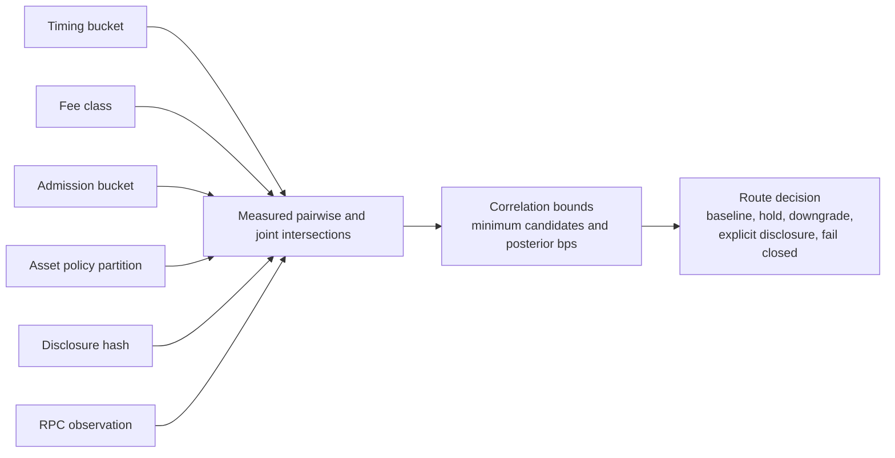

# Privacy Correlation Bounds

The deanonymization-bound packet sets posterior floors. The correlation-bound
packet adds the missing adversarial condition: metadata channels are not
treated as independent. Baseline privacy requires measured pairwise
intersections, measured full joint metadata tuples, temporal-link cohorts,
cross-window cohorts, RPC cohorts, and disclosure-reuse cohorts.

This is controlled-testnet evidence only. It does not mutate registry state and
does not transfer authority.

## Model

The model uses integer basis points and observed partitions:

```text
posterior_bps = ceil(10000 / observed_candidate_count)
```

The packet does not multiply independent probabilities. A wallet or observer
must measure the actual number of candidates that remain after metadata
channels are combined.

Required channels:

| Channel |
| --- |
| `timing` |
| `fee_class` |
| `admission_bucket` |
| `asset_policy_partition` |
| `disclosure_hash` |
| `rpc_observation` |



## Bounds

| Bound | v1 value |
| --- | ---: |
| Minimum pairwise intersection | 16 candidates |
| Minimum full joint metadata tuple | 16 candidates |
| Minimum temporal-link cohort | 16 candidates |
| Minimum cross-window cohort | 16 candidates |
| Minimum RPC cohort | 16 candidates |
| Minimum repeated-disclosure cohort | 16 candidates |
| Maximum pairwise posterior | 625 bps |
| Maximum joint posterior | 625 bps |
| Maximum temporal posterior | 625 bps |
| Maximum cross-window posterior | 625 bps |
| Maximum RPC posterior | 625 bps |
| Observation freshness | 3,600 seconds |

## Routes

| Condition | Route |
| --- | --- |
| All observed correlation bounds pass | `baseline-private` |
| Full joint metadata tuple shortfall | `downgrade-privacy-claim` |
| Pairwise metadata shortfall | `downgrade-privacy-claim` |
| Temporal link shortfall | `hold-for-batching` |
| Cross-window link shortfall | `hold-for-batching` |
| Direct RPC observer | `hold-for-private-relay` |
| RPC cohort shortfall | `downgrade-privacy-claim` |
| Repeated disclosure shortfall | `explicit-disclosure-required` |
| Declared off-chain side information | `downgrade-privacy-claim` |
| Compromised wallet infrastructure | `fail-closed` |
| Missing correlation channel | `hold` |
| Stale observation | `hold` |
| Ungoverned correlation policy | `fail-closed` |

## Fixture Coverage

The valid fixture covers a baseline-private correlated observation. Negative
fixtures verify root mismatch, statement-hash mismatch, joint tuple shortfall,
pairwise shortfall, temporal-link shortfall, cross-window shortfall, direct RPC
observation, RPC cohort shortfall, repeated-disclosure shortfall, declared
off-chain side information, compromised wallet infrastructure, missing channel,
stale observation, and ungoverned policy.

## Verification

```bash
scripts/privacy-correlation-bound-verify --fixtures
scripts/privacy-correlation-bound-verify --write-report
scripts/privacy-correlation-bound-verify --verify-report
```

The canonical valid fixture is:

```text
docs/governance/agent/fixtures/privacy_correlation_bound/valid_correlation_bound.json
```

Current roots:

| Root | Value |
| --- | --- |
| Valid packet hash | `58d785fff5b99a2eee69afc64b2f8b521c97391bbbba816efb0d7dd2ba51a5d9792b0a5718848b0eb721fbbde206e47c` |
| Statement hash | `5332e6946d782a796e1b8ed451bc2605abaad1cd48f21bb8103589f15250a9165e211189e00ca376f4f335300b99cf11` |
| Correlation root hash | `7f43b236c713dfbdda050e8348b1b284bed82264c54389a2c6fc8066531ecc81eb61f54365a88eddc35d0c2a3ce9bea3` |

## Status

The next implementation step is to feed these routes into wallet delay,
batching, private-relay selection, and disclosure policy.
