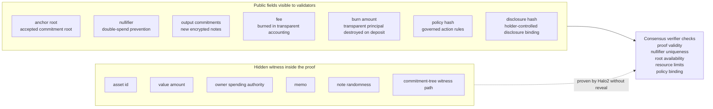
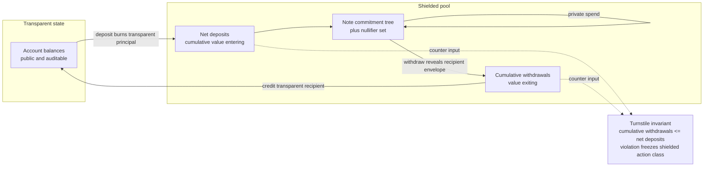

# Deposit, Spend, Withdraw

PostFiat's current shielded flow has three production-shaped operations:

1. transparent-to-Orchard deposit;
2. Orchard private spend;
3. Orchard-to-transparent withdraw.

## Shielded Action Structure

A shielded action exposes enough data for consensus verification while keeping
the spent note, owner, amount, asset details, and memo inside the proof.

## Turnstile Accounting

The transparent and shielded states meet at a turnstile. Supply integrity is
checked with public counters in addition to proof verification.

## Deposit

A deposit envelope contains a signed transparent funding transfer to the
protocol burn sink and an Orchard/Halo2 output action. The Orchard action binds
the funding transfer id, amount, fee, policy id, and disclosure hash into the
authorization domain.

Accepted apply:

- verifies funding signature and sequence;
- burns transparent principal plus deposit resource fee;
- mints the Orchard note;
- updates pool roots and public counters;
- leaves the recipient note scan-spendable.

## Spend

`orchard-spend-create` builds a real Orchard spend from one decrypted note. It
can send full value minus fee or send an amount plus default change.

Accepted apply:

- verifies the Orchard proof;
- persists the nullifier;
- appends output commitments;
- burns the signed fee;
- rejects duplicate nullifiers.

## Withdraw

`orchard-withdraw-create` builds a one-note withdraw action bound to a
transparent recipient envelope.

Accepted apply:

- verifies the external binding;
- nullifies the spent note;
- burns the signed fee;
- credits the transparent recipient in the same committed block.

## Evidence

- `reports/testnet-orchard-wallet-finality-smoke/privacy-direct-deposit-20260515T132406Z/testnet-orchard-wallet-finality-smoke.json`
- `reports/testnet-orchard-peer-certified-smoke/peer-direct-deposit-20260515T134027Z/testnet-orchard-peer-certified-smoke.json`
- `reports/testnet-live-orchard-direct-deposit/current-write-gates-20260517T153630Z-orchard-direct-deposit/testnet-live-orchard-direct-deposit.json`
