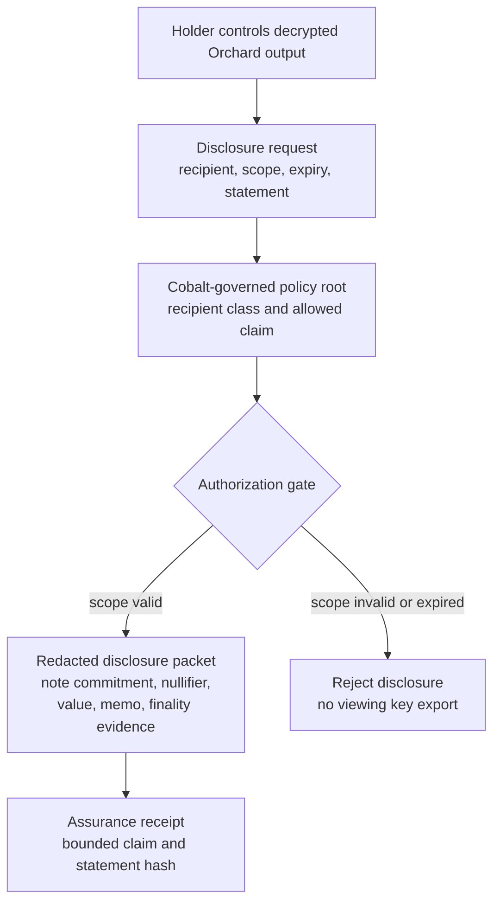

# Selective Disclosure

PostFiat includes a local selective-disclosure path for Orchard outputs.

## Packet

`orchard-disclose` writes a redacted `postfiat-orchard-disclosure-packet-v1`
for a decrypted Orchard output.

The packet includes:

- chain id;
- genesis hash;
- protocol version;
- note commitment;
- nullifier;
- value;
- memo;
- retained-root metadata;
- auditor instructions;
- ordered-batch finality evidence when available.

The packet omits secret spending and viewing material.

## Governed Disclosure Flow

## Assurance Receipts

Selective disclosure proves facts to a chosen party. Assurance receipts add a
policy layer around that disclosure: the packet binds a shielded subject to a
Cobalt-governed policy root, list-provider root, scoped recipient class, expiry,
and statement hash.

The important boundary is negative. An assurance receipt is not a full viewing
key, not future-history access, and not a full-wallet audit grant. It is a
bounded receipt for one action, note, transaction, or time window.

Fixture and verifier:

- `docs/governance/agent/fixtures/privacy_assurance_receipt/valid_assurance_receipt.json`
- `scripts/privacy-assurance-receipt-verify --fixtures`

## Verification

`orchard-disclosure-verify` validates:

- schema and packet hash;
- chain/genesis context;
- archive commitment inclusion;
- block/finality fields when present;
- tamper rejection.

## Sources

- `crates/node/src/privacy.rs`
- `scripts/testnet-orchard-wallet-finality-smoke`
- `docs/status/privacy-production-burndown.md`
