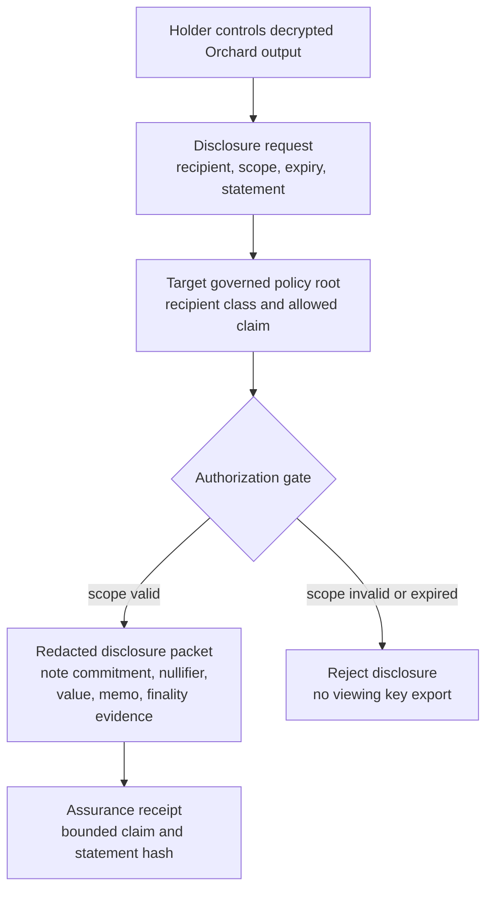

# Selective Disclosure

PostFiat includes a local selective-disclosure path for Orchard outputs.

## Packet

`orchard-disclose` writes a redacted `postfiat-orchard-disclosure-packet-v1`
for a decrypted Orchard output.

The packet includes:

- chain id;
- genesis hash;
- protocol version;
- note commitment;
- nullifier;
- value;
- memo;
- retained-root metadata;
- auditor instructions;
- ordered-batch finality evidence when available.

The packet omits secret spending and viewing material.

## Target governed disclosure flow

The local packet commands below are implemented. This diagram describes the
broader policy/assurance target; its archived fixtures do not establish a live
consumer for every gate. Current Cobalt authority covers validator trust, so
calling an arbitrary disclosure-policy root “Cobalt-governed” is not a supported
current-authority claim.

```mermaid
flowchart TD
  Holder[Holder controls decrypted Orchard output]
  Request[Disclosure request<br/>recipient, scope, expiry, statement]
  Policy[Target governed policy root<br/>recipient class and allowed claim]
  Authorize{Authorization gate}
  Packet[Redacted disclosure packet<br/>note commitment, nullifier,<br/>value, memo, finality evidence]
  Receipt[Assurance receipt<br/>bounded claim and statement hash]
  Reject[Reject disclosure<br/>no viewing key export]

  Holder --> Request --> Policy --> Authorize
  Authorize -->|scope valid| Packet --> Receipt
  Authorize -->|scope invalid or expired| Reject
```

## Assurance Receipts

Local disclosure verifies a bounded packet against available commitments and
finality evidence. The assurance-receipt design adds a policy layer binding a
shielded subject, policy root, list-provider root, recipient class, expiry and
statement hash. The fixture/verifier references below are historical; they do
not prove current live policy enforcement or Cobalt authority over this scope.

The important boundary is negative. An assurance receipt is not a full viewing
key, not future-history access, and not a full-wallet audit grant. It is a
bounded receipt for one action, note, transaction, or time window.

Fixture and verifier:

- `docs/governance/agent/fixtures/privacy_assurance_receipt/valid_assurance_receipt.json`
- `scripts/privacy-assurance-receipt-verify --fixtures` *(archived outside this repository; see `scripts/README.md`)*

## Verification

`orchard-disclosure-verify` validates:

- schema and packet hash;
- chain/genesis context;
- archive commitment inclusion;
- block/finality fields when present;
- tamper rejection.

## Sources

- `crates/node/src/privacy.rs`
- `scripts/testnet-orchard-wallet-finality-smoke` *(archived outside this repository; see `scripts/README.md`)*
- `docs/status/privacy-production-burndown.md`
