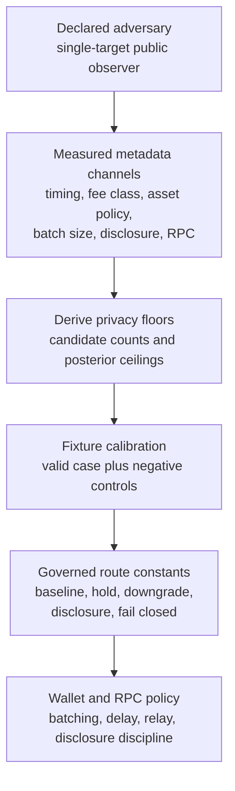

# Privacy Floor Calibration

The floor-calibration packet explains why the v1 privacy route constants have
their current values. It does not prove absolute anonymity. It calibrates a
bounded single-target deanonymization adversary and defines when PostFiat may
claim baseline privacy rather than downgrade, hold, require disclosure, or fail
closed.

This is controlled-testnet evidence only. It does not mutate registry state and
does not transfer authority.

## Adversary

The v1 adversary is a public observer attempting to identify one target action
after applying declared public and inferable metadata. The model gives no
credit for channel independence. Perfectly correlated channels collapse to the
measured joint candidate count.

## Calibration

The constants are derived mechanically:

| Constant | Derivation |
| --- | --- |
| Joint posterior ceiling | 625 bps = 6.25% |
| Minimum joint candidate count | `ceil(10000 / 625) = 16` |
| Single-channel posterior ceiling | 1,250 bps = 12.5% |
| Minimum batch size | `ceil(10000 / 1250) = 8` |
| Minimum timing-bucket cohort | 16 candidates |
| Minimum activity timing buckets | 8 buckets |
| Minimum activity window | `16 * 8 = 128` actions |
| Timing bucket width | 300 seconds |
| Activity window duration | `300 * 8 = 2,400` seconds |

Fee-class partitions require 32 candidates, giving a 2x margin over the joint
floor. Asset-policy and disclosure partitions require 16 candidates because
they are already hard privacy partitions; below 16, the route downgrades or
requires explicit disclosure.



## Routes

| Condition | Route |
| --- | --- |
| All derived floors pass | `baseline-private` |
| Joint candidate shortfall | `downgrade-privacy-claim` |
| Perfect correlation collapses joint `k` | `downgrade-privacy-claim` |
| Timing, activity, or batch shortfall | `hold-for-batching` |
| Thin asset-policy partition | `downgrade-privacy-claim` |
| Exchange-side batching observer | `downgrade-privacy-claim` |
| Direct RPC observer | `hold-for-private-relay` |
| Declared side information | `downgrade-privacy-claim` |
| Ungoverned calibration policy | `fail-closed` |

## Fixture Coverage

The valid fixture proves the arithmetic for the route constants and a baseline
observation. Negative fixtures cover broken derivations, correlated-channel
collapse, direct RPC observation, missing cases, root mismatch, statement-hash
mismatch, and verifier-claim removal.

## Verification

```bash
scripts/privacy-floor-calibration-verify --fixtures
scripts/privacy-floor-calibration-verify --write-report
scripts/privacy-floor-calibration-verify --verify-report
```

The canonical valid fixture is:

```text
docs/governance/agent/fixtures/privacy_floor_calibration/valid_floor_calibration.json
```

Current roots:

| Root | Value |
| --- | --- |
| Valid packet hash | `538f3be69052d461a3bdbcfd232fdb0508e0dc867ca519c660427d7e173618864640affa2da43dc660c116bfe7184031` |
| Statement hash | `e5471cb78414c28ac72c1905f809eb0de3a090e7a98a90cf998afebdb86c93d0220589143859b1385dbf265710a33808` |
| Calibration root hash | `d408a11538ab35570934763542f0f0fe40e3b24ba6c13d66e4c3d5d3061be99ced2abdb587370126a84c9e72ec6a1297` |

## Status

The next implementation step is to replace calibrated thresholds with measured
pool-flow distributions once public testnet telemetry exists.
