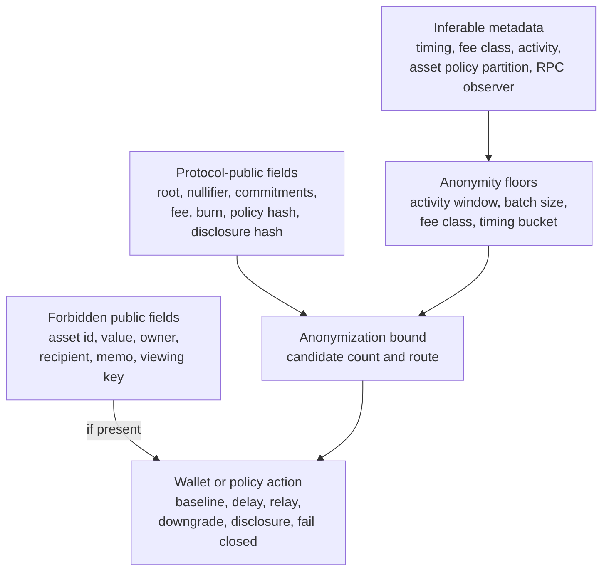

# Privacy Metadata And Anonymity Bounds

PostFiat privacy is a bounded settlement claim, not a claim of absolute
anonymity. The privacy metadata/anonymity-bound packet defines the public
fields, inferable metadata, wallet discipline, and minimum activity thresholds
required before a shielded flow can be called baseline-private.

The fixture is intentionally controlled-testnet only. It does not mutate live
registry state and it does not transfer authority.

## Public, Inferable, Required

| Class | Fields |
| --- | --- |
| Public by protocol | `root`, `nullifier`, `output_commitments`, `fee`, `burn`, `policy_hash`, `disclosure_hash` |
| Forbidden as public fields | `asset`, `asset_id`, `asset_type`, `value`, `owner`, `sender`, `recipient`, `memo`, `note_randomness`, `witness_path`, `full_viewing_key`, `ip_address`, `rpc_client_id` |
| Statistically inferable | `timing`, `fee_class`, `admission_bucket`, `disclosure_hash_uniqueness`, `asset_policy_partition`, `rpc_observer_metadata` |
| Wallet / infrastructure discipline | `batching`, `delay_window`, `relay_or_self_hosted_rpc`, `withdrawal_timing`, `disclosure_reuse_avoidance` |

## Thresholds

| Parameter | v1 floor |
| --- | ---: |
| Shielded actions in activity window | 128 |
| Same fee-class actions | 32 |
| Same asset / policy actions | 16 |
| Batch size | 8 |
| Timing bucket | 300 seconds |
| Disclosure hash reuse count | greater than 1 |
| RPC submission mode | `self_hosted_rpc` or private relay |

Below these floors the chain should not describe the flow as
baseline-private. It either downgrades the privacy claim, holds for batching,
requires explicit disclosure treatment, or fails closed.



## Routes

| Condition | Route |
| --- | --- |
| All floors pass and no forbidden public field appears | `baseline-private` |
| Low activity window or singleton fee class | `downgrade-privacy-claim` |
| Thin asset / policy partition | `downgrade-privacy-claim` |
| Bursty timing or small batch | `hold-for-batching` |
| Unique disclosure hash | `explicit-disclosure-required` |
| Direct third-party RPC observer | `hold-for-private-relay` |
| Private or partitioning data in public fields | `fail-closed` |
| Ungoverned metadata policy | `fail-closed` |
| Incomplete threat model or wallet discipline | `hold` |

## Fixture Coverage

The packet includes one passing baseline fixture and ten route fixtures:

| Case | Expected route |
| --- | --- |
| `case-01-baseline-private` | `baseline-private` |
| `case-02-low-volume-downgrade` | `downgrade-privacy-claim` |
| `case-03-bursty-timing-hold-for-batching` | `hold-for-batching` |
| `case-04-thin-asset-policy-downgrade` | `downgrade-privacy-claim` |
| `case-05-unique-disclosure-explicit` | `explicit-disclosure-required` |
| `case-06-third-party-rpc-hold-for-relay` | `hold-for-private-relay` |
| `case-07-private-field-public-fail-closed` | `fail-closed` |
| `case-08-ungoverned-policy-fail-closed` | `fail-closed` |
| `case-09-missing-threat-model-hold` | `hold` |
| `case-10-fee-class-singleton-downgrade` | `downgrade-privacy-claim` |

Negative controls reject route downgrades that are mislabeled as
baseline-private, root mismatches, statement-hash mismatches, private fields in
the public surface, and ungoverned metadata policy.

## Verification

```bash
scripts/privacy-metadata-anonymity-bound-verify --fixtures
scripts/privacy-metadata-anonymity-bound-verify --write-report
scripts/privacy-metadata-anonymity-bound-verify --verify-report
```

The canonical valid fixture is:

```text
docs/governance/agent/fixtures/privacy_metadata_anonymity_bound/valid_metadata_bound.json
```

Current roots:

| Root | Value |
| --- | --- |
| Valid packet hash | `c71a811cb9ee1eb010164f548a24f10c390110e205759f0bfced024c03fcf9c13481043de2a7bb09f3c7eae6d86b609b` |
| Statement hash | `42d924d4c704e86c528ce42a5820ecd2d89ee63583ee9ccc60fd20bea0bb8ce99e1e568e8d3c2293cb4cea04c2ab66b4` |
| Metadata root hash | `7af983eec4861bd846e58929a028a00cae8c5c3b2dc3ba119fb5d084234cc7b8c488f20c96fbbca115d341685ab0b081` |

## Status

This is an evidence packet for claim discipline. The next implementation step is
to feed the routes into wallet batching, relay/self-hosting policy, and
shielded-asset policy gates.
