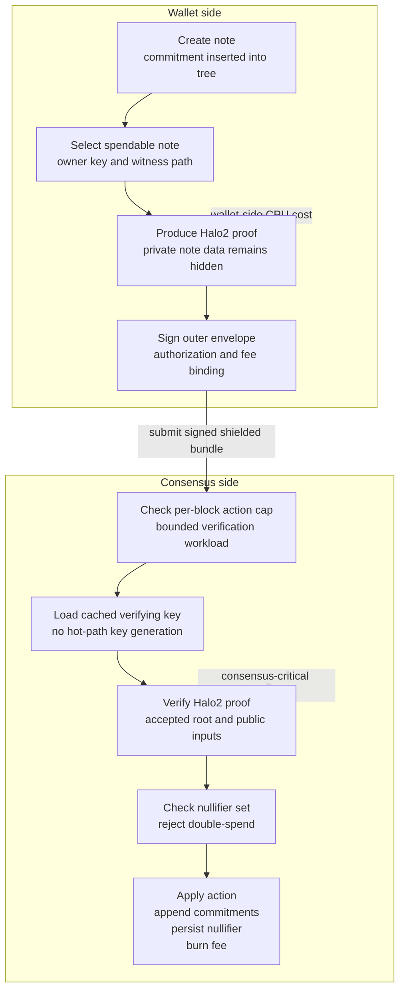
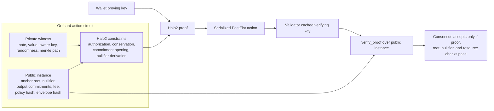

# Orchard/Halo2

The production privacy path uses Orchard/Halo2 verification through
`crates/privacy_orchard`.

## Adapter Role

The adapter owns the PostFiat serialized action shape, reconstructs upstream
Orchard bundles, verifies real Halo2 proofs and signatures, and binds
authorization to:

- chain id;
- genesis hash;
- protocol version;
- pool id;
- fee;
- optional external envelope hash.

## Proof Lifecycle

## Halo2 Circuit And Verification Flow

## Verification Budget

The verifier path is the consensus-critical part. Proving is wallet-side work;
validators cache the Orchard action verifying key and verify bounded action
bundles against the active resource policy.

Current local budget packet:

- report: `reports/orchard-verification-budget-v1-report.json`;
- checker: `verify_serialized_orchard_action`;
- proof system: `postfiat.privacy.orchard-halo2.v2`;
- circuit: `orchard.action.v2`;
- setup posture: Halo2 profile with no per-circuit trusted setup;
- measured action: two-action Orchard output proof;
- proof size: 7,264 bytes;
- wallet-side build/prove: 28.2 seconds on the local AMD EPYC host;
- cached verification: 80 ms median over three runs;
- verifying key build: 11.3 seconds, cacheable outside the hot block path.

The May 2026 local budget packet is retained as historical evidence for the
pre-upgrade v1 profile. Current builds accept the v2 identifiers above, backed
by `orchard >= 0.14.0` and `halo2_gadgets >= 0.5.0`.

## What The Node Persists

When a verified Orchard action is applied, the node persists:

- nullifiers;
- output commitments;
- encrypted outputs;
- accepted anchors;
- retained roots;
- public pool counters.

## Evidence

- `scripts/testnet-orchard-wallet-finality-smoke`
- `scripts/testnet-orchard-peer-certified-smoke`
- `scripts/testnet-live-orchard-full-flow-smoke`
- `reports/testnet-live-orchard-full-flow/live-orchard-full-flow-20260515T183724Z/testnet-live-orchard-full-flow.json`
- `reports/orchard-verification-budget-v1-report.json`
