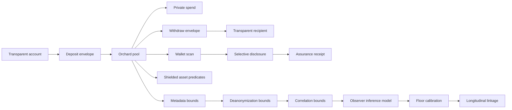

# Privacy Overview

PostFiat privacy is built around an Orchard/Halo2 shielded path using the
upstream Rust/Zcash Orchard and Halo2 implementations. PostFiat implements the
chain adapter and application circuits; it does not implement a new Halo2 proof
system. The exact dependency and narrow local compatibility patch are described
in [Halo2 Dependency And Local Patch Boundary](../security/halo2-dependency.md).

The goal is confidential settlement for workflows where transparent ledgers leak
too much: balances, counterparties, timing, execution intent, treasury movement,
and position changes.

## What Exists

- Orchard/Halo2 adapter using the upstream Rust/Zcash Orchard stack.
- Direct transparent-to-Orchard deposit envelopes.
- One-note Orchard spend construction.
- One-note Orchard withdraw construction.
- Nullifier persistence and duplicate-spend rejection.
- Retained roots and scan material for local wallet spending.
- `orchard-scan`, `orchard-disclose`, and `orchard-disclosure-verify`.
- Privacy assurance receipt fixture and verifier for scoped institutional
  disclosure without full viewing-key access.
- Shielded asset predicate registry fixture for transparent supply, private
  flow, and closed owner-scoped asset predicates.
- Privacy metadata/anonymity-bound fixture for low-volume, bursty, thin-asset,
  unique-disclosure, direct-RPC, and forbidden-public-field routes.
- Privacy deanonymization-bound fixture that converts metadata floor counts
  into integer basis-point posterior bounds and joint-candidate routes.
- Privacy correlation-bound fixture that requires observed joint partitions,
  pairwise intersections, temporal-link cohorts, and RPC cohorts.
- Privacy observer-inference fixture that derives candidate count `k` by
  intersecting timing, fee, RPC, disclosure, asset/policy, and off-chain
  side-information partitions.
- Privacy floor-calibration fixture that derives the v1 `k >= 16`, 625 bps,
  five-minute bucket, 128-action window, and batch-size floors from a bounded
  deanonymization adversary.
- Privacy longitudinal-linkage fixture that routes repeated observations,
  multi-target search, repeated disclosure, recurring timing, direct RPC reuse,
  exchange-side batching, and thin asset-policy reuse.
- Public Orchard pool telemetry through `orchard_pool_report`.
- Bounded RPC batch creation for Orchard actions and direct deposits.
- Malformed proof, rate-limit, child-isolation, and concurrency-limit evidence.
- Live five-validator deposit, spend, withdraw, outage, restart, snapshot, soak,
  and audit-packet evidence.

## System Diagram

## Main Sources

- `crates/privacy/src/lib.rs`
- `crates/privacy_orchard/src/lib.rs`
- `crates/privacy_orchard/src/types.rs`
- `crates/privacy_orchard/src/verify.rs`
- `crates/node/src/privacy.rs`
- `docs/status/privacy-production-burndown.md`
- [Assurance Receipts](assurance-receipts.md)
- [Shielded Asset Predicate Registry](shielded-asset-predicates.md)
- [Privacy Metadata And Anonymity Bounds](metadata-anonymity-bounds.md)
- [Privacy Deanonymization Bounds](deanonymization-bounds.md)
- [Privacy Correlation Bounds](correlation-bounds.md)
- [Privacy Observer Inference Model](observer-inference-model.md)
- [Privacy Floor Calibration](floor-calibration.md)
- [Privacy Longitudinal Linkage](longitudinal-linkage.md)
