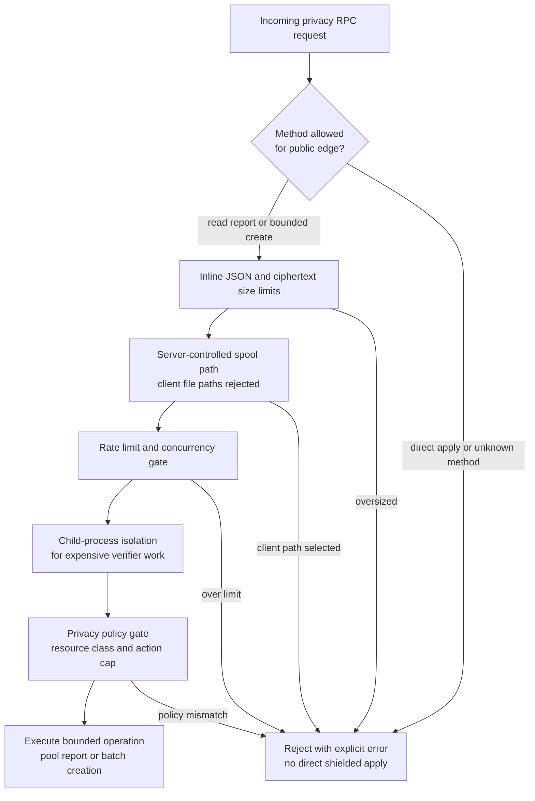

# Privacy RPC And Resource Policy

Remote privacy RPC is intentionally bounded. Proof verification is expensive
enough that public edge behavior must be explicit.

## Current RPC Posture

- Read-only pool report is available through `orchard_pool_report`.
- Remote Orchard batch creation is opt-in.
- Inline JSON is bounded.
- Server-controlled spool paths are used.
- Client-selected file paths are rejected.
- Direct shielded apply is rejected at the public edge.
- Concurrency and rate limits exist for remote verifier work.
- Child-process isolation exists for selected RPC operations.

## RPC Resource Gates

## Resource Evidence

- malformed proof load;
- oversized proof rejection;
- ciphertext size rejection;
- RPC rate limit;
- RPC concurrency limit;
- RPC child isolation;
- repeated live target-hardware malformed load.

Evidence anchors:

- `reports/testnet-orchard-rpc-concurrency-limit/orchard-rpc-concurrency-limit-v0-20260515T171128Z/testnet-orchard-rpc-concurrency-limit.json`
- `reports/testnet-orchard-rpc-child-isolation/orchard-rpc-child-isolation-v0-20260515T174034Z/testnet-orchard-rpc-child-isolation.json`
- `reports/testnet-live-orchard-malformed-edge-load-series/live-orchard-malformed-edge-load-series-20260515T170500Z/testnet-live-orchard-malformed-edge-load-series.json`
