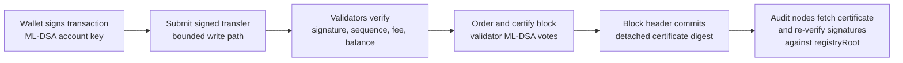
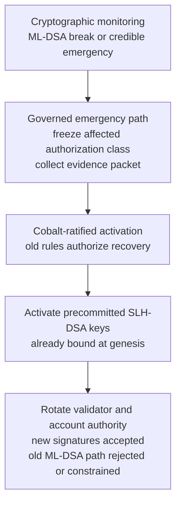

# Quantum Authorization

PostFiat starts the base transparent account and validator authorization paths
with ML-DSA-style signatures.

## Why

A new settlement chain does not need to begin with long-lived classical account
and validator keys and hope to migrate later. If quantum migration risk matters
on an institutional horizon, the chain should price larger signatures and
certificates from genesis.

## What Exists

- post-quantum account signing flows;
- wallet vectors;
- post-quantum validator transport envelopes;
- certificate handling for larger signature material;
- ML-DSA performance and size evidence;
- SDK wallet finality using signed transparent transfers.

## ML-DSA Certificate Structure

```mermaid
flowchart TD
  Header[Block header<br/>height, parent, state root,<br/>payload hash, certificate digest]
  Cert[Detached ML-DSA certificate<br/>registryRoot<br/>certificate domain<br/>validator signatures]
  Pair1[validatorID + ML-DSA signature]
  Pair2[validatorID + ML-DSA signature]
  PairN[validatorID + ML-DSA signature]
  Registry[Active registry root<br/>validator identities and public keys]
  Quorum[Quorum check<br/>q = floor(2n/3) + 1]

  Header --> Cert
  Cert --> Pair1
  Cert --> Pair2
  Cert --> PairN
  Cert --> Registry
  Pair1 --> Quorum
  Pair2 --> Quorum
  PairN --> Quorum
  Registry --> Quorum
```

## Post-Quantum Authorization Flow



## Recovery Path



## Sources

- `crates/crypto_provider/src/lib.rs`
- `crates/types/src/lib.rs`
- `crates/node/src/transport_cli.rs`
- `crates/rpc_sdk/src/lib.rs`
- `scripts/testnet-ml-dsa-performance-smoke`
- `scripts/testnet-wallet-test-vectors-smoke`
