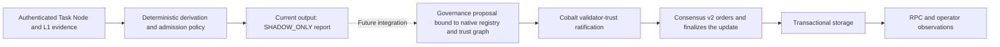

# Storage, Cobalt, and Task Node handoff review — 2026-09-06

Reviewed canonical `main` at `3d0e5c012950399cad0ab4af967cfc1291077e40`, the August 27–September 4 handoffs, storage deployment receipts, Cobalt campaign packets, and Task Node derivation code. Existing unrelated worktree changes were preserved. This is a review, not an implementation or deployment authorization. No services, wallets, or chain state were changed.

**P1 resolution update:** The RPC cache defect below was fixed and deployed to all six validators later on September 6. See the [repair handoff](../handoffs/2026-09-06___codex__rpc_status_cache_fix.md) and its deployment receipt. P2 findings remain open. The findings below preserve the original review evidence.

At review time, the storage rollout had succeeded, but its RPC integration still had a live correctness defect. Task Node remains an offline reference implementation with reproducible real-data holds and two additional evidence-binding defects. Cobalt should retain its existing bounded validator-trust ratification role while these issues are resolved; this review supplies no reason to replace Consensus v2 block finality.

1. **P1 — Transactional commits do not reliably invalidate RPC status.**

   `crates/node/src/rpc_cli.rs:2147` builds the health stamp from mempool, chain-tip, node-state, and governance JSON files. It does not observe the transactional database or generation pointer. At line 2099, the cache refreshes its check timestamp and returns the old report whenever those file metadata values match. The nominal cache age therefore bounds metadata checks, not report age. A transactional commit can leave a report stale indefinitely.

   Live read-only reproduction at **2026-09-06 19:38 UTC**: ports 28650–28655 returned status heights **989, 990, 991, 980, 981, 988**, respectively. Every endpoint simultaneously served block **992**, with identical hash `066ae1e8ebc99d53b41b15bcb45ba33f623e0de807c19547d01a95fe15429f693ee211d2de8e275e287877da7dac111d` and state root `beb33019f81dd0be0b529debcd75fc14efc66b4e96bf0222521fd964cdf9b0af52cfbe16d75c9a6c027d044b6f52a8e8`. RPCs reported build revision `707e006f`; the cache code is unchanged between that revision and reviewed main. This demonstrates misleading status, not a conflicting block-992 history.

   The deployment gate already noted stale status across cutover, but its restart workaround does not solve subsequent transactional commits. The existing cache regression test at `crates/node/src/main_parts/tests/rpc_serve_request_tests.rs:895` changes the legacy mempool file, so it misses this case. Make expiration force a real report refresh or bind cache invalidation to authoritative transactional generation/tip changes. Test an externally committed block with legacy JSON unchanged and verify status without restarting RPC.

2. **P2 — Missing wallet mappings can turn a correlated Task Node candidate into an independent admission.**

   `python/postfiat_rpc/tasknode_unl_policy.py:1410` considers independence evidence complete whenever binding replay and global edge extraction pass. It never requires the funding graph's wallet mapping for the candidate to exist and equal the wallet in the verified binding/digest. `tasknode_unl_edges.py:1122` and its majority-inflow counterpart silently skip funding relations involving unmapped wallets.

   Reproduced from the committed passing fixture: add a PFT transfer from the mapped wallet of active `validator-03` to the signed wallet of candidate `validator-22` (`account-pass`). With the complete mapping the runner returns **reject**, `rho_score=1`, `rho_above_cap`. Remove only `account-pass` from `funding_transfers.wallet_accounts`, leaving the transfer, bindings, signatures, and digest untouched: it returns **admit**, `rho_score=0`, `all_gates_passed`, and selects `validator-22`. Replacing that map entry with an unrelated wallet also passes the original fixture.

   Require complete, consistent wallet/account coverage for the candidate and relevant active validators before assigning independence. Missing or conflicting identity joins must hold. Add a regression that preserves the known funding transfer while removing or substituting its identity mapping. Current impact is incorrect shadow output; the runner exposes no live submission authority.

3. **P2 — Candidate key identity is not joined to the verified binding key.**

   `tasknode_unl_policy.py:445` checks the supplied `public_key_hash` only for hex syntax; line 889 copies it into the admission packet. Binding replay selects a signed binding by validator ID, without checking that this candidate key hash identifies the key authenticated by that binding. Replacing the passing fixture's candidate key hash with `ab` repeated 32 times preserves **admit** and `all_gates_passed` while changing the key identity in the output packet.

   Validate the candidate's registry key against authenticated binding evidence. If the binding key and native consensus key occupy different key domains, require an explicit authenticated relationship between them rather than assuming the validator-ID string proves it. A key-substitution fixture should hold or reject. This is another shadow-report defect, not evidence of a live Cobalt signature bypass.

4. **P2 — The advertised consolidated Cobalt verification command fails on current main.**

   Running `python3 benchmarks/cobalt-adversarial-verification/packet/verify_packet.py` fails with `adversarial packet semantic verifier is missing, failed, or inconsistent`. The false checks are specifically `publication_documents_bound` and `publication_complete`. `python/postfiat_rpc/cobalt.py:946` hashes publication paths in the current checkout against the August campaign's pins. README, STATUS, `docs/status/chain-state-current.md`, and `mkdocs.yml` have changed; the results document and completed milestone still match.

   The independent E5 verifier passes. This failure does not establish that the cryptographic campaign failed; it establishes that its historical publication receipt cannot survive routine repository maintenance. Preserve the publication's exact bytes or bind verification to its immutable source revision. Keep current-document freshness as a separate check. The focused Python suite constructs synthetic campaign packets, which is why its passing result does not catch this broken shipped packet.

5. **P2 — The storage handoff describes a different concurrency mechanism from the one deployed.**

   `docs/plans/active/devnet-storage-single-writer-deployment-plan.md:32` says concurrent cross-process readers coexist with a writer and line 46 says RPC queries never take the write lock. Actual `crates/storage/src/transactional/generation.rs:110` and `transactional.rs:2665` use operation-scoped shared writable handles for ordinary NodeStore calls. A weak registry releases the database only when the last in-process caller drops its handle; a sibling process retries acquisition. The source explicitly documents that a read-only open also conflicts with a writer.

   Correct the plan to describe exclusive cross-process access with operation-scoped leases. Do not implement persistent readers based on the current prose: that would recreate the failed canary's lock contention. Sustained overlapping operations and writer fairness remain a qualification question for a continuously busy public network; the controlled-devnet gate proves the topology and exercised rounds, not that broader workload.

The storage work addressed several distinct problems. Transactional redb commits and the ordered-history accumulator removed repeated full-prefix JSONL work from ordinary finality. Bounded certified-send tombstone indexing and batched pruning removed retained-payload scans and repeated fsync overhead. Registry continuation needed its own superseded-update replay repair. The first live storage canary then revealed transport/RPC process contention and rollback incompatibility; the replacement gate tested the actual two-service topology, signed-unit sandbox, both start orders, and old-binary plus data restoration. The deployment receipt records activation at 930 and successful continuation at 931. Subsequent checkpoint-export, RPC read-budget, and submit-idempotency fixes are separate changes, not consequences of choosing redb.

This is not a general disk-space cure. Finalized history is retained, and pruning is an explicit maintenance operation with archive/checkpoint prerequisites (`crates/storage/src/transactional.rs:1440`). This review measured the local development filesystem at **96% used, approximately 24 GiB available**; canonical `target/` alone occupied approximately **55 GiB**. Those are local build-host measurements, not validator-fleet capacity measurements. No data or build artifacts were deleted. The “canonical current state” page also retains superseded 924/undeployed/Z1-not-started tables beneath its 931 deployment notice; the active storage milestone's opening status still says no deployable candidate. Reconcile these references against receipts instead of treating every pending-decision row as current.

The intended authority flow is:

Task Node proposes evidence-derived content; Cobalt authenticates and ratifies validator-trust changes; Consensus v2 finalizes blocks. `crates/node/src/cobalt_handoff.rs:169` enforces the bounded scope and requires a protocol decision certificate for a Cobalt validator update. Other governance domains retain their existing authority path. Cobalt's campaign explicitly leaves an independent-operator proposal path as follow-on work: Foundation administration of all nodes is not operator decentralization.

There is a policy decision to reconcile before promotion. The September 3 AI direction proposes deterministic sub-scores and a model identity flag with a stricter entry profile. The September 4 Task Node implementation deliberately preserves Admission Policy V1: missing model output or classification other than `independent` holds admission (`tasknode_unl_policy.py:1022`). These are different admission policies. Also, a model flag that changes eligibility timing remains an input to admission, even when downstream checks are deterministic. Its semantics need an explicit policy version; calling it advisory does not remove that dependency.

The real-data Task Node replay is useful but narrow. It uses the fork's 20-entry baseline and a content hash as a shadow registry identifier, not the six-validator native L1 registry root. All three wallet coverage rows hold; none is an admitted validator. The runner reproduces the committed report byte for byte, SHA-256 `1998fafb9131331c66fb74446ac19b101440f925e8c56f72f3a636f05800767f`. Real signed bindings, publisher-attested work digests, exclusions, and remaining admission facts are still missing from that packet. The pre-39 churn guard and overlap illustrations do not substitute for native Cobalt linkedness verification. Incumbent-removal guards exist separately, while the combined derivation currently selects additions and passes empty identity-failure/removal arrays.

Recommended sequence: repair status freshness and the two identity joins; make the historical Cobalt packet independently reproducible; reconcile current handoff status and the versioned admission policy; then extend shadow replay with complete real evidence and native registry binding. Retain Cobalt's current scoped authority and Consensus v2 finality. A later independently operated proposal/ratification rehearsal should demonstrate the whole path before live Task Node-derived updates are enabled.

Validation performed: **207 focused Python tests passed, plus 34 subtests**; committed real-data replay was byte-identical; E5 packet verification passed; consolidated Cobalt packet verification failed for the publication hashes described above; targeted fixture mutations reproduced both identity-join findings; six live read-only RPC comparisons reproduced stale status. The Rust workspace suite, full archived replay, sustained-contention benchmark, and fleet disk inventory were not rerun. Historical storage test counts in receipts are historical evidence, not fresh test results from this review.
