# PostFiat Wallet first-time-user UX teardown

**Reviewed:** 2026-08-12

**Live wallet:** `https://5.223.45.94:5173/`

**Perspective:** A normal self-custody user who has never seen PostFiat, does not know its protocol vocabulary, and wants to understand and use their money.
**Method:** Walk every exposed pane of the live wallet using the funded account, capture the rendered state, and evaluate what the interface actually communicates. Navigation and recovery-state inspection only; no transaction was submitted during this review.

## Executive verdict

This is not presently a reasonable consumer wallet. It is an operator console, integration test harness, and protocol debugger wearing a wallet shell.

The most damaging defect is not cosmetic: the home screen labels **0.000102 PFT** as **“Total balance”** while the account also holds 73.497570 pfUSDC, 99 A666, 0.100495 of a legacy A666-like asset, and 45,501.363531 of another legacy asset. Those holdings are then rendered as anonymous hexadecimal IDs. A rational new user will conclude either that their funds were wiped or that they restored the wrong wallet. That is exactly the failure this interface produced.

Several primary navigation destinations are blank, broken, contradictory, or aimed at protocol operators. Deprecated Arbitrum instructions remain prominent. A GPU configuration error is exposed as the blocker for a fixed-amount “acceptance” loop. “Process,” “NAV Markets,” and “NavCoins” overlap without establishing a user mental model. Basic jobs—understand holdings, recover safely, send a named asset, swap with a quote, bridge in either direction, and review activity—are harder than inspecting validator height or a route adapter.

Calling a backend route “wired up” is not enough. A route is wallet-ready only when a person can discover it, understand what will happen, see the balances and quote involved, consent once, follow progress, recover from failure, and verify the result without knowing an asset ID, RPC endpoint, proof service, validator count, or transaction payload.

## What this funded wallet actually needs to communicate

| Holding visible on-chain | What the wallet currently calls it | What the user should see |
|---|---|---|
| 0.000102 PFT | PFT | PFT, clearly labeled as the network-fee balance—not the total portfolio |
| 73.497570 pfUSDC | `02c46a36...a7005d7b` / “other or legacy issued asset” | pfUSDC, its network, spendable balance, and an approximate US-dollar value |
| 0.100495 legacy asset | `300bf48a...e272a293` / “other or legacy issued asset” | Its verified symbol and issuer, visibly marked legacy if that classification is correct |
| 99 A666 | `521c6c63...cbee5e2c` / “other or legacy issued asset” | A666, verified NAV, current market price, discount/premium, and available actions |
| 45,501.363531 legacy asset | `de8d3d78...a6f966b6` / “other or legacy issued asset” | Its verified symbol and issuer, visibly marked legacy if that classification is correct |

An asset registry failure must not silently turn known assets into hashes. If metadata cannot be verified, the interface should say that clearly, retain any previously verified identity, and give the user a safe detail view. It must not make the portfolio look empty.

## Severity summary

### P0 — Fix before asking anyone to use the wallet

- “Total balance” excludes issued assets and makes a funded wallet appear empty.
- Known assets, including pfUSDC and A666, are shown as raw IDs.
- NAV Markets and Process are primary destinations that terminate in internal configuration errors.
- NavCoins shows zero rows even though the account holds issued assets, including A666.
- Recovery language does not clearly distinguish the master seed, local unlock passphrase, and encrypted backup.

### P1 — The main flows are not consumer-safe

- The Bridge page prominently teaches a retired Arbitrum route instead of deleting it from the product vocabulary.
- The A666 page is a fixed 10-USDC live acceptance test, not a buy, sell, mint, export, redeem, or round-trip transaction interface.
- The Send page exposes account-lane architecture, FastPay experiments, 96-character asset IDs, and trust limits before it provides a normal asset send flow.
- Private FX exposes a broken demo service and contradictory states in the main navigation.
- Protocol-wide status and prior operator runs are presented without distinguishing them from this wallet's own balances and activity.

### P2 — The navigation and language are structurally confused

- Nine equal-weight destinations force a new user to reverse-engineer the product architecture.
- Bridge, NAV Markets, A666 Loop, Process, Private FX, and NavCoins describe mechanisms rather than user goals.
- Validator count, block height, sequence, “Cobalt,” route adapters, proof GPUs, RPC endpoints, bytecode, and Tier-4 finality dominate ordinary wallet tasks.
- Quick Links duplicate the left navigation and increase choice without improving comprehension.

## Pane 1 — No-wallet onboarding

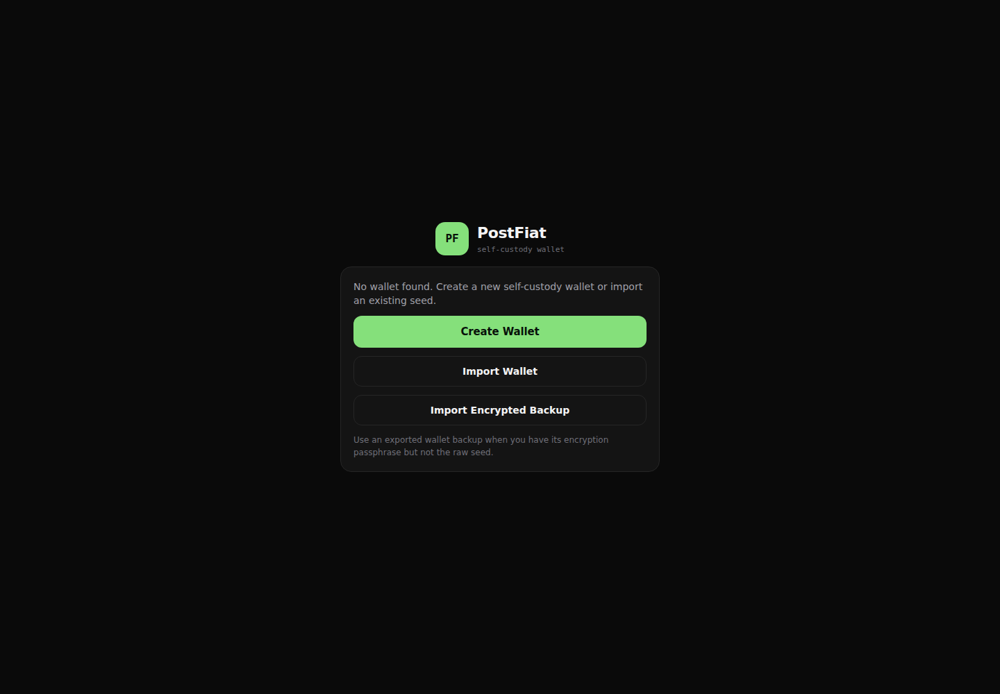

### What a new user understands

The app cannot find a wallet and offers three ways forward: create one, import one, or import an encrypted backup. The screen is visually clean, but the recovery model is unexplained.

### Explicit criticism

- **“Create Wallet” is the visually dominant action even for a returning user.** Someone who expects their existing wallet to be present can easily create a second empty wallet and believe the original was wiped.
- **“Import Wallet” and “Import Encrypted Backup” do not explain the difference.** One apparently expects a 64-character hexadecimal master seed; the other expects a file plus a passphrase. The user has to discover this by clicking around.
- **There is no recovery decision aid.** The screen should say: “Have a 64-character recovery seed?”, “Have a PostFiat encrypted backup file?”, or “Starting fresh?”
- **There is no local-storage explanation.** A self-custody user needs to know that this browser profile stores an encrypted local wallet and that clearing browser data or changing devices removes that local copy without deleting on-chain assets.
- **There is no warning that creating a wallet will not recover an existing address.** That omission is how users end up funding or inspecting the wrong account.
- **The product claims self-custody but does not establish a recovery contract.** Before any wallet action, the app should explain what must be backed up and what PostFiat cannot recover.

### Minimum acceptable behavior

Offer three plain-language paths—**Restore from recovery seed**, **Restore from encrypted backup**, and **Create a new wallet**—with a one-sentence explanation under each. If a local wallet was previously used in this browser but is missing, say so and explain likely causes without implying the on-chain wallet was erased.

## Pane 2 — Seed import

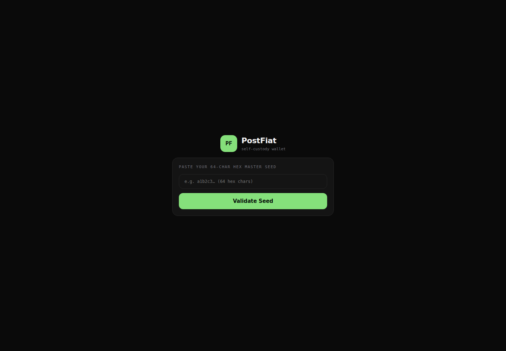

### What a new user understands

They are told to paste a “64-char hex master seed.” Unless they already know the implementation, they cannot tell whether their password, passphrase, backup text, private key, or seed phrase belongs here.

### Explicit criticism

- **This is developer-facing recovery UX.** Most self-custody products teach users to expect a mnemonic phrase, hardware wallet, QR code, or backup file—not an unexplained hexadecimal seed.
- **The screen caused the exact confusion it should prevent.** A local wallet passphrase and the master seed are different secrets, but the interface does not define either one.
- **There is no privacy warning.** A seed-entry screen must explicitly say never to share the seed, that PostFiat support will never ask for it, and that entry should happen only on the expected origin.
- **There is no Back or Cancel action in the form.** Recovery is high anxiety; trapping the user in a sparse form erodes confidence.
- **There is no show/hide control, paste confirmation, formatting help, or validation explanation.** The only action is “Validate Seed,” which sounds like the seed may be uploaded for checking.
- **There is no address preview before persistence.** After local validation, the app should show the derived public address and ask the user to confirm that it is the account they expect.
- **There is no explanation of what happens next.** The user does not know whether validation imports immediately, asks for a new local passphrase, or contacts a server.

### Minimum acceptable behavior

Use a guided restore flow: identify the recovery material, explain local-only handling, validate locally, preview the derived address, let the user verify it, then create a clearly named local unlock passphrase. Never let the unlock passphrase masquerade as the seed.

## Pane 3 — Wallet dashboard

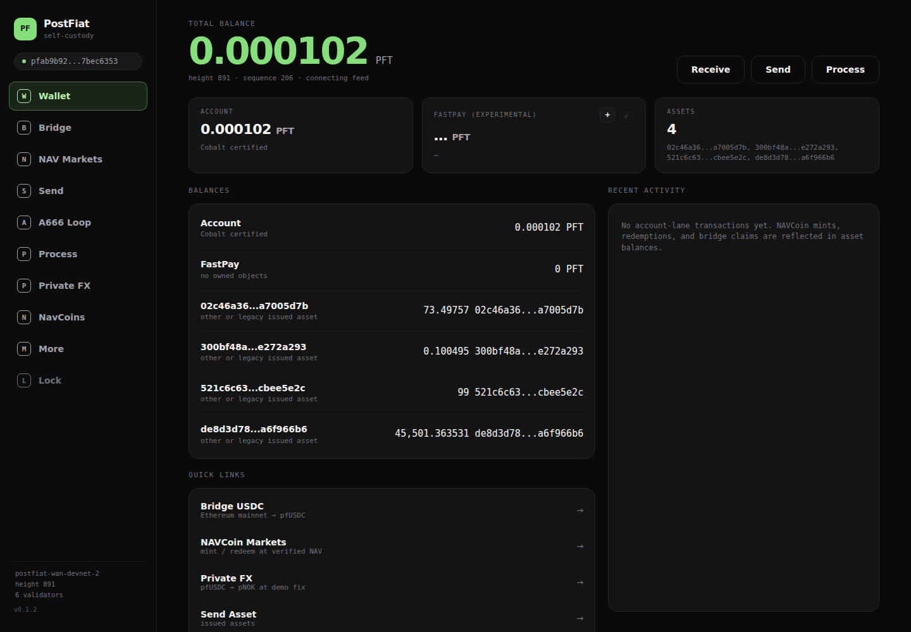

### What a new user understands

The wallet has a “Total balance” of 0.000102 PFT, no FastPay objects, four mysterious assets, and no recent transactions. The obvious interpretation is that the meaningful wallet balance is almost zero and the remaining rows are unknown junk.

### Explicit criticism

- **“Total balance: 0.000102 PFT” is materially misleading.** It is only the native PFT balance. Calling it total while excluding all issued assets is the interface's worst trust failure.
- **The four actual holdings are hidden behind truncated hashes.** A wallet that knows enough to route pfUSDC and A666 elsewhere in the product cannot call those same assets “other or legacy issued asset” here.
- **Amounts are followed by asset hashes instead of symbols.** `73.49757 02c46a36...` is not a balance a person can recognize, price, send, or verify.
- **The dashboard has no portfolio valuation.** Even if pricing is unavailable, stablecoins can be identified and NAV assets can show verified NAV with a timestamp. Unknown valuation should be explicit, not omitted behind a fake total.
- **“Cobalt certified,” “FastPay (experimental),” block height, sequence, validator count, and live-feed state outrank useful information.** These belong in network details or developer diagnostics.
- **“Recent activity: No account-lane transactions yet” is technically narrow and experientially false.** NAVCoin mints, redemptions, and bridge claims changed the wallet. A user does not care which protocol lane recorded them; they expect one chronological activity history.
- **The four raw IDs repeated in the Assets summary add noise without identity.** Truncation makes them impossible to compare reliably, while full IDs would be unusable. The answer is metadata, not a different truncation length.
- **Quick Links duplicate the sidebar.** The page offers two competing menus while neither prioritizes the basic next actions for each held asset.
- **There is no chain boundary.** PFTL holdings and the connected Ethereum wallet are part of the promised flow, but the dashboard provides no consolidated view or clear separation.
- **There is no state distinction.** Spendable, reserved, pending, legacy, protected, and externally held balances need explicit labels.

### Minimum acceptable behavior

The home screen should lead with **Portfolio**, list recognizable assets with symbols and values, label 0.000102 PFT as the **network-fee balance**, show the connected Ethereum account separately, and provide per-asset actions. Activity must unify sends, bridge actions, NAV issuance/redemption, swaps, and failures.

## Pane 4 — Bridge

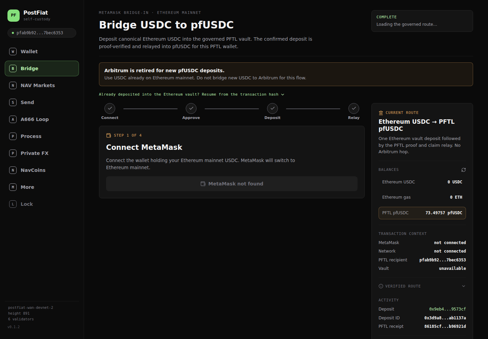

### What a new user understands

The user is warned about Arbitrum, told to use Ethereum mainnet, sees that MetaMask is missing, sees zero USDC, and is simultaneously shown vault status, route hashes, a recipient address, and prior activity. It is unclear whether the bridge is available, configured, complete, or broken.

### Explicit criticism

- **Delete the Arbitrum paragraph.** “Arbitrum is retired” teaches a deprecated route to users who may never have heard of it. If Ethereum mainnet is the supported source, the interface should simply say **Deposit USDC from Ethereum**.
- **The page talks about the old route more prominently than the current task.** Deprecation history belongs in migration notes, not the live transaction surface.
- **“MetaMask not found” is a dead end.** There is no strong Connect Wallet action, supported-wallet explanation, WalletConnect option, installation path, or way to understand which Ethereum address will be used.
- **A displayed balance of 0 USDC is ambiguous and alarming.** It may mean no provider is connected rather than a zero balance. Never render unavailable data as zero.
- **“COMPLETE” and “Loading governed route…” appear together.** Those states contradict each other and make the status indicator meaningless.
- **The route/vault panel is operator telemetry.** Vault addresses, route IDs, asset IDs, and raw hashes should be available under transaction details, not compete with the amount and expected result.
- **The stepper lacks the information needed for consent.** Connect, Approve, Deposit, and Relay do not show network fees, bridge fee, expected pfUSDC, estimated duration, confirmation requirements, or what happens if relay stalls.
- **The page appears deposit-only even though the product promises a round trip back to Ethereum USDC.** Deposit and Withdraw should be clear peer actions, not separated into an opaque acceptance flow.
- **Prior activity is not scoped clearly.** A hash on a transaction screen must say whether it belongs to this user, this browser session, or global route operations.

### Minimum acceptable behavior

Provide **Deposit** and **Withdraw** tabs, a connected Ethereum address, source/destination balances, amount, fee, expected received amount, estimated time, and a human-readable progress tracker. Hide route internals under Advanced details. Remove every Arbitrum reference from the normal flow.

## Pane 5 — NAV Markets

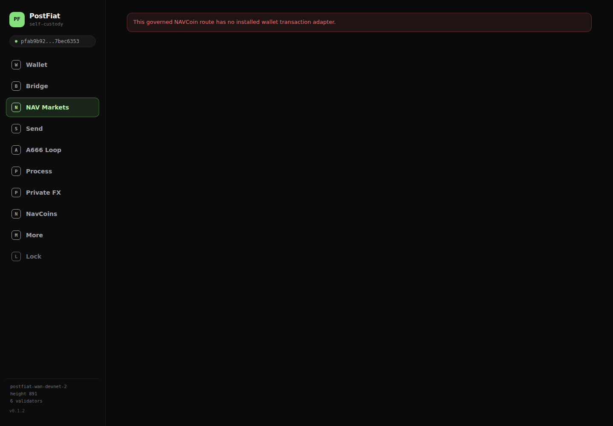

### What a new user understands

Nothing. The selected primary destination is almost entirely blank and says: “This governed NAVCoin route has no installed wallet transaction adapter.”

### Explicit criticism

- **This is a backend integration failure rendered directly to the customer.** “Governed route” and “transaction adapter” are implementation terms with no user action attached.
- **The error proves the feature is not wired into the wallet.** A route existing in protocol configuration is irrelevant if the wallet cannot construct and submit the user's transaction.
- **The blank page provides no asset list, holdings, NAV, market price, action, status, fallback, or support path.** It is a dead navigation item.
- **It contradicts the rest of the product.** The wallet holds A666, the A666 Loop claims verified-NAV issuance and redemption, and another NavCoins destination exists. The user cannot tell which surface is authoritative.
- **An unavailable market should not be promoted as a primary feature.** Either make it work end to end or remove it from navigation until it does.
- **There is no graceful degradation.** Even if trading is unavailable, the page could still show holdings, verified NAV, proof timestamp, market price, and “Transactions temporarily unavailable.”

### Minimum acceptable behavior

Merge holdings and market actions into one **Assets** experience. For A666, show verified NAV, proof freshness, market price, discount/premium, wallet balance, and plain actions such as Buy, Sell, Mint, Redeem, Deposit, and Withdraw—only when each action is actually executable.

## Pane 6 — Send

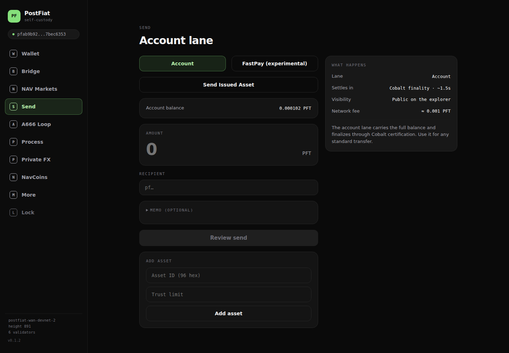

### What a new user understands

They are on an “Account lane,” can switch to an experimental FastPay lane, and may send PFT or open a separate issued-asset mode. They can also add an asset by pasting a 96-character ID and setting a trust limit. None of that matches the ordinary mental model of “choose an asset, choose a recipient, choose an amount, review, send.”

### Explicit criticism

- **The interface starts with protocol architecture instead of the user's job.** “Account lane” and “FastPay” should not be the first choice on a Send screen.
- **The asset should be the first selector.** PFT and issued assets are artificially split into different modes, making common tokens feel second-class or unsafe.
- **The balance is below the displayed approximate network fee.** The screen shows 0.000102 PFT and an estimated fee of about 0.001 PFT, yet does not lead with “You need more PFT to send.”
- **“Review send” is disabled without a complete, prominent explanation.** Disabled controls should say what input or balance is missing.
- **FastPay is labeled experimental but given equal navigation weight.** Experimental settlement belongs under an advanced option after a normal send path works.
- **“Cobalt finality ~1.5s” and “Public on explorer” are implementation/disclosure details, not the central send form.** They can appear in the review step.
- **The Add Asset section is hostile to normal users.** Requiring a 96-character asset ID and trust limit is an expert custody operation. Putting it on Send creates risk of trusting the wrong issuer or pasting the wrong identifier.
- **There is no address book, QR scanner, resolved-name preview, recent recipients, clear paste validation, Max button, or recipient warning.** These are standard safeguards, not polish.
- **There is no clear review of what the recipient receives.** Asset symbol, network, fee asset, final amount, memo visibility, and irreversibility must be shown before signing.

### Minimum acceptable behavior

Use one Send flow: asset selector with names and balances, recipient with validation/QR, amount with Max, fee and received amount, then a clear review. Put FastPay and manual asset trust configuration under Advanced or Developer settings.

## Pane 7 — A666 Loop

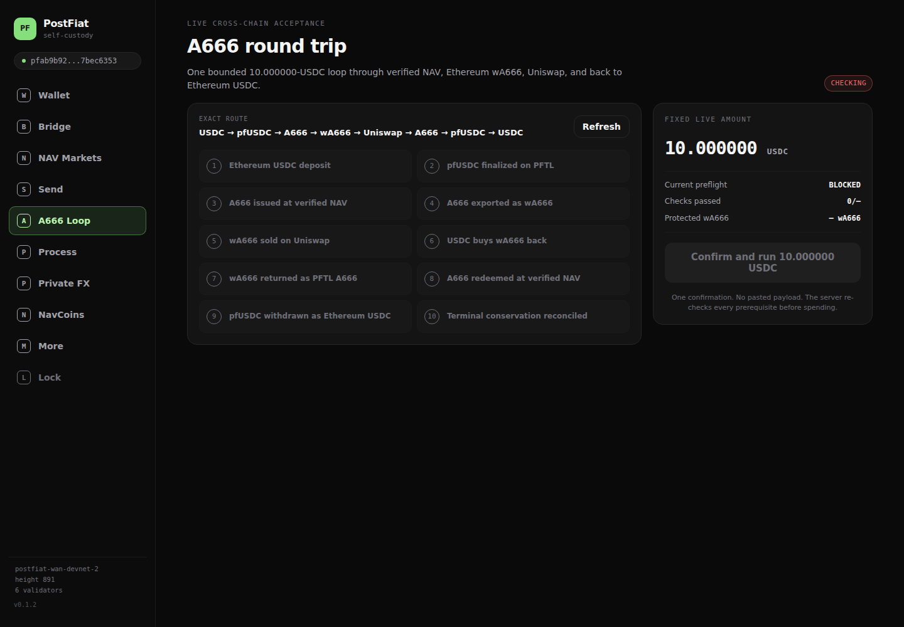

### What a new user understands

The wallet wants to run a fixed 10.000000-USDC “live cross-chain acceptance” test through ten protocol steps. The captured state is still checking. Once loaded, the same pane reports 22/23 checks, blocks execution because `proof_gpu` has no dedicated A666 proof GPU, calls 103 wA666 “protected,” and displays a previous global-looking run that returned 9.921265 USDC from 10 USDC.

### Explicit criticism

- **This is a production acceptance harness, not a wallet transaction screen.** “Acceptance,” “preflight,” “terminal conservation,” and a checklist of internal legs describe QA, not a user's financial intent.
- **The user cannot choose an amount.** A fixed 10-USDC loop is a test fixture. A wallet flow needs an amount, quote, and explicit outcome.
- **There is no useful quote before consent.** The prior run implies a cost of 0.078735 USDC, but the page does not turn that into expected output, percentage cost, price impact, gas estimate, minimum received, or slippage tolerance for the next run.
- **A server GPU is exposed as a spending blocker.** `proof_gpu: No dedicated A666 proof GPU is configured` is an operations alert. A user can neither understand nor fix it.
- **“Protected wA666: 103.000000” has unclear ownership and scope.** Is it this PFTL account, the connected Ethereum account, a reserve, or an operator safety floor? The word “protected” is not a custody model.
- **The ten-step route is not grouped by user-understandable custody transitions.** It should explain which wallet holds what after each cross-chain action, not merely announce internal completion.
- **The page mixes current-user action with previous system evidence.** “Last completed live run” could be this wallet, another wallet, or a global acceptance job. That ambiguity is unacceptable around real funds.
- **PASS and BLOCKED coexist without a clear object.** A previous run passed while current preflight is blocked, but the visual hierarchy makes the entire feature look both successful and unusable.
- **“One confirmation” is not enough information.** It is a convenience claim, not informed consent. The user must see allowances, maximum spend, route risk, expected return, and cancellation/failure behavior.
- **The route names do not match the actions the user originally wanted.** Buying wA666, moving it to PFTL A666, and redeeming at NAV should be exposed as understandable actions. A mandatory full loop is not a substitute.

### Minimum acceptable behavior

Remove this pane from the primary wallet navigation. Preserve it under **Diagnostics → Live acceptance tests** for operators. Build ordinary A666 actions around a quote: choose amount and direction, see Ethereum/PFTL balances, market price versus verified NAV, discount/premium, all fees and gas, minimum received, route stages, and wallet-specific activity. A one-click round trip can exist as an advanced strategy only after those primitives work.

## Pane 8 — Process

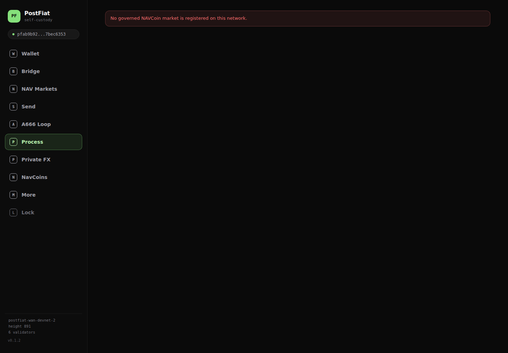

### What a new user understands

The word “Process” communicates no financial task. Clicking it produces a nearly blank page with “No governed NAVCoin market is registered on this network.”

### Explicit criticism

- **“Process” is not a meaningful navigation label.** It could mean transactions, jobs, proofs, business workflows, or nothing at all.
- **The pane is another raw configuration error.** Users do not register governed markets and cannot act on this message.
- **The error contradicts the A666 pane.** One screen says an exact governed A666 route passed; another says no governed NAVCoin market exists.
- **A blank broken page occupies prime navigation space.** That advertises incompleteness every time the user opens the wallet.
- **The missing concept is probably Activity, not Process.** Users need pending, completed, failed, and recoverable actions across every protocol lane.

### Minimum acceptable behavior

Replace Process with **Activity** and show wallet-scoped transactions across PFT transfers, issued assets, bridge operations, NAV mints/redemptions, Ethereum swaps, and proof/finality states. Internal orchestration status can expand from an individual activity row.

## Pane 9 — Private FX

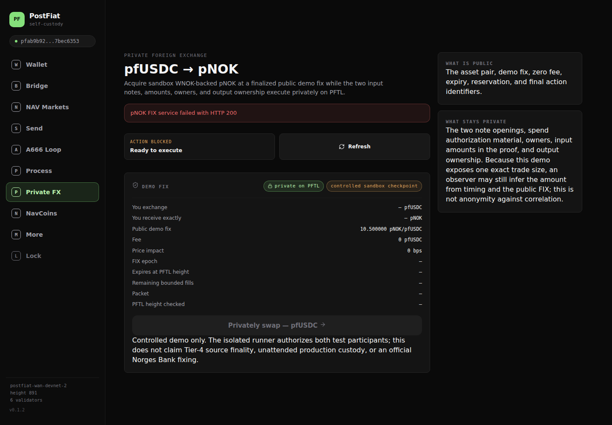

### What a new user understands

The wallet offers a private pfUSDC-to-pNOK exchange using a demo fix. The service “failed with HTTP 200,” the action is simultaneously “BLOCKED” and “Ready to execute,” quote fields are dashes, and the action button is disabled.

### Explicit criticism

- **“Failed with HTTP 200” is nonsensical user-facing output.** HTTP 200 means the request succeeded at the transport layer; if the payload is invalid, say the quote is unavailable and log the technical reason privately.
- **“ACTION BLOCKED” and “Ready to execute” directly contradict each other.** A transaction surface cannot disagree with itself about whether spending is possible.
- **The pane claims a 10.500000 demo fix, zero fee, and zero price impact while quote fields are unavailable.** That is not a trustworthy quote.
- **There is no usable amount input or output.** The disabled CTA ends with an arrow and no amount, so the user cannot even model the trade.
- **“Demo public fix,” “controlled sandbox checkpoint,” Tier-4 finality, and central-bank disclaimers reveal that this is an experiment.** Experiments should not sit beside Send and Wallet as ordinary production features.
- **The privacy promise is too complex and too prominent for an unavailable demo.** The pane says the swap is private while warning that public timing can reveal information. That needs a careful, transaction-specific disclosure—not marketing shorthand.
- **The page uses enormous space for mechanism and disclaimers while omitting the basic trade ticket.** Source balance, amount, rate timestamp, output, fees, expiry, and settlement time should come first.

### Minimum acceptable behavior

Move Private FX into **Labs** until it has a valid live quote and executable transaction. When enabled, use a conventional trade ticket with a precise privacy disclosure, quote expiry, source of rate, all fees, and a single coherent availability state.

## Pane 10 — NavCoins

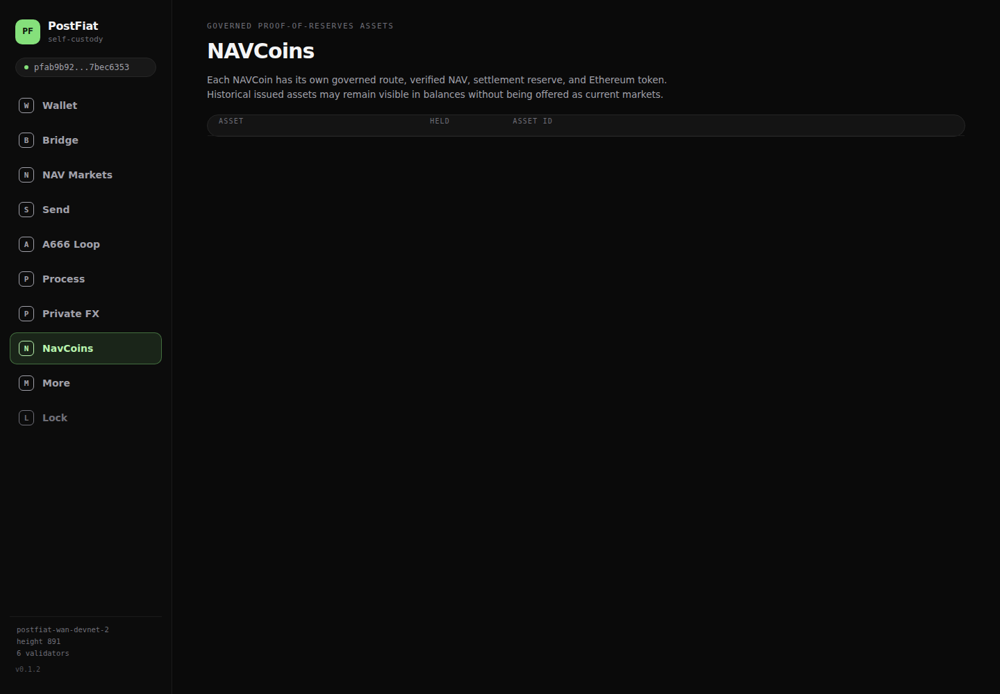

### What a new user understands

The table has headings but no rows. There is no loading indicator, empty-state explanation, error, retry action, or link to the A666 holding visible on the dashboard.

### Explicit criticism

- **This is observably false for the active account.** The wallet holds issued assets and 99 A666, yet the asset-management screen renders nothing.
- **A blank table is not an empty state.** The user cannot tell whether they own nothing, metadata failed, the network is wrong, or the page is still loading.
- **“Governed proof-of-reserves assets” is not a portfolio label.** It describes an implementation category and excludes assets the user still needs to understand.
- **NAV Markets and NavCoins are duplicate concepts with no explained distinction.** One is a broken route adapter; the other is an empty table. Neither helps the user act on A666.
- **The pane mentions historical assets but fails to display or classify them.** If legacy assets remain in the account, this is exactly where their status, issuer, and migration path should be explained.
- **There is no asset-detail route to inspect NAV, backing, proof freshness, supply, market liquidity, or available actions.** The absence of rows prevents the entire promised mental model.

### Minimum acceptable behavior

Eliminate this separate destination and use a single **Assets** screen. Every held asset must render even if a market is unavailable. Verified NAV assets should have a detail page containing identity, balance, issuer, backing, proof timestamp, NAV, market price, discount/premium, liquidity warning, and available actions.

## Pane 11 — More / settings

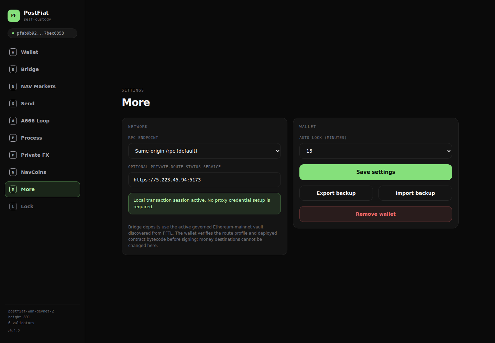

### What a new user understands

“More” contains RPC and route-service configuration, local-session status, wallet backup import/export, and wallet removal. Critical recovery operations and dangerous developer settings are mixed into one page.

### Explicit criticism

- **“More” is a junk-drawer label.** Security, recovery, network, developer configuration, and destructive wallet removal deserve separate hierarchy.
- **RPC and private-route service URLs should not be ordinary user fields.** A mistaken edit can disconnect the wallet, spoof data, or route requests somewhere unintended.
- **“Local transaction session active. No proxy credential setup required” is deployment/authentication language.** It does not reassure a user because it never defines the session, its scope, expiry, or security boundary.
- **Route profile and bytecode details are diagnostic output.** They should be hidden behind an Advanced section with a warning.
- **Backup controls do not explain the recovery artifact.** The user needs to know whether the encrypted backup contains the master seed, whether the current passphrase decrypts it, and how to test the backup safely.
- **There is no recovery-readiness status.** The wallet should say whether a backup has been downloaded and verified, without pretending that server-side recovery exists.
- **There is no change-passphrase workflow.** A local self-custody wallet needs a clear way to rotate its unlock passphrase without changing its address.
- **The destructive Remove Wallet action shares a page with routine settings.** It needs a clear explanation that removal deletes only the local encrypted copy, does not move or destroy on-chain assets, and requires the seed or backup to restore.
- **“Save settings” competes visually with security actions.** Network configuration should not be the primary call to action for most users.

### Minimum acceptable behavior

Split this into **Security & Recovery**, **Network**, **Advanced**, and **About**. Default users should see backup status, export encrypted backup, verify recovery, change passphrase, auto-lock, and remove local wallet. RPC and route endpoints belong behind an explicit developer-mode gate.

## Pane 12 — Locked wallet

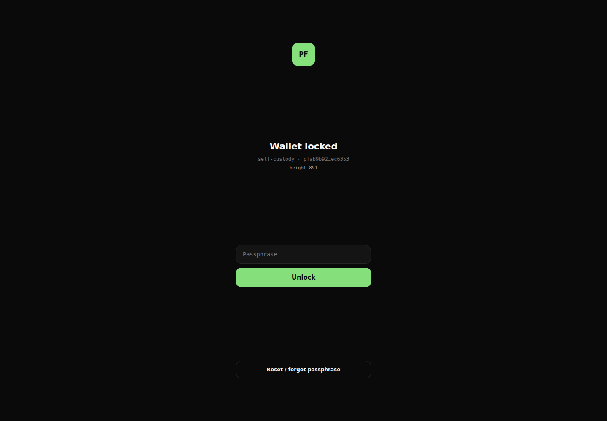

### What a new user understands

The wallet knows a truncated address and asks for a passphrase. A “Reset / forgot passphrase” option appears to promise that the passphrase might be reset.

### Explicit criticism

- **“Reset / forgot passphrase” is dangerously ambiguous.** In self-custody, a forgotten local passphrase generally cannot be reset without recovery material. The wording implies an account-style password reset that may not exist.
- **The consequence of reset is not stated before the user starts.** It must say that resetting removes the local encrypted wallet and that the recovery seed or encrypted backup is required to restore access.
- **The screen does not define the passphrase.** It should say this passphrase unlocks the encrypted wallet stored in this browser and is not the master seed.
- **There is no direct safe recovery path.** A user without the passphrase should be guided to Restore from recovery seed or Restore from encrypted backup, with exact requirements.
- **The address is truncated too aggressively for a recovery decision.** Let the user reveal/copy the full address so they can verify they are unlocking the expected wallet.
- **Network and storage context are weak.** The user should know which network and browser-local wallet they are about to unlock.
- **Block height and connectivity again receive attention that belongs to identity and recovery safety.**

### Minimum acceptable behavior

Say: **Unlock the wallet stored in this browser**. Define the passphrase, show/copy the full public address, and replace “Reset” with **Remove local wallet and restore**, followed by a plain warning that recovery material is mandatory and on-chain funds are unaffected.

## Cross-pane failures

### The wallet has no stable asset identity layer

The same protocol knows that A666 and pfUSDC exist when describing routes, but the dashboard cannot name the balances and NavCoins cannot list them. Asset identity must be resolved once from an authoritative registry and used consistently in portfolio, send, market, bridge, activity, and transaction review. If identity verification fails, every affected action should fail safely and visibly; the UI must not fall back to pretending the assets are anonymous legacy tokens.

### The wallet confuses system state with user state

Validator height, route readiness, prior live acceptance runs, protected reserve balances, vault status, proof GPU availability, and global activity appear beside personal holdings and actions without a clear boundary. Every status must answer: **whose state is this, which network is it on, when was it measured, and can this user act on it?**

### Navigation reflects the codebase, not the user's goals

The top-level destinations mirror subsystems. A comprehensible consumer structure would be:

1. **Home** — total portfolio, network-fee health, key actions, recent activity.
2. **Assets** — all PFTL and connected Ethereum holdings, identity, value, details.
3. **Trade** — buy/sell/swap with quotes, including A666 market price versus NAV.
4. **Bridge** — deposit/withdraw between Ethereum and PFTL.
5. **Send** — one consistent asset-send flow.
6. **Activity** — unified wallet-specific history and pending actions.
7. **Settings** — security and recovery first; network and developer controls hidden under Advanced.

FastPay experiments, the fixed A666 acceptance loop, Private FX demo, proof-GPU status, raw route configuration, and RPC editing should live under **Labs/Developer**, not primary navigation.

### Error handling exposes implementation rather than recovery

The live product says “no installed wallet transaction adapter,” “no governed NAVCoin market is registered,” “proof_gpu,” and “failed with HTTP 200.” These are logs. A user-facing error must state what could not be done, whether funds moved, whether retrying is safe, and what the user can do next. The technical cause can be included in expandable diagnostics with a copyable incident ID.

### Transaction consent is incomplete

For every operation involving live funds, the review step must show:

- source and destination networks and addresses;
- asset and amount spent;
- asset and minimum amount received;
- verified NAV and timestamp when relevant;
- market price, discount/premium, and price impact when relevant;
- protocol fees, LP fees, gas, and total expected cost;
- allowances or approvals being granted;
- estimated time and irreversible point;
- failure/recovery behavior;
- which balances are protected or excluded, and why.

“One confirmation” and “no pasted payload” are implementation achievements, not a replacement for those facts.

## Definition of “wallet-ready” for this product

The wallet is not done when an end-to-end route can pass from an operator screen. It is done when a first-time user can complete these checks without assistance:

1. Restore the expected address and explain the difference between seed, backup, and unlock passphrase.
2. Identify every held asset by name and understand why the portfolio total has that value.
3. See where each asset lives—PFTL or Ethereum—and which wallet controls it.
4. Buy or sell wA666 with a quote and an explicit price-versus-NAV comparison.
5. Move A666/wA666 across the chain boundary with fees, timing, and custody transitions shown.
6. Redeem A666 at verified NAV and understand what backing and proof support that NAV.
7. Withdraw pfUSDC to Ethereum USDC without learning about a retired Arbitrum route.
8. Follow the entire operation in one wallet-scoped activity history.
9. Recover safely from a failed or interrupted step without contacting an operator for an internal transaction payload.
10. Never see an asset hash, adapter error, proof GPU, RPC URL, or acceptance-run result unless they deliberately open Advanced diagnostics.

Until those conditions are met, the live backend may be operational, but the wallet experience is not end-to-end enabled.
