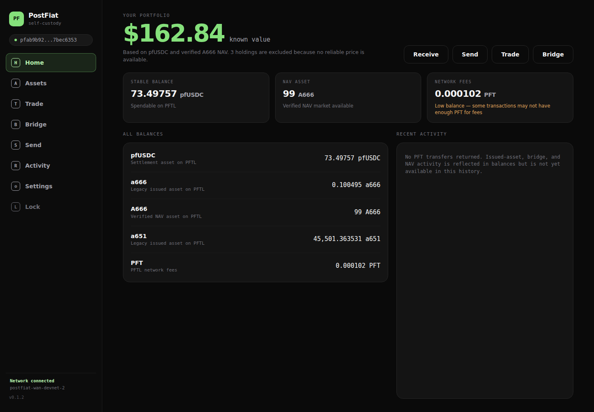
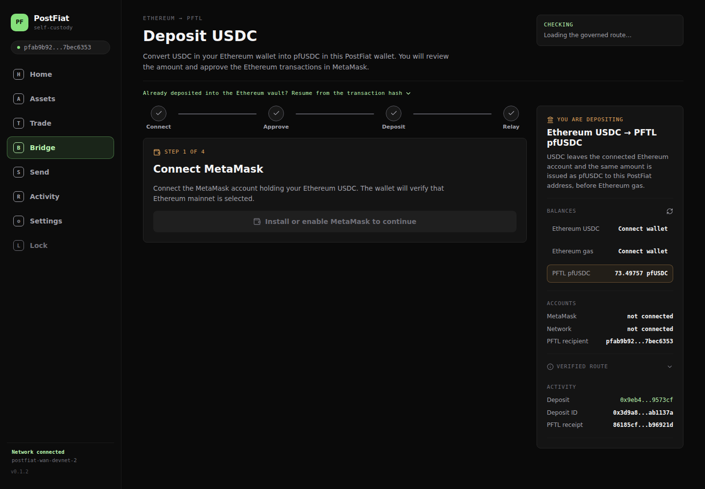
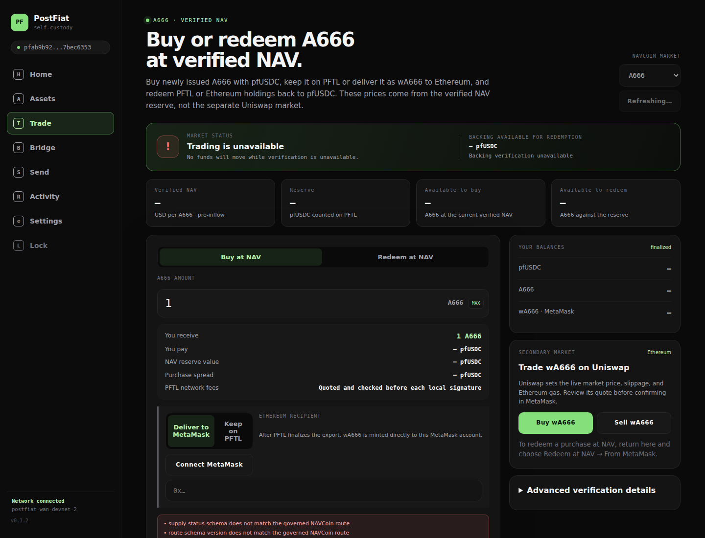
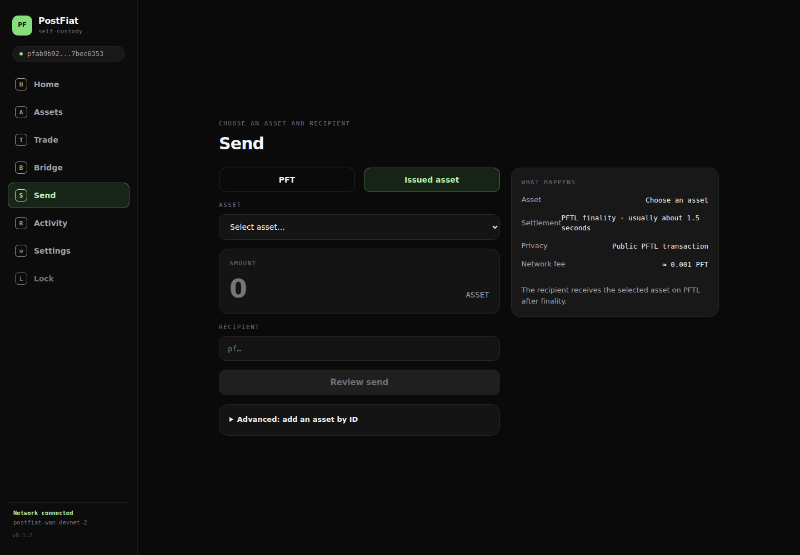
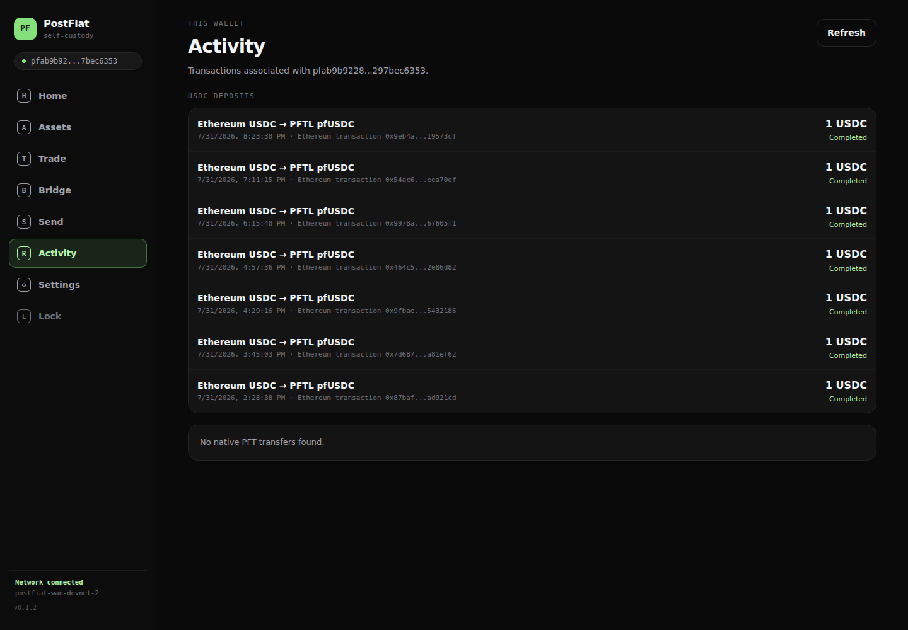
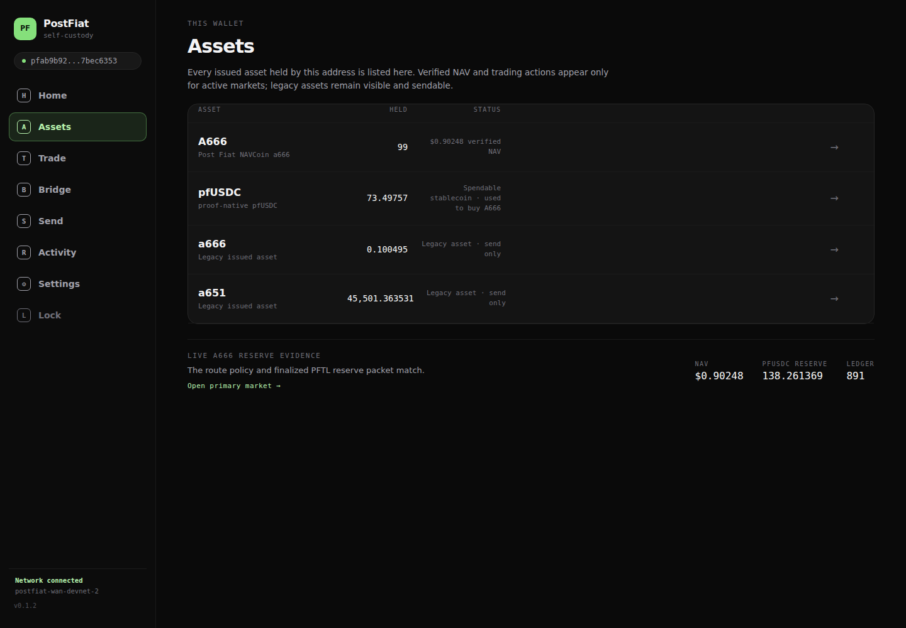

# PostFiat wallet UX remediation

**Date:** 2026-08-12

**Live wallet:** `https://5.223.45.94:5173/`

**Wallet inspected:** `pfab9b9228942e5c529633a13aa271d5297bec6353`
**Source teardown:** [WALLET-UX-NEW-USER-PANE-AUDIT-20260812.md](WALLET-UX-NEW-USER-PANE-AUDIT-20260812.md)

## Outcome

The live wallet has been changed from a protocol/operator menu into seven user goals: **Home, Assets, Trade, Bridge, Send, Activity, and Settings**. The A666 acceptance harness, Process pane, Private FX demo, validator telemetry, FastPay experiment, proof-GPU blocker, and deprecated-route copy are no longer mounted in consumer navigation.

The funded wallet now renders:

- approximately **$162.84 known value** from 73.49757 pfUSDC and 99 active A666 at the verified $0.90248 NAV;
- **0.000102 PFT** as a low network-fee balance, never as total portfolio value;
- active **A666** and legacy lowercase **a666** as different assets, resolved by governed asset ID rather than case-insensitive symbol matching;
- legacy **a651** as a named, sendable legacy holding;
- seven wallet-scoped, accepted **1 USDC** Ethereum-to-PFTL deposits in Activity.

No live transaction was submitted during remediation verification. The account remained at sequence **206** and PFT balance **102 atoms (0.000102 PFT)** after the browser tests.

## Pane-by-pane disposition

### Pane 1 — No-wallet onboarding: resolved

Restore is now the primary path. Recovery seed, encrypted backup, and new-wallet creation are separate plain-language choices. The page says that restoring does not move funds and defines the two recovery artifacts.

### Pane 2 — Seed import: resolved

The seed is masked by default, the privacy warning is explicit, Back is available, validation happens before persistence, and the derived address is previewed before the user creates a new local unlock passphrase.

### Pane 3 — Dashboard: resolved

“Total balance” has been replaced by a priced portfolio summary. Stablecoin, active NAV asset, legacy holdings, and fee balance are named and itemized. Unpriced holdings are counted and explicitly excluded from the dollar estimate.

### Pane 4 — Bridge: deposit corrected; withdrawal remains a protocol gap

All Arbitrum language is gone. Missing MetaMask data is shown as **Connect wallet**, not zero. The contradictory Complete/Loading state is fixed. Vault and route identities moved under a collapsed verification section.

The current self-custody browser client still has no user-signed `pfUSDC → Ethereum USDC` withdrawal adapter. The existing StakeHub bridge-out runner signs from agent/operator configuration, so it was deliberately not exposed as though it were a self-custody wallet action.

### Pane 5 — NAV Markets: resolved for the active A666 route

The live validator registry returns the v1 route schema while the old browser accepted only v2. The loader now hydrates v1 routes from authoritative `asset_info` responses, then applies the same strict route parser. A666 buy/export and PFTL or MetaMask return/redemption are available from a quote-driven screen.

The governed wA666 and Ethereum USDC addresses are also passed to official Uniswap buy/sell URLs. Uniswap remains responsible for its live quote, slippage, approval, and gas confirmation; the wallet explains how to return and redeem the purchased wA666 at NAV.

### Pane 6 — Send: resolved for ordinary PFT and issued-asset sends

Send opens on the funded issued-asset flow, lists live asset symbols and balances, warns that the PFT fee balance is insufficient when PFT is selected, and moves manual asset-ID trust configuration under Advanced. FastPay no longer appears as a consumer choice.

### Pane 7 — A666 Loop: removed from consumer navigation

The fixed 10-USDC acceptance runner is no longer imported or mounted by the wallet. It cannot be mistaken for a personal swap, mint, redemption, or account history screen.

### Pane 8 — Process: replaced by wallet-scoped Activity

Activity now merges native PFT history with recipient-scoped bridge jobs. The live account has seven accepted deposits, all rendered with amount, time, Ethereum transaction reference, and terminal status.

The network does not expose a wallet-scoped issued-asset transaction index, so historical NAV issuance/redemption rows cannot yet be reconstructed safely. The UI states that limitation instead of claiming the wallet has no activity.

### Pane 9 — Private FX: removed from consumer navigation

The broken demo fix, HTTP status leakage, and contradictory Ready/Blocked state are no longer reachable from the wallet shell.

### Pane 10 — NavCoins: replaced by Assets

Every held issued asset renders even without an active market. Governed A666 and pfUSDC metadata comes from the live route and asset registry; legacy holdings remain visible and sendable. Raw IDs are confined to Advanced asset detail.

### Pane 11 — More/settings: resolved

Settings leads with Security & Recovery. It supports auto-lock, local passphrase rotation, encrypted backup download/restore, and clearly scoped local removal. RPC and route-service configuration are collapsed under Advanced. Passphrase rotation was tested in an isolated browser profile by rotating, locking, and unlocking the same restored address.

### Pane 12 — Locked wallet: resolved

The page defines the local unlock passphrase, shows the complete wallet address, and replaces the false promise of a password reset with **Remove and restore wallet** plus the recovery-material consequence.

## Mobile verification

The rewritten shell and primary portfolio/asset/trade panes were also captured at 390 × 844:

- [Mobile Home](wallet-ux-remediation-20260812/11-mobile-home.png)
- [Mobile Assets](wallet-ux-remediation-20260812/12-mobile-assets.png)
- [Mobile Trade](wallet-ux-remediation-20260812/13-mobile-trade.png)

## Verification

- 249 wallet unit and integration tests passed.
- Production Vite build passed.
- Public restore showed the expected funded address and named holdings.
- Public Trade rendered the active A666 market and two correctly parameterized official Uniswap URLs.
- Public Activity rendered exactly seven address-scoped bridge deposit jobs.
- Isolated passphrase rotation, lock, and unlock passed.
- The deployed production bundle contains none of: `Arbitrum`, `proof_gpu`, `A666 round trip`, `transaction adapter`, `Private FX`, or `FastPay (experimental)`.
- No account mutation occurred during the review; sequence remained 206.

## Remaining protocol work

Two audit requirements cannot be truthfully solved by presentation code alone:

1. Add a browser-prepared, locally signed pfUSDC burn plus durable proof/claim relay for **pfUSDC → Ethereum USDC**. Do not wrap the existing agent-key bridge-out runner and call it self-custody.
2. Add a wallet/account index for issued-asset transactions so Activity can include historical NAV mint, export, return, redemption, and failure rows without scanning global operator receipts or guessing ownership.

Until those protocol surfaces exist, the wallet now fails honestly at those boundaries rather than exposing operator machinery or fabricating completeness.
