# PostFiat wallet UX remediation and live verification

**Reviewed:** 2026-08-12 to 2026-08-13

**Live wallet:** `https://5.223.45.94:5173/`

**Wallet:** `pfab9b9228942e5c529633a13aa271d5297bec6353`
**Source teardown:** [WALLET-UX-NEW-USER-PANE-AUDIT-20260812.md](WALLET-UX-NEW-USER-PANE-AUDIT-20260812.md)

## Outcome

The consumer wallet now has seven understandable destinations: **Home, Assets, Trade, Bridge, Send, Activity, and Settings**. It no longer mounts the fixed A666 acceptance harness, Process pane, Private FX demo, deprecated-network instructions, proof-GPU state, validator telemetry, or FastPay experiment in normal navigation.

The funded wallet now shows approximately **$769.48 known value**, including both chains:

- **PFTL:** 73.097570 pfUSDC, 99 A666, 0.100495 legacy a666, 45,501.363531 legacy a651, and 0.000010 PFT for network fees.
- **Ethereum:** 514.079891 USDC and 103 wA666 in the connected `0x1455…ad8c0` wallet.
- **A666 market:** verified NAV **$0.90248**; observed Uniswap pool-state estimate **$0.768164**, or **14.88% below verified NAV** at the captured block.

The dollar total intentionally excludes PFT and legacy holdings without a reliable price. PFT is labeled as the network-fee balance, not the portfolio total.

## Pane 1 — No-wallet onboarding

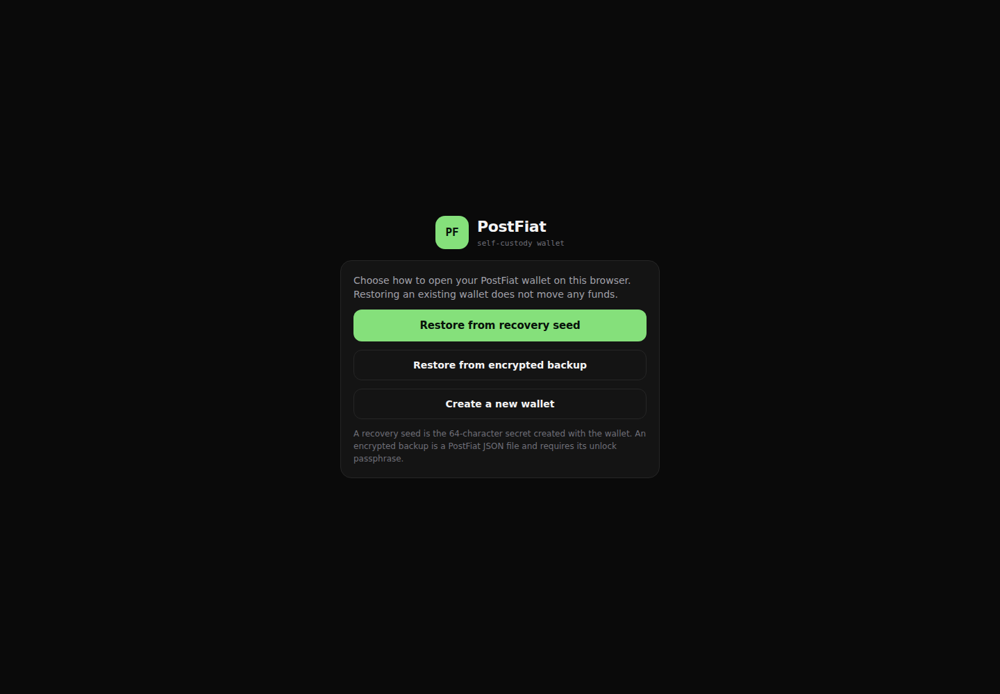

### Implemented correction

Restore is the primary task. Recovery seed, encrypted backup, and new-wallet creation are separate paths with plain explanations. The screen tells returning users that browser storage contains an encrypted local copy and that restoring does not move funds.

### Remaining criticism

The wallet still uses a 64-character hexadecimal recovery seed rather than a more familiar mnemonic or hardware-wallet flow. The UX now explains that fact honestly, but the recovery artifact remains more intimidating than mainstream self-custody products.

## Pane 2 — Seed restore

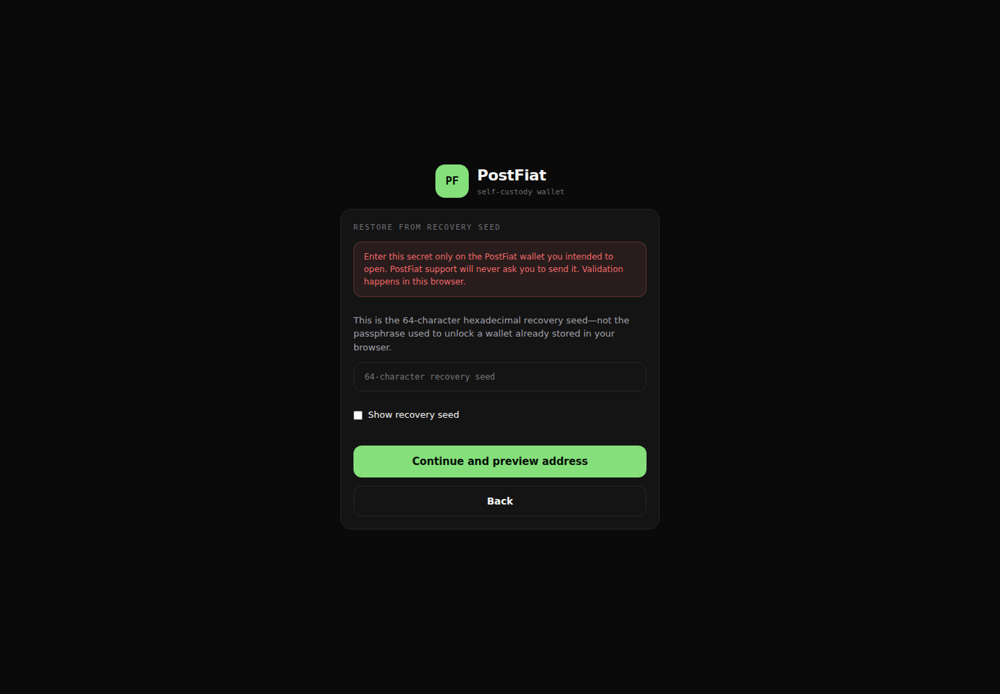

### Implemented correction

The seed is masked, handled locally, and explicitly distinguished from the local unlock passphrase. Back navigation, privacy warnings, local validation, and the derived-address preview precede persistence.

### Remaining criticism

The seed format is still implementation-shaped. A future version should support a standard mnemonic or hardware wallet without weakening local-only derivation and address preview.

## Pane 3 — Home / portfolio

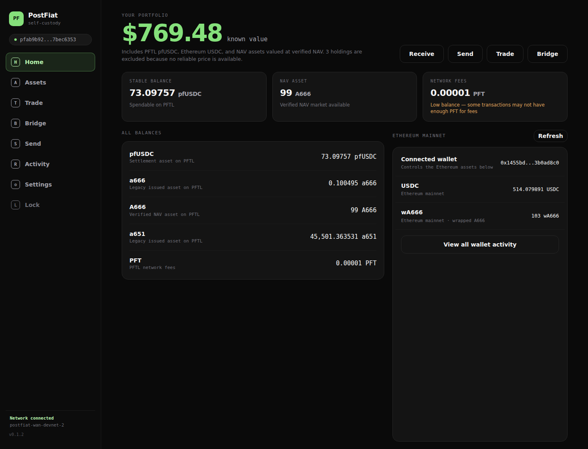

### Implemented correction

The false **0.000102 PFT total balance** is gone. Home names every PFTL holding, separates PFT network fees, shows connected Ethereum USDC and wA666, and computes one known-value total from stablecoins and verified NAV assets. Legacy holdings remain visible instead of becoming hashes or disappearing.

### Remaining criticism

The portfolio prices wA666 at verified NAV rather than executable Uniswap spot, because NAV is the governed asset valuation. That is defensible but can overstate immediate liquidation value when the pool is discounted. The page says “known value,” but a stronger version would show separate **NAV value** and **market liquidation estimate** totals.

The PFT balance is now only **0.000010 PFT**, so another PFTL transaction is unlikely to have enough fees. The warning is visible, but the wallet still lacks a simple fee top-up action.

## Pane 4 — Assets

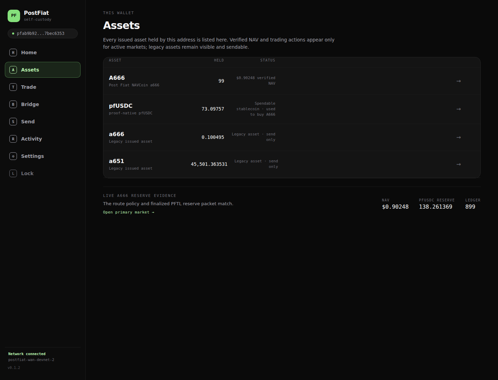

### Implemented correction

Every held issued asset renders by a recognizable name. A666 is marked as a verified NAV asset, pfUSDC as a spendable settlement stablecoin, and lowercase a666/a651 as legacy send-only holdings. Advanced detail holds raw identifiers.

### Remaining criticism

The legacy names remain opaque because the chain metadata itself provides no trustworthy economic description or price. “Legacy asset · send only” is safer than guessing, but it does not answer what backs those assets or whether migration exists. That requires authoritative issuer metadata, not UI inference.

## Pane 5 — Trade / A666 NAV market

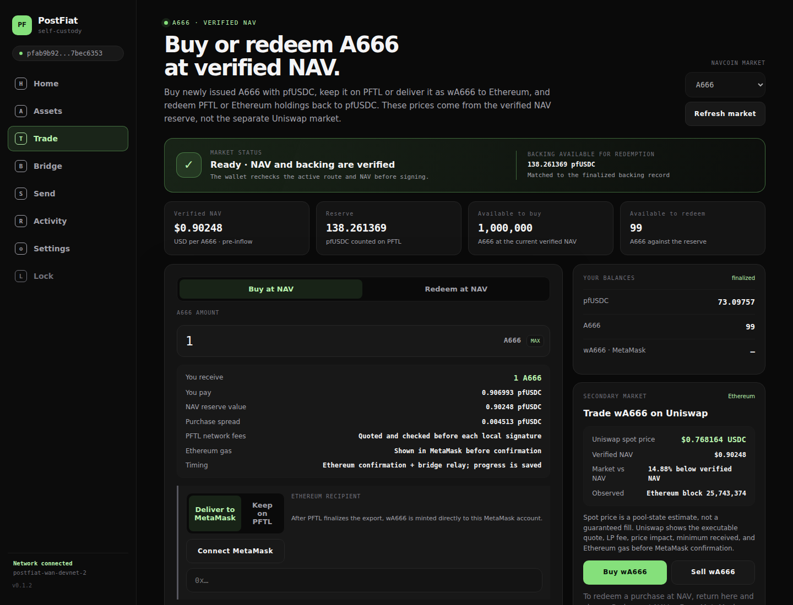

### Implemented correction

The dead adapter error is replaced by an actual transaction surface. It shows verified NAV, backing, available buy/redeem capacity, PFTL balances, purchase spread, fee behavior, delivery to PFTL or Ethereum, Uniswap buy/sell actions, live pool spot, and the explicit discount versus NAV.

The capture shows:

- verified NAV: **$0.90248 per A666**;
- PFTL backing: **138.261369 pfUSDC**;
- available to redeem from this wallet: **99 A666**;
- Uniswap pool-state estimate: **$0.768164 per wA666**;
- market discount: **14.88% below verified NAV**.

### Remaining criticism

The in-wallet Uniswap number is a pool-state estimate, not an executable quote. The UI states this and sends the user to Uniswap for LP fee, price impact, minimum received, gas, and final confirmation, but the experience still leaves the wallet for secondary-market execution. A future embedded quote should preserve Uniswap’s exact calldata and MetaMask review rather than inventing a wallet-side estimate.

The primary buy form initially defaults to “Deliver to MetaMask” even when MetaMask is not connected. “Keep on PFTL” would be a less surprising default for a PFTL wallet.

## Pane 6 — Bridge

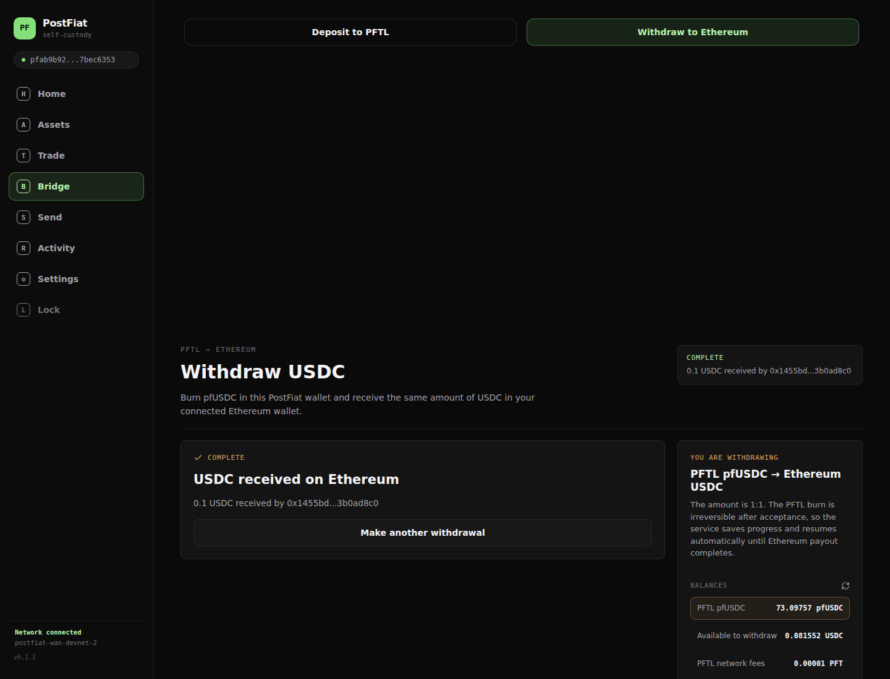

### Implemented correction

Deposit and withdrawal are peer tabs. No deprecated network is named. Withdrawal is now a real self-custody flow: the browser locally signs the exact pfUSDC burn, the server discovers the accepted burn without receiving seed material, a qualified local CPU prover produces the Ethereum proof, progress is durable, and exact 1:1 USDC is released to the connected Ethereum address.

The review shows amount, source/destination, PFTL fee, included Ethereum gas, estimated 20–40 minute local verification, reserve-limited capacity, irreversible point, and automatic recovery. The completed state is shown above; the actual pre-sign review is retained here:

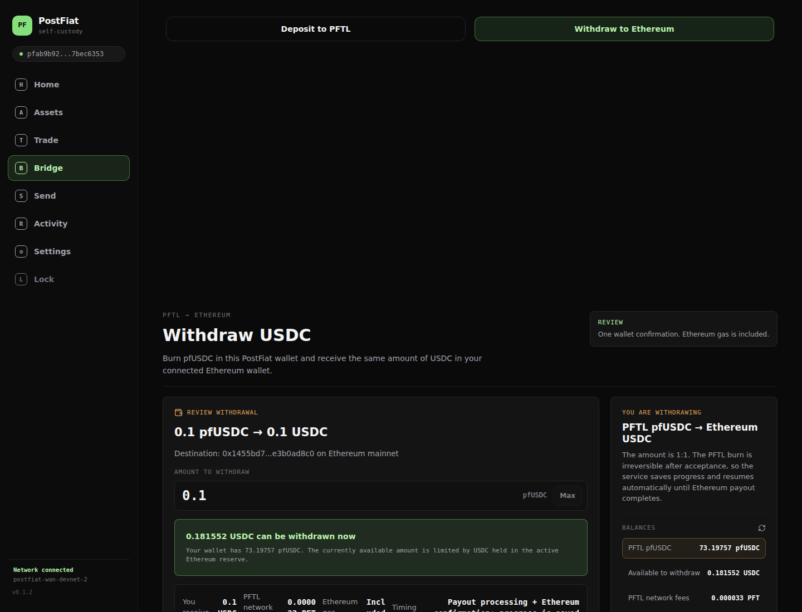

### Remaining criticism

The CPU proof takes roughly 18–20 minutes on this host, and current reserve capacity is only **0.081552 USDC** after the live verification. Those are protocol capacity constraints, not visual defects. The wallet communicates both, but this is not yet a high-throughput consumer bridge.

The completion card shows only the most recent 0.100000-USDC job. Activity contains all four completed jobs, but the completion pane should offer a direct Ethereum explorer link and exact transaction hash.

## Pane 7 — Send

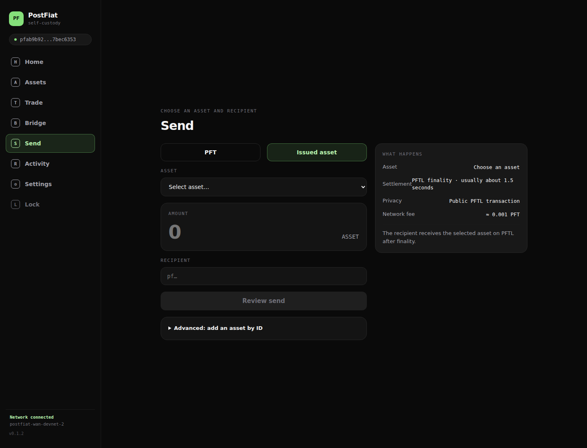

### Implemented correction

Send now starts with a normal asset choice, recipient, amount, and review. PFT and issued assets are understandable choices; manual trust-by-ID is collapsed under Advanced. The consumer FastPay lane is gone.

### Remaining criticism

The form does not preselect the last-used or highest-value asset, so its first state is empty. It also lacks an address book, QR scanner, recent recipients, and a fee-funding shortcut. With only 0.000010 PFT left, the user cannot currently complete another send even though the selected issued-asset form does not lead with that blocker until an asset is chosen.

## Pane 8 — Activity

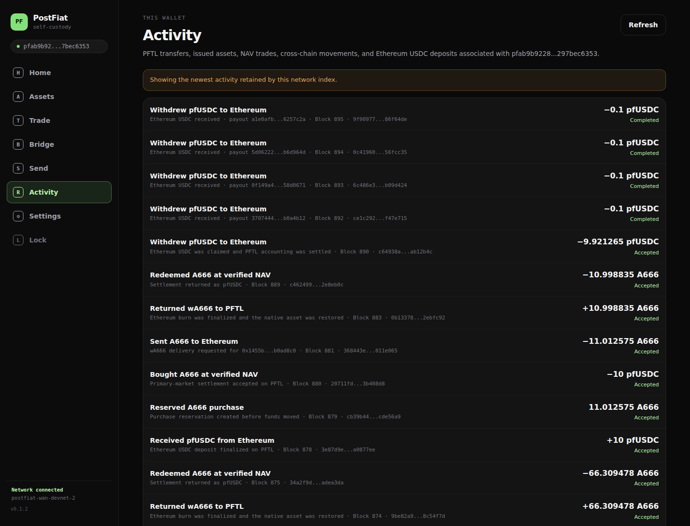

### Implemented correction

Activity is wallet-scoped and merges PFTL transfers, issued-asset actions, NAV buys/redemptions, cross-chain exports/returns, Ethereum deposits, durable relay jobs, and pfUSDC withdrawals. The four live withdrawals appear as four completed 0.100000-pfUSDC rows with their distinct burn heights and Ethereum payout references.

### Remaining criticism

The network index is truncated, so the pane warns that it shows the newest retained history. There is no pagination or explorer deep link. Old rows use “Accepted” while durable relay rows use “Completed”; those labels should eventually be normalized around user outcomes.

## Pane 9 — Settings / security and recovery

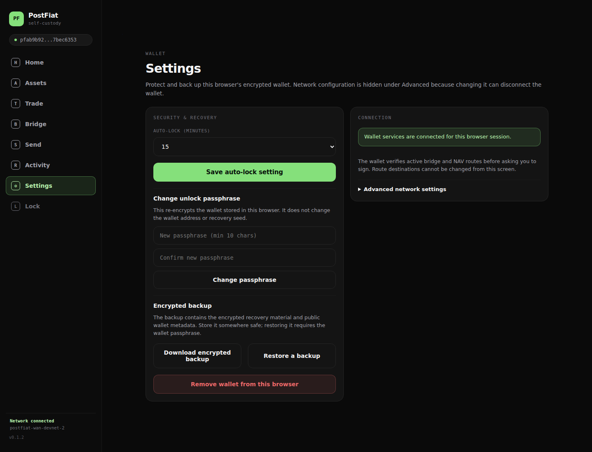

### Implemented correction

Security and recovery lead the page. The wallet supports encrypted backup export/import, passphrase rotation, auto-lock, and removal of only the local encrypted copy. RPC and route-service configuration are hidden under Advanced.

### Remaining criticism

The wallet can say that an encrypted backup exists locally only if it can verify the artifact in the current browser. It still cannot guarantee the user stored that backup somewhere recoverable. A guided “test this backup in an isolated restore” flow would provide stronger recovery assurance.

## Pane 10 — Locked wallet

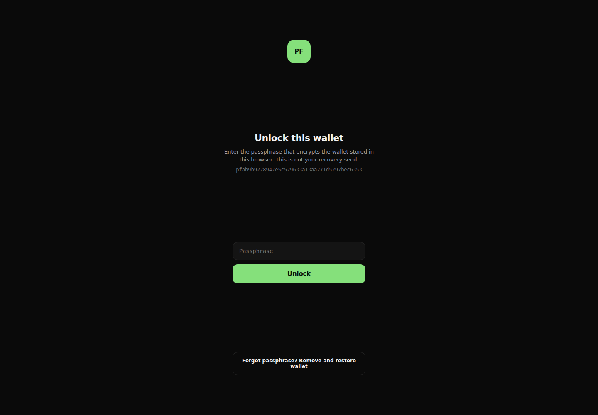

### Implemented correction

The screen defines the local unlock passphrase, displays the full public address, and replaces the false password-reset promise with **Remove and restore wallet** plus the explicit requirement for recovery material. Removing the local copy does not imply funds are deleted.

### Remaining criticism

The full address is visually useful but should also have a dedicated copy control on this pane. Hardware-wallet support would eliminate the browser-stored seed risk entirely for users who prefer it.

## Removed consumer panes

The following were removed rather than cosmetically renamed:

- **A666 Loop:** an operator acceptance harness, not a normal transaction.
- **Process:** replaced by wallet-scoped Activity.
- **Private FX:** an unavailable demo, not a production wallet action.
- **NavCoins:** merged into Assets and Trade.
- **FastPay experimental lane:** removed from consumer Send and Home.

## Live-funds verification

The intended browser test amount was one **0.100000-USDC** withdrawal. The browser automation retried before durable job discovery disabled the button and accidentally submitted four distinct accepted 0.100000-pfUSDC burns at PFTL heights 892–895. This was a test-harness race, not a user action and not hidden as a successful single test.

The recovery work completed all four already-accepted burns in strict verifier-checkpoint order:

| Burn height | Ethereum USDC delta | Accounting close | Replay attempt |
|---:|---:|---:|---|
| 892 | +0.100000 | PFTL height 896 | Rejected |
| 893 | +0.100000 | PFTL height 897 | Rejected |
| 894 | +0.100000 | PFTL height 898 | Rejected |
| 895 | +0.100000 | PFTL height 899 | Rejected |

Conservation evidence:

- Ethereum recipient USDC: **513.679891 → 514.079891** (**+0.400000 USDC**).
- Active Ethereum vault: **0.481552 → 0.081552 USDC** (**−0.400000 USDC**).
- PFTL pfUSDC: **73.497570 → 73.097570** (**−0.400000 pfUSDC**).
- PFTL network fees: **0.000102 → 0.000010 PFT** (**0.000092 PFT paid**).
- Ethereum wA666: remained exactly **103.000000 wA666**.
- Ethereum gas across the four payout transactions: **206,584,019,097,211 wei** (about **0.000206584 ETH**), paid by the constrained payout path rather than deducted from the 1:1 USDC receipt.
- All four redemption records are settled for exactly 100,000 atoms; final mempool pending is zero.

The permanent product corrections from this incident are:

1. the confirm button remains disabled until durable saved-job discovery and burn recovery finish;
2. any earlier failed/incomplete accepted burn blocks later payouts, preserving monotonic verifier order;
3. retries reuse durable proof and Ethereum receipt evidence and cannot pay twice;
4. retry settlement artifacts are archived before a clean retry;
5. the settlement runner uses the wallet’s actual six validator tunnels, not obsolete local ports.

## Wallet-ready audit

| Requirement from the teardown | Result |
|---|---|
| Restore expected address; explain seed, backup, passphrase | Implemented and captured |
| Identify every held asset and portfolio value | Implemented; legacy unpriced assets explicitly excluded |
| Show PFTL/Ethereum location and controlling Ethereum wallet | Implemented on Home, Assets, Trade, and Bridge |
| Buy/sell wA666 with price-versus-NAV context | Implemented via live market data and exact Uniswap handoff |
| Move A666/wA666 across chains with custody/timing shown | Implemented through Trade export/return jobs |
| Redeem A666 at verified NAV with backing | Implemented with live NAV/backing/capacity |
| Withdraw pfUSDC to Ethereum USDC | Implemented and proven with live funds |
| Follow work in wallet-scoped Activity | Implemented; four live withdrawals captured |
| Recover interrupted work without pasted payload | Implemented; live settlement recovery exercised |
| Keep hashes, RPC, proof/GPU internals out of normal UX | Implemented; details confined to Advanced/evidence |

## Verification

- **137/137** wallet web tests passed.
- **33/33** wallet proxy suites passed.
- **4/4** Python Ethereum withdrawal recovery tests passed.
- Production Vite build passed.
- All four local Groth16 proofs verified the expected program verification key.
- Static production-bundle scan found none of: deprecated-network copy, `proof_gpu`, `A666 round trip`, `transaction adapter`, `Private FX`, or `FastPay (experimental)`.
- Public wallet URL returned HTTP 200; retired FastSwap endpoint returned HTTP 404.
- Final read-only browser capture produced eight screenshots and submitted **zero** transactions.
- Canonical and live implementation files were synchronized byte-for-byte before commit.

The global Rust formatter still reports pre-existing formatting differences in `tools/pfusdc-tier4-prover/src/ingress_capture/bonded.rs`; that unrelated file was not rewritten during this wallet change.
