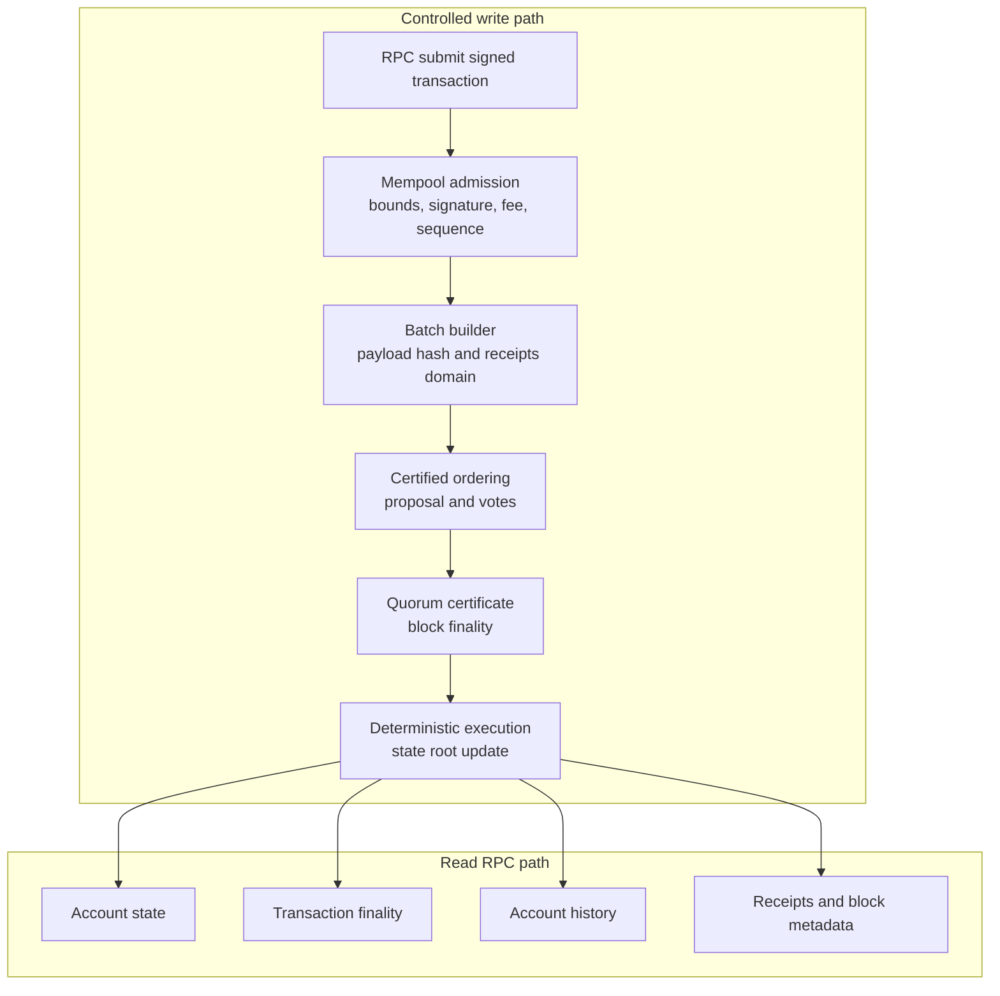

# RPC Overview

PostFiat RPC is read-first for the controlled network. Write paths exist, but
they are bounded and explicit because public write exposure changes abuse and
operator-risk assumptions.

## RPC Surfaces

| Surface | Purpose |
| --- | --- |
| Read RPC | Status, ledger, fee, validators, blocks, receipts, transaction finality, account history, pool reports. |
| Controlled write path | Bounded operator-approved transaction submission for live evidence and wallet tests. |
| Local request-file path | Local node command path for building batches from prepared request files. |
| Privacy batch creation | Opt-in bounded Orchard batch creation with rate and concurrency limits. |

## Write And Read Paths

## Current Tooling

- `crates/node/src/rpc_cli.rs`
- `crates/rpc_sdk/src/lib.rs`
- `scripts/testnet-rpc-doctor`
- `scripts/testnet-rpc-method-inventory`
- `scripts/postfiat-rpc-account-tx`
- `python/postfiat_rpc/client.py`

## Read Next

- [Methods](methods.md)
- [Account History](account-history.md)
- [Write Policy](write-policy.md)
- [Examples](examples.md)
