# NAVCoin external round trip — completed September 7, 2026

**PASS: the actual Ethereum mainnet → PFTL devnet → Uniswap → PFTL → Ethereum route completed through the existing StakeHub signer.** This is the external traversal, including both real Uniswap trades and the final USDC payout. No replacement deposit is needed.

```mermaid
flowchart LR
    A["Ethereum: 10 USDC"] --> B["PFTL: 10 pfUSDC · source epoch 10"]
    B --> C["NAV issue: 9.611565 A666"]
    C --> D["SP1 export → Ethereum wA666"]
    D --> E["Uniswap sell: 7.357995 USDC"]
    E --> F["Uniswap buy: 9.599569 wA666"]
    F --> G["Burn → PFTL return import"]
    G --> H["NAV redeem: 9.932860 pfUSDC · same source"]
    H --> I["SP1 withdrawal: 9.932860 Ethereum USDC"]
```



## Accepted execution

| Step | Actual result | Evidence |
| --- | --- | --- |
| Ethereum deposit | 10.000000 USDC into the epoch-10 vault | [Deposit](https://etherscan.io/tx/0x639893f4c8d3df16baa392a1f958acd7549586f7b186068cd73ad5cd14806772) |
| Proven ingress claim | 10.000000 source-series pfUSDC | PFTL 1011 |
| Source authorization, NAV issue, export | 9.611565 A666 using NAV epoch 8 | PFTL 1012–1015 |
| Historical verifier synchronization | Checkpoints 881→917→924→989 accepted, including both committee rotations | Three Ethereum advancement receipts in the recovery archive |
| Ethereum proof acceptance and mint | Exactly 9.611565 new wA666; verifier advances to 1015 | [Mint](https://etherscan.io/tx/0x08b001efba5fd3ddabc084d1080107189891654ba1cbfc52559b0c4f4ccaa9fe) |
| Mint acknowledgement | Governed five-signature checkpoint certificate | PFTL 1016 |
| Uniswap sell | 9.611565 wA666 → 7.357995 USDC | [Sell](https://etherscan.io/tx/0x95b1dafdb8bd9a04691257f80b4620e3a210443fc444459a9e39df9271acfbe6) |
| Uniswap buyback | Same 7.357995 USDC → 9.599569 wA666 | [Buyback](https://etherscan.io/tx/0xfc0cdd8f7df48ec7a5221604943967ad27b1a09973701e4325b41720e4c1eba1) |
| Return burn and import | Exactly the buyback output | [Burn](https://etherscan.io/tx/0x589ee45820fe35e92e9a4cb1d8f0f90e66f26cd5ec55ed9759c8e884cd635cc3), PFTL 1017 |
| NAV redemption | 9.932860 pfUSDC from the original source series | PFTL 1018 |
| Native withdrawal burn | Exact source bucket; 9.932860 pfUSDC | PFTL 1019 |
| Ethereum payout | 9.932860 USDC; duplicate withdrawal rejected | [Withdrawal](https://etherscan.io/tx/0x713b43d9746ea70277baac528fd3e1f309734a0ba02b4b7522e547526bfc8575) |
| PFTL settlement | Actual Ethereum receipt bound to the native redemption | PFTL 1020 |

## Conservation and costs

All six validators agree at PFTL **1020**, with empty mempools and state root:

```text
587c6526a2549c97458b371f42e849c49274a1f522e7dcb841b74cd74bdb3d6747c2e6ca646c08ac51733796d39bead6
```

The original **103 wA666**, **99 native A666**, **14 pfUSDC from the old Ethereum source**, and every other pre-existing PFTL holder asset balance are preserved. Final wallet USDC is **534.012751**, exactly its initial 534.079891 minus the 10 deposit plus the 9.932860 payout. The new source has no remaining holder balance or pending redemption. Ethereum wrapped supply equals PFTL's Ethereum supply accounting.

The remaining **0.067140 USDC** in the new vault equals its obligations and its PFTL source claims: **0.012419** in A666 primary principal custody plus **0.054721** in spread custody. Source custody is separate from transparent holder supply; `asset_info.outstanding_supply` alone does not measure it. The principal difference is exactly 0.049752 issue spread, 0.012419 for the units retained by the AMM valued at NAV with rounding, and 0.004969 redemption spread.

Receipt-based Ethereum gas across 17 transactions:

| Category | Gas paid, ETH |
| --- | ---: |
| Actual route traversal, including approvals | 0.000114043116345626 |
| Historical verifier synchronization | 0.000060738864755576 |
| New route verifier/vault deployment | 0.000311639191122977 |
| Total | 0.000486421172224179 |

Gas is `gasUsed × effectiveGasPrice`. The StakeHub response's `charged_usd` field is budget metadata and is excluded. GPU credit funding is also separate from Ethereum gas.

## Implementation and proof identity

- StakeHub `stakehub/navcoin_route.py` derives the next epoch from authoritative governance; pfUSDC epochs are global per asset. Arc's epoch 9 therefore led to Ethereum epoch 10.
- StakeHub `stakehub/navcoin_deposit.py` checks the active route and deployment, journals before signing, and reconciles the exact deposit event and balance deltas. `stakehub/navcoin_checkpoint.py` simulates the actual proof against the existing verifier and uses the agent's contract authorization. Its sender test verifies that an existing journal cannot trigger a second send.
- [Ingress relay](../../scripts/a666-mainnet-pfusdc-relay.sh) carries the governed route epoch into the signed claim. [Issuance](../../scripts/a666-mainnet-primary-issue-ops.py) and [redemption](../../scripts/a666-build-transparent-redeem-op.py) explicitly select the source-series settlement asset while preserving the mint packet's canonical family field.
- [Uniswap approvals](../../scripts/a666-mainnet-uniswap-allowances.py) authorize exact trade inputs. The [swap runner](../../scripts/pftl-uniswap-mainnet-swap.py) journals intent and returned transaction hashes. Both trade deltas were verified; no spendable approval remains.
- [Return and redemption wrapper](../../scripts/a666-mainnet-transparent-roundtrip-after-mint.sh) propagates source custody through the return. The [egress wrapper](../../scripts/a666-mainnet-pfusdc-proof-egress.sh) verifies the embedded guest before burning, proves the selected withdrawal, pays Ethereum USDC, and settles the actual receipt on PFTL.

A666 uses the frozen `004e44` guest, vkey `0x004e44aca326861252ee5ff7863b1174635b727759b75d46b28bb28d4a7b34f9`. The new pfUSDC verifier uses frozen `0015b046`, vkey `0x0015b046ba4b80c0ca7e2d9429a1f5fd88bc6d1d328cca6acec29ffdf48a9d87`, anchored after the rotations at checkpoint 1001. Its accepted withdrawal proves through 1019. The successful GPU hosts used SP1 SDK 6.3.1. The ingress CPU proof took about 24.5 minutes; A100 export and egress proving took about 182 and 136 seconds respectively. These are individual successful proof jobs, not total workflow elapsed time.

Ethereum mint acknowledgement and return import use the existing `BFT_CHECKPOINT` class with five-of-six signatures and governed confirmation depth. Validator 5's current key differs from the older Ethereum route committee; the other five form its quorum. Validators use a workflow-specific archive RPC proxy at `http://127.0.0.1:28703`, forwarding to `https://eth.drpc.org`. This remains a Foundation-operated PFTL devnet demonstration; it does not establish independent operator decentralization or a cryptographic Ethereum light-client return path.

## Evidence and continuation

Original host: `~/.local/share/stakehub/a666-full-route-20260907/roundtrip-PASS.json` and `final-audit/summary.json`. The private StakeHub handoff archive `docs/handoffs/navcoin-recovery-20260907/resumed-epoch10/` preserves proofs, accepted receipts, source selection, six validator snapshots, and exact gas receipts under a hash inventory. The temporary GPU instance was removed after retrieving the proofs.

The empty epoch-7 contracts remain invalid and must not be funded. This traversal does not repair the old epoch-6 verifier or resolve the separate historical Cobalt publication-binding defect. The paused Hyperliquid/Lighter privacy objective remains separate. The consolidated handoff source is not the exact deployed node binary; follow the [machine handoff](../handoffs/2026-09-07___codex__navcoin_cobalt_machine_handoff.md) for release provenance.
