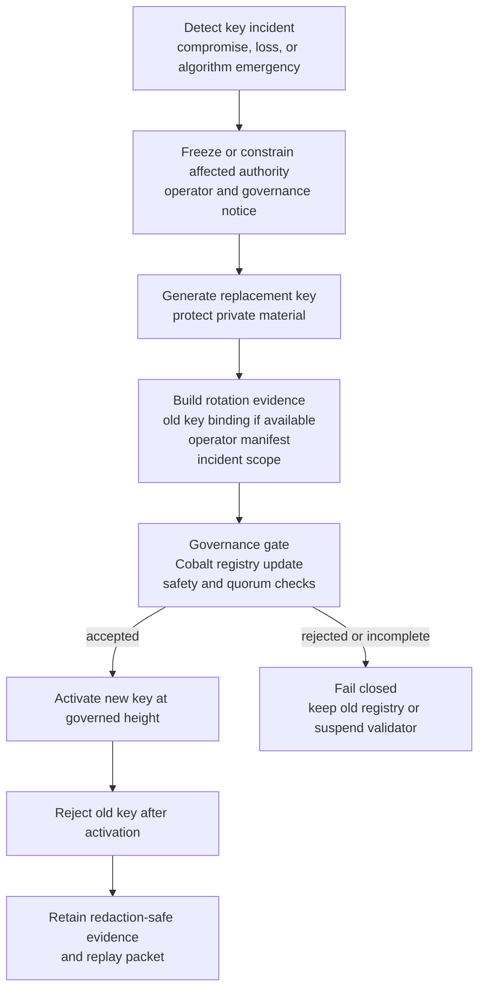

# Emergency Key Rotation

Emergency key rotation is a rehearsed operator workflow.

## Goals

- rotate validator identity or operational keys without silent divergence;
- preserve governance replayability;
- record evidence;
- fail closed if the transition cannot be verified.

## Emergency Rotation Procedure

## Source

- `docs/runbooks/validator-emergency-key-rotation.md`
- `scripts/testnet-remote-emergency-key-rotation-rehearsal`
- `reports/testnet-remote-emergency-key-rotation-rehearsal/`
