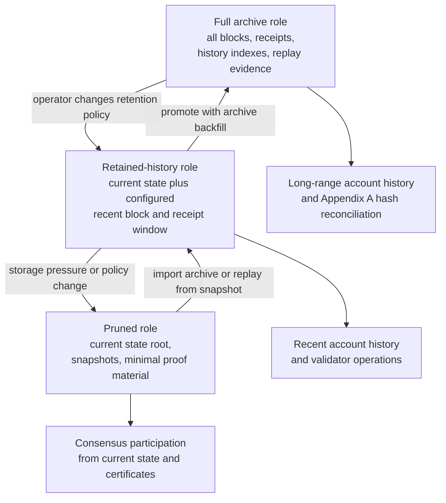

# History Retention

Validators should not need to retain infinite history to validate current state.
PostFiat has explicit history roles and account-history indexing.

## Current Concepts

- retained block and receipt history;
- account transaction index;
- partial-history validation;
- archive/export roles;
- snapshot import/export;
- index status reporting.

## Retention Roles And Transitions

## Source

- `docs/runbooks/validator-history-retention.md`
- `docs/runbooks/account-tx-index.md`
- `crates/node/src/history.rs`
- `crates/storage/src/lib.rs`
