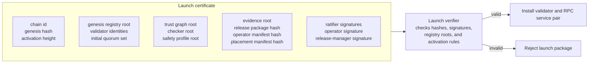
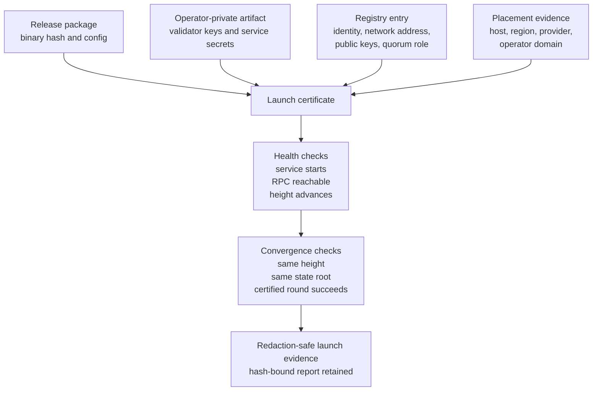

# Validator Launch

Validator launch is package-driven.

## Launch Flow

1. build release package;
2. generate operator-private artifact;
3. run launch prep check;
4. run remote join rehearsal;
5. install validator/RPC service pairs;
6. verify service activity;
7. verify state convergence;
8. run a certified round;
9. retain redaction-safe launch evidence.

## Launch Certificate Structure

## Launch Requirements

## Source

- `docs/runbooks/controlled-testnet-operator-launch.md`
- `scripts/testnet-release-package`
- `scripts/testnet-controlled-launch-prep-check`
- `scripts/testnet-release-live-launch`
- `scripts/testnet-operator-launch-packet`
