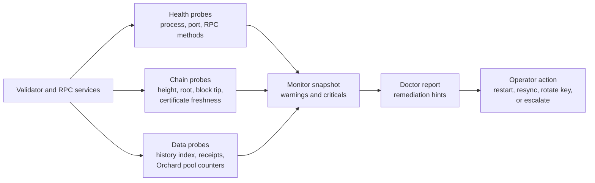

# Monitors

Monitoring is covered by doctor reports and monitor snapshots.

## Monitor Snapshot

The monitor snapshot summarizes:

- endpoint health;
- height lag;
- validator service state;
- RPC method status;
- account-history index readiness;
- Orchard public pool counters when available;
- warnings and criticals.

## Monitoring Pipeline



## Commands

```bash
scripts/testnet-validator-doctor-smoke
scripts/testnet-monitor-snapshot-smoke
scripts/testnet-rpc-doctor
```

## Evidence

- `reports/testnet-validator-doctor/`
- `reports/testnet-monitor-snapshot/`
- `reports/testnet-rpc-doctor/`
