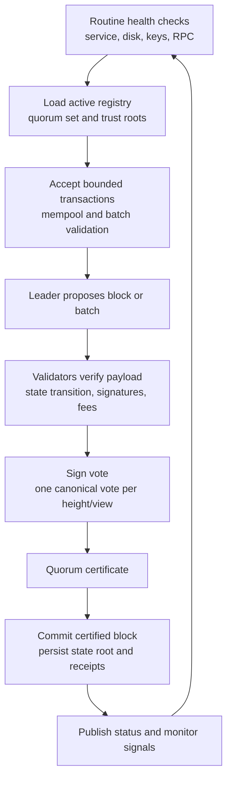

# Validator Operations

Day-two validator work is about keeping services healthy and making recovery
boring.

## Routine Checks

- service active;
- height convergence;
- state root convergence;
- RPC read response;
- account-history index readiness;
- Orchard public pool counters when privacy is enabled;
- disk usage and history retention;
- latest launch/evidence revision.

## Operational Duties And Block Production

## Drills

- restart;
- partial outage;
- below-quorum no-advance and recovery;
- snapshot export/import;
- RPC read-load;
- RPC edge-load;
- emergency key rotation rehearsal.

## Source

- `docs/runbooks/operator-day-two.md`
- `docs/runbooks/validator-doctor.md`
- `docs/runbooks/validator-history-retention.md`
