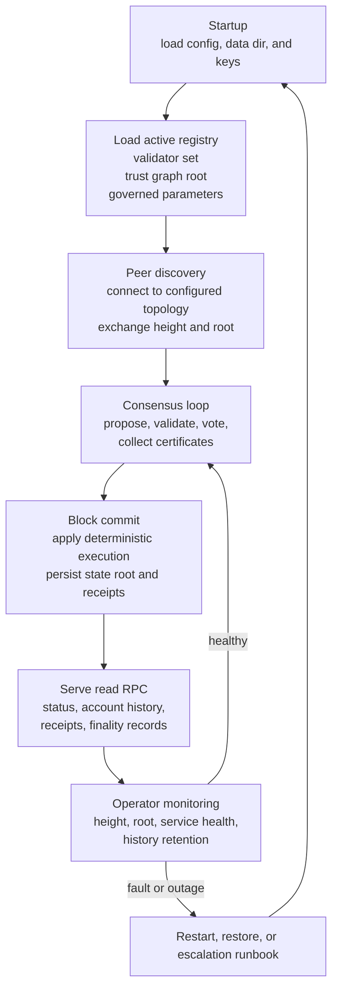
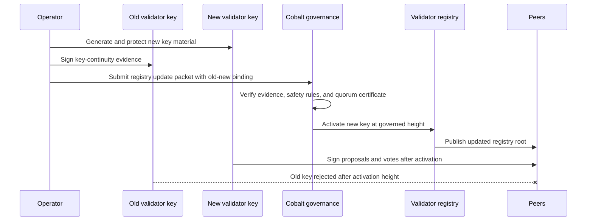

# Validator Overview

Validators are known infrastructure operators. They verify transactions, vote on
blocks, publish certificates, serve read RPC, retain role-appropriate history,
and participate in Cobalt governance.

## Operator Responsibilities

- run validator and RPC services;
- keep keys and private launch material secure;
- monitor state, height, service health, and account-history indexes;
- participate in restart, outage, and recovery drills;
- preserve enough history for the configured role;
- handle emergency key rotation through the runbook.

## Operation Flow

## Key Rotation Flow

## Current Tooling

- `scripts/testnet-validator-doctor-smoke`
- `scripts/testnet-live-validator-doctor`
- `scripts/testnet-monitor-snapshot-smoke`
- `scripts/testnet-remote-restart-drill`
- `scripts/testnet-remote-snapshot-drill`
- `scripts/testnet-remote-emergency-key-rotation-rehearsal`
