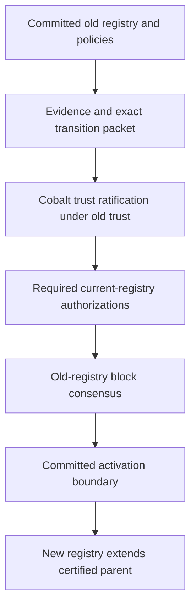
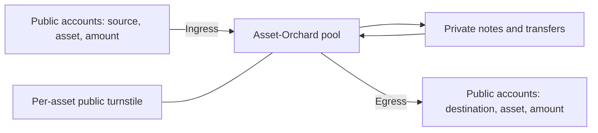

# PostFiat: An Authority-Validated Settlement Ledger

### Governed trust evolution, private multi-asset settlement, bounded machine classification, and post-quantum authorization

**Whitepaper • Version 4 • 2026**

---

## Abstract

PostFiat is a Layer 1 settlement protocol with known validators, prepare/precommit certificate finality, fixed native supply, fee burn, and no native validator subsidy. Its economic thesis is that institutions can earn an incremental return from operating settlement infrastructure through reliability, operational control, and protection of their own business. The protocol therefore treats operator independence, continued participation, and accountable trust changes as core security concerns.

PostFiat composes four established mechanisms around explicit authority boundaries. Cobalt governs changes to declared validator trust. Asset-Orchard supports private multi-asset transfers with public ingress, egress, and per-asset pool accounting. Replayable machine classification converts qualitative governance evidence into public, contestable policy inputs. ML-DSA authenticates accounts and validators from genesis.

This paper specifies durable voting rules, derives block-certificate safety across views, and defines registry activation through an old-authority-certified boundary. It also gives a complete extraction argument for a bounded threshold-subset trust model, an operator participation and attack-deterrence model, and precise privacy and classification interfaces. The distinctive contribution is the composition: evidence informs policy, policy constrains authorization, existing authority approves its successor, and consensus commits the resulting state transition.

## 1. Purpose and Design

Settlement infrastructure serves institutions whose revenue depends on payments, custody, liquidity, and dependable access to shared financial state. Those institutions can have a reason to operate validators even when the ledger pays no block reward. The XRP Ledger supplies a documented institutional precedent for fixed native supply, burned transaction fees, and validation without native validator rewards [1, 10].

PostFiat develops this model around an explicit division of responsibility:

- **Block consensus** orders deterministic state transitions and produces finality certificates.
- **Trust governance** authorizes changes to validator membership and declared trust.
- **Admission policy** evaluates authenticated observations about prospective operators.
- **Private settlement** proves authorized value movement while concealing note openings.
- **Machine classification** interprets bounded evidence questions outside consensus.
- **Cryptographic authorization** binds accounts, validators, and governance participants to exact actions.

These responsibilities meet at the ledger’s state-transition boundary. A classification may support an admission evaluation; an admission evaluation may support a trust proposal; an authorized trust proposal may enter a block. Only successful execution of that ordered proposal changes the active registry.

Five principles govern the composition.

**Old rules validate new rules.** The active authority and checking rules evaluate their proposed successors. A successor registry, policy, or cryptographic profile cannot authorize its own activation.

**Fail closed.** Missing prerequisites prevent the action requiring them. Stalled governance leaves the preceding valid configuration in force.

**Least machinery.** Exact predicates handle exact facts. Interpretation is confined to questions whose evidence requires judgment.

**Hash-bound decisions.** Signatures commit to the evidence, policy, parent state, and result they concern. Content substitution changes the signed decision.

**Deletion monotonicity.** Removing required evidence or classification can stop an admission; it cannot create one. Established violations retain rejection priority even when other evidence is unavailable.

The protocol builds on Byzantine agreement, Cobalt, Orchard, Halo2, and standardized post-quantum signatures [3–8, 11–13]. Its contribution lies in their authority-preserving composition rather than a new consensus or proof primitive.

## 2. Ledger, Authorization, and Fault Model

### 2.1 Replicated state

At each committed height, the ledger contains:

1. public accounts, balances, asset definitions, and authorization state;
2. shielded commitment trees, spent nullifiers, and accepted anchors;
3. per-asset shielded-pool accounting;
4. application state affecting settlement;
5. the active validator registry, trust graph, and governance policies;
6. authenticated history and any scheduled activation boundary.

The state commitment covers every field that can change future validation. Two equal committed states must produce equal validity and execution results for the same subsequent input.

A transaction’s semantic envelope identifies its chain and action type, replay-protection context, fee obligation, action body, and authorization. A shielded action additionally carries its proof statement, commitments, nullifiers, encrypted outputs, and spend authorization. Registry actions carry the transition packet defined in §4. These are semantic requirements; canonical encodings must make each signed and hashed field unambiguous.

A block identifies its certified parent, ordered transaction sequence, and resulting state commitment. Deterministic execution validates authorizations, applies successful actions atomically, and checks the proposed resulting state. A rejected action leaves its affected balances, nullifiers, and governance state unchanged.

Native PFT is allocated in the genesis state with fixed total supply. There is no subsequent native issuance and no validator subsidy. Transaction fees destroy PFT. Issued assets follow their own issuance and authorization rules. The active fee schedule prices bandwidth, verification, and persistent-state consumption; governance changes to that schedule follow its assigned authority.

### 2.2 Security assumptions

For an active block committee of $n$ validators, define

$$
f=\left\lfloor\frac{n-1}{3}\right\rfloor,
\qquad
q=\left\lfloor\frac{2n}{3}\right\rfloor+1.
$$

At most $f$ committee identities are Byzantine during the relevant signing history. Quorums contain $q$ distinct authenticated identities. Across a trust transition, $\beta$ denotes the maximum number of distinct Byzantine identities over the entire transition influence window, including identities compromised at different times.

Correct validators execute the state machine, protect their keys, and preserve signing state against rollback. Cryptographic assumptions are signature unforgeability, collision resistance of domain-separated hashes, and the soundness, authorization, encryption, and zero-knowledge assumptions of the shielded system.

Safety permits arbitrary network delay. Progress requires enough responsive correct validators, eventual delivery, and a view-synchronization regime that eventually gives a correct proposer sufficient time [6]. Cobalt trust agreement additionally requires the declared trust relationships and participation assumptions of its agreement model [3].

Operator identities are meaningful only to the extent that control is independent. Multiple keys under one controller count together when assessing the fault bound. Admission evidence supports that assessment; cryptographic identity alone supplies no independence guarantee.

## 3. Prepare/Precommit Consensus

PostFiat uses a height-local prepare/precommit protocol. It is not chained HotStuff: a prepare certificate supports locking, and a precommit certificate commits its block at that height.

### 3.1 Artifacts and persistent state

Every proposal, vote, certificate, and timeout binds a consensus domain comprising the chain, genesis, protocol, committee epoch, and registry root. Block votes also bind height, view, phase, parent, payload, and resulting state root.

A block identifier is independent of proposal view. The same block can therefore be reproposed in a later view without changing its identity.

At an unfinished height $h$, a validator persists:

| State | Meaning |
|---|---|
| Domain and $h$ | Authority and height under which signing is permitted. |
| Current view $v_{\mathrm{cur}}$ | Cross-phase lower bound on any newly issued vote. |
| Prepare, precommit, and timeout high-water marks | Highest view signed in each phase. |
| Lock $L$ | Verified prepare certificate on which the validator last precommitted, or empty. |
| High certificate $H$ | Highest verified prepare certificate known at this height, or empty. |
| Signed digests | Bindings needed to reject equivocation and safely retransmit existing signatures. |
| Committed parent and state | Authenticated history from which this height executes. |

**Normative cross-phase requirement.** The current-view fence is durable and monotone. A validator may issue a new prepare, precommit, or timeout signature only in its current view. Entering a higher view persists the new fence before signing there. Once the fence advances, no phase may issue a new lower-view signature.

Separate phase counters remain necessary for same-phase uniqueness, but the fence connects them. Verification and storage of a delayed certificate are distinct from authorization to issue a vote for it. A validator may learn old history without regressing its signing view.

Every authorization transition is written atomically before releasing the corresponding signature. Retransmitting identical signed bytes is permitted; signing a different action at an already-used phase and view is prohibited.

### 3.2 Proposal validity

The proposer is determined by height and view. A valid proposal has the expected proposer’s signature, a recomputed block identifier, the current domain and height, the certified parent, and a valid deterministic state transition.

View zero carries neither timeout evidence nor a prior valid-round certificate.

A proposal in view $v>0$ carries a verified precommit-phase timeout certificate for view $v-1$. The proposal identifies that exact certificate and copies its selected high prepare certificate as its justification.

If the selected high certificate is nonempty, it must:

- resolve to a verified prepare certificate in the active domain;
- concern the same height;
- have view strictly below $v$;
- certify the exact proposed block.

A timeout certificate with no prepare certificate permits a fresh valid proposal. It does not erase any recipient’s lock.

### 3.3 Prepare eligibility and justified unlocking

A correct validator prepares a proposal only when:

1. the proposal passes §3.2;
2. its view equals the durable current view;
3. the validator has not prepared at that view or a higher one;
4. it is unlocked, the proposal matches its locked block, or the proposal carries a prepare certificate for its block strictly newer than the lock.

The validator persists the prepare high-water mark and signed digest before emitting its vote. A justified proposal can update the known high certificate.

The fourth condition allows a conflicting proposal to become eligible when a newer prepare certificate justifies it. It preserves the ability to leave an uncommitted lock. Preparing that proposal alone does not replace the lock; lock replacement occurs before precommit.

### 3.4 Locking and precommit

A prepare certificate contains at least $q$ valid prepare signatures for the same nonempty block, domain, height, and view.

To precommit its block, a validator must verify the prepare certificate, remain in that certificate’s view, and have no precommit at that view or a higher one. The certificate must not regress its lock or conflict with a lock at the same view.

Before emitting precommit, the validator atomically:

- advances its precommit high-water mark;
- installs the prepare certificate as its lock;
- updates its high certificate if appropriate;
- records the exact precommit digest.

A newer prepare certificate can thus replace an older uncommitted lock. A lower-view delayed certificate can still be verified and retained, but it cannot authorize a new precommit after the current-view fence has advanced.

### 3.5 Timeouts and view advancement

A timeout vote names its height, view, precommit phase, and highest known verified prepare certificate eligible at that view, or an empty reference. The referenced prepare view may not exceed the timeout view. The validator persists its timeout high-water mark before signing.

A timeout certificate contains at least $q$ distinct timeout signers for one round and phase, in canonical identity order. Every referenced certificate must resolve and verify. Its high certificate is the highest-ranked verified prepare reference appearing in those votes. Conflicting references at an equal numeric rank invalidate the timeout certificate.

The selected high certificate is the maximum among the included votes, not an oracle for withheld certificates elsewhere in the network.

A valid timeout certificate permits entry into the next view. The fence advances durably and applies to every phase. Timeout generation and certificate exchange synchronize progress; elapsed time alone neither clears a lock nor reduces a threshold.

### 3.6 Commit and restart

A precommit certificate contains at least $q$ distinct precommits for the same block at one view. It is the block’s finality certificate.

A recipient verifies the certificate, certified ancestry, and block execution before committing. A delayed finality certificate can commit a valid block even if the recipient has advanced beyond its view: learning finality requires no new lower-view vote.

After commit, the validator advances height using the committed state and certified parent. At a restart it restores the active domain, unfinished-height fence, phase marks, lock, signed digests, and certificate references before signing. If durable signing state cannot be established, the validator remains non-signing while recovering authenticated history.

### 3.7 Certificate safety

**Lemma 1 — Same-view uniqueness.** Two different blocks cannot both obtain prepare certificates at the same height and view.

*Proof.* Two sets of $q$ signers overlap in at least $2q-n>f$ identities. At least one overlapping signer is correct. Its durable prepare high-water mark prohibits preparing both blocks in that view. ∎

The same intersection argument gives same-view precommit uniqueness. Every precommit certificate also requires an underlying prepare certificate.

**Lemma 2 — Exclusion above a precommit certificate.** If block $X$ has a precommit certificate at view $c$, no different block has a prepare certificate at any view $v>c$, even when signatures and certificates are delivered out of view order.

*Proof sketch.* Let $K$ be the signers of the precommit certificate for $X$. Suppose a conflicting prepare certificate exists. Choose its smallest view $v>c$, and, among conflicting prepare certificates at $v$, the first point at which enough signatures exist to form one.

Its signer set intersects $K$ in a correct validator $a$. Validator $a$ signed both precommit for $X$ at $c$ and the conflicting prepare at $v$.

The higher-view prepare cannot have preceded that validator’s lower-view precommit: after preparing at $v$, the current-view fence forbids a new precommit at $c$. Therefore $a$ first precommitted $X$, durably locking it at $c$, and later prepared the conflicting block.

Consider the lock when that prepare was issued. If it still names $X$, prepare eligibility requires a conflicting justification certificate with view strictly between the lock and $v$, contradicting the minimality of $v$. If the lock has already changed to a conflicting block, that change required a conflicting prepare certificate above $c$. A certificate below $v$ again contradicts minimality. A certificate above $v$ would require precommitting in a higher view and thereby prohibit preparing at $v$. A certificate at $v$ would have existed before the selected first conflicting certificate at that view. Every case is impossible. ∎

**Theorem — Block-certificate finality.** Under §2.2 and the stated signing state machine, two different blocks at the same height and active domain cannot both obtain valid precommit certificates.

*Proof.* Equal-view certificates are excluded by Lemma 1 and their prepare prerequisites. For different views, select the lower precommit view. The higher certificate requires a conflicting prepare certificate excluded by Lemma 2. ∎

This theorem concerns certified blocks, rather than equality of every vote: justified movement between uncommitted proposals remains permitted. Its extension to complete ledger histories follows by induction over certified parents and the activation rule in §4.6.

### 3.8 Adversarial execution: delayed certificates, restart, and rotation

Consider $n=4$, $q=3$, Byzantine validator $Z$, and correct validators $H_1,H_2,H_3$.

1. In view 0, $H_1,H_2$ prepare block $X$. $Z$ adds the third signature but withholds the prepare certificate.
2. Correct validators that have seen no prepare certificate can support a nil-high-certificate timeout. View 1 opens. While still unlocked, $H_1,H_3$ prepare conflicting block $Y$, and $Z$ adds the third signature.
3. $H_1$ restarts. It restores its view-1 fence and prepare record.
4. $Z$ delivers $X$’s view-0 prepare certificate to $H_1,H_2$. $H_1$ verifies and stores it, but refuses a new view-0 precommit. Even if $H_2$ has remained in view 0 and precommits, $Z$ and $H_2$ provide only two signatures.
5. Delivery of $Y$’s prepare certificate allows $H_1,H_3$ to lock and precommit $Y$ in view 1. With $Z$, they form its finality certificate.

Separate prepare and precommit counters would permit the dangerous step at item 4: $H_1$ could issue its first precommit at view 0 after preparing at view 1. The cross-phase fence specifically excludes that temporal schedule.

Suppose $Y$ also contains a fully authorized registry transition activating immediately after this height. The old committee commits $Y$, including the exact new registry and activation boundary. New validators begin at the next height using $Y$’s certified state. They reject a proposed child of $X$: the delayed prepare certificate for $X$ is neither a committed parent nor authority to activate any registry.

### 3.9 Progress and ordering

A valid block commits a transaction sequence, not a global first-seen order. Proposer choices and network ingress affect inclusion. Censorship attribution requires authenticated admission evidence and a defined inclusion obligation; ordinary block certificates establish the accepted history.

Unavailable validators remain in the committee. There is no automatic availability-based quorum reduction or Negative-UNL mechanism. If the normal quorum cannot form, progress halts while safety rules remain intact.

## 4. Cobalt Trust Governance and Registry Activation

### 4.1 Two thresholds, two decisions

The global committee threshold $q$ in §2 governs **block preparation and precommit**. Cobalt essential-subset thresholds govern **agreement about declared validator trust**.

A trust configuration is

$$
\mathcal T_e=(G_e,T_e,\chi_e,\pi_e),
$$

where $G_e$ is the registry, $T_e$ the rooted trust graph, $\chi_e$ the active transition checker, and $\pi_e$ the safety profile for configuration index $e$.

Cobalt’s reliable broadcast and binary/multivalue agreement structure establishes trust decisions under its declared trust assumptions [3]. Reliable broadcast binds participants to proposal content; agreement selects the accepted value or rejection; ratification identifies the exact trust decision. Intermediate support messages are phase-specific agreement artifacts, not final transition authorizations.

Cobalt’s scope here is validator trust. Fee policy, application governance, and unrelated authorities retain their own authorization rules.

The acceptance chain is:

A trust certificate authenticates a governance decision. A block certificate authenticates its position in ledger history. Both are required where the active transition policy prescribes them.

### 4.2 Transition packet

A transition commits to:

- the parent registry and trust-graph roots;
- the proposed successor registry, graph, checker, and safety profile;
- admission evidence and applicable classification commitments;
- local threshold rows, extracted covers, and linkedness results;
- key-continuity evidence;
- challenge resolution, expiry, and activation boundary;
- Cobalt ratification and required current-authority signatures.

All these fields belong to one exact transition digest. Expiry or unresolved required challenges prevent acceptance. The current checker evaluates the successor checker and profile; the successor’s looser rules cannot validate the transition introducing them.

### 4.3 Local thresholds and linkedness

An essential subset $S$ declares $n_S=|S|$, fault budget $t_S$, and threshold $q_S$. Its local requirements are

$$
0\le t_S,q_S\le n_S,\qquad
t_S<2q_S-n_S,\qquad
2t_S<q_S.
$$

Two threshold signer sets within $S$ intersect in at least $2q_S-n_S$ identities, exceeding the fault allowance. The final inequality is the stronger Cobalt requirement that Byzantine participants occupy less than half of a threshold set.

A trust view $V_i$ lists essential subsets $ES_i$. Two views are linked when they share an essential subset whose actual faults remain within its budget. Full linkedness also requires enough correct members to reach its threshold:

$$
S\in ES_i\cap ES_j,\qquad
|F\cap S|\le t_S,\qquad
|S\setminus F|\ge q_S,
$$

where $F$ is an admissible Byzantine identity set.

The rooted model requires the prescribed pairwise linkedness throughout the relevant trust closure. The quantifier ranges over every fault allocation allowed by the active profile. With a global budget $|F|\le\beta$, requiring $\beta\le t_S$ and $n_S-\beta\ge q_S$ for a shared subset is a conservative sufficient check.

Cobalt agreement is inherited under these declared-trust premises [3]. The block-finality theorem in §3 is a separate result derived from global committee voting rules.

### 4.4 Complete bounded cover extraction

The transition profile bounds the number of **distinct declared threshold rows**, not the number of possible arbitrary federated quorums.

The supported model has authenticated finite old and new graphs, explicit roots and trust-view references, and essential subsets with canonical identity lists, thresholds, fault budgets, and activation intervals. Every trust view used by certificate acceptance must belong to the committed rooted graph. Every certificate-acceptance case must identify its declared essential-subset support; an accepted support contains at least the threshold number of signers from its row. Cases requiring several rows retain all those requirements.

Extraction proceeds as follows:

1. Validate graph roots, registry references, identities, thresholds, and graph-parent continuity.
2. Traverse every declared trust view and every essential-subset reference, including repeated references.
3. Check that each referenced subset is active at its graph’s activation height. A future or already deactivated declaration is rejected rather than silently omitted.
4. Construct the canonical row containing graph root, subset identifier, members, $n_S,t_S,q_S$.
5. Deduplicate identical repeated rows by subset identifier within each graph. Reject an identifier mapped to conflicting contents.
6. Sort the old and new rows canonically. Reject empty covers, any rejected declaration, a non-increasing activation height, or total distinct rows exceeding the profile bound $M_{\mathrm{cover}}$.
7. Require
   $
   \beta\le \min_{S\text{ in either cover}}t_S.
   $
   Recompute the safety witness from these exact rows and transition bindings.

**Cover lemma.** Every declared-row support usable by certificate acceptance appears in the extracted cover.

*Argument.* Acceptance resolves its support through a committed graph reference. The traversal visits every such reference. Each valid reference produces a row or an identical row already retained; a conflicting or inactive reference rejects extraction. Thus no accepted declaration can be omitted. ∎

This covers ordinary threshold supports and compound cases whose mandatory support rows are declared in the rooted model. Pairwise checks on every old/new row are conservative for compound cases. Unrestricted federated quorum systems with arbitrary recursive acceptance predicates lie outside this extraction theorem.

Let $R$ be the number of graph references, $L$ the total encoded input length including repeated member lists, $m_o,m_n$ the old and new distinct row counts, $M=m_o+m_n$, and $V$ the number of distinct identities across the two registries. A direct comparison-based computation costs

$$
O\!\left(L+R\log M+MV\log V+m_om_nV\right),
$$

apart from cryptographic verification of attached evidence. The $L$ term is essential: a graph can repeat a bounded number of distinct subsets arbitrarily often. Bounding $M$ bounds pairwise work; admission resource limits must also bound input length.

### 4.5 Cross-registry intersection and key continuity

For ordinary threshold supports $S_o,S_n$, any signer sets $Q_o,Q_n$ of sizes at least $q_o,q_n$ satisfy

$$
|Q_o\cap Q_n|
\ge
\max\!\left(0,q_o+q_n-|S_o\cup S_n|\right).
$$

This follows from

$$
|Q_o\cap Q_n|
=|Q_o|+|Q_n|-|Q_o\cup Q_n|
$$

and $Q_o\cup Q_n\subseteq S_o\cup S_n$. For unrestricted threshold selection inside these supports, the lower bound is attainable.

Identity overlap must also preserve authenticated signing continuity. Let $C_{on}\subseteq S_o\cap S_n$ contain only identities whose keys and relevant history continue authentically across the transition. Either side may omit members of this intersection. A sufficient lower bound on key-continuous shared signers is

$$
I_{on}=
\max\!\left(
0,\,
|C_{on}|-(|S_o|-q_o)-(|S_n|-q_n)
\right).
$$

A replacement key without an authenticated continuity handoff contributes nothing to $C_{on}$. The transition profile requires $I_{on}>\beta$ for every covered old/new row pair, alongside local and linkedness checks.

**Seven-validator counterexample.** Let

$$
G_o=\{A,B,C,D,E,F,G\},\qquad
G_n=\{A,B,H,I,J,K,L\}.
$$

Each registry has one subset with $n_S=7,q_S=5,t_S=2$, satisfying the local inequalities. Yet

$$
Q_o=\{A,B,C,D,E\},\qquad
Q_n=\{A,B,H,I,J\}
$$

share only $A,B$. Under transition budget $\beta=2$, both shared signers may be Byzantine. More strongly, the threshold lower bound is zero: old and new quorums can select their five nonshared identities.

The transition fails even if every shared key continues correctly. Replacing either shared key without continuity only weakens the result. Individually acceptable registries therefore need an independently checked handoff.

### 4.6 Activation and authenticated history continuity

Suppose a transition specifies that the new registry first governs height $a$. The old registry must order and commit the exact transition before that boundary. Any intervening heights remain under the old authority, and the certified block at $a-1$ supplies the new registry’s parent.

A validator entering the new domain imports:

- the verified certificate chain through that parent;
- the committed successor registry and activation rule;
- the parent application and governance state;
- commitment trees, nullifiers, pool totals, and account authorizations;
- authenticated key-continuity records where required.

It initializes local voting state for the new domain at height $a$. Cross-domain continuity comes from authenticated committed history and activation, rather than a blanket transfer of an old-domain lock file.

**History-continuity theorem.** Given §3’s certificate safety in each active committee and the activation rule above, accepted block histories cannot diverge through a registry change.

*Proof sketch.* At genesis the initial authority is fixed. Assume a unique certified prefix. Its active committee can certify only one next block by §3. An accepted registry transition is part of that unique prefix and fixes both its successor authority and boundary. The successor can certify only extensions of the prescribed parent. Applying the same argument inductively preserves the prefix across each height and registry boundary. ∎

The cover and intersection results establish correct-overlap properties for the bounded trust model; Cobalt supplies agreement under declared trust; old-registry consensus supplies the ordered activation boundary. Their composition avoids assuming that every higher-round signature must repeat an earlier vote.

A stalled transition leaves the active registry unchanged. Returning to an earlier membership is a new forward transition. Loss of the active authorizing quorum cannot be repaired by a successor declaring itself active.

## 5. Validator Economics and Admission

### 5.1 Incremental participation

An institution may benefit greatly from the ledger while preferring someone else to validate. Participation must therefore compare operating a validator with using the same ledger passively.

For operator $i$, let all recurring quantities use the same accounting period:

- $C_i$: total validator operating cost;
- $\Delta p_iD_i$: expected reduction in institution-specific settlement disruption loss attributable to operating;
- $O_i$: operational-control and assurance benefit;
- $J_i$: incremental service margin or customer-retention benefit;
- $K_i$: opportunity and operational-risk cost.

The incremental participation surplus is

$$
U_i^{\mathrm{op}}-U_i^{\mathrm{passive}}
=
\Delta p_iD_i+O_i+J_i-C_i-K_i.
$$

A break-even operator satisfies

$$
\Delta p_iD_i+O_i+J_i\ge C_i+K_i.
$$

The broad benefit of the ledger continuing to exist cancels from this comparison unless the operator’s own participation changes that outcome. For a small operator in an already robust committee, $\Delta p_i$ may be small. Its justification must then come from real operational or commercial benefits rather than assigning the ledger’s entire value to its validator.

Cost accounting includes

$$
C_i=C_i^{\mathrm{hardware}}
+C_i^{\mathrm{bandwidth}}
+C_i^{\mathrm{verification}}
+C_i^{\mathrm{storage}}
+C_i^{\mathrm{staffing}}.
$$

Verification includes transaction authorization and privacy proofs. Staffing includes key custody, monitoring, maintenance, incident response, and governance review. Redundancy can improve availability while increasing both hardware and staffing costs.

### 5.2 Hypothetical sensitivity scenario

Consider annual normalized cost units, with no claim about measured prices:

| Item | Assumed units |
|---|---:|
| Hardware and redundancy | 12 |
| Bandwidth | 8 |
| Signature and proof-verification capacity | 10 |
| Storage and retained history | 5 |
| Staffing and incident response | 45 |
| **Operating cost** | **80** |

Assume opportunity and operational-risk cost $K_i=10$, avoided disruption loss $\Delta p_iD_i=35$, operational-control benefit $O_i=40$, and incremental service benefit $J_i=25$. Surplus is $100-90=10$ units.

If bandwidth cost doubles, surplus falls to 2. If staffing rises by 20 units, it becomes $-10$. If the operator can obtain the same control benefit from a passive service provider and $O_i$ falls to 15, it becomes $-15$. These are concrete exit pressures.

Certificate bandwidth is one identifiable input. If $s(n)$ is the signature-set size in §8, $b$ blocks are processed per accounting period, $k$ such sets are received per successful height on average, and $d$ is a traffic multiplier for relaying and retransmission, the component traffic is

$$
B_{\mathrm{cert}}=b\,k\,d\,s(n)\quad\text{bytes per period}.
$$

A price per byte converts this to cost. Transactions, proofs, proposals, timeout ancestry, and storage replication add separate terms.

### 5.3 Deterrence over an influence window

Let $W$ be a bounded period during which a validator or coalition can influence settlement before removal or containment. For coalition $C$, define:

- $G_C(W)$: attack proceeds, bribes, censorship gains, and external-position gains;
- $L_C(W)$: lost settlement business, franchise value, and other private losses;
- $p_C(W)$: probability that misconduct leads to an enforceable consequence;
- $A_C(W)$: additional accountable loss conditional on that consequence;
- $E_C(W)$: attack execution cost.

All quantities are monetary present values on the same valuation basis. A deterrence condition is

$$
G_C(W)<L_C(W)+p_C(W)A_C(W)+E_C(W).
$$

There is no protocol stake to slash. Deterrence comes from actual business exposure and enforceable accountability. Gross settlement volume is not automatically loss at risk, and the same exposure must not be counted twice.

Individual break-even conditions do not prove coalition deterrence. Shared funding, coordinated outside positions, or a common business shock can make several otherwise viable operators act together. Admission and transition budgets must consider control groups and dependencies, while sensitivity analysis varies attack-window length, detection probability, and external gains.

### 5.4 Persistent independent participation

Let $N_{\min}$ be the active policy’s required minimum number of independent control groups. A sustainable configuration requires both:

1. enough responsive validator identities to reach normal block and trust quorums; and
2. at least $N_{\min}$ independently controlled participants whose continuation decisions preserve the declared fault bounds.

Recruitment must precede predictable exits far enough to complete a safe transition. Adding identities under existing control does not replenish independent participation. Common vendors, correlated revenue, and synchronized maintenance create availability risks even without malicious coordination.

The economic thesis is falsifiable through operator cost, incremental benefit, sustained participation, recruitment time, independent control concentration, and losses versus potential attack gains. XRPL demonstrates that no-reward validation is an institutional category [10]; PostFiat’s participation conditions must be evaluated for its own operators.

### 5.5 Evidence-supported admission

Admission separates observation authentication, reproducible evaluation, and registry authority.

An active policy defines observation windows, approved source classes, valuation conventions, freshness, uncertainty treatment, and challenge rights. A concrete policy family can evaluate

$$
\begin{aligned}
\operatorname{eligible}(i)={}&
(x_i\ge x_{\min})\land
(r_i\ge r_{\min})\land
(a_i\ge a_{\min})\\
&\land(b_i\le b_{\max})\land
(\rho_i\le\rho_{\max})\land
\operatorname{safe}(\mathcal T_e,i).
\end{aligned}
$$

Here:

- $x_i$ is a conservative monetary lower bound on documented economic loss exposure over $W$, supported by business records, obligations, and attributable settlement dependence.
- $r_i$ is a policy-defined reliability statistic, such as fulfilled observable service opportunities divided by independently recorded opportunities over a stated window. Its sampling and outage rules are fixed.
- $a_i$ records satisfaction of mandatory accountability requirements: authenticated identity, responsible jurisdiction, control evidence, and actionable revocation or enforcement paths.
- $b_i$ compares conservatively assessed attack gains with documented loss and accountability capacity, using the valuation conventions of §5.3.
- $\rho_i$ measures declared non-prohibited dependency concentration under a fixed policy mapping. Prohibited common key custody or release control is handled as an exact rejection gate.
- $\operatorname{safe}(\mathcal T_e,i)$ means the proposed insertion passes the active local, cover, linkedness, intersection, continuity, and authorization requirements of §4.

These are policy quantities derived from cited observations, not arbitrary assessor labels. A narrow evaluator supplied with an evidence packet can reproduce the mapping only for supported inputs; broad attack and exposure estimates remain governed judgments about real-world records.

Policy decisions have strict precedence:

1. **REJECT** if any mandatory policy failure is established, including a known threshold violation or prohibited control.
2. Otherwise **HOLD** if required evidence is absent, stale, ambiguous, disputed, or insufficient for the required bound.
3. Otherwise **PASS** if every requirement succeeds; **REJECT** if a complete evaluation fails a mandatory threshold.

A confirmed prohibited shared controller therefore rejects even when unrelated reliability evidence is missing. A pass recommends a candidate; activation still follows §4.

The real-world premise is that authenticated sources, responsible assessors, and effective challenges provide sufficiently accurate control and economic evidence. Genesis records this bootstrap judgment through commitments to the initial registry, trust graph, checking policy, evidence, and ratifiers. The launch policy requires at least seven ratifiers, no single control group above one third, and disclosure of shared funding, release management, and key custody.

## 6. Asset-Orchard Private Settlement

### 6.1 Notes and conservation

Asset-Orchard applies Orchard-style notes and Halo2 proofs to multi-asset settlement [11, 12]. A note commits to its asset identifier, value, owner authorization data, and randomness. Spending proves an authorized opening, membership under an accepted anchor, correct nullifier derivation, valid outputs, and value conservation.

For each asset $a$, the transaction relation enforces

$$
\sum \mathrm{privateInputs}_a+\mathrm{publicIngress}_a
=
\sum \mathrm{privateOutputs}_a+\mathrm{publicEgress}_a
+\mathrm{authorizedCharges}_a.
$$

Values are range-constrained, and assets are identified consistently throughout the relation. One asset’s balance cannot cancel another’s. Pure private transfers keep asset and value openings private while enforcing these constraints. Any permitted issuance has its own explicit authorization and accounting relation.

A private bilateral swap can exchange two assets atomically: both parties authorize the same bound action, each asset conserves separately, and the private amounts encode the agreed exchange. The proof establishes settlement constraints rather than discovering a market price.

### 6.2 Public statement and authorization

The proof’s public statement binds the accepted anchors, nullifiers, output commitments, public value movements, applicable policies, fee obligations, and action-specific conditions. The ledger verifies the exact statement it executes.

RedPallas authorizes shielded spending. Its action digest binds the chain, anchors, nullifiers, randomized keys, commitments, encrypted outputs, accounting, fees, and swap or withdrawal conditions. Proofs, spend signatures, and execution must identify the same action.

Shielded action authorization **does not add an account-level ML-DSA** signature. Account-authorized public ingress uses the applicable account authorization; shielded spends use RedPallas. ML-DSA validator signatures authenticate certified inclusion of the verified action.

Nullifiers are unique across committed history. Accepted anchors, proof size, action counts, and verification work are bounded by protocol policy. Proof generation belongs to the sender or its chosen prover; validators verify. The Orchard/Halo2 construction avoids a separate trusted setup ceremony for each circuit [11, 12].

### 6.3 Public boundaries and the turnstile

Ingress exposes the public source, asset, amount, and associated pool commitment. Egress exposes the public destination, asset, and amount. Internal private note openings remain concealed under the privacy assumptions.

For each asset $a$, let $P_a$ be the publicly accounted pool balance, $I_a$ ingress, $O_a$ egress, and $F_a$ pool-funded fees or burns. Execution enforces

$$
P_a'=P_a+I_a-O_a-F_a\ge0.
$$

Consequently, cumulative public outflow is capped by accounted inflow and any authenticated initial pool allocation.

Three threat consequences are distinct. Broken proof soundness can create counterfeit claims competing for the existing pool; the turnstile neither identifies those notes nor guarantees depositor recovery. Broken note encryption can disclose historical private data without moving any value, so the turnstile imposes no disclosure bound. A governed pause can restrict subsequent actions only through its independent authorization rules.

### 6.4 Disclosure, metadata, and continuity

Holders may disclose selected transaction evidence or broader viewing capabilities without granting spending authority. The scope of disclosure must identify which notes and historical relationships become visible.

Public timing, action counts, fees, ciphertexts, commitments, pool movements, and ingress/egress patterns remain observable. Anonymity depends on the available set of plausible counterparties and flows. Classical note encryption also permits ciphertext collection for later decryption if its assumptions fail.

Registry rotation preserves the entire settlement state. Nullifier insertions, commitment updates, pool accounting, and registry actions commit atomically in their block. New validators import that state from the certified parent; changing authority cannot recreate spent notes.

## 7. Bounded, Replayable Machine Classification

### 7.1 A narrow governance role

Operator evidence often combines corporate disclosures, service contracts, attestations, and incident reports using inconsistent language. Exact predicates can compare authenticated controller identifiers or dates. They need an interpretation step when “managed service,” “approval,” or “control” has different meanings across documents.

A bounded classifier turns such interpretation into an inspectable policy input. A human assessor or rules engine can perform the same role where suitable. Machine classification earns its place through a standardized interface for public reasoning inputs, repeatable application, and structured challenges—not privileged authority.

Inference runs outside block consensus. Consensus verifies the resulting commitments, signatures, and policy gates.

### 7.2 Closed answer and decision context

A governed question defines a closed answer schema containing:

| Field | Permitted content |
|---|---|
| Question identifier | One active, versioned question. |
| Evidence root | Commitment to the exact packet. |
| Classification | A finite label set, for example `INDEPENDENT_CONTROL_SUPPORTED`, `SHARED_CONTROL_SUPPORTED`, or `UNRESOLVED`. |
| Findings | Enumerated policy predicates marked supported, contradicted, or unresolved. |
| Citations | Evidence identifiers and precise locations within the packet. |
| Conflict codes | Enumerated explanations of source conflict or ambiguity. |

Unknown fields, invented citations, invalid labels, and malformed output fail parsing. A bounded explanation may accompany findings, but the selector consumes the defined fields.

Let $E$ be evidence, $P$ the question and prompt, $Q$ the schema, $M$ the inference profile, $V_Q$ the parser, and $A$ the parsed answer:

$$
Y=M(P,E,Q),\qquad A=V_Q(Y).
$$

After replay verification, deterministic selector $S$ computes proposal $\Gamma$ from active policy, current registry, evidence, and answer. It performs no model calls or external observations.

The decision commits to

$$
\bigl(
h(P),h(E),h(Q),h(M),h(V_Q),h(A),h(S),h(\Gamma),C_R
\bigr),
$$

where $h$ is the prescribed domain-separated commitment and $C_R$ the replay certificate.

### 7.3 Replay authority and threshold

The inference profile commits to model weights, tokenizer, prompt construction, runtime, numerical precision, quantization, decoding settings, seed where relevant, permitted hardware class, batching rules, parser, and canonicalization. This defines the reproducibility domain [16].

Replay signers are operators admitted by the active classification policy for the relevant question class. They independently obtain the committed inputs, execute the permitted profile, validate the parsed output, and sign the same replay statement.

Let $N_R$ be the admitted replay population, $f_R$ its declared Byzantine bound, and $q_R$ the required number of distinct signatures. A policy seeking exclusion of conflicting replay certificates chooses

$$
2q_R-N_R>f_R.
$$

Availability additionally requires $q_R\le N_R-f_R$. Correct replay signers sign only one canonical answer for the same question, evidence, and profile context. Their identities and key authorizations are verified independently of the block committee.

Equality is checked on the canonical parsed answer:

$$
\operatorname{root}(A)=
\operatorname{SHA3\text{-}384}
\left(\operatorname{canonicalJSON}(\operatorname{validate}_Q(A))\right).
$$

Raw formatting differences may disappear under canonicalization; changed labels or citations do not. Signatures bind that root and every replay-context commitment. Numerical commitments required by a profile are additional gates.

Disagreement remains visible. Without the required matching signatures, classification-dependent admission holds. Agreement authenticates reproducible classification under the profile; evidence truth and semantic accuracy remain matters for source assessment and challenge.

### 7.4 Illustrative evidence interpretation

Consider a candidate whose signed operator manifest identifies an independent board. Its infrastructure contract says that a service provider “manages production releases.” The same provider serves an incumbent validator. An older corporate filing describes the candidate as a subsidiary; a later signed divestiture document records a completed sale.

The active question asks whether the packet supports independent release and key control.

The classifier must connect cited provisions. A contract annex says the provider stages releases, but production installation requires two candidate-controlled approvals. A separate key-custody attestation identifies the candidate’s authorized officers. The divestiture document’s effective date postdates the older filing.

An illustrative answer may support independent control by citing those exact clauses and resolving the older ownership statement through the dated divestiture. This is a real interpretation step: matching the phrase “manages releases” alone would lose the distinction between staging and unilateral production authority.

The deterministic selector then checks signer authenticity, effective dates, freshness, required attestations, approved source classes, concentration limits, and challenge state. If all mandatory evidence and policy predicates pass, the candidate becomes eligible for a trust proposal.

If another authenticated clause gives the shared provider unilateral production or signing-key control, the exact prohibited-control gate rejects. If the contract remains ambiguous, the classification is `UNRESOLVED` and admission holds. A favorable label never overrides an established violation.

### 7.5 Challenges and replacement

Challenges identify a disputed citation, interpretation, source, or policy application. Required unresolved challenges block activation. Corrected evidence creates a new commitment and replay context; historical outputs retain their original bindings.

Profile replacement requires authorization by the preceding policy, declared resource limits, comparison on the relevant question class, and review of changed answers. Replay consistency and decision quality are assessed separately, including adversarial evidence and boundary cases. Deleting a required classification leaves a hold; changing that requirement is an explicit policy transition.

## 8. Post-Quantum Account and Validator Authorization

PostFiat selects ML-DSA for account and validator authorization from genesis. Validator signatures authenticate proposals, votes, certificates, and registry-related authorizations in their assigned domains. Account signatures bind public-account actions and replay protection [13].

ML-DSA-65 public keys are **1,952 bytes** and signatures **3,309 bytes**. With an illustrative 32-byte signer identifier, one quorum’s signatures and identifiers occupy

$$
s(n)=q(3309+32)\ \text{bytes}.
$$

| Committee size $n$ | Threshold $q$ | One signature set |
|---:|---:|---:|
| 35 | 24 | 80,184 bytes |
| 100 | 67 | 223,847 bytes |

Prepare and precommit signature sets together contain 160,368 and 447,694 bytes respectively at those committee sizes, before framing, certificate metadata, proposals, or timeout evidence. Public-key transmission adds to these signature-and-identifier totals.

Certificate verification involves a linear number of signature verifications in the signer count. Account authorization scales with transaction authorizations; privacy-proof verification adds a separate workload. Network topology, retransmission, transaction mix, proof cost, batching, and durable storage determine end-to-end performance. The byte counts are analytical components, not measured throughput or latency.

The post-quantum scope is precise: ML-DSA protects its account and validator authorization roles. RedPallas, Orchard-style key agreement, and the privacy proof stack retain classical assumptions. Shielded spending and confidentiality therefore have separate migration requirements.

Cryptographic evolution follows old-rule authorization and an explicit boundary. An independently secured hash-based family such as SLH-DSA can diversify recovery assumptions [14], but a useful recovery path requires prior authenticated commitments and activation rules that remain trustworthy under the assumed failure. Signatures from an already forgeable family cannot establish a trustworthy successor decision.

## 9. Security Boundaries and Recovery

The protocol’s safety results depend on the stated fault bounds, durable cross-phase signing discipline, authenticated activation, and cryptographic assumptions. Trust-cover completeness applies to the bounded declared threshold-subset model. Cobalt agreement depends on the declared trust relationships, while sustained availability depends on independent operators remaining willing and able to participate.

Genesis and real-world control assessment remain institutional trust decisions. Hidden relationships, correlated incentives, and external attack positions can invalidate an otherwise consistent model. Public evidence and challenges make those premises inspectable.

Ordinary failures have definite outcomes: invalid actions reject, unresolved prerequisites hold, stalled trust transitions preserve the old registry, and normal-quorum loss halts progress. There is no timeout-derived emergency authority.

Privacy retains public-boundary leakage and classical cryptographic dependencies. Replay provides contestable reproducibility, with semantic error handled through governance review. Catastrophic loss of authorization or proof assumptions requires an independently secured recovery path or an explicitly coordinated change of trust assumptions.

## 10. Conclusion

PostFiat organizes settlement around a simple authority chain: authenticated evidence supports policy evaluation; existing trust authorizes its successor; the active block committee commits the transition; the successor extends the certified parent.

The prepare/precommit state machine gives that chain a concrete finality argument. Durable phase records prevent same-view equivocation, a cross-phase current-view fence excludes delayed lower-view signing, and justified certificates permit safe movement between uncommitted proposals. Registry activation preserves the resulting certified history.

Cobalt contributes governed trust evolution. Asset-Orchard contributes private multi-asset conservation with public accounting boundaries. Bounded replay contributes consistent, contestable evidence interpretation. ML-DSA contributes post-quantum account and validator authorization. Fixed supply and fee burn place the economic burden on incremental institutional participation rather than native validator issuance.

Together, these mechanisms define a settlement ledger whose authority changes are explicit, whose privacy and authorization scopes are precise, and whose security claims follow from stated rules and inspectable assumptions.

## References

[1] David Schwartz, Noah Youngs, and Arthur Britto. **“The Ripple Protocol Consensus Algorithm.”** Ripple Labs, 2014.

[2] Brad Chase and Ethan MacBrough. **“Analysis of the XRP Ledger Consensus Protocol.”** arXiv:1802.07242, 2018.

[3] Ethan MacBrough. **“Cobalt: BFT Governance in Open Networks.”** arXiv:1802.07240, 2018.

[4] Miguel Castro and Barbara Liskov. **“Practical Byzantine Fault Tolerance.”** OSDI, 1999.

[5] Maofan Yin, Dahlia Malkhi, Michael K. Reiter, Guy Golan Gueta, and Ittai Abraham. **“HotStuff: BFT Consensus with Linearity and Responsiveness.”** PODC, 2019.

[6] Cynthia Dwork, Nancy Lynch, and Larry Stockmeyer. **“Consensus in the Presence of Partial Synchrony.”** Journal of the ACM, 1988.

[7] Gabriel Bracha. **“Asynchronous Byzantine Agreement Protocols.”** Information and Computation, 1987.

[8] Leslie Lamport, Robert Shostak, and Marshall Pease. **“The Byzantine Generals Problem.”** ACM Transactions on Programming Languages and Systems, 1982.

[9] David Mazières. **“The Stellar Consensus Protocol: A Federated Model for Internet-Level Consensus.”** Stellar Development Foundation, 2015.

[10] XRP Ledger documentation. **“Consensus Protocol,” “Unique Node List,” “Negative UNL,” “Transaction Cost,” and “XRP Overview.”**

[11] Zcash. **ZIP 224: “Orchard Shielded Protocol”; Zcash Protocol Specification.**

[12] Zcash. **The halo2 Book.**

[13] National Institute of Standards and Technology. **FIPS 204: “Module-Lattice-Based Digital Signature Standard.”** 2024.

[14] National Institute of Standards and Technology. **FIPS 205: “Stateless Hash-Based Digital Signature Standard.”** 2024.

[15] Philip Daian, Steven Goldfeder, Tyler Kell, Yunqi Li, Xueyuan Zhao, Iddo Bentov, Lorenz Breidenbach, and Ari Juels. **“Flash Boys 2.0: Frontrunning in Decentralized Exchanges, Miner Extractable Value, and Consensus Instability.”** IEEE Symposium on Security and Privacy, 2020.

[16] **SGLang deterministic inference documentation; vLLM batch-invariance and reproducibility documentation;** Thinking Machines Lab, **“Defeating Nondeterminism in LLM Inference,”** 2025.
