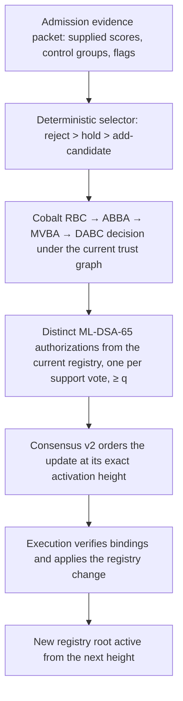
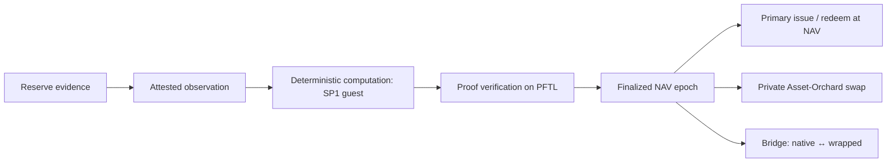

# Post Fiat: A Buy-Side Internet of Value

### NAVCoins, verified value, and private exchange of economic exposure on an authority-validated ledger with governed trust, ML-DSA authorization, and Asset-Orchard settlement

---

## Abstract

A ledger earns its existence by settling claims that people want to hold. The claims most in demand on public chains today are not payment messages; they are ownership and exposure: tokenized shares, debt, perpetual swaps, and rules-based portfolios. Post Fiat is built for that market. Its central instrument is the NAVCoin, a floating-value economic unit whose reserve valuation, valid supply, methodology, custody perimeter, primary-market operations, and settlement representation can each be inspected separately. Its central capability is the private exchange of those units: two assets change hands in one atomic state transition while the ledger publishes commitments, nullifiers, and per-asset pool accounting rather than positions.

The protocol treats value verification and settlement as one design problem. Reserve evidence, attested observation, deterministic computation, and proof verification are separate steps with separate failure modes; the ledger finalizes a NAV epoch only after the profile it registered has been satisfied, and issues or retires units only against that finalized state. Market price and verified NAV are different objects, and the paper explains why the primary market rather than a venue pool is the channel that connects them.

Post Fiat inherits the XRP category—known validators, deterministic finality, fixed native supply, fee burn, no native validator subsidy—and changes three things. Validator-trust evolution is protocol state ratified by Cobalt rather than a published file. Accounts and validators are authorized with ML-DSA from genesis. Settlement can be private through Asset-Orchard, in the Zcash Orchard lineage, with public turnstile accounting per asset. The paper develops the theory of these mechanisms under stated assumptions, argues the business case for entering through asset ownership and trading rather than by replacing correspondent-banking messaging, and closes with a claim-by-claim implementation table that names, for each claim, the kind of proof that supports it and the pinned source or record that carries it.

---

## Part 1 — Theory

### 1.1 The economic reason for the chain

An investor who holds an exposure wants four things at once: to know what backs it, to know how many claims exist against that backing, to acquire and dispose of it without telling the market, and to be able to prove all of this to a counterparty, an auditor, or a court without trusting the issuer's prose. Conventional fund administration delivers the first two on a reporting cadence and the fourth by attestation letter; it delivers the third by keeping everything off any shared ledger. Transparent blockchains deliver machine-checkable accounting and destroy the third property entirely.

Post Fiat's thesis is that these four properties are one design problem. If the ledger that verifies value is the same ledger that settles ownership, then the verification can gate issuance, the settlement can be private without becoming unaccountable, and the holder's claim can be stated as an object rather than a promise. The paper separates four things throughout, because confusing them is the source of most overclaims in this field:

- the **asset**: the economic exposure a unit represents (a share of a reserve portfolio, an index, an options program, a currency claim);
- the **methodology**: the rules that determine what the reserve holds and how it is valued;
- the **custody perimeter**: where the backing physically sits and who can move it;
- the **settlement representation**: the ledger object a holder actually owns and transfers, whether a transparent balance, a wrapped ERC-20, or a shielded note.

A NAVCoin is a settlement representation of an asset defined by a methodology and held inside a custody perimeter. The protocol can verify the arithmetic that links them. It cannot make a custodian honest, and it does not try to.

### 1.2 NAV as net marked assets per valid economic unit

Fix a NAVCoin instance and a valuation unit (for example, USD with six or eight decimals of scale). At epoch $t$ the issuer's registered proof profile admits a set of holdings $j$ with quantities $q_j$, marks $p_j$, and policy haircuts $h_j \in [0,1]$, together with disclosed liabilities $L_t$. Net marked assets are

$$
V_t \;=\; \sum_j h_j\, q_j\, p_j \;-\; L_t ,
$$

computed under the valuation policy whose hash the profile commits to. Let $S_t$ be the **valid global economic supply**: every unit that is a claim on this reserve, across every representation—native balances, shielded notes, wrapped units on an external chain, and in-flight bridge claims—counted once. Then, for $S_t > 0$,

$$
\mathrm{NAV}_t \;=\; \frac{V_t}{S_t}.
$$

When $S_t = 0$ there is no NAV; the opening supply of a new instance is created by an explicit opening rule against a finalized reserve proof, not by dividing by zero. The A666 lineage, for example, opened at $31{,}386.197455$ units against $\$31{,}386.19745591$ of verified net assets, an opening NAV of $\$1.000000$ with $\$0.00000091$ of rounding overcollateral; the entire opening supply was locked in an ownerless migration contract and became spendable only as legacy a651 was burned against it ([primary-market accounting][pma]).

Consensus never computes with floating point. Let $v_t$ denote net assets in valuation atoms, $s_t$ supply in token atoms, and $u=10^d$ token atoms per whole unit, where $d$ is the token's precision. The stored value $n_t$ is valuation atoms per whole unit. Reserve submission enforces

$$
v_t u \;\ge\; s_t n_t.
$$

The provider-neutral SP1 reserve profile also requires the exact conservative floor

$$
n_t \;=\; \left\lfloor \frac{v_t u}{s_t} \right\rfloor \qquad (s_t>0).
$$

These checks establish arithmetic consistency with the supplied denominator. Establishing valid NAV also requires the denominator to match the authorized economic supply defined above; understating $s_t$ can inflate even an exactly computed floor. Other profiles may register a floor factor or haircut policy, so the profile identifies the valuation rule alongside the supply perimeter ([reserve submission source][nav-exec]).

Freshness has a direct financial consequence. Suppose $S$ existing units have current net assets $S N^*$, while the active epoch permits subscriptions at an earlier value $\bar N$. Issuing $x$ units against $x\bar N$ of new principal gives, before fees and integer rounding,

$$
N_{\mathrm{after}} = \frac{S N^*+x\bar N}{S+x},
\qquad
N_{\mathrm{after}}-N^* = \frac{x(\bar N-N^*)}{S+x}.
$$

If the reserve has appreciated since the snapshot, $\bar N<N^*$ and the subscriber dilutes existing holders. Their aggregate loss is $Sx(N^*-\bar N)/(S+x)$, equal to the subscriber's gain. The effect grows with the stale-price error and the subscription's share of the enlarged fund. Epoch cadence and issuance caps therefore govern transfers of wealth as well as availability.

A profile registers a maximum snapshot age for finalization, a challenge window that must close before a packet becomes the active epoch, and a maximum epoch gap after which minting and redemption initiation fail closed ([reserve primitives][rp]). Those controls bound the age and use of a valuation; market movement within the permitted interval remains an economic risk.

Precision and rounding are directional. For $x$ token atoms at the finalized pre-inflow value $n_t$ and issue multiplier $m_I$,

$$
\text{base} = \left\lceil \frac{x n_t}{u} \right\rceil,\qquad
\text{due} = \lceil \text{base}\cdot m_I \rceil,\qquad
\text{fee} = \text{due}-\text{base},
$$

all in valuation atoms. Redemption uses the finalized pre-outflow value and redeem multiplier $m_R$:

$$
\text{base} = \left\lfloor \frac{x n_t}{u} \right\rfloor,\qquad
\text{out} = \lfloor \text{base}\cdot m_R \rfloor,\qquad
\text{fee} = \text{base}-\text{out}.
$$

The deployed A666 policy uses $m_I=10050/10000$ and $m_R=9995/10000$; the spread is custodied outside NAV assets. The fee itself leaves NAV unchanged, while conservative integer rounding leaves any residual with the reserve ([primary-market accounting][pma]). A policy that distributes fees to holders must specify that NAV accretion separately.

### 1.3 Primary and secondary markets, and why wrapped units are not backing

Primary operations change backing and supply together. In the integer notation above, a **primary subscription** moves counted settlement value into the reserve and creates units:

$$
v \leftarrow v+\text{base},\qquad s \leftarrow s+x.
$$

A **primary redemption** retires units and releases the corresponding principal:

$$
v \leftarrow v-\text{base},\qquad s \leftarrow s-x.
$$

Marks, income, expenses, and liabilities can change net assets independently of supply. A **secondary exchange**—an offer-book fill, a Uniswap swap, or a private Asset-Orchard swap—changes ownership while preserving both. Primary-market evidence therefore consists of the before/after change in verified net assets and valid supply across an issue or a redemption.

Representations complicate counting without changing it. Partition the authorized supply into disjoint economic claims, all measured in the same token atoms:

$$
s_{\mathrm{native}}+s_{\mathrm{shielded}}+s_{\mathrm{external}}+s_{\mathrm{in\text{-}flight}}
\;=\;s_{\mathrm{authorized}}.
$$

A claim belongs to exactly one category at each stage of its lifecycle. Export moves it from native ownership through an in-flight claim to an external representation; shielding moves it between native and shielded ownership. Source escrow and the destination token it backs represent one claim, counted at its current economic location. Migration likewise exchanges representations of the opening supply. These operations preserve net assets. Venue liquidity supplies market depth; escrow supplies representation backing; neither adds fresh reserve value merely because units move through it.

The same discipline governs the cash leg. A source-labelled receipt such as pfUSDC is a claim on USDC locked in a source-chain vault under a named route and finality rule. Let $W_{\mathrm{cash}}$ be the vault balance, $S_{\mathrm{cash}}$ outstanding receipt atoms, $D$ deposits awaiting credit, $B$ cumulative accepted receipt burns, and $R$ the corresponding cumulative vault releases. All use the same cash-atom scale. Then

$$
W_{\mathrm{cash}} \;=\; S_{\mathrm{cash}}+D+B-R,
$$

where $B-R$ is the amount awaiting release. A deposit raises $W_{\mathrm{cash}}$ and $D$; credit moves $D$ into $S_{\mathrm{cash}}$; a burn moves $S_{\mathrm{cash}}$ into $B$; release raises $R$ and reduces $W_{\mathrm{cash}}$. The identity thus holds during transit as well as at rest ([wrapped stablecoins on PFTL][wrapped]). A reserve packet counts only finalized, allocated receipts and identifies their source domain and finality proof. Each receipt carries the source and redemption risk of that route.

### 1.4 Market price and verified NAV are different objects

Let $P_t$ be a venue price and define the discount

$$
d_t \;=\; \frac{P_t - \mathrm{NAV}_t}{\mathrm{NAV}_t}.
$$

A valid reserve proof says nothing about $d_t$. What connects the two objects is a channel through which someone can profit from their divergence: a redemption right at $\mathrm{NAV}_t$ makes a persistent negative $d_t$ an opportunity for anyone who can redeem; a subscription right at $\mathrm{NAV}_t$ does the same for a positive $d_t$. The strength of the channel is determined by who has access to the primary market, what the round trip costs (the spread $m_I/m_R$, bridge fees, gas), how long it takes relative to the freshness of the epoch, and whether funded participants exist to use it. None of these is guaranteed by the proof, and Post Fiat makes no claim that $d_t \to 0$. What it claims is narrower and checkable: the primary channel is available at a verified value rather than at an issuer's quote, and its capacity is bounded by proven backing and policy caps rather than by an operator's inventory or a pool's depth ([A666 current state][a666]).

### 1.5 Four separate steps: evidence, attestation, computation, verification

"Proof of reserves" bundles four steps that fail differently. Post Fiat keeps them apart.

**Reserve evidence** is what a source exposes: an on-ledger balance, a public venue API, a broker response, a custodian statement. Its honesty is a property of the source.

**Attested observation** is a signed statement by an identified party that it observed particular evidence at a particular time. For public sources, the multi-fetch profile requires a configured minimum of registered attestors to submit passing verdicts and zero failing verdicts; a single failing verdict blocks finalization and forces supersession rather than debate. Observation roots are evidence commitments, compared under a registered tolerance band, because live accounts do not produce bit-identical snapshots: a drift study over a roughly $\$275$M venue vault found equity drift of $0.0005$ bp across ten samples and zero identical snapshots ([proof of reserves][por]). For authenticated brokerage sources, the YOLO adapter classifies both quantity and valuation as `Attested`, so the resulting value appears in the public `attested_value` bucket and never in `cryptographically_verified_value` ([YOLO reserve profile][yolo-profile]).

**Deterministic computation** turns admitted observations into net assets under a committed policy. In the SP1 reserve guest, the computation runs inside a zkVM over a bounded CBOR witness and commits a fixed-width public-values record: genesis hash, asset, profile, valuation policy hash, source manifest hash, valuation unit and scale, observation epoch and interval, gross assets, total liabilities, verified net assets, the three trust-class value buckets, source counts, and trust and disclosure roots—584 bytes in the v1 ABI ([public values][pv]; [reserve guest][guest]).

**Proof verification** is what consensus does: it verifies the Groth16 proof against the program key pinned in the registered profile, decodes the public values, and binds every field to the packet and to ledger context, rejecting on any mismatch of genesis, asset, profile, policy, manifest, valuation unit, epoch, freshness, span, source root, or attestor root, and rejecting controlled value where the profile forbids it ([SP1 verifier][sp1v]).

Verification establishes exactly this: the stated computation was performed over inputs bound to the disclosed sources and policy, and the outputs are the ones the packet claims. It does not establish that the sources told the truth, that no undisclosed liability exists elsewhere, that the custodian can deliver, or that a legal claim would be honored in insolvency. Those are separate economic inputs. The public proof-of-disclosed-leverage record on Arbitrum One makes the point concretely: six legs across six verification domains reconcile exactly to public buckets, each leg labelled cryptographic or attested, and the record states plainly that it does not prove total assets, total liabilities, or solvency ([proof of leverage][pol]).

### 1.6 Private per-asset conservation and atomic exchange

Asset-Orchard extends the Orchard note model to typed assets. A note commits to an asset tag, a value, an owner's diversified key, and randomness. A swap action spends two input notes and creates two output notes under a Halo2 proof whose public instance carries the anchor, two nullifiers, two randomized verification keys, two output commitments, encrypted-output hashes, the pricing binding, and the fee. For every asset $a$ appearing in the action,

$$
\sum_{\text{inputs of } a} v \;+\; \text{publicInflow}_a \;=\; \sum_{\text{outputs of } a} v \;+\; \text{publicOutflow}_a \;+\; \text{fee}_a ,
$$

with values range-checked and asset tags bound inside the note commitments so that one asset's surplus cannot pay for another's deficit ([asset-orchard circuit][circuit]). Each spent note publishes a nullifier derived from the nullifier key, the note's $\rho$, and its commitment; consensus rejects any nullifier it has already recorded. Nullifier uniqueness prevents reuse of an accepted spend; proof soundness is what makes the nullifier correspond to a valid note. They are different guarantees.

Atomicity is a property of the state transition, not of a coordinator. A multi-leg action either applies in full—both nullifiers recorded, both commitments appended—or is rejected with no value movement. In the controlled pNOK experiment of 1 August 2026, a buyer's 20 pfUSDC note and a facility's 210 pNOK note were consumed and two outputs created in one transition under a public fixed quote; there was no valid outcome in which only one leg settled ([pNOK acceptance report][pnok-report]; [pNOK article][pnok-blog]).

What the public pool balance controls is precise. For each asset, the pool tracks $P_a$ with

$$
P_a' \;=\; P_a + I_a - O_a - F_a \;\ge\; 0 ,
$$

so cumulative public withdrawals cannot exceed accounted inflows. This turnstile caps what can leave; it cannot identify a counterfeit note created by a soundness failure, and it cannot protect a legitimate depositor whose share of the pool a counterfeit note consumes before the cap binds. An underflow rejection does not automatically pause the pool or restore funds; incident response is a governed action ([privacy overview][priv]).

Confidential notes do not imply confidential everything. Ingress publicly reveals the source, asset, amount, and output commitment; egress reveals destination, asset, and amount; timing and action counts are observable; a public fixed quote reveals the ratio; and a coordinator that arranges a bilateral trade sees the orders it arranges. The pNOK run had cryptographically private note state and weak statistical cover, because every acquisition repeated the same 20-for-210 size against the only available quote ([pNOK article][pnok-blog]). Statistical privacy is a property of the crowd, and Section 1.7 quantifies it.

Authorization boundaries also differ. Shielded spends are authorized by randomized RedPallas signatures over a chain-bound action digest; the batch that carries them has no account-level ML-DSA outer envelope. ML-DSA authorizes transparent accounts and validator signatures over the block that certifies inclusion. Neither substitutes for the other.

### 1.7 Market design for private exchange

Settlement risk and information leakage are distinct costs, and the two mechanisms above address them separately: atomicity removes the asynchrony that creates principal risk; confidential notes conceal the ownership and values represented inside the shielded pool. Neither removes the information carried by aggregate flow. The FX proposal's market-design argument develops this ([private FX settlement][fx]); the derivations below restate it under explicit assumptions so the reader can see where each result stops.

**Impact is information.** Kyle's one-period model makes the connection explicit. Let the terminal payoff $F$ be Gaussian with mean $\mu$ and variance $\Sigma_0$, independent of uninformed flow $Z\sim\mathcal N(0,\sigma_u^2)$. An informed trader observes $F$ and submits $X=\beta(F-\mu)$. A competitive market maker sees only aggregate flow $Y=X+Z$ and quotes its conditional expected payoff:

$$
P(Y)=\mathbb E[F\mid Y]=\mu+\lambda Y,\qquad
\lambda=\frac{\beta\Sigma_0}{\beta^2\Sigma_0+\sigma_u^2}.
$$

Taking the linear pricing rule as given, the trader chooses $X$ to maximize expected profit,

$$
\mathbb E[X(F-P)\mid F]=X(F-\mu)-\lambda X^2.
$$

The first-order condition gives $X=(F-\mu)/(2\lambda)$, hence $\beta=1/(2\lambda)$. Substituting into the market maker's pricing rule yields

$$
\beta^2\Sigma_0=\sigma_u^2,\qquad
\beta=\frac{\sigma_u}{\sqrt{\Sigma_0}},\qquad
\lambda=\frac{\sqrt{\Sigma_0}}{2\sigma_u}.
$$

Size moves price because observable flow reveals information. Greater uncertainty about value raises impact; more uninformed flow lowers it. Crossing orders inside a batch reduces the quantity exposed to that inference. The equilibrium is a mechanism model under Gaussian flow and competitive pricing, rather than a calibration of Post Fiat's market.

**Netting residual.** Let $n$ signed orders $X_i$ be independent, mean zero, with finite variance $\sigma_X^2$ and $\mathbb{E}|X_i| = \mu_{\text{abs}}$. Gross flow is $G = \sum_i |X_i|$ with $\mathbb{E}[G] = n\,\mu_{\text{abs}}$. The net $N = \sum_i X_i$ has variance $n\sigma_X^2$, and by the central limit approximation $N \approx \mathcal N(0, n\sigma_X^2)$, whose mean absolute value is $\sqrt{2/\pi}\,\sigma_X\sqrt{n}$. Hence

$$
\frac{\mathbb{E}|N|}{\mathbb{E}[G]} \;\approx\; \sqrt{\frac{2}{\pi}}\;\frac{\sigma_X}{\mu_{\text{abs}}\sqrt{n}} .
$$

If order magnitudes have coefficient of variation 1, then $\sigma_X^2 = \mathbb{E}[X^2] = 2\mu_{\text{abs}}^2$ and the ratio becomes $2/\sqrt{\pi n}$: about $36\%$ at $n=10$, $11\%$ at $n=100$, $3.6\%$ at $n=1000$. This is a model of the residual under balanced, independent flow. Persistently one-sided flow with buy probability $p$ drives the ratio to a floor of $|2p-1|$ regardless of $n$; heavy tails, unequal sizes, and a thin batch all weaken it. Netting hides composition, never direction.

**What the residual reveals.** Under the same assumptions with Gaussian orders of equal variance $\sigma^2$, the published net $N = X_i + R$, where $R = \sum_{j\ne i} X_j$ is independent of $X_i$ with variance $(n-1)\sigma^2$. This is a Gaussian channel with signal $\sigma^2$ and noise $(n-1)\sigma^2$, so

$$
I(X_i;\,N) \;=\; \tfrac12 \ln\!\left(1 + \frac{1}{n-1}\right) \;=\; \tfrac12 \ln\!\frac{n}{n-1} \;\approx\; \frac{1}{2n}\ \text{nats}.
$$

At $n = 51$ this is about one hundredth of a nat per batch. The bound concerns what the batch residual leaks about one participant's signed order; it says nothing about public quotes, repeated participation across batches, timing, or an operator who sees the book. For independent Gaussian orders with unequal variances, the corresponding expression is $\tfrac12\ln(1+\sigma_i^2/\sigma_R^2)$, where $\sigma_i^2$ is the participant's order variance and $\sigma_R^2$ the rest of the batch's. A participant who dominates that variance receives little cover. This result motivates size limits; a particular realized order size alone supplies insufficient information to calculate mutual information.

**Batch length.** Model per-unit cost as staleness plus residual impact,

$$
\text{cost}(\tau) \;=\; a\sqrt{\tau} \;+\; \frac{b}{\sqrt{\Lambda\tau}},
$$

where $\Lambda$ is order arrival rate, $a$ prices the clearing price going stale, and $b$ prices externalized impact. Setting the derivative to zero, $a/(2\sqrt{\tau}) = b/(2\sqrt{\Lambda}\,\tau^{3/2})$, gives

$$
\tau^* \;=\; \frac{b}{a\sqrt{\Lambda}},
$$

at which both terms equal $\sqrt{ab/\sqrt{\Lambda}}$. Busier venues run shorter batches with more depth ($n^* = \Lambda\tau^*$ grows like $\sqrt{\Lambda}$); volatile days want shorter batches. The result is a property of this cost model. It does not describe a deployed matcher, and the FX post's illustrative seven-minute calibration is a model number rather than measured performance.

The boundary between demonstrated and proposed is sharp. Bilateral atomic settlement under a public, expiring, capacity-bounded fixed quote has run on the controlled devnet with real mainnet USDC on the dollar leg and sandbox WNOK on the krone leg ([pNOK article][pnok-blog]). The shielded frequent batch auction—uniform-price clearing over committed orders, internal crossing, and eventually an operator-blind matcher—is a design whose first proposed version still requires the matcher to see the book for one interval ([private FX settlement][fx]).

### 1.8 Fixed supply, fee burn, and validators without a subsidy

Native PFT has a fixed genesis supply and every native transaction fee is burned; there is no validator reward and no protocol treasury. Issued assets, including NAVCoins, follow their own issuance rules under their own reserve accounting. The economic question is therefore not how validators are paid but why an institution would operate a validator at all.

The correct comparison is between operating and using the same ledger passively. For operator $i$ over an accounting period, let $C_i$ be operating cost, $K_i$ opportunity and operational-risk cost, $\Delta p_i D_i$ the reduction in the operator's own expected settlement-disruption loss attributable to its participation, $O_i$ the operational-control and assurance benefit, and $J_i$ the incremental service margin or retention benefit. The participation surplus is

$$
U_i^{\text{op}} - U_i^{\text{passive}} \;=\; \Delta p_i D_i + O_i + J_i - C_i - K_i .
$$

Broad exposure to the ledger's success cancels from this difference unless the operator's participation changes the outcome. For a small operator in an already robust committee, $\Delta p_i$ is small, and the case rests on $O_i$ and $J_i$: an issuer that verifies its own NAV epochs, a custodian that wants its own copy of finality, an index sponsor whose product depends on the registry it helps govern. Positive passive exposure alone does not make validation rational; free riding is the default, and recruitment must anticipate exits early enough to complete a safe transition.

Deterrence is a separate question. With no stake to slash, a coalition $C$ over an influence window $W$ is deterred when attack gains $G_C$ fall short of business losses $L_C$, expected accountable consequences $p_C A_C$, and execution cost $E_C$:

$$
G_C(W) \;<\; L_C(W) + p_C(W)\,A_C(W) + E_C(W).
$$

Individual break-even does not imply coalition deterrence: shared funding, common vendors, or a correlated shock can align otherwise viable operators. This is why admission and trust transitions carry explicit control-group and dependency checks, and why the current controlled fleet—six Foundation-administered validators using separate keys—does not establish independent control ([Cobalt adversarial results][cobalt-adv]). Hypothetical sensitivities can illustrate the model; only observed business behavior can calibrate it.

### 1.9 The chain of authority: block committee, Cobalt, admission, activation

Two thresholds govern two decisions. For an active block committee of $n$ validators,

$$
f = \left\lfloor \frac{n-1}{3} \right\rfloor, \qquad q = \left\lfloor \frac{2n}{3} \right\rfloor + 1, \qquad 2q - n > f ,
$$

and the last inequality holds for every $n$: writing $n = 3k + r$ with $r \in \{0,1,2\}$ gives $2q - n \in \{k+2, k+1, k+2\}$ against $f \in \{k-1, k, k\}$. Any two $q$-sets therefore share a correct validator, which is what makes a prepare certificate at one view unique and a precommit certificate commit. Consensus v2 is an explicit prepare/precommit protocol: $q$ prepare votes form the durable lock, $q$ precommit votes for the same non-nil block form the only commit certificate, and a proposal at view $v+1$ must carry a verified timeout certificate for view $v$ together with its highest typed prepare-QC reference ([finality][fin]; [consensus v2 source][cv2]).

Cobalt governs a different object: agreement over declared validator trust. A trust view lists essential subsets; a subset $S$ with size $n_S$, fault budget $t_S$, and threshold $q_S$ must satisfy

$$
0 \le t_S, q_S \le n_S, \qquad t_S < 2q_S - n_S, \qquad 2t_S < q_S .
$$

The middle inequality gives two threshold sets a correct common member under the subset's own budget; the last keeps any threshold set from being majority-Byzantine. Two views are fully linked when they share a subset whose actual faults fit its budget and which retains enough correct members to reach threshold. The controlled devnet's trust graph is one six-validator subset with $t_S = 1$, $q_S = 5$: $1 < 10 - 6$ and $2 < 5$, so any valid five-of-six certificate ratifies and every four-of-six set fails ([Cobalt implementation][cobalt-impl]).

A registry transition must also pass a cross-registry check. Let $\beta$ bound the number of distinct Byzantine identities across the transition's entire influence window—a union across time, which need not equal any single committee's $f$. For every covered old row $S_o$ and new row $S_n$ with key-continuous shared members $C_{on}$,

$$
I_{on} \;=\; \max\!\big(0,\; |C_{on}| - (|S_o| - q_o) - (|S_n| - q_n)\big) \;>\; \beta .
$$

The seven-validator counterexample shows why local rows are insufficient: old $\{A,\dots,G\}$ and new $\{A,B,H,\dots,L\}$, each a single subset with $n_S = 7$, $q_S = 5$, $t_S = 2$, both pass locally, yet quorums $\{A,B,C,D,E\}$ and $\{A,B,H,I,J\}$ share only $\{A,B\}$, and with $\beta = 2$ the whole intersection can be Byzantine. The transition fails and the old registry stays active. The cover that feeds this matrix is extracted by the checker from the two rooted graphs, deduplicated by subset identity, bounded by a profile limit, and required to match the proposer's witness exactly; a proposer cannot omit an unfavorable row ([cover extractor][cover]). Completeness is bounded: it covers declared threshold rows in the rooted model, not arbitrary open-network quorum enumeration.

The end-to-end path, as exercised in the August 2026 campaign, is:

Each authority can do one thing and not another. The selector can only produce a candidate; it checks supplied fields and cannot discover concealed shared control. Cobalt ratifies a scoped validator-trust decision; it does not finalize blocks. Current-registry signers authorize the exact payload, parent lock, sequence, slot, and expiry, and old-rule signed authorizations are forbidden after activation ([handoff consumer][handoff]). The block committee orders the update; execution activates it; a rejected receipt leaves the registry unchanged. The Foundation retains authority over unrelated governance scopes. No authority can retroactively alter certificate thresholds, and loss of the normal quorum halts the chain rather than lowering $q$.

A concrete instance: at height 924 the legitimate rotation of validator 5 carried authorizations from validators 0–4, excluded the old validator-5 key, and committed; the treated-as-stolen old key's attempt had one signature and a decision certificate but rejected for lack of current-registry authorization ([Cobalt adversarial results][cobalt-adv]).

**The consensus obligation, stated exactly.** The inspected signer keeps separate durable high-water marks for prepare, precommit, and timeout, plus a lock and high QC. The precommit authorization checks the precommit mark, the lock, and that the prepare QC is newer and non-nil; it does not compare the proposed precommit view with a higher prepare or timeout view already signed ([consensus v2 source][cv2]). An analytical four-validator schedule shows what separate counters admit: prepare $X$ at view 0 with the certificate withheld; open view 1 and prepare $Y$ with an overlapping correct signer; deliver $X$'s certificate to obtain a first-ever lower-view precommit; then deliver $Y$'s newer certificate to replace the lock. A durable cross-phase current-view fence—no new signature in any phase at a view below the highest view entered—excludes that schedule. That fence is a proposed normative rule; the source review did not establish that the current runtime enforces it, no executed regression reproduces the schedule, and no network exploit is claimed. Progress under the fence has its own obligations: a correct validator whose lock is not among the $q$ timeout signers is not represented in the certificate's high QC, so a proposer following that certificate may repropose below some correct lock and be refused. Eventual progress requires that every correct validator's highest QC reach some subsequent timeout certificate, and a pacemaker that gives a correct proposer enough synchronous time. Assuming that every timeout certificate already contains the globally highest lock would be assuming the conclusion, and this paper does not do so. The implementation table carries this item as an open assurance obligation.

### 1.10 Bounded, replayable classification

Some inputs to public methodologies and evidence interpretation are qualitative: whether a company expresses a theme, whether two documents describe one controller. Post Fiat admits machine interpretation for exactly one step—converting committed evidence into a typed, cited answer under a closed schema—and confines everything else to deterministic code.

Let $E$ be the evidence packet, $P$ the prompt, $Q$ the closed schema, $M$ the pinned inference profile, and $V_Q$ the parser. The model step is $A = V_Q(M(P,E,Q))$; a deterministic selector $S$ then computes the result from policy, current state, $E$, and $A$ with no model calls. Replay means that an independent operator running the same profile on the same request bytes obtains the same response bytes. It proves reproduction under a pinned profile. It does not prove that the classification is semantically true, that the source data are correct, or that any resulting portfolio will perform.

The agentic-index methodology makes the division concrete. A frozen model scores each company in a 1,000-company universe against a public rubric; scores of 70 or more qualify; for a qualifying company $i$,

$$
\text{strength}_i = \frac{s_i - 70}{30}, \qquad
\text{scale}_i = \sqrt{\text{mcap}_i}\;\exp\!\big(0.03\, z_i\big),
$$

$$
w_i^{\text{pre}} = 0.2\,\frac{\text{strength}_i}{\sum_k \text{strength}_k} + 0.8\,\frac{\text{scale}_i}{\sum_k \text{scale}_k},
$$

with $z_i$ the population z-score of routed profitability, weights above 20% clipped and redistributed proportionally, and the result normalized to one trillion integer units by a largest-remainder rule with CIK tie-break. A universe with fewer than five qualifying names cannot satisfy the cap and is rejected rather than accommodated ([agentic indexing][agentic]). These are one published methodology's parameters. Authorization is separate: a replayed score changes no ledger state until a registered series and epoch policy accept it, and the proposed PFTL series and epoch registry is not implied to be live because the off-chain experiment succeeded.

Methodology inputs also obey a deletion-monotonicity rule: removing required evidence can only preserve or reduce authorization. Let $E'\subseteq E$ result from deleting inputs required by a registered methodology, and let $\mathcal A(E)$ be the ledger actions those inputs authorize. The rule is $\mathcal A(E')\subseteq\mathcal A(E)$. A missing liability, failed constituent record, or absent replay receipt must block the dependent action instead of silently improving a valuation, dropping a constituent, or renormalizing the survivors. The numerical result may move either way when evidence changes; the restriction governs permission to act. This is a requirement for methodology profiles and the proposed index registry, alongside the existing fail-closed reserve checks.

### 1.11 What ML-DSA from inception covers

Accounts and validators sign with ML-DSA-65 from genesis: 1,952-byte public keys, 3,309-byte signatures, deterministic verification, domain-separated contexts for transactions, block certificates, bridge witnesses, and admission receipts ([crypto provider][crypto]). Launching with post-quantum authorization avoids a future migration in which years of public keys already sit on a permanent ledger. A quorum of $q = 24$ from 35 validators carries 79,416 signature bytes plus identifiers; prepare and precommit sets double that before framing, and this byte cost is the dominant operational cost of the choice.

The scope stops there. Asset-Orchard authorization uses RedPallas, its proofs use Halo2 over the Pasta curves, note encryption uses classical key agreement, SP1 reserve and bridge proofs are wrapped in Groth16, and external-chain contracts use their own cryptography. None of these is post-quantum, and a break in note encryption would expose historical ciphertexts without moving value. The turnstile bounds what a soundness break can withdraw; it does not repair it. Naming this asymmetry is part of the design, and the claim is exactly "post-quantum account and validator authorization from inception," not "post-quantum system."

---

## Part 2 — Business Case

### 2.1 The buy-side entry point

XRP proposed an internet of value and pursued it through payments, positioning a public ledger against correspondent-banking messaging. That path required displacing incumbents whose rails are not standing still: SWIFT reports a tokenized-deposit ledger ready for initial use with 17 banks preparing live pilots, orchestrating payments while final settlement remains in existing systems ([SWIFT][swift]). Competing there means competing with the incumbent's own tokenization.

Crypto's demonstrated use cases point elsewhere. On-chain perpetual futures have become deployer-extensible infrastructure: HIP-3 lets builders define markets, oracles, leverage, and settlement controls over shared margining and order books ([HIP-3][hip3]). Tokenized shares now exist with regulated custody and institutional primary mint and redemption ([Coinbase Tokenize][coinbase]). Published model portfolios are implemented directly in users' wallets by an execution platform, separating methodology authorship from rebalancing ([Bitwise ATP][bitwise]). Every one of these is a buy-side activity: owning, valuing, hedging, and rebalancing exposures. None of them is a payment message.

Post Fiat's strategic claim is that the compelling path to an internet of value runs through this market. The reasoning is structural rather than a forecast. Ownership and trading create recurring demand for exactly the properties a settlement ledger can supply and a messaging network cannot: verified value bound to issuance, private transfer with public accounting, and atomic exchange of two exposures. FX settlement illustrates the scale of the unsolved settlement-risk problem even among sophisticated counterparties—about $\$5.2$ trillion of daily obligations settled payment-versus-payment against $\$1.4$ trillion still settled gross and bilaterally ([BIS settlement survey][bis-settle])—but the argument does not depend on converting those figures into an addressable market, and payments remain a use of the chain rather than its entry point.

### 2.2 NAVCoins: the product

A NAVCoin is a floating-value unit whose backing, supply, methodology, custody, primary operations, and settlement representation can be inspected separately. It is not a stablecoin; if the reserve loses value, the NAV falls. The protocol's promise is that current backing, liabilities, valuation policy, freshness, and supply discipline are explicit, hash-bound, machine-checked, and mechanically tied to issuance and redemption ([NAVCoins][navcoins]).

The first asset classes are those crypto has already proven demand for:

- **Tokenized equities.** A NAVCoin over a custodied share basket, valued at policy marks, with primary subscription and redemption at NAV. The holder's economic claim runs through the issuer's legal structure; the ledger verifies the accounting and gates issuance.
- **Debt and cash-like reserves.** Source-labelled cash receipts (pfUSDC) and, by extension, other receipt-backed instruments where the source, finality proof, and haircut are part of the packet.
- **Perpetual-swap exposure.** A rules-based short or long perpetual strategy on a venue whose state is publicly observable; the UltraShort proposal specifies an isolated, autonomously managed short-perpetual NAVCoin whose collateral, execution, funding, NAV, supply, and redemption would be verified end to end, and states plainly that no such token should be called trustless until the full path has passed adversarial tests with live funds ([UltraShort][ultrashort]).
- **Rules-based portfolios.** An index defined by a public methodology, constructed deterministically, and replayed independently before an epoch is published.

Across all four, the differentiating primitive is the same: the unit is created only against counted value at a verified NAV while the proof is fresh, and the unit can be exchanged privately without leaving the accounting perimeter.

### 2.3 Users and workflows

**Issuers and managers** register a proof profile and a NAV asset, submit reserve packets, and finalize epochs. Their incentive is a unit whose backing is checkable without publishing positions: a Tier-2 aggregate disclosure with an attested trust class is a legitimate profile, and the market prices its opacity.

**Holders** hold transparent balances, shielded notes, or wrapped representations. They acquire units through primary subscription at NAV or through secondary exchange, and they dispose of them the same way. Managers need privacy for the obvious reason: a position being built or unwound is information with a price, and a transparent ledger hands it to the market. Holders need it for the less obvious one: their own balances, counterparties, and timing are the raw material of front-running and of inference about strategy.

**Authorized participants and desks** use the primary market. Their edge is access and speed relative to epoch freshness; the protocol gives them a verified value to trade against rather than a quote to negotiate.

**Observers and attestors** perform paid extra-consensus service work: fetching public sources, attesting under registered tolerance bands, and, where a profile requires it, operating measured collectors. Registration is open and not validator-gated, and payment attaches to service delivery rather than to validation ([proof of reserves][por]).

**Index sponsors and methodology authors** publish rubrics, universes, and construction rules, and submit or verify replay receipts.

**Validators** order blocks, verify proofs, and, through Cobalt, govern their own membership. Their return is incremental (Section 1.8), which is why the natural candidates are the issuers, custodians, and sponsors whose products depend on the ledger.

### 2.4 An end-to-end example

The example follows one investor, Dana, through a NAVCoin whose asset is a rules-based thematic equity portfolio. Numbers are illustrative; each step names the primitive it uses and whether that primitive has been demonstrated or is proposed.

**The asset and its methodology.** A sponsor publishes an index series: universe (the 1,000 largest U.S. reporting companies by trailing revenue), a public rubric for a theme, the 70-point threshold, the 20/80 blend of thematic strength and fundamental scale, the 20% cap, and the largest-remainder normalization. An epoch is generated on one pinned H200 profile and replayed on a second; 4,000 score responses across four themes matched byte for byte in the August demonstration, and one theme was rejected because only three names cleared the threshold ([agentic indexing][agentic]). This is the demonstrated part of the methodology layer. The series registry and epoch object on PFTL are proposed.

**The custody perimeter.** The sponsor's reserve holds the constituent shares at a broker under a regulated custody arrangement, plus a cash buffer. Custody is a legal fact outside the ledger; the ledger records which perimeter the profile discloses.

**The reserve proof.** At each epoch the collector observes the brokerage account, the deterministic reserve program computes gross assets, liabilities, and net assets under the registered valuation policy, and a proof is verified on PFTL. Because the quantity source is a broker response, its value lands in `attested_value`, not the cryptographic bucket; the public values say so ([public values][pv]). Suppose the finalized epoch shows $V = \$10{,}000{,}000$ and $S = 10{,}000{,}000$ units, so $\mathrm{NAV} = \$1.000000$.

**Primary acquisition.** Dana deposits 1,005,000 USDC into the Ethereum-mainnet vault, receives 1,005,000 pfUSDC on PFTL after the ingress proof is verified—the demonstrated mainnet run completed deposit inclusion through withdrawal inclusion in 20 minutes 12 seconds ([A666 current state][a666])—and submits a primary subscription for 1,000,000 units at the finalized pre-inflow NAV with $m_I = 1.005$. Base value $\$1{,}000{,}000$ enters the reserve, $\$5{,}000$ enters non-NAV fee custody, supply becomes 11,000,000, and NAV remains $\$1.000000$. No venue pool was touched; the same accounting ran on mainnet for 100.5 USDC → 100 A666 → 100 wA666, with canonical and wrapped supply each rising by exactly 100,000,000 atoms ([A666 current state][a666]). A private variant—private primary issue and redemption—has committed on the six-validator fleet, with the latest qualification passing the redemption latency gate and missing the issue gate ([A666 current state][a666]).

**Product lineage.** The a651 instance and the a652 cross-NAVCoin swap are historical: a651's Ethereum pool had zero liquidity at its last inspection, its launch controller model is not the canonical primary market, and a652 exists as controlled devnet evidence only ([assets and venues][venues]). The A666 v2 lineage with Ethereum-mainnet pfUSDC carries the current product evidence. The Arbitrum pfUSDC route is deprecated for new ingress because its trustless confirmation path took roughly 6.4 days; its earlier round-trip records remain conservation history.

**Private exchange.** Dana shields the units into Asset-Orchard notes. Later she agrees with a counterparty to exchange 200,000 units for a second NAVCoin representing a short-duration debt reserve. Both notes are consumed and two outputs created in one state transition; per-asset conservation and both nullifiers are checked; the ledger records commitments and nullifiers, not amounts or owners. The primitive is the one exercised in the pNOK swap (20 pfUSDC for 210 pNOK, 19 controlled private jobs, exact replays rejected without effect, six validators converged) ([pNOK acceptance report][pnok-report]). Neither $V$ nor $S$ of either NAVCoin changes. Statistical cover depends on how many other trades share the pool and the batch; a single trade against a single quote has little.

**Verification.** A counterparty performing diligence checks four objects that answer four different questions: the index epoch's replay receipts (was the portfolio constructed as the methodology says?), the reserve proof's public values (do disclosed holdings and liabilities net to the stated value under the stated policy, and which trust class does each source carry?), the primary-market receipts (did supply and reserve move together?), and the swap's nullifiers and commitments (did the transfer settle atomically?). A target proof is not a holdings proof; a holdings proof is not a reserve proof; a reserve proof is not a trade receipt ([single-stock option indices][options]).

**The holder's claim.** Dana's units are a pro-rata claim on the reserve at the finalized NAV, redeemable through the primary market at $m_R = 0.9995$ while the epoch is fresh and the asset is not halted. The claim's economic value depends on the broker's honesty, the custodian's ability to deliver, and the legal structure through which the shares are held; the ledger verifies that issuance never outran counted value and that redemption releases the principal it counted. If the sponsor stops proving, minting and redemption initiation fail closed, which protects the accounting and can trap holders during distress—an explicit reason the design calls for a separately specified emergency exit before production use ([Post Fiat, Canton, and XRP][canton]).

### 2.5 Indexing as the methodology layer

Thematic indices have always contained a qualitative step—deciding which companies belong—performed privately by a committee. Post Fiat makes that step a public, replayable artifact. In the top-1,000 test, 2,552 of 2,552 tested artifacts replayed byte for byte on a second H200, covering 85.38% of a 2,989-artifact corpus at the stated cutoff; 11 outputs were initially unresolved, nine of which later produced valid byte-exact pairs under a stricter profile while two hit the same generation limit on both attempts; a separate fixed-24 profile produced one mismatch in 137 comparable outputs ([deterministic financial indices][detindex]; [replay summary][replay-summary]). The determinism runbook records the exact profile: pinned model revision, runtime image digest, single H200, fixed 32-request batches, radix cache and CUDA graphs disabled, greedy decode with a fixed seed ([runbook][runbook]). Replay is a serving discipline for one model, one runtime, and one hardware class; cross-vendor portability is out of scope.

Two things make this commercially useful. Reusable evidence packets lower the cost of maintaining a thematic methodology from a research department to a versioned scoring program, which makes long-tail themes feasible. And a methodology that can be forked—same universe, one changed rubric clause—turns disagreement into a new lineage rather than an argument. Replay fidelity is not analytical validity: the historical large-cap backtest of the fundamental discipline (10.92% CAGR against 8.98% for SPY over 1998–2026, correlation 0.949, insignificant five-factor alpha) validates reasonableness of the accounting route, not the live thematic blend and not alpha ([agentic indexing][agentic]).

### 2.6 From instruments to portfolios

The same primitives extend from a single instrument to a portfolio because the objects compose rather than multiply.

A **single-stock options tracker** is a rulebook that selects and rolls call contracts on one company. The September demonstration computed targets for Micron and Nvidia from Nitro-attested Schwab observations, verified two real SP1 proofs, and accepted both through isolated four-validator receipt tests; the public interface is 408 bytes binding program, methodology, parameters, collection, prior state, and target ([options demo record][options-record]). Starting cash was hypothetical, no options were bought, and no funded tracker launched. A target proof establishes verifiable rule execution over attested inputs; a funded product would add execution, reconciliation, custody, and a reserve profile around it.

A **short-perpetual NAVCoin** would package one isolated strategy as a fungible unit; leverage must belong to the series, not to individual holders, so a "leverage slider" selects among series rather than mixing unlike claims. The 90-day funding study across 47 eligible HIP-3 markets found shorts paid in 85.11% of markets with a median $+2.50\%$ of constant $1\times$ notional; volume-weighted across 30 matched U.S.-listed markets, $+2.56\%$ against a $+0.83\%$ stock-loan rebate proxy ([UltraShort][ultrashort]). This is historical funding cash flow under a fixed rule. It is not a forecast, not a token return, and no funding income is guaranteed.

A **private FX pair** is two reserve-backed currency assets and one atomic swap; the batch-auction layer over it is proposed (Section 1.7).

A **rules-based portfolio** is a NAVCoin whose reserve is itself constructed by a replayable methodology—the example in Section 2.4. Nothing new is required of the ledger: the reserve packet, the epoch, the primary market, and the swap are the same objects. What changes is that the methodology's replay receipt becomes one more thing the reserve profile binds. A managed account, a model-portfolio feed, and a tokenized fund can all consume the same target and reserve objects with different custody and disclosure arrangements ([options][options]).

### 2.7 Economics of the network

Value flows are deliberately simple. Native fees burn. Issue and redeem spreads accrue to non-NAV fee custody under each series' published policy. Observers, collectors, replay operators, and challengers are paid for measurable service work. Methodology sponsors earn per the terms they publish; an ATP-style delivery separates that fee from execution fees ([Bitwise ATP][bitwise]). The protocol pays no native validator reward; service revenue and separately disclosed funding support its operators.

For a validator, the return is the incremental surplus of Section 1.8. The operators for whom $O_i$ and $J_i$ are large are the ones whose products run on the ledger: an issuer verifying its own epochs, a custodian holding its own finality, a sponsor governing the registry that admits the next sponsor. The network's growth model is therefore that products recruit validators, not that rewards do. The obligation this creates is stated in the trust-governance design: independent control must be established by evidence and independent custody, and the current Foundation-administered fleet has not established it ([Cobalt E6 decision][e6]).

### 2.8 Differentiated capabilities

Compared with issuing a tokenized fund on a transparent contract chain, a NAVCoin on Post Fiat binds issuance to a finalized, profile-verified NAV epoch in the ledger's own validity rules; the Ethereum contracts in the A666 route enforce compact PFTL outputs and do not reinterpret the NAV calculation ([assets and venues][venues]). Compared with an OTC desk, the private swap settles both legs atomically with no principal risk between them and no ledger record of amounts or owners. Compared with a published validator list, Cobalt makes a trust change a checkable object rather than a file. Compared with a launch on classical signatures, ML-DSA from genesis removes a migration.

These are comparisons of mechanism, not claims of priority or of universal superiority. Other systems provide privacy, atomic settlement, or governed membership in their own ways; Coinbase's B20 tokens provide primary redemption and regulated custody without any of Post Fiat's machinery ([Coinbase Tokenize][coinbase]). Post Fiat's differentiation is that verification, private settlement, and governed trust are one ledger's validity rules, so a holder's diligence is a sequence of object checks rather than a sequence of counterparty inquiries.

### 2.9 Risks that define the claim

A NAVCoin's risks are the definition of the financial claim, not boilerplate around it. **Source risk**: a broker or venue can misreport; the proof verifies the disclosed perimeter, and the trust-class buckets say which values rest on attestation. **Issuer risk**: an issuer can stop proving, in which case the asset fails closed; an issuer can also hold undisclosed liabilities, which no proof detects. **Execution risk**: a rules-based strategy can be liquidated, gapped, or mis-marked; funding can turn negative; a primary order can fail its freshness check and refund rather than fill. **Legal risk**: an on-ledger redemption claim is not a court judgment; the legal wrapper, jurisdiction, and custody agreement determine what a holder recovers in insolvency. **Cryptographic risk**: the shielded stack is classical; a soundness failure can consume legitimate backing within the turnstile's aggregate withdrawal ceiling (§1.6). **Governance risk**: fail-closed rejection preserves a captured or deadlocked registry as readily as a good one. Each of these is priced by the market when it is visible, which is the reason the protocol makes them visible.

---

## Part 3 — Implementation Details

The table below states each claim at the scope its evidence supports. "Proof" identifies the kind of evidence: a derivation under assumptions, an inspectable source with retained tests, a cryptographic verifier, or a project-authored execution or replay report under named conditions. Source references are pinned to `postfiatl1v2` at `aa8b365f` and `postfiatorg.github.io` at `f930703e`. None of the rows certifies production readiness; the A666 service is limited availability, the Cobalt fleet is Foundation-administered, and the batch matcher and index registry are proposed.

| Claim | Proof | Codebase reference |
| --- | --- | --- |
| Floating-NAV assets have explicit proof profiles, reserve epochs, supply bounds, and freshness rules enforced at submission, finalization, mint, and redeem. | Inspectable source and retained execution tests. The lifecycle test uses a placeholder profile; it establishes state-machine behavior, not reserve truth. | [market_nav_asset_types.rs](https://github.com/postfiatorg/postfiatl1v2/blob/aa8b365f5cf97be05a5222b55de63150cab275c6/crates/types/src/market_nav_asset_types.rs); [nft_escrow_asset_execution.rs](https://github.com/postfiatorg/postfiatl1v2/blob/aa8b365f5cf97be05a5222b55de63150cab275c6/crates/execution/src/nft_escrow_asset_execution.rs) |
| Consensus rejects a reserve packet unless `verified_net_assets × u ≥ supply × nav_per_unit`; the provider-neutral profile additionally requires the exact conservative floor. | Inspectable validity rule in the `NavReserveSubmit` arm; derivation in §1.2. | [nft_escrow_asset_execution.rs (reserve submit)](https://github.com/postfiatorg/postfiatl1v2/blob/aa8b365f5cf97be05a5222b55de63150cab275c6/crates/execution/src/nft_escrow_asset_execution.rs) |
| Primary subscription increases reserve principal and valid supply together; primary redemption contracts both; issue/redeem spreads are custodied outside NAV assets. | Canonical accounting document plus the private primary issue and redeem transitions, which credit or debit `settlement_reserve_atoms`, `authorized_valid_supply_atoms`, and `non_nav_spread_atoms` in one transition. | [primary-market-accounting.md](https://github.com/postfiatorg/postfiatl1v2/blob/aa8b365f5cf97be05a5222b55de63150cab275c6/docs/navcoins/primary-market-accounting.md); [nav_vault_asset_execution.rs](https://github.com/postfiatorg/postfiatl1v2/blob/aa8b365f5cf97be05a5222b55de63150cab275c6/crates/execution/src/nav_vault_asset_execution.rs) |
| A secondary exchange changes ownership and neither reserves nor economic supply. | Accounting model; retained execution tests cover mint, offer-book trade, and redeem separately. Swap validity is a separate obligation from primary accounting. | [market_nav_execution_tests.rs](https://github.com/postfiatorg/postfiatl1v2/blob/aa8b365f5cf97be05a5222b55de63150cab275c6/crates/execution/src/market_nav_execution_tests.rs); [primary-market-accounting.md](https://github.com/postfiatorg/postfiatl1v2/blob/aa8b365f5cf97be05a5222b55de63150cab275c6/docs/navcoins/primary-market-accounting.md) |
| SP1 reserve verification binds disclosed inputs, policy, freshness, and outputs, and separates cryptographic, attested, and controlled value buckets. | Cryptographic verifier (Groth16 against a profile-pinned program key) plus a fixed 584-byte public-values ABI. Establishes the stated computation and bindings, not undisclosed liabilities or custody solvency. | [nav_sp1_verifier.rs](https://github.com/postfiatorg/postfiatl1v2/blob/aa8b365f5cf97be05a5222b55de63150cab275c6/crates/execution/src/nav_sp1_verifier.rs); [nav_reserve_public_values.rs](https://github.com/postfiatorg/postfiatl1v2/blob/aa8b365f5cf97be05a5222b55de63150cab275c6/crates/types/src/nav_reserve_public_values.rs); [reserve-proof-guest main.rs](https://github.com/postfiatorg/postfiatl1v2/blob/aa8b365f5cf97be05a5222b55de63150cab275c6/tools/nav-reserve-proof/programs/reserve-proof-guest/src/main.rs) |
| Brokerage-sourced reserve observations are classified as attested, never cryptographic. | Inspectable adapter design and golden commitment vectors; no asset registration, capital, or trading authorization is inferred. | [yolo-options-reserve-profile.md](https://github.com/postfiatorg/postfiatl1v2/blob/aa8b365f5cf97be05a5222b55de63150cab275c6/docs/navcoins/yolo-options-reserve-profile.md) |
| Multi-fetch reserve observations are reproducible under a declared source and policy, compared under tolerance rather than byte equality. | Inspectable observation and valuation code; project drift study over a live venue vault (0.0005 bp span, zero identical snapshots). | [hyperliquid.py](https://github.com/postfiatorg/postfiatl1v2/blob/aa8b365f5cf97be05a5222b55de63150cab275c6/python/postfiat_rpc/hyperliquid.py); [basis_policy.py](https://github.com/postfiatorg/postfiatl1v2/blob/aa8b365f5cf97be05a5222b55de63150cab275c6/python/postfiat_rpc/basis_policy.py); [navcoin-proof-of-reserves.md](https://github.com/postfiatorg/postfiatl1v2/blob/aa8b365f5cf97be05a5222b55de63150cab275c6/docs/business/navcoin-proof-of-reserves.md) |
| Source-labelled cash receipts have explicit route, finality, allocation, and egress boundaries, with SP1 ingress and egress programs. | Inspectable execution code and zkVM guest programs; the Ethereum-mainnet route is the current pfUSDC source and the Arbitrum route is deprecated. | [pfusdc-ingress main.rs](https://github.com/postfiatorg/postfiatl1v2/blob/aa8b365f5cf97be05a5222b55de63150cab275c6/programs/pfusdc-ingress/src/main.rs); [pfusdc-egress main.rs](https://github.com/postfiatorg/postfiatl1v2/blob/aa8b365f5cf97be05a5222b55de63150cab275c6/programs/pfusdc-egress/src/main.rs); [nav_vault_asset_execution.rs](https://github.com/postfiatorg/postfiatl1v2/blob/aa8b365f5cf97be05a5222b55de63150cab275c6/crates/execution/src/nav_vault_asset_execution.rs) |
| A wrapped NAVCoin is a representation of the same economic supply; the destination controller mints only against an accepted PFTL receipt and enforces route and packet caps. | Inspectable Solidity source; venue liquidity is not backing. Mainnet deployment and the 100.5 USDC → 100 A666 → 100 wA666 run are a project-authored dated record. | [PFTLUniswapPrimaryMarketV2.sol](https://github.com/postfiatorg/postfiatl1v2/blob/aa8b365f5cf97be05a5222b55de63150cab275c6/crates/ethereum-contracts/src/PFTLUniswapPrimaryMarketV2.sol); [A666 current state](https://github.com/postfiatorg/postfiatl1v2/blob/aa8b365f5cf97be05a5222b55de63150cab275c6/docs/status/A666-PFUSDC-PRIVATE-SWAP-CURRENT-STATE-20260730.md) |
| Asset-Orchard proves per-asset value conservation and spend authorization for two-leg swaps; nullifiers, anchors, statement, and authorization are separate checks. | Inspectable circuit and retained tests under a local Halo2 profile. Security requires both Halo2 soundness and correctness of the custom circuit's constraints. | [asset_orchard.rs](https://github.com/postfiatorg/postfiatl1v2/blob/aa8b365f5cf97be05a5222b55de63150cab275c6/crates/privacy_orchard/src/asset_orchard.rs); [asset_orchard_circuit.rs](https://github.com/postfiatorg/postfiatl1v2/blob/aa8b365f5cf97be05a5222b55de63150cab275c6/crates/privacy_orchard/src/asset_orchard_circuit.rs); [asset_orchard_circuit_tests.rs](https://github.com/postfiatorg/postfiatl1v2/blob/aa8b365f5cf97be05a5222b55de63150cab275c6/crates/privacy_orchard/src/asset_orchard_circuit_tests.rs) |
| A controlled private currency swap settled both legs atomically under a public fixed quote: 20 pfUSDC for 210 pNOK, ten browser acquisitions and nine inverse swaps, 18 of 18 checks passing. | Project-authored acceptance report. Sandbox WNOK, operator-controlled source checkpoint, pre-arranged rate; no price discovery, redemption, or independent audit. | [pnok acceptance report.json](https://github.com/postfiatorg/postfiatl1v2/blob/aa8b365f5cf97be05a5222b55de63150cab275c6/deployments/pnok-private-fix-20260801/acceptance/public/report.json); [shielded_batch_actions.rs](https://github.com/postfiatorg/postfiatl1v2/blob/aa8b365f5cf97be05a5222b55de63150cab275c6/crates/node/src/shielded_batch_actions.rs) |
| Duplicate submission is idempotent and the private swap path recovered from validator, prover, and wallet-proxy restarts. | Project-authored recovery-fault report (`retry_count: 2`, supply unchanged, replay rejected without effect). Controlled demo only. | [pnok recovery-faults report.json](https://github.com/postfiatorg/postfiatl1v2/blob/aa8b365f5cf97be05a5222b55de63150cab275c6/deployments/pnok-private-fix-20260801/recovery-faults/report.json) |
| Private primary issue and redemption are explicit state transitions bound to the policy-pinned finalized NAV packet and its freshness limit. | Inspectable transition functions (`apply_asset_orchard_private_primary_issue/redeem_route_transition`); A666 record of committed transitions and a qualification that passed the redeem latency gate and missed the issue gate. | [nav_vault_asset_execution.rs](https://github.com/postfiatorg/postfiatl1v2/blob/aa8b365f5cf97be05a5222b55de63150cab275c6/crates/execution/src/nav_vault_asset_execution.rs); [A666 current state](https://github.com/postfiatorg/postfiatl1v2/blob/aa8b365f5cf97be05a5222b55de63150cab275c6/docs/status/A666-PFUSDC-PRIVATE-SWAP-CURRENT-STATE-20260730.md) |
| Cobalt ratifies scoped validator-trust updates; a live update requires a decision certificate plus distinct current-registry ML-DSA authorizations bound to payload, parent lock, sequence, slot, and expiry; block finality is separate. | Inspectable consumer source and retained handoff tests; RBC/ABBA/MVBA/DABC message construction and signing. | [cobalt_handoff.rs](https://github.com/postfiatorg/postfiatl1v2/blob/aa8b365f5cf97be05a5222b55de63150cab275c6/crates/node/src/cobalt_handoff.rs); [rbc_abba_mvba.rs](https://github.com/postfiatorg/postfiatl1v2/blob/aa8b365f5cf97be05a5222b55de63150cab275c6/crates/consensus_cobalt/src/rbc_abba_mvba.rs); [dabc_registry.rs](https://github.com/postfiatorg/postfiatl1v2/blob/aa8b365f5cf97be05a5222b55de63150cab275c6/crates/consensus_cobalt/src/dabc_registry.rs) |
| Trust graphs are rooted objects and the safety cover is extracted from the graphs, deduplicated by subset id, bounded by profile, and required to match the witness. | Inspectable extractor and graph source; bounded input model and supplied fault budget are essential assumptions (§1.9). | [cobalt_cover_extractor.rs](https://github.com/postfiatorg/postfiatl1v2/blob/aa8b365f5cf97be05a5222b55de63150cab275c6/crates/consensus_cobalt/src/cobalt_cover_extractor.rs); [trust_graph_governance.rs](https://github.com/postfiatorg/postfiatl1v2/blob/aa8b365f5cf97be05a5222b55de63150cab275c6/crates/consensus_cobalt/src/trust_graph_governance.rs) |
| Old/new transition obligations—local rows, budget binding, cover bound, key-continuity intersection, same-registry and old/new conflict—are executable checks with valid and invalid fixtures. | Project fixture report (May 2026): one-validator rotation accepted; seven invalid fixtures rejected for named reasons. Controlled checker, not a production proof. | [cobalt-transition-safety-proof.md](https://github.com/postfiatorg/postfiatl1v2/blob/aa8b365f5cf97be05a5222b55de63150cab275c6/docs/governance/cobalt-transition-safety-proof.md); [June proof report](https://github.com/postfiatorg/postfiatorg.github.io/blob/f930703e32433a9eb9d74708c2423ebde17832b4/static/benchmarks/cobalt-devnet-evidence-20260609/postfiatl1v2/reports/cobalt-transition-safety-proof/20260529T081141Z/cobalt-transition-safety-proof-report.json) |
| Admission selection checks supplied evidence, holds on missing or conflicting fields, and rejects established shared control with rejection outranking hold. | Inspectable selector and retained tests (clean candidate, shared-control rejection, missing domain, conflicting evidence, unknown model citation). Independent exposure, control, and evidence truth are upstream obligations. | [validator_admission_policy.rs](https://github.com/postfiatorg/postfiatl1v2/blob/aa8b365f5cf97be05a5222b55de63150cab275c6/crates/consensus_cobalt/src/validator_admission_policy.rs) |
| Production and two independent oracles agreed on 10,240 generated trust-graph cases; 108 Byzantine cases and 442,368 searched schedules produced zero conflicting roots, false accepts, or false halts. | Project-authored experiment summaries (E1, E2), bounded to the generated corpus and the six-validator graph. | [e1 summary.json](https://github.com/postfiatorg/postfiatl1v2/blob/aa8b365f5cf97be05a5222b55de63150cab275c6/benchmarks/cobalt-adversarial-verification/e1/clean-rerun/summary.json); [e2 summary.json](https://github.com/postfiatorg/postfiatl1v2/blob/aa8b365f5cf97be05a5222b55de63150cab275c6/benchmarks/cobalt-adversarial-verification/e2/clean-rerun/summary.json) |
| Tampered durable history and forged catch-up were rejected (24 and 18 cases) and six interrupted recoveries restored byte-identical accepted history; live rollback/return committed at 922/923 and a legitimate key rotation at 924 with a stolen-key attempt rejected. | Project-authored experiment summaries (E3, E5). Six Foundation-administered validators; the independent-operator gate remains a separate open milestone (E6). | [e3 summary.json](https://github.com/postfiatorg/postfiatl1v2/blob/aa8b365f5cf97be05a5222b55de63150cab275c6/benchmarks/cobalt-adversarial-verification/e3/clean-rerun/summary.json); [e5 verifier.json](https://github.com/postfiatorg/postfiatl1v2/blob/aa8b365f5cf97be05a5222b55de63150cab275c6/benchmarks/cobalt-adversarial-verification/e5/verifier.json); [e6 decision.json](https://github.com/postfiatorg/postfiatl1v2/blob/aa8b365f5cf97be05a5222b55de63150cab275c6/benchmarks/cobalt-adversarial-verification/e6/decision.json) |
| Consensus v2 persists prepare, precommit, and timeout high-water marks, a lock, and a high QC before signing, and commits only on a non-nil precommit QC. | Inspectable signer state and durable store. **Open obligation (G12):** the precommit authorization does not enforce a cross-phase current-view fence; the delayed-certificate schedule of §1.9 is an analytical trace, not an executed regression or a demonstrated exploit, and no progress theorem is claimed. | [consensus_v2.rs](https://github.com/postfiatorg/postfiatl1v2/blob/aa8b365f5cf97be05a5222b55de63150cab275c6/crates/ordering_fast/src/consensus_v2.rs); [consensus_v2_store.rs](https://github.com/postfiatorg/postfiatl1v2/blob/aa8b365f5cf97be05a5222b55de63150cab275c6/crates/node/src/consensus_v2_store.rs) |
| Accounts and validators use ML-DSA-65 with domain-separated signing contexts; the provider is differentially tested against a reference verifier. | Inspectable provider source and retained differential tests. Shielded authorization and note encryption remain classical. | [crypto_provider lib.rs](https://github.com/postfiatorg/postfiatl1v2/blob/aa8b365f5cf97be05a5222b55de63150cab275c6/crates/crypto_provider/src/lib.rs) |
| Option-target calculation and verification bind methodology, parameters, attested collection, and prior state; the public ABI is 408 bytes; a target receipt grants no trading, reserve, or issuance authority. | Deterministic calculator, SP1 guest, and registered receipt verifier with retained tests for malformed proofs and duplicate or conflicting registrations. | [yolo_target.rs](https://github.com/postfiatorg/postfiatl1v2/blob/aa8b365f5cf97be05a5222b55de63150cab275c6/tools/nav-reserve-proof/crates/reserve-proof-types/src/yolo_target.rs); [yolo-target-guest main.rs](https://github.com/postfiatorg/postfiatl1v2/blob/aa8b365f5cf97be05a5222b55de63150cab275c6/tools/nav-reserve-proof/programs/yolo-target-guest/src/main.rs); [yolo_target_verifier.rs](https://github.com/postfiatorg/postfiatl1v2/blob/aa8b365f5cf97be05a5222b55de63150cab275c6/crates/execution/src/yolo_target_verifier.rs); [yolo_target_public_values.rs](https://github.com/postfiatorg/postfiatl1v2/blob/aa8b365f5cf97be05a5222b55de63150cab275c6/crates/types/src/yolo_target_public_values.rs); [yolo_target_execution_tests.rs](https://github.com/postfiatorg/postfiatl1v2/blob/aa8b365f5cf97be05a5222b55de63150cab275c6/crates/execution/src/yolo_target_execution_tests.rs) |
| Two option-target proofs (MU, NVDA) were verified and accepted through isolated four-validator receipt tests. | Project-authored dated record: hypothetical $100,000 starting cash per tracker, one retained observation per stock, no brokerage orders, no external network submission. | [options demo-record.json](https://github.com/postfiatorg/postfiatorg.github.io/blob/f930703e32433a9eb9d74708c2423ebde17832b4/static/research/options-tee-indices/demo-record.json) |
| 2,552 of 2,552 tested index score artifacts replayed byte for byte on a second H200, covering 85.38% of a 2,989-artifact corpus; a different batch profile produced one mismatch. | Project-authored replay summary under pinned profiles; reproduction, not semantic truth or investment performance. | [replay summary](https://github.com/postfiatorg/postfiatorg.github.io/blob/f930703e32433a9eb9d74708c2423ebde17832b4/static/benchmarks/qwen38-top1000-byte-replay-20260817-summary.json); [determinism runbook](https://github.com/postfiatorg/postfiatorg.github.io/blob/f930703e32433a9eb9d74708c2423ebde17832b4/content/research/qwen-3-8-determinism-runbook.md) |
| Model classification feeds deterministic portfolio construction (threshold 70, 20/80 blend, 20% cap, largest-remainder integer weights), and an infeasible universe is rejected. | Public evidence-builder script and original/replay byte-comparison files for four themes; the proposed PFTL series registry is not inferred to be active. | [build_agentic_index_evidence.py](https://github.com/postfiatorg/postfiatorg.github.io/blob/f930703e32433a9eb9d74708c2423ebde17832b4/scripts/build_agentic_index_evidence.py); [agentic-indexing.md](https://github.com/postfiatorg/postfiatorg.github.io/blob/f930703e32433a9eb9d74708c2423ebde17832b4/content/blog/agentic-indexing.md) |
| A disclosed-leverage statement over six legs is verifiable from public Arbitrum state with a standard-library script. | Cryptographic verifier on Arbitrum One plus a public checker of the on-chain buckets, policy hash, and program key. Hidden-witness reproduction and liability completeness are stronger, separate claims. | [verify_proof_of_leverage.py](https://github.com/postfiatorg/postfiatorg.github.io/blob/f930703e32433a9eb9d74708c2423ebde17832b4/scripts/verify_proof_of_leverage.py); [proof-of-leverage.md](https://github.com/postfiatorg/postfiatorg.github.io/blob/f930703e32433a9eb9d74708c2423ebde17832b4/content/blog/proof-of-leverage.md) |

---

## References

[pma]: https://github.com/postfiatorg/postfiatl1v2/blob/aa8b365f5cf97be05a5222b55de63150cab275c6/docs/navcoins/primary-market-accounting.md
[nav-exec]: https://github.com/postfiatorg/postfiatl1v2/blob/aa8b365f5cf97be05a5222b55de63150cab275c6/crates/execution/src/nft_escrow_asset_execution.rs
[rp]: https://github.com/postfiatorg/postfiatl1v2/blob/aa8b365f5cf97be05a5222b55de63150cab275c6/docs/navcoins/reserve-primitives.md
[wrapped]: https://postfiat.org/research/trustless-wrapped-stablecoins/
[a666]: https://github.com/postfiatorg/postfiatl1v2/blob/aa8b365f5cf97be05a5222b55de63150cab275c6/docs/status/A666-PFUSDC-PRIVATE-SWAP-CURRENT-STATE-20260730.md
[por]: https://github.com/postfiatorg/postfiatl1v2/blob/aa8b365f5cf97be05a5222b55de63150cab275c6/docs/business/navcoin-proof-of-reserves.md
[yolo-profile]: https://github.com/postfiatorg/postfiatl1v2/blob/aa8b365f5cf97be05a5222b55de63150cab275c6/docs/navcoins/yolo-options-reserve-profile.md
[pv]: https://github.com/postfiatorg/postfiatl1v2/blob/aa8b365f5cf97be05a5222b55de63150cab275c6/crates/types/src/nav_reserve_public_values.rs
[guest]: https://github.com/postfiatorg/postfiatl1v2/blob/aa8b365f5cf97be05a5222b55de63150cab275c6/tools/nav-reserve-proof/programs/reserve-proof-guest/src/main.rs
[sp1v]: https://github.com/postfiatorg/postfiatl1v2/blob/aa8b365f5cf97be05a5222b55de63150cab275c6/crates/execution/src/nav_sp1_verifier.rs
[pol]: https://postfiat.org/blog/proof-of-leverage/
[circuit]: https://github.com/postfiatorg/postfiatl1v2/blob/aa8b365f5cf97be05a5222b55de63150cab275c6/crates/privacy_orchard/src/asset_orchard_circuit.rs
[pnok-report]: https://github.com/postfiatorg/postfiatl1v2/blob/aa8b365f5cf97be05a5222b55de63150cab275c6/deployments/pnok-private-fix-20260801/acceptance/public/report.json
[pnok-blog]: https://postfiat.org/private-fx-executed-pnok/
[priv]: https://github.com/postfiatorg/postfiatl1v2/blob/aa8b365f5cf97be05a5222b55de63150cab275c6/docs/privacy/overview.md
[fx]: https://postfiat.org/private-fx-settlement/
[cobalt-adv]: https://github.com/postfiatorg/postfiatl1v2/blob/aa8b365f5cf97be05a5222b55de63150cab275c6/docs/governance/cobalt-adversarial-verification-results.md
[fin]: https://github.com/postfiatorg/postfiatl1v2/blob/aa8b365f5cf97be05a5222b55de63150cab275c6/docs/architecture/finality.md
[cv2]: https://github.com/postfiatorg/postfiatl1v2/blob/aa8b365f5cf97be05a5222b55de63150cab275c6/crates/ordering_fast/src/consensus_v2.rs
[cobalt-impl]: https://github.com/postfiatorg/postfiatl1v2/blob/aa8b365f5cf97be05a5222b55de63150cab275c6/docs/governance/cobalt-implementation.md
[cover]: https://github.com/postfiatorg/postfiatl1v2/blob/aa8b365f5cf97be05a5222b55de63150cab275c6/crates/consensus_cobalt/src/cobalt_cover_extractor.rs
[handoff]: https://github.com/postfiatorg/postfiatl1v2/blob/aa8b365f5cf97be05a5222b55de63150cab275c6/crates/node/src/cobalt_handoff.rs
[cv2-store]: https://github.com/postfiatorg/postfiatl1v2/blob/aa8b365f5cf97be05a5222b55de63150cab275c6/crates/node/src/consensus_v2_store.rs
[agentic]: https://postfiat.org/blog/agentic-indexing/
[crypto]: https://github.com/postfiatorg/postfiatl1v2/blob/aa8b365f5cf97be05a5222b55de63150cab275c6/crates/crypto_provider/src/lib.rs
[swift]: https://www.swift.com/news-events/press-releases/swifts-blockchain-ledger-ready-use-17-banks-set-pioneer-tokenised-cross-border-payments-trusted-global-infrastructure
[hip3]: https://hyperliquid.gitbook.io/hyperliquid-docs/hyperliquid-improvement-proposals-hips/hip-3-builder-deployed-perpetuals
[coinbase]: https://www.coinbase.com/tokenize
[bitwise]: https://bitwiseinvestments.com/newsroom/bitwise-launches-automated-token-portfolios-atps-powered-by-coinbase-and-glider
[bis-settle]: https://www.bis.org/publications/uncovering-fx-settlement-risk-new-measures-2025-bis-triennial-survey
[navcoins]: https://github.com/postfiatorg/postfiatl1v2/blob/aa8b365f5cf97be05a5222b55de63150cab275c6/docs/navcoins/index.md
[ultrashort]: https://postfiat.org/blog/trustless-ultrashort-tokens/
[options]: https://postfiat.org/blog/trustless-single-stock-option-indices/
[options-record]: https://postfiat.org/research/options-tee-indices/demo-record.json
[detindex]: https://postfiat.org/blog/deterministic-financial-indices/
[replay-summary]: https://postfiat.org/benchmarks/qwen38-top1000-byte-replay-20260817-summary.json
[runbook]: https://postfiat.org/research/qwen-3-8-determinism-runbook/
[canton]: https://postfiat.org/blog/postfiat-canton-xrp/
[e6]: https://github.com/postfiatorg/postfiatl1v2/blob/aa8b365f5cf97be05a5222b55de63150cab275c6/benchmarks/cobalt-adversarial-verification/e6/decision.json
[venues]: https://github.com/postfiatorg/postfiatl1v2/blob/aa8b365f5cf97be05a5222b55de63150cab275c6/docs/navcoins/assets-and-venues.md

**Post Fiat protocol documentation and source (pinned at `aa8b365f5cf97be05a5222b55de63150cab275c6`)**

1. NAVCoins overview — [docs/navcoins/index.md][navcoins]
2. Canonical NAVCoin Primary-Market Accounting — [docs/navcoins/primary-market-accounting.md][pma]
3. NAVCoin Proof-of-Reserve Primitives — [docs/navcoins/reserve-primitives.md][rp]
4. NAVCoin Assets and Venues — [docs/navcoins/assets-and-venues.md][venues]
5. YOLO Options Reserve Profile — [docs/navcoins/yolo-options-reserve-profile.md][yolo-profile]
6. NAVCOIN Proof of Reserves — [docs/business/navcoin-proof-of-reserves.md][por]
7. A666, pfUSDC, Private Swap, Bridge, and Uniswap Current State (2026-07-30) — [docs/status/A666-PFUSDC-PRIVATE-SWAP-CURRENT-STATE-20260730.md][a666]
8. Privacy Overview — [docs/privacy/overview.md][priv]
9. Finality — [docs/architecture/finality.md][fin]
10. Cobalt Implementation — [docs/governance/cobalt-implementation.md][cobalt-impl]
11. Cobalt Adversarial Verification Results — [docs/governance/cobalt-adversarial-verification-results.md][cobalt-adv]
12. Consensus v2 durable signer state — [crates/node/src/consensus_v2_store.rs][cv2-store]
13. Consensus v2 signer — [crates/ordering_fast/src/consensus_v2.rs][cv2]
14. Cobalt handoff consumer — [crates/node/src/cobalt_handoff.rs][handoff]
15. Cobalt cover extractor — [crates/consensus_cobalt/src/cobalt_cover_extractor.rs][cover]
16. Asset-Orchard circuit — [crates/privacy_orchard/src/asset_orchard_circuit.rs][circuit]
17. NAV SP1 verifier — [crates/execution/src/nav_sp1_verifier.rs][sp1v]
18. NAV reserve public values — [crates/types/src/nav_reserve_public_values.rs][pv]
19. Reserve-proof SP1 guest — [tools/nav-reserve-proof/programs/reserve-proof-guest/src/main.rs][guest]
20. ML-DSA-65 crypto provider — [crates/crypto_provider/src/lib.rs][crypto]
21. pNOK private-fix acceptance report — [deployments/pnok-private-fix-20260801/acceptance/public/report.json][pnok-report]
22. Cobalt E6 independent-operator decision — [benchmarks/cobalt-adversarial-verification/e6/decision.json][e6]

**Post Fiat research articles and retained artifacts**

23. A Proposal for Better Private FX Settlement (July 2026) — [postfiat.org/private-fx-settlement/][fx]
24. A Controlled Private FX Swap: pfUSDC–pNOK Atomic Settlement (August 2026) — [postfiat.org/private-fx-executed-pnok/][pnok-blog]
25. Agentic Indexing: Financial Indices That Replay Byte for Byte (August 2026) — [postfiat.org/blog/agentic-indexing/][agentic]
26. Deterministic Financial Indices (August 2026) — [postfiat.org/blog/deterministic-financial-indices/][detindex]; replay summary — [qwen38-top1000-byte-replay-20260817-summary.json][replay-summary]
27. Runbook: Deterministic Qwen 3.8 Inference for Replayable Index Scoring — [postfiat.org/research/qwen-3-8-determinism-runbook/][runbook]
28. A Framework for Trustless Single Stock Option Indices (September 2026) — [postfiat.org/blog/trustless-single-stock-option-indices/][options]; demo record — [demo-record.json][options-record]
29. Trustless UltraShort Tokens (August 2026) — [postfiat.org/blog/trustless-ultrashort-tokens/][ultrashort]
30. Proof of Disclosed Leverage (June 2026) — [postfiat.org/blog/proof-of-leverage/][pol]
31. Trustless Wrapped Stablecoins on PFTL (July 2026) — [postfiat.org/research/trustless-wrapped-stablecoins/][wrapped]
32. Post Fiat, Canton, and XRP: Three Bets on the Future of Settlement (August 2026) — [postfiat.org/blog/postfiat-canton-xrp/][canton]
33. Cobalt: Further Evaluation (August 2026) — https://postfiat.org/blog/cobalt-further-evaluation/
34. pfUSDC: A Stablecoin Bridge Secured by Proofs, Not Committees (July 2026) — https://postfiat.org/pfusdc-trustless-bridge/
35. The NAVCoin Proposal (June 2026; early design history superseded on primary-market and redemption mechanics by references 2 and 7) — https://postfiat.org/blog/navcoin-proposal/

**External primary sources**

36. Bitwise, "Bitwise Launches Automated Token Portfolios (ATPs) Powered by Coinbase and Glider," 25 August 2026 — [bitwiseinvestments.com][bitwise]
37. Coinbase, "Tokenize" (B20 tokenized shares) — [coinbase.com/tokenize][coinbase]
38. Hyperliquid, "HIP-3: Builder-Deployed Perpetuals" — [hyperliquid.gitbook.io][hip3]
39. SWIFT, "Swift's blockchain ledger ready for use; 17 banks set to pioneer tokenised cross-border payments," 9 July 2026 — [swift.com][swift]
40. Bank for International Settlements, "Uncovering FX settlement risk: new measures from the 2025 BIS Triennial Survey" (2026) — [bis.org][bis-settle]
41. Bank for International Settlements, Triennial Central Bank Survey of Foreign Exchange and OTC Derivatives Markets 2025 — https://www.bis.org/publications/triennial-central-bank-survey-foreign-exchange-and-over-the-counter-otc-derivatives-markets-2025

**Standards and prior work**

42. Ethan MacBrough, "Cobalt: BFT Governance in Open Networks," arXiv:1802.07240 (2018) — https://arxiv.org/abs/1802.07240
43. NIST, FIPS 204: Module-Lattice-Based Digital Signature Standard (2024) — https://csrc.nist.gov/pubs/fips/204/final
44. Zcash Improvement Proposal 224, "Orchard Shielded Protocol" — https://zips.z.cash/zip-0224
45. Albert S. Kyle, "Continuous Auctions and Insider Trading," Econometrica 53(6), 1985.
46. Eric Budish, Peter Cramton, and John Shim, "The High-Frequency Trading Arms Race: Frequent Batch Auctions as a Market Design Response," Quarterly Journal of Economics 130(4), 2015.
