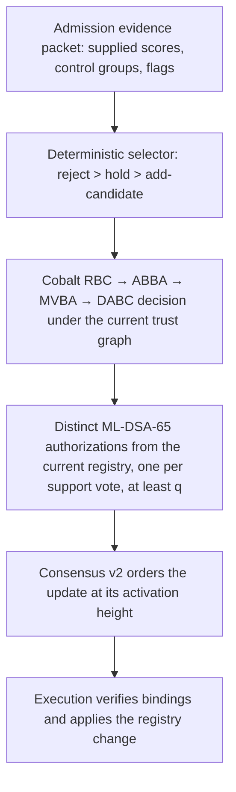

# Post Fiat: A Buy-Side Internet of Value

### NAVCoins, verified value, and private exchange of economic exposure on an authority-validated ledger

---

## Abstract

Investors need to know what backs a financial claim, how many claims share that backing, and how they can trade without exposing their positions. Fund administration supplies valuations and ownership records; a shared ledger can make their reconciliation continuous and independently checkable. Confidential settlement lets that shared accounting coexist with private holdings.

Post Fiat treats the four questions as one design problem. Its instrument is the NAVCoin: a floating-value unit whose reserve valuation, valid supply, methodology, custody perimeter, primary-market operations, and settlement representation can each be inspected on their own. The ledger finalizes a NAV epoch only after a registered proof profile has been satisfied, creates and retires units only against that finalized state, and settles an exchange of two units privately in one atomic transition while publishing per-asset pool accounting. The chain inherits the XRP category—known validators, deterministic finality, a fixed-supply native asset, fee burn, no validator subsidy—and changes three things. Validator-trust changes become protocol state ratified by Cobalt. Accounts and validators sign with ML-DSA from genesis, while the shielded stack itself remains classical. Settlement can run through Asset-Orchard, a typed-asset extension of Zcash Orchard.

The evidence behind this paper consists of a limited-availability primary-market route on Ethereum mainnet (A666), a controlled private currency swap on a six-validator devnet, byte-exact replay of model-scored index inputs, and an adversarial governance campaign—all project-authored and pinned to immutable commits. Several requirements remain proposals: a shielded batch matcher, an on-ledger index registry, an emergency redemption path, a cross-phase signing fence in consensus, and independently operated validators. Part 1 explains the mechanisms and their limits, Part 2 the issuer's decision, and Part 3 maps each claim to its proof and source.

### How to read this paper

Issuers and investment professionals may begin with Part 2 and return to Part 1 for the mechanism behind each step. Protocol reviewers should read Part 1 in order and check Part 3 against the pinned sources. Two words carry precise meaning throughout. *Demonstrated* means a retained record exists at the cited commit, produced by the project under named conditions. *Proposed* means a specified requirement with no retained execution. Neither word means independently audited, and one organization administers the current validator fleet.

---

## Part 1 — Theory

### 1.1 The financial object

A NAVCoin is a settlement representation of an asset defined by a methodology and held inside a custody perimeter. Those four nouns govern the paper, because conflating them produces most of the overclaims in this field.

- The **asset** is the economic exposure a unit represents: a pro-rata share of a reserve portfolio, an index, an options program, a currency claim.
- The **methodology** is the rule set that decides what the reserve holds and how each holding is valued.
- The **custody perimeter** is where the backing sits and who can move it: a broker, a venue vault, a source-chain contract.
- The **settlement representation** is what a holder owns and transfers: a transparent balance, a shielded note, or a wrapped token on another chain.

The protocol verifies the arithmetic linking them and gates issuance on that arithmetic. Custodian honesty, undisclosed liabilities, and legal recovery in insolvency lie outside what any proof establishes; they are inputs the market must price, and the design makes them visible so that it can.

Two kinds of unit live on the ledger. Native PFT has a fixed genesis supply; every native fee burns, no validator reward exists, and PFT pays for ordering and proof verification. NAVCoins are issued by issuers under their own registered profiles and reserve accounting. Issuers define their economic terms and bear their obligations; execution enforces the registered issuance rules.

### 1.2 NAV as net marked assets per valid unit

Fix an instance and a valuation unit (USD at six or eight decimals). At epoch $t$ the issuer's proof profile admits holdings $j$ with quantities $q_j$, marks $p_j$, and policy haircuts $h_j\in[0,1]$, together with disclosed liabilities $L_t$:

$$V_t=\sum_j h_j\,q_j\,p_j - L_t,\qquad \mathrm{NAV}_t=\frac{V_t}{S_t}\quad(S_t>0),$$

where $S_t$ is the **valid global economic supply**: every claim on this reserve across every representation, counted once. When $S_t=0$ there is no NAV; an explicit opening rule creates the first supply against a finalized reserve proof. The A666 lineage opened at 31,386.197455 units against \$31,386.19745591 of verified net assets—an opening NAV of \$1.000000 with \$0.00000091 of rounding overcollateral—with the entire opening supply locked in an ownerless migration contract and released only as legacy a651 burned against it ([primary-market accounting][pma]).

Consensus computes in integers. Let $v_t$ be net assets in valuation atoms, $s_t$ supply in token atoms, $u=10^d$ token atoms per whole unit, and $n_t$ the stored valuation atoms per whole unit. Reserve submission enforces

$$v_t\,u\ \ge\ s_t\,n_t,$$

and the provider-neutral SP1 profile additionally requires the conservative floor $n_t=\lfloor v_t u/s_t\rfloor$ ([reserve submission][nav-exec]). These checks establish consistency with the supplied denominator. A valid NAV also requires that denominator to equal the authorized supply of §1.3, because an understated $s_t$ inflates an exactly computed floor. Each profile must bind that denominator to authenticated supply records independently of the value computation.

Freshness has a price. If $S$ units hold current net assets $SN^*$ while the active epoch permits subscriptions at an earlier value $\bar N$, issuing $x$ units against $x\bar N$ of principal gives

$$N_{\text{after}}=\frac{SN^*+x\bar N}{S+x},\qquad N_{\text{after}}-N^*=\frac{x(\bar N-N^*)}{S+x}.$$

When the reserve has appreciated, $\bar N<N^*$ and the subscriber dilutes existing holders by $Sx(N^*-\bar N)/(S+x)$ in aggregate—exactly the subscriber's gain. A profile therefore registers a maximum snapshot age at finalization, a challenge window before a packet becomes the active epoch, and a maximum epoch gap after which minting and redemption initiation fail closed ([reserve primitives][rp]). These controls bound the age of a valuation; market movement inside the permitted interval remains an economic risk.

Rounding is directional, always toward the reserve. For $x$ token atoms at the finalized pre-inflow value $n_t$ with issue multiplier $m_I$,

$$\text{base}=\Big\lceil\frac{x\,n_t}{u}\Big\rceil,\qquad \text{due}=\lceil\text{base}\cdot m_I\rceil,\qquad \text{fee}=\text{due}-\text{base},$$

all in valuation atoms. Redemption at the finalized pre-outflow value with multiplier $m_R$ uses floors: $\text{base}=\lfloor x n_t/u\rfloor$, $\text{out}=\lfloor\text{base}\cdot m_R\rfloor$. A666 runs $m_I=10050/10000$ and $m_R=9995/10000$; the spread is custodied outside NAV assets, so a fee leaves NAV unchanged and residual rounding accrues to the reserve ([primary-market accounting][pma]).

### 1.3 Supply perimeter, primary operations, and the cash leg

A **primary subscription** moves counted settlement value into the reserve and creates units, $v\leftarrow v+\text{base},\ s\leftarrow s+x$; a **primary redemption** reverses both. Marks, income, and expenses move $v$ alone. A **secondary exchange**—an offer-book fill, a Uniswap swap, a shielded Asset-Orchard swap—changes ownership and leaves $v$ and $s$ untouched. Primary-market evidence is therefore a before/after record of net assets and supply moving together, and a balanced swap supplies none of it.

Representations change counting without changing the count. Partition authorized supply into disjoint economic claims in the same token atoms:

$$s_{\text{native}}+s_{\text{shielded}}+s_{\text{external}}+s_{\text{in-flight}}=s_{\text{authorized}}.$$

A claim occupies exactly one category at each stage of its life. Export moves it from native through in-flight to external; shielding moves it between native and shielded. Source escrow and the destination token it backs are one claim at its current location. Venue liquidity supplies depth and escrow supplies representation backing; neither adds reserve value because units pass through it.

The cash leg obeys the same discipline. A source-labelled receipt such as pfUSDC is a claim on USDC locked in a source-chain vault under a named route and finality rule. With vault balance $W_{\text{cash}}$, outstanding receipt atoms $S_{\text{cash}}$, deposits awaiting credit $D$, cumulative accepted burns $B$, and cumulative releases $R$, all in cash atoms,

$$W_{\text{cash}}=S_{\text{cash}}+D+B-R.$$

A deposit raises $W_{\text{cash}}$ and $D$; credit moves $D$ into $S_{\text{cash}}$; a burn moves $S_{\text{cash}}$ into $B$; release raises $R$ and lowers $W_{\text{cash}}$. The identity holds in transit as well as at rest ([wrapped stablecoins][wrapped]). A reserve packet counts only finalized, allocated receipts, and each receipt carries the source and redemption risk of its route.

### 1.4 Market price and verified NAV

Let $P_t$ be a venue price and $d_t=(P_t-\mathrm{NAV}_t)/\mathrm{NAV}_t$ its discount. A valid reserve proof says nothing about $d_t$. What connects the two objects is a channel through which divergence can be monetized: redemption at NAV makes a persistent negative $d_t$ an opportunity for anyone who can redeem, and subscription at NAV does the same for a positive one. Channel strength depends on who may use the primary market, the round-trip cost ($m_I/m_R$, bridge fees, gas), elapsed time relative to epoch freshness, and whether funded participants exist. The protocol claims something narrower than convergence: the primary channel opens at a verified value rather than an issuer's quote, and its capacity is bounded by proven backing and policy caps rather than an operator's inventory ([A666 current state][a666]).

### 1.5 Evidence, attestation, computation, verification

"Proof of reserves" bundles four steps that fail differently. Post Fiat keeps them apart.

**Reserve evidence** is what a source exposes: an on-ledger balance, a venue API, a broker response. Its honesty belongs to the source.

**Attested observation** is a signed statement by an identified party that it observed particular evidence at a particular time. For public sources, the multi-fetch profile requires a registered minimum of attestors to pass and zero to fail; one failing verdict blocks finalization and forces supersession. Observation roots are compared under a registered tolerance band, because live accounts drift: a study over a roughly \$275M venue vault found equity drift of 0.0005 bp across ten samples with zero identical snapshots ([proof of reserves][por]). For authenticated brokerage sources the YOLO adapter classifies both quantity and valuation as `Attested`, so their value lands in the public `attested_value` bucket and never in `cryptographically_verified_value` ([YOLO reserve profile][yolo-profile]).

**Deterministic computation** turns admitted observations into net assets under a committed policy. The SP1 reserve guest runs inside a zkVM over a bounded CBOR witness and commits a fixed 584-byte public-values record: genesis, asset, profile, valuation-policy hash, source-manifest hash, unit and scale, epoch and interval, gross assets, liabilities, verified net assets, the three trust-class buckets, source counts, and trust and disclosure roots ([public values][pv]; [reserve guest][guest]).

**Proof verification** is consensus work: verify the Groth16 proof against the program key pinned in the profile, decode the public values, and bind every field to the packet and to ledger context, rejecting on any mismatch of genesis, asset, profile, policy, manifest, unit, epoch, freshness, span, source root, or attestor root, and rejecting controlled value where the profile forbids it ([SP1 verifier][sp1v]).

Verification establishes that the stated computation ran over inputs bound to the disclosed sources and policy and produced the outputs the packet claims. It leaves open whether the sources told the truth, whether an undisclosed liability exists elsewhere, whether the custodian can deliver, and whether a court would honor the claim. The public proof-of-disclosed-leverage record on Arbitrum One shows the discipline in miniature: six legs across six verification domains reconcile exactly to public buckets, each labelled cryptographic or attested, and the record states that it proves neither total assets, total liabilities, nor solvency ([proof of leverage][pol]).

### 1.6 Private per-asset conservation and atomic exchange

Asset-Orchard extends the Orchard note to typed assets. A note commits to an asset tag, a value, an owner's diversified key, and randomness. A swap action spends two input notes and creates two outputs under a Halo2 proof whose public instance carries the anchor, two nullifiers, two randomized verification keys, two output commitments, encrypted-output hashes, the pricing binding, and the fee. For every asset $a$ in the action,

$$\sum_{\text{inputs of }a}v+\text{publicInflow}_a=\sum_{\text{outputs of }a}v+\text{publicOutflow}_a+\text{fee}_a,$$

with values range-checked and asset tags bound inside the commitments, so one asset's surplus can never pay another's deficit ([asset-orchard circuit][circuit]). Each spend publishes a nullifier derived from the nullifier key, the note's $\rho$, and its commitment; consensus rejects any nullifier already recorded. Nullifier uniqueness prevents reuse of an accepted spend; proof soundness makes the nullifier correspond to a valid note. They are different guarantees.

Atomicity belongs to the state transition. A multi-leg action applies whole—both nullifiers recorded, both commitments appended—or rejects with no value movement. In the controlled pNOK experiment of 1 August 2026, a buyer's 20 pfUSDC note and a facility's 210 pNOK note were consumed and two outputs created in one transition under a public fixed quote; no valid outcome settled one leg alone ([pNOK acceptance report][pnok-report]).

The public pool balance per asset satisfies

$$P_a'=P_a+I_a-O_a-F_a\ \ge\ 0,$$

so cumulative public outflows, including pool fees, stay within opening backing plus subsequent accounted inflows. This turnstile caps what leaves the pool. It cannot identify a counterfeit note created by a soundness failure, and a legitimate depositor whose share a counterfeit consumes before the cap binds loses that share. An underflow rejection pauses nothing and restores nothing; incident response is a governed action ([privacy overview][priv]).

Confidential notes leave much visible. Ingress reveals source, asset, amount, and output commitment; egress reveals destination, asset, and amount; timing and action counts are observable; a public fixed quote reveals the ratio; a coordinator that arranges a bilateral trade sees the orders it arranges. The pNOK run had cryptographically private note state and weak statistical cover, because every acquisition repeated 20-for-210 against the only available quote ([pNOK article][pnok-blog]). Statistical privacy is a property of the crowd, and §1.7 quantifies it.

Privacy also permits bounded evidence sharing. The local `orchard-disclose` tool writes a redacted packet for one decrypted output—chain and genesis context, commitment, nullifier, value, memo, and available finality evidence—and omits spending and viewing keys; `orchard-disclosure-verify` checks the packet hash, context, commitment inclusion, and finality fields, and rejects tampering ([disclosure specification][disclosure]; [privacy source][privacy-src]). That is inspection of a selected output. Enforcing holder eligibility across every Asset-Orchard transfer of a restricted instrument is a distinct scope with no retained implementation; §2.6 treats it as a product requirement.

Authorization boundaries differ as well. Shielded spends carry randomized RedPallas signatures over a chain-bound action digest; the batch that carries them has no account-level ML-DSA outer envelope. ML-DSA authorizes transparent accounts and the validator signatures on the block that certifies inclusion.

### 1.7 Market design for private exchange

Settlement risk and information leakage are separate costs. Atomicity removes the asynchrony that creates principal risk; confidential notes conceal positions inside the pool. Neither removes the information carried by aggregate flow, and the FX proposal's market design addresses that residual ([private FX settlement][fx]). The derivations below restate it with the assumptions in view.

**Impact is information.** In Kyle's one-period model the terminal payoff $F\sim\mathcal N(\mu,\Sigma_0)$ is independent of uninformed flow $Z\sim\mathcal N(0,\sigma_u^2)$. An informed trader who observes $F$ submits $X=\beta(F-\mu)$; a competitive market maker sees only $Y=X+Z$ and quotes its conditional expectation,

$$P(Y)=\mathbb E[F\mid Y]=\mu+\lambda Y,\qquad \lambda=\frac{\beta\Sigma_0}{\beta^2\Sigma_0+\sigma_u^2}.$$

Taking the linear rule as given, the trader maximizes $X(F-\mu)-\lambda X^2$, so $X=(F-\mu)/2\lambda$ and $\beta=1/2\lambda$. Substituting into the pricing rule gives $\beta^2\Sigma_0=\sigma_u^2$, hence

$$\beta=\frac{\sigma_u}{\sqrt{\Sigma_0}},\qquad \lambda=\frac{\sqrt{\Sigma_0}}{2\sigma_u}.$$

Size moves price because observable flow reveals information; greater value uncertainty raises impact, and more uninformed flow lowers it. Crossing orders inside a batch shrinks the flow exposed to that inference. This is a mechanism model under Gaussian flow and competitive pricing; it calibrates nothing about Post Fiat's market.

**Netting residual.** Let $n$ signed orders $X_i$ be independent with mean zero, variance $\sigma_X^2$, and $\mathbb E|X_i|=\mu_{\text{abs}}$. Gross flow $G=\sum_i|X_i|$ has mean $n\mu_{\text{abs}}$; the net $N=\sum_iX_i$ is approximately $\mathcal N(0,n\sigma_X^2)$ by the central limit theorem, with mean absolute value $\sqrt{2/\pi}\,\sigma_X\sqrt n$. Hence

$$\frac{\mathbb E|N|}{\mathbb E[G]}\approx\sqrt{\frac{2}{\pi}}\;\frac{\sigma_X}{\mu_{\text{abs}}\sqrt n}.$$

If the magnitudes $|X_i|$ have coefficient of variation one—exponentially distributed sizes, say—then $\mathrm{Var}|X_i|=\mu_{\text{abs}}^2$, so $\sigma_X^2=\mathbb E[X_i^2]=2\mu_{\text{abs}}^2$ and the ratio becomes $2/\sqrt{\pi n}$: about 36% at $n=10$, 11% at $n=100$, and 3.6% at $n=1000$. Persistently one-sided flow with buy probability $p$ leaves a floor of $|2p-1|$ at any $n$; heavy tails, unequal sizes, and a thin batch weaken the result. Netting hides composition and reveals direction.

**What the residual reveals.** With equal-variance Gaussian orders, the published net $N=X_i+R$ is a Gaussian channel with signal $\sigma^2$ and independent noise $(n-1)\sigma^2$:

$$I(X_i;N)=\tfrac12\ln\!\Big(1+\frac{1}{n-1}\Big)=\tfrac12\ln\frac{n}{n-1}\approx\frac{1}{2n}\ \text{nats},$$

about a hundredth of a nat per batch at $n=51$. With unequal variances the term is $\tfrac12\ln(1+\sigma_i^2/\sigma_R^2)$, where $\sigma_R^2$ is the rest of the batch; a participant who dominates batch variance receives little cover, which motivates size limits. The bound concerns one batch residual and one signed order. Quotes, repeated participation, timing, and an operator who sees the book are separate channels.

**Batch length.** Model per-unit cost as staleness plus residual impact, $\text{cost}(\tau)=a\sqrt\tau+b/\sqrt{\Lambda\tau}$, with arrival rate $\Lambda$. Setting the derivative to zero gives

$$\tau^*=\frac{b}{a\sqrt\Lambda},$$

where both terms equal $\sqrt{ab/\sqrt\Lambda}$. Busier venues run shorter batches with more depth ($n^*=\Lambda\tau^*$ grows like $\sqrt\Lambda$), and volatile days want shorter batches. The FX post's seven-minute illustration is a model number. The boundary between demonstrated and proposed is sharp: bilateral atomic settlement under a public, expiring, capacity-bounded fixed quote has run on the controlled devnet with mainnet USDC on the dollar leg and sandbox WNOK on the krone leg, while the shielded frequent batch auction is proposed and its first version requires the matcher to see the book for one interval ([private FX settlement][fx]; [pNOK article][pnok-blog]).

### 1.8 Validators without a subsidy

With fixed supply and fee burn, the question is why an institution operates a validator rather than using the ledger passively. For operator $i$ over an accounting period, let $C_i$ be operating cost, $K_i$ opportunity and operational-risk cost, $\Delta p_iD_i$ the reduction in the operator's own expected settlement-disruption loss attributable to participating, $O_i$ the control and assurance benefit, and $J_i$ incremental service margin or retention. The participation surplus is

$$U_i^{\text{op}}-U_i^{\text{passive}}=\Delta p_iD_i+O_i+J_i-C_i-K_i.$$

Passive exposure to the ledger's success cancels from this difference unless the operator's participation changes the outcome. Free riding is therefore the default, and the case rests on $O_i$ and $J_i$: an issuer verifying its own epochs, a custodian holding its own copy of finality, a sponsor governing the registry that admits the next sponsor. Recruitment must anticipate exits early enough to complete a safe transition.

Deterrence is separate. With no stake to slash, a coalition $C$ over an influence window $W$ is deterred when attack gains fall short of business losses, expected accountable consequences, and execution cost:

$$G_C(W)<L_C(W)+p_C(W)\,A_C(W)+E_C(W).$$

Individual break-even implies nothing about coalitions: shared funding, common vendors, or a correlated shock can align otherwise viable operators. Admission therefore carries control-group and dependency checks, and the current fleet—six Foundation-administered validators with separate keys—establishes no independent control ([Cobalt adversarial results][cobalt-adv]). Only observed business behavior can calibrate this model.

### 1.9 The chain of authority

Two thresholds govern two decisions. For a block committee of $n$ validators,

$$f=\Big\lfloor\frac{n-1}{3}\Big\rfloor,\qquad q=\Big\lfloor\frac{2n}{3}\Big\rfloor+1,\qquad 2q-n>f\ \text{ for every }n,$$

since writing $n=3k+r$ with $r\in\{0,1,2\}$ gives $2q-n\in\{k+2,k+1,k+2\}$ against $f\in\{k-1,k,k\}$. Any two $q$-sets share a correct validator. Consensus v2 is an explicit prepare/precommit protocol: $q$ prepare votes form the durable lock, $q$ precommit votes for the same non-nil block form the only commit certificate, and a proposal at view $v+1$ must carry a verified timeout certificate for view $v$ with its highest prepare-QC reference ([finality][fin]; [consensus v2][cv2]). Intersection is the ingredient; the signer's lock and phase rules complete the safety argument, and one of those rules carries the open obligation stated at the end of this section.

Cobalt governs a different object: agreement over declared validator trust. A trust view lists essential subsets; a subset with size $n_S$, fault budget $t_S$, and threshold $q_S$ must satisfy

$$t_S<2q_S-n_S,\qquad 2t_S<q_S,$$

so that two threshold sets share a correct member under the subset's own budget and no threshold set is majority-Byzantine. Two views are fully linked when they share a subset whose actual faults fit its budget and which retains enough correct members to reach threshold. The devnet's graph is one six-validator subset with $t_S=1,\ q_S=5$: five-of-six ratifies, four-of-six fails ([Cobalt implementation][cobalt-impl]).

A registry transition must also pass a cross-registry check. Let $\beta$ bound the number of distinct Byzantine identities across the transition's whole influence window—a union across time that may exceed any single committee's $f$. For every covered old row $S_o$ and new row $S_n$ with key-continuous shared members $C_{on}$,

$$I_{on}=\max\big(0,\ |C_{on}|-(|S_o|-q_o)-(|S_n|-q_n)\big)>\beta.$$

Local rows are insufficient. Old $\{A,\dots,G\}$ and new $\{A,B,H,\dots,L\}$, each one subset with $n_S=7,\ q_S=5,\ t_S=2$, both pass locally, yet quorums $\{A,B,C,D,E\}$ and $\{A,B,H,I,J\}$ share only $\{A,B\}$, and with $\beta=2$ that whole intersection can be Byzantine; the transition fails and the old registry stays active. The checker extracts the cover from the two rooted graphs, deduplicates by subset identity, bounds it by profile, and requires it to match the proposer's witness exactly, so an unfavorable row cannot be omitted ([cover extractor][cover]). Completeness covers declared threshold rows in the rooted model, short of open-network quorum enumeration.

The August 2026 campaign exercised the full path:

Each authority has a defined scope. The selector produces a candidate from supplied fields; it cannot discover concealed shared control. Cobalt ratifies a scoped trust decision; it finalizes no blocks. Current-registry signers authorize the exact payload, parent lock, sequence, slot, and expiry, and old-rule authorizations are forbidden after activation ([handoff consumer][handoff]). The committee orders; execution activates; a rejected receipt leaves the registry unchanged. The Foundation retains authority over unrelated governance scopes. No authority can retroactively alter certificate thresholds, and loss of quorum halts the chain rather than lowering $q$. At height 924, the legitimate rotation of validator 5 carried authorizations from validators 0–4 and committed; the treated-as-stolen old key's attempt had a decision certificate and one signature and was rejected for lack of current-registry authorization ([Cobalt adversarial results][cobalt-adv]).

**The consensus obligation, stated exactly.** The inspected signer keeps separate durable high-water marks for prepare, precommit, and timeout, plus a lock and high QC. Precommit authorization checks the precommit mark, the lock, and that the prepare QC is newer and non-nil; it performs no comparison against a higher prepare or timeout view already signed ([consensus v2][cv2]). An analytical four-validator schedule shows what separate counters admit: prepare $X$ at view 0 with the certificate withheld; open view 1 and prepare $Y$ with an overlapping correct signer; deliver $X$'s certificate to obtain a first-ever lower-view precommit; deliver $Y$'s newer certificate to replace the lock. A durable cross-phase current-view fence—no new signature in any phase below the highest view entered—excludes that schedule. The fence is a proposed normative rule. Source review left its enforcement in the current runtime unestablished, no executed regression reproduces the schedule, and no exploit is claimed. Progress is a separate obligation: a correct validator whose lock is absent from the $q$ timeout signers is unrepresented in the certificate's high QC, so a proposer following that certificate may repropose below a correct lock and be refused. Eventual progress requires every correct validator's highest QC to reach some later timeout certificate, together with a pacemaker granting a correct proposer enough synchronous time. Assuming each timeout certificate already contains the globally highest lock would assume the conclusion, and this paper declines to do so.

### 1.10 AI-assisted governance and indexing

Some inputs to public methodologies and to governance evidence are qualitative: whether a company expresses a theme, whether two filings describe one controller. Post Fiat admits machine interpretation for exactly one step—converting committed evidence into a typed, cited answer under a closed schema—and confines everything else to deterministic code. Let $E$ be the evidence packet, $P$ the prompt, $Q$ the closed schema, $M$ a pinned inference profile, and $V_Q$ the parser. The model step is $A=V_Q(M(P,E,Q))$; a deterministic selector then computes the result from policy, current state, $E$, and $A$ with no model calls. Replay means an independent operator running the same profile on the same request bytes obtains the same response bytes. It proves reproduction under a pinned profile and says nothing about semantic truth, source correctness, or performance.

The agentic-index methodology applies this to portfolios. A frozen model scores each company in a 1,000-company universe against a public rubric; scores of 70 or more qualify; for a qualifying company $i$,

$$\text{strength}_i=\frac{s_i-70}{30},\qquad \text{scale}_i=\sqrt{\text{mcap}_i}\;e^{0.03\,z_i},\qquad w_i^{\text{pre}}=0.2\,\frac{\text{strength}_i}{\sum_k\text{strength}_k}+0.8\,\frac{\text{scale}_i}{\sum_k\text{scale}_k},$$

with $z_i$ the population z-score of routed profitability, weights above 20% clipped and redistributed proportionally, and the result normalized to one trillion integer units by largest remainder with CIK tie-break. A universe with fewer than five qualifying names cannot satisfy the cap and is rejected ([agentic indexing][agentic]). These are one methodology's parameters. The blend also requires positive aggregate strength: an all-70 qualifying set has a zero denominator and needs an explicit registered rule before use. A replayed score changes no ledger state until a registered series and epoch policy accept it, and that registry is proposed.

Validator admission has the same shape. A model interprets a public admission packet into typed fields under a fixed schema; the selector orders outcomes reject > hold > add-candidate, holding on missing or conflicting evidence and rejecting established shared control; Cobalt and current-registry authorization, never the model, change validator trust ([admission policy][admission]).

The proposed methodology registry requires deletion monotonicity. For $E'\subseteq E$ obtained by deleting inputs a registered methodology requires, the authorized ledger actions satisfy $\mathcal A(E')\subseteq\mathcal A(E)$. A missing liability, failed constituent record, or absent replay receipt blocks the dependent action rather than improving a valuation, dropping a constituent, or renormalizing the survivors. The numerical result may move either way when evidence changes; the restriction governs permission to act.

### 1.11 What ML-DSA covers

Accounts and validators sign with ML-DSA-65 from genesis: 1,952-byte public keys, 3,309-byte signatures, deterministic verification, and domain-separated contexts for transactions, block certificates, bridge witnesses, and admission receipts ([crypto provider][crypto]). Launching with post-quantum account and validator authorization avoids a migration in which years of public keys already sit on a permanent ledger. A quorum of $q=24$ from 35 validators carries $24\times3{,}309=79{,}416$ signature bytes plus identifiers; prepare and precommit sets double that before framing, and this byte cost dominates the operational price of the choice.

The scope ends there. Asset-Orchard authorization uses RedPallas, its proofs Halo2 over the Pasta curves, its note encryption classical key agreement; SP1 reserve and bridge proofs wrap in Groth16; external-chain contracts use their own cryptography. A break in note encryption would expose historical ciphertexts without moving value; the turnstile bounds what a soundness break can withdraw and repairs nothing. The claim is post-quantum account and validator authorization from inception, and nothing broader.

---

## Part 2 — Business Case

### 2.1 Why enter through the buy side

XRP pursued an internet of value through payments, positioning a public ledger against correspondent-banking messaging. Incumbents there have moved: SWIFT reports a tokenized-deposit ledger ready for initial use with 17 banks preparing live pilots, orchestrating payments while final settlement stays in existing systems ([SWIFT][swift]). Competing there means competing with the incumbent's own tokenization.

Crypto's demonstrated demand points elsewhere. Perpetual futures have become deployer-extensible infrastructure over shared margining and order books ([HIP-3][hip3]); tokenized shares exist with regulated custody and institutional primary mint and redemption ([Coinbase Tokenize][coinbase]); published model portfolios rebalance directly in users' wallets, separating methodology from execution ([Bitwise ATP][bitwise]). Each is a buy-side activity—owning, valuing, hedging, rebalancing—and each recurs. Ownership creates repeated demand for what a settlement ledger can supply and a messaging network cannot: value verified at issuance, private transfer with public accounting, atomic exchange of two exposures. FX settlement shows how much settlement risk persists even among sophisticated counterparties—about \$5.2 trillion of daily obligations settle payment-versus-payment against \$1.4 trillion still settled gross and bilaterally ([BIS settlement survey][bis-settle])—though this paper treats payments as a use of the chain rather than its entry.

A private ledger with a common valuation interface serves this market because diligence becomes a sequence of object checks. A holder verifies a methodology receipt, a reserve proof, a primary-market receipt, and a swap's nullifiers and commitments, each answering one question, in place of a sequence of counterparty inquiries. Issuers gain a repeatable accounting and settlement workflow; holders gain a claim they can inspect and move without informing the market.

### 2.2 The target issuer and the adoption sequence

The proposed first customer is an issuer that already maintains a liquid, regularly marked portfolio and serves participants who can use a primary subscription and redemption channel: the sponsor of a rules-based thematic equity portfolio, or the manager of a short-duration reserve whose holdings are observable at a broker or venue. Such an issuer already produces the observations a reserve epoch needs; it wants primary flow at NAV, and its participants value confidential positions. Integration cost depends on the quality and accessibility of those existing records. What it buys is the workflow: register a profile, prove an epoch, issue and redeem against it, and let holders settle privately.

The adoption sequence begins with one reserve, one legal wrapper, one settlement route, and a small set of primary participants. The pilot must complete funded subscription, private transfer, redemption, and recovery while measuring proof cost, elapsed time, failed operations, and reconciliation effort. The second issuer reuses the profile and integrations; later assets earn their place through repeated use and shared liquidity. The A666 and pNOK records establish the primitives this sequence relies on. Customer commitments and recurring volume remain to be demonstrated, and the sequence is a proposal.

### 2.3 One holder's path

Dana subscribes to a NAVCoin whose asset is a thematic equity portfolio. Amounts and the legal arrangement are illustrative; the example assumes USDC at USD parity. Each step names its mechanism and its evidence.

*Methodology.* The sponsor publishes the universe, rubric, threshold, blend, cap, and normalization of §1.10. In the August demonstration 4,000 score responses across four themes replayed byte for byte on a second H200, and one theme was rejected because only three names cleared the threshold ([agentic indexing][agentic]). In the top-1,000 study, 2,552 of 2,552 tested artifacts replayed exactly, covering 85.38% of a 2,989-artifact corpus at the stated cutoff; nine of eleven initially unresolved outputs later matched under a stricter profile, two hit the same generation limit twice, and a separate fixed-24 batch profile produced one mismatch in 137 comparable outputs ([replay summary][replay-summary]; [runbook][runbook]). Replay is a serving discipline for one model, one runtime, and one hardware class. The on-ledger series registry is proposed.

*Custody and proof.* A broker holds the shares and a cash buffer under a regulated arrangement. Because the quantity source is a broker response, the epoch's value lands in `attested_value` ([public values][pv]). Suppose the finalized epoch shows \$10,000,000 against 10,000,000 units: NAV \$1.000000.

*Primary acquisition.* Dana deposits 1,005,000 USDC into the Ethereum-mainnet vault and receives pfUSDC once the ingress proof verifies; the recorded mainnet run completed deposit inclusion through withdrawal inclusion in 20 minutes 12 seconds ([A666 current state][a666]). She subscribes for 1,000,000 units at the pre-inflow NAV with $m_I=1.005$: \$1,000,000 enters the reserve, \$5,000 enters fee custody, supply becomes 11,000,000, and NAV stays \$1.000000. The same accounting ran on mainnet for 100.5 USDC → 100 A666 → 100 wA666, canonical and wrapped supply each rising by exactly 100,000,000 atoms. Private issue and redeem have committed on the six-validator fleet; the latest qualification passed the redemption latency gate and missed the issue gate ([A666 current state][a666]). A666 v2 with mainnet pfUSDC carries the current evidence; a651 is historical lineage, a652 controlled swap evidence only, and the Arbitrum pfUSDC route is closed to new ingress after roughly 6.4-day trustless confirmations ([assets and venues][venues]).

*Private exchange.* Dana shields her units and later exchanges 200,000 of them for a NAVCoin representing a short-duration debt reserve. Both notes are consumed and two outputs created in one transition; neither asset's $V$ or $S$ moves. The primitive is the pNOK swap: 19 controlled private jobs, exact replays rejected without effect, six validators converged ([pNOK acceptance report][pnok-report]). Statistical cover depends on how many other trades share the pool and the batch.

*Exit.* Dana redeems at $m_R=0.9995$ while the epoch is fresh and the asset unhalted. Her recovery depends on the broker's honesty, the custodian's delivery, and the legal structure holding the shares; the ledger checks issuance and redemption against the finalized, counted value. If the sponsor stops proving, minting and redemption initiation fail closed, protecting the accounting and trapping holders during distress. A separately specified emergency exit—trigger conditions, authorization path, priority, and loss allocation—is a proposed requirement before production use ([Post Fiat, Canton, and XRP][canton]).

### 2.4 From one instrument to a product line

The objects compose. A **single-stock options tracker** is a rulebook that selects and rolls call contracts on one company; the September demonstration computed targets for Micron and Nvidia from Nitro-attested Schwab observations, verified two SP1 proofs, and accepted both through isolated four-validator receipt tests over a 408-byte public interface binding program, methodology, parameters, collection, prior state, and target—with hypothetical starting cash and no options bought ([options record][options-record]). A **short-perpetual NAVCoin** would package one isolated strategy as a fungible unit, with leverage belonging to the series so that a "leverage slider" selects among series; the 90-day funding study across 47 eligible HIP-3 markets found shorts paid in 85.11% of markets with a median +2.50% of constant 1× notional, and +2.56% volume-weighted across 30 matched U.S.-listed markets against a +0.83% stock-loan rebate proxy—historical cash flow under a fixed rule that guarantees nothing ([UltraShort][ultrashort]). A **private FX pair** is two reserve-backed currency assets and one atomic swap, with the batch layer proposed. A **rules-based portfolio** is a NAVCoin whose reserve is constructed by a replayable methodology, so the replay receipt becomes one more object the reserve profile binds ([single-stock option indices][options]). The historical large-cap backtest of the fundamental discipline (10.92% CAGR against 8.98% for SPY over 1998–2026, correlation 0.949, insignificant five-factor alpha) validates the accounting route and says nothing about the live thematic blend ([agentic indexing][agentic]).

### 2.5 Revenue, costs, and participants

Native fees burn and fund no one. A NAVCoin business earns from its published terms. A666 supplies one schedule: a 50-basis-point issue spread and a 5-basis-point redemption spread, both custodied outside NAV assets ([primary-market accounting][pma]). For subscription principal $Q_I$ and redemption principal $Q_R$ in a period, gross spread before integer rounding is

$$R_{\text{spread}}=0.005\,Q_I+0.0005\,Q_R;$$

one million of subscriptions and one million of redemptions yield 5,500 in gross spread. This measures revenue at the stated policy and forecasts no volume. Against it the operator pays proof generation, observation and attestation, custody, investor servicing, compliance, infrastructure, and route costs (bridge gas and finality proofs) from revenue or separately contracted fees. Methodology sponsors earn under terms they publish, on the model in which methodology fees are separated from execution fees ([Bitwise ATP][bitwise]). Observers, collectors, and replay operators are paid for measurable service work; registration is open and independent of validator status ([proof of reserves][por]). Validators justify their cost through the incremental surplus of §1.8, so the natural candidates are the issuers, custodians, and sponsors whose products run on the ledger.

The record supplies one measured cost input: a June 2026 Asset-Orchard benchmark on a 32-vCPU host produced a swap proof in 5.780 seconds and verified it in 66 milliseconds with cached keys; the proof occupied 6,816 bytes. Cold proving-key setup took about 330 seconds. At a whole-host price of $H$ per hour, exclusive hot proving time costs approximately $0.001606H$ per proof before utilization, setup, and service overhead. This measurement covers the swap circuit; reserve proofs, attestation, custody, compliance, and bridge operations require their own quotations ([prover benchmark][prover-cost]).

The spread also gives an immediate budget test. With equal subscription and redemption principal $Q$, gross spread is $0.0055Q$. A period's all-in cost $C$ therefore requires $Q\ge C/0.0055$. Cost budgets of 5,000, 25,000, and 100,000 require roughly 0.91 million, 4.55 million, and 18.18 million of principal **on each side**. These are sensitivity cases, with cost and volume measured in the same currency and period. The pilot must replace each budget with measured costs at its tested volume. A million in and a million out support a total cost budget of 5,500; costs above that exhaust the spread.

Primary participants are the channel that connects price to NAV (§1.4). An issuer must designate participants funded to subscribe and redeem, agree their access and timing relative to epoch freshness, and accept that their round-trip cost sets the band within which $d_t$ can persist. A viable pilot shows positive contribution after these costs and repeat demand at the quoted fees.

### 2.6 Legal wrapper, eligibility, and disclosure

These are product requirements an issuer must satisfy; the paper claims no established compliance for any instrument. The legal wrapper must identify the holder's claim, custody segregation, permitted investors, redemption rights, governing jurisdiction, and insolvency priority. Operating terms must assign investor checks, sanctions screening, recordkeeping, and transfer restrictions to identifiable parties. An eligibility check at ingress alone leaves later shielded transfers unresolved; a restricted instrument needs an enforceable eligibility rule across its entire transfer path before that path may carry it. The local Orchard disclosure packet (§1.6) lets a holder show one output to an auditor or counterparty without exporting keys. Full Asset-Orchard eligibility enforcement and a governed disclosure-policy layer are designs without a live consumer, and Cobalt's present authority is confined to validator trust. Signed legal documents create the off-chain obligations; ledger receipts supply evidence of the corresponding recorded actions.

### 2.7 Why a dedicated ledger

The strongest alternative is an existing chain with custody integrations, NAV-gated contracts, privacy infrastructure, and established liquidity. Post Fiat must justify the consensus, governance, and integration dependencies it adds.

| Issuer decision | Post Fiat | Existing-chain alternative | Evidence needed to choose |
|---|---|---|---|
| Where valuation constrains issuance | Registered profiles and finalized epochs are ledger validity rules; the Ethereum contracts enforce compact PFTL outputs without reinterpreting NAV ([assets and venues][venues]). | Issuer contracts with oracle integrations enforce a NAV policy. | Integration and assurance cost across several series. |
| How private trades settle | Asset-Orchard checks both legs and per-asset conservation in one transition. | A compatible private execution layer can supply an equivalent atomic boundary. | Transaction coverage, disclosure needs, attainable liquidity. |
| How users enter and exit | A666: recorded primary path, 20 m 12 s mainnet round trip, Ethereum representation. | Tokenization platforms with established custody and primary channels. | Full-cycle cost, latency, capacity, recovery under actual terms. |
| Who maintains the rules | Cobalt ratifies validator trust; deterministic selectors consume model-interpreted evidence; ML-DSA authorization from genesis. | Host-chain consensus and contract governance. | Independent operation and reviewed update procedures. |

Post Fiat's intended advantage is reuse: one reserve interface, one supply discipline, one private settlement model, and one governance path across many issuers. That advantage becomes commercial when the second and third products cost less to integrate and operate than separate deployments elsewhere. The record establishes the building blocks; comparative integration cost and customer demand remain open measurements.

### 2.8 Risks that define the claim

A NAVCoin's risks are the definition of the financial claim. *Source*: a broker or venue can misreport; the trust-class buckets show which values rest on attestation. *Issuer*: proving can stop, and the asset fails closed; undisclosed liabilities escape every proof. *Execution*: a strategy can be liquidated, gapped, or mis-marked; funding can turn negative; a primary order can fail its freshness check and refund. *Legal*: an on-ledger redemption right differs from a court judgment, and the wrapper decides recovery. *Cryptographic*: the shielded stack is classical, and a soundness failure can consume legitimate backing within the turnstile ceiling. *Governance*: fail-closed rejection preserves a captured or deadlocked registry as faithfully as a good one, and one organization administers today's fleet. *Consensus*: the cross-phase fence of §1.9 awaits enforcement evidence. The market prices what it can see, and the protocol's work is to make these visible.

---

## Part 3 — Implementation Details

Each row states a claim at the scope its evidence supports. "Proof" names the kind of evidence: a derivation under assumptions, inspectable source with retained tests, a cryptographic verifier, or a project-authored execution or replay record under named conditions. Source references pin `postfiatl1v2` at `aa8b365f` and `postfiatorg.github.io` at `f930703e`. No row certifies production readiness: A666 is limited availability, the fleet is Foundation-administered, and the batch matcher, index registry, and emergency exit are proposed.

| Claim | Proof | Codebase reference |
|---|---|---|
| Floating-NAV assets carry explicit proof profiles, reserve epochs, supply bounds, and freshness rules enforced at submission, finalization, mint, and redeem. | Inspectable source and retained execution tests. The lifecycle test uses a placeholder profile; it establishes state-machine behavior only. | [market_nav_asset_types.rs][types]; [nft_escrow_asset_execution.rs][nav-exec] |
| A reserve packet is rejected unless `verified_net_assets × u ≥ supply × nav_per_unit`; the provider-neutral profile also requires the exact conservative floor. | Validity rule in the `NavReserveSubmit` arm; derivation in §1.2. Denominator authenticity is a separate obligation. | [nft_escrow_asset_execution.rs][nav-exec] |
| Primary subscription raises reserve principal and valid supply together; redemption lowers both; spreads are custodied outside NAV assets. | Canonical accounting document; private primary transitions credit or debit `settlement_reserve_atoms`, `authorized_valid_supply_atoms`, and `non_nav_spread_atoms` in one transition. | [primary-market-accounting.md][pma]; [nav_vault_asset_execution.rs][vault] |
| A secondary exchange changes ownership and leaves reserves and economic supply unchanged. | Accounting model; retained tests cover mint, offer-book trade, and redeem separately. Swap validity is a distinct obligation. | [market_nav_execution_tests.rs][mn-tests]; [primary-market-accounting.md][pma] |
| SP1 reserve verification binds disclosed inputs, policy, freshness, and outputs, and separates cryptographic, attested, and controlled value. | Groth16 verifier against a profile-pinned program key; fixed 584-byte public-values ABI. Establishes computation and bindings; undisclosed liabilities and custody solvency lie outside it. | [nav_sp1_verifier.rs][sp1v]; [nav_reserve_public_values.rs][pv]; [reserve-proof-guest main.rs][guest] |
| Brokerage-sourced observations are classified attested, never cryptographic; public-source observations are compared under tolerance. | Adapter design with golden commitment vectors; observation and valuation code; drift study over a live venue vault (0.0005 bp, zero identical snapshots). | [yolo-options-reserve-profile.md][yolo-profile]; [hyperliquid.py][hl-py]; [basis_policy.py][basis-py]; [navcoin-proof-of-reserves.md][por] |
| Source-labelled cash receipts have explicit route, finality, allocation, and egress boundaries with SP1 ingress and egress programs. | Inspectable execution code and zkVM guests. Ethereum mainnet is the current pfUSDC source; the Arbitrum route is deprecated. | [pfusdc-ingress main.rs][ingress]; [pfusdc-egress main.rs][egress]; [nav_vault_asset_execution.rs][vault] |
| A wrapped NAVCoin represents the same economic supply; the controller mints only against an accepted PFTL receipt under route and packet caps. | Inspectable Solidity. The 100.5 USDC → 100 A666 → 100 wA666 mainnet run is a dated project record. | [PFTLUniswapPrimaryMarketV2.sol][solidity]; [A666 current state][a666] |
| Asset-Orchard proves per-asset value conservation and spend authorization for two-leg swaps; nullifier, anchor, statement, and authorization are separate checks. | Inspectable circuit and retained tests under a local Halo2 profile. Security requires Halo2 soundness and correct custom constraints. | [asset_orchard.rs][ao]; [asset_orchard_circuit.rs][circuit]; [asset_orchard_circuit_tests.rs][ao-tests] |
| A controlled private currency swap settled both legs atomically under a public fixed quote (20 pfUSDC for 210 pNOK; ten acquisitions, nine inverse swaps; 18 of 18 checks) and recovered from validator, prover, and wallet-proxy restarts with duplicates rejected. | Project-authored acceptance and recovery reports (`retry_count: 2`, supply unchanged). Sandbox WNOK, operator-controlled checkpoint, pre-arranged rate; no price discovery or independent audit. | [pnok acceptance report.json][pnok-report]; [pnok recovery-faults report.json][pnok-recovery]; [shielded_batch_actions.rs][sba] |
| Private primary issue and redemption are explicit transitions bound to the finalized NAV packet and its freshness limit. | Inspectable transition functions; A666 record of committed transitions with a qualification that passed the redeem latency gate and missed the issue gate. | [nav_vault_asset_execution.rs][vault]; [A666 current state][a666] |
| Cached-key swap proving took 5.780 s and verification 66 ms on a 32-vCPU host, with a 6,816-byte proof. | Project benchmark; about 330 s of cold proving-key setup. A swap-circuit measurement, excluding other proofs and operating services. | [zk-prover-k15-circuit-optimization.md][prover-cost] |
| A holder can produce and a recipient verify a redacted disclosure packet for one Orchard output without key export. | Inspectable local tooling. Per-output scope; eligibility enforcement across Asset-Orchard transfers has no retained implementation. | [disclosure.md][disclosure]; [privacy.rs][privacy-src] |
| Cobalt ratifies scoped validator-trust updates; a live update requires a decision certificate plus distinct current-registry ML-DSA authorizations bound to payload, parent lock, sequence, slot, and expiry. | Inspectable consumer source and retained handoff tests; RBC/ABBA/MVBA/DABC construction and signing. Block finality is separate. | [cobalt_handoff.rs][handoff]; [rbc_abba_mvba.rs][rbc]; [dabc_registry.rs][dabc] |
| Trust graphs are rooted objects; the safety cover is extracted from the graphs, deduplicated, bounded by profile, and required to match the witness. | Inspectable extractor and graph source; bounded input model and supplied fault budget are essential assumptions (§1.9). | [cobalt_cover_extractor.rs][cover]; [trust_graph_governance.rs][tg] |
| Old/new transition obligations—local rows, budget binding, cover bound, key-continuity intersection, conflict rules—are executable checks with fixtures. | Project fixture report (May 2026): one rotation accepted, seven invalid fixtures rejected for named reasons. Controlled checker. | [cobalt-transition-safety-proof.md][tsp]; [proof report][tsp-report] |
| Admission selection checks supplied evidence, holds on missing or conflicting fields, and rejects established shared control, with rejection outranking hold. | Inspectable selector and retained tests. Independent exposure, control, and evidence truth are upstream obligations. | [validator_admission_policy.rs][admission] |
| Production and two independent oracles agreed on 10,240 generated trust-graph cases; 108 Byzantine cases and 442,368 searched schedules produced zero conflicting roots, false accepts, or false halts. | Project-authored summaries (E1, E2), bounded to the generated corpus and the six-validator graph. | [e1 summary.json][e1]; [e2 summary.json][e2] |
| Tampered history and forged catch-up were rejected (24 and 18 cases); six interrupted recoveries restored byte-identical history; rollback and return committed at 922/923; a legitimate rotation committed at 924 and a stolen-key attempt was rejected. | Project-authored summaries (E3, E5). Six Foundation-administered validators; the independent-operator gate (E6) remains open. | [e3 summary.json][e3]; [e5 verifier.json][e5]; [e6 decision.json][e6] |
| Consensus v2 persists prepare, precommit, and timeout marks, a lock, and a high QC before signing, and commits only on a non-nil precommit QC. | Inspectable signer and durable store. **Open signing obligation:** the inspected precommit authorization performs no cross-phase current-view check; the §1.9 schedule is analytical, no regression reproduces it, and no progress theorem is claimed. | [consensus_v2.rs][cv2]; [consensus_v2_store.rs][cv2-store] |
| Accounts and validators use ML-DSA-65 with domain-separated contexts; the provider is differentially tested against a reference verifier. | Inspectable provider source and retained tests. Shielded authorization and note encryption remain classical. | [crypto_provider lib.rs][crypto] |
| Option-target calculation and verification bind methodology, parameters, attested collection, and prior state over a 408-byte ABI; two targets (MU, NVDA) were accepted through isolated four-validator receipt tests. A target receipt grants no trading, reserve, or issuance authority. | Deterministic calculator, SP1 guest, registered verifier, and tests for malformed proofs and duplicate registrations; dated record with hypothetical \$100,000 per tracker and no brokerage orders. | [yolo_target.rs][yolo-target]; [yolo-target-guest main.rs][yolo-guest]; [yolo_target_verifier.rs][yolo-verifier]; [yolo_target_public_values.rs][yolo-pv]; [yolo_target_execution_tests.rs][yolo-tests]; [demo-record.json][options-record] |
| 2,552 of 2,552 tested index score artifacts replayed byte for byte on a second H200 (85.38% of a 2,989-artifact corpus); another batch profile produced one mismatch. Model classification feeds deterministic construction (threshold 70, 20/80 blend, 20% cap, largest remainder), and an infeasible universe is rejected. | Project-authored replay summary under pinned profiles; public evidence-builder script and original/replay comparison files. Reproduction only; the PFTL series registry is proposed. | [replay summary][replay-summary]; [determinism runbook][runbook]; [build_agentic_index_evidence.py][evidence-script]; [agentic-indexing.md][agentic] |
| A disclosed-leverage statement over six legs is verifiable from public Arbitrum state with a standard-library script. | Cryptographic verifier on Arbitrum One plus a public checker of buckets, policy hash, and program key. Hidden-witness reproduction and liability completeness are separate claims. | [verify_proof_of_leverage.py][pol-script]; [proof-of-leverage.md][pol] |

---

## References

All Post Fiat source files, documents, and records cited above resolve to `postfiatorg/postfiatl1v2` at commit `aa8b365f5cf97be05a5222b55de63150cab275c6` or `postfiatorg/postfiatorg.github.io` at commit `f930703e32433a9eb9d74708c2423ebde17832b4`, through the inline links. Research articles are linked at postfiat.org where a pinned copy is absent.

**External primary sources.** SWIFT, "Swift's blockchain ledger ready for use; 17 banks set to pioneer tokenised cross-border payments," 9 July 2026 ([swift.com][swift]). Hyperliquid, "HIP-3: Builder-Deployed Perpetuals" ([hyperliquid.gitbook.io][hip3]). Coinbase, "Tokenize" ([coinbase.com/tokenize][coinbase]). Bitwise, "Bitwise Launches Automated Token Portfolios (ATPs) Powered by Coinbase and Glider," 25 August 2026 ([bitwiseinvestments.com][bitwise]). Bank for International Settlements, "Uncovering FX settlement risk: new measures from the 2025 BIS Triennial Survey" ([bis.org][bis-settle]).

**Standards and prior work.** Ethan MacBrough, "Cobalt: BFT Governance in Open Networks," arXiv:1802.07240 (2018), https://arxiv.org/abs/1802.07240. NIST, FIPS 204: Module-Lattice-Based Digital Signature Standard (2024), https://csrc.nist.gov/pubs/fips/204/final. Zcash Improvement Proposal 224, "Orchard Shielded Protocol," https://zips.z.cash/zip-0224. Albert S. Kyle, "Continuous Auctions and Insider Trading," *Econometrica* 53(6), 1985. Eric Budish, Peter Cramton, and John Shim, "The High-Frequency Trading Arms Race: Frequent Batch Auctions as a Market Design Response," *Quarterly Journal of Economics* 130(4), 2015.

[pma]: https://github.com/postfiatorg/postfiatl1v2/blob/aa8b365f5cf97be05a5222b55de63150cab275c6/docs/navcoins/primary-market-accounting.md
[nav-exec]: https://github.com/postfiatorg/postfiatl1v2/blob/aa8b365f5cf97be05a5222b55de63150cab275c6/crates/execution/src/nft_escrow_asset_execution.rs
[rp]: https://github.com/postfiatorg/postfiatl1v2/blob/aa8b365f5cf97be05a5222b55de63150cab275c6/docs/navcoins/reserve-primitives.md
[wrapped]: https://postfiat.org/research/trustless-wrapped-stablecoins/
[a666]: https://github.com/postfiatorg/postfiatl1v2/blob/aa8b365f5cf97be05a5222b55de63150cab275c6/docs/status/A666-PFUSDC-PRIVATE-SWAP-CURRENT-STATE-20260730.md
[por]: https://github.com/postfiatorg/postfiatl1v2/blob/aa8b365f5cf97be05a5222b55de63150cab275c6/docs/business/navcoin-proof-of-reserves.md
[yolo-profile]: https://github.com/postfiatorg/postfiatl1v2/blob/aa8b365f5cf97be05a5222b55de63150cab275c6/docs/navcoins/yolo-options-reserve-profile.md
[pv]: https://github.com/postfiatorg/postfiatl1v2/blob/aa8b365f5cf97be05a5222b55de63150cab275c6/crates/types/src/nav_reserve_public_values.rs
[guest]: https://github.com/postfiatorg/postfiatl1v2/blob/aa8b365f5cf97be05a5222b55de63150cab275c6/tools/nav-reserve-proof/programs/reserve-proof-guest/src/main.rs
[sp1v]: https://github.com/postfiatorg/postfiatl1v2/blob/aa8b365f5cf97be05a5222b55de63150cab275c6/crates/execution/src/nav_sp1_verifier.rs
[pol]: https://github.com/postfiatorg/postfiatorg.github.io/blob/f930703e32433a9eb9d74708c2423ebde17832b4/content/blog/proof-of-leverage.md
[pol-script]: https://github.com/postfiatorg/postfiatorg.github.io/blob/f930703e32433a9eb9d74708c2423ebde17832b4/scripts/verify_proof_of_leverage.py
[circuit]: https://github.com/postfiatorg/postfiatl1v2/blob/aa8b365f5cf97be05a5222b55de63150cab275c6/crates/privacy_orchard/src/asset_orchard_circuit.rs
[ao]: https://github.com/postfiatorg/postfiatl1v2/blob/aa8b365f5cf97be05a5222b55de63150cab275c6/crates/privacy_orchard/src/asset_orchard.rs
[ao-tests]: https://github.com/postfiatorg/postfiatl1v2/blob/aa8b365f5cf97be05a5222b55de63150cab275c6/crates/privacy_orchard/src/asset_orchard_circuit_tests.rs
[pnok-report]: https://github.com/postfiatorg/postfiatl1v2/blob/aa8b365f5cf97be05a5222b55de63150cab275c6/deployments/pnok-private-fix-20260801/acceptance/public/report.json
[pnok-recovery]: https://github.com/postfiatorg/postfiatl1v2/blob/aa8b365f5cf97be05a5222b55de63150cab275c6/deployments/pnok-private-fix-20260801/recovery-faults/report.json
[pnok-blog]: https://postfiat.org/private-fx-executed-pnok/
[sba]: https://github.com/postfiatorg/postfiatl1v2/blob/aa8b365f5cf97be05a5222b55de63150cab275c6/crates/node/src/shielded_batch_actions.rs
[priv]: https://github.com/postfiatorg/postfiatl1v2/blob/aa8b365f5cf97be05a5222b55de63150cab275c6/docs/privacy/overview.md
[privacy-src]: https://github.com/postfiatorg/postfiatl1v2/blob/aa8b365f5cf97be05a5222b55de63150cab275c6/crates/node/src/privacy.rs
[fx]: https://postfiat.org/private-fx-settlement/
[cobalt-adv]: https://github.com/postfiatorg/postfiatl1v2/blob/aa8b365f5cf97be05a5222b55de63150cab275c6/docs/governance/cobalt-adversarial-verification-results.md
[fin]: https://github.com/postfiatorg/postfiatl1v2/blob/aa8b365f5cf97be05a5222b55de63150cab275c6/docs/architecture/finality.md
[cv2]: https://github.com/postfiatorg/postfiatl1v2/blob/aa8b365f5cf97be05a5222b55de63150cab275c6/crates/ordering_fast/src/consensus_v2.rs
[cv2-store]: https://github.com/postfiatorg/postfiatl1v2/blob/aa8b365f5cf97be05a5222b55de63150cab275c6/crates/node/src/consensus_v2_store.rs
[cobalt-impl]: https://github.com/postfiatorg/postfiatl1v2/blob/aa8b365f5cf97be05a5222b55de63150cab275c6/docs/governance/cobalt-implementation.md
[cover]: https://github.com/postfiatorg/postfiatl1v2/blob/aa8b365f5cf97be05a5222b55de63150cab275c6/crates/consensus_cobalt/src/cobalt_cover_extractor.rs
[tg]: https://github.com/postfiatorg/postfiatl1v2/blob/aa8b365f5cf97be05a5222b55de63150cab275c6/crates/consensus_cobalt/src/trust_graph_governance.rs
[handoff]: https://github.com/postfiatorg/postfiatl1v2/blob/aa8b365f5cf97be05a5222b55de63150cab275c6/crates/node/src/cobalt_handoff.rs
[rbc]: https://github.com/postfiatorg/postfiatl1v2/blob/aa8b365f5cf97be05a5222b55de63150cab275c6/crates/consensus_cobalt/src/rbc_abba_mvba.rs
[dabc]: https://github.com/postfiatorg/postfiatl1v2/blob/aa8b365f5cf97be05a5222b55de63150cab275c6/crates/consensus_cobalt/src/dabc_registry.rs
[admission]: https://github.com/postfiatorg/postfiatl1v2/blob/aa8b365f5cf97be05a5222b55de63150cab275c6/crates/consensus_cobalt/src/validator_admission_policy.rs
[tsp]: https://github.com/postfiatorg/postfiatl1v2/blob/aa8b365f5cf97be05a5222b55de63150cab275c6/docs/governance/cobalt-transition-safety-proof.md
[tsp-report]: https://github.com/postfiatorg/postfiatorg.github.io/blob/f930703e32433a9eb9d74708c2423ebde17832b4/static/benchmarks/cobalt-devnet-evidence-20260609/postfiatl1v2/reports/cobalt-transition-safety-proof/20260529T081141Z/cobalt-transition-safety-proof-report.json
[e1]: https://github.com/postfiatorg/postfiatl1v2/blob/aa8b365f5cf97be05a5222b55de63150cab275c6/benchmarks/cobalt-adversarial-verification/e1/clean-rerun/summary.json
[e2]: https://github.com/postfiatorg/postfiatl1v2/blob/aa8b365f5cf97be05a5222b55de63150cab275c6/benchmarks/cobalt-adversarial-verification/e2/clean-rerun/summary.json
[e3]: https://github.com/postfiatorg/postfiatl1v2/blob/aa8b365f5cf97be05a5222b55de63150cab275c6/benchmarks/cobalt-adversarial-verification/e3/clean-rerun/summary.json
[e5]: https://github.com/postfiatorg/postfiatl1v2/blob/aa8b365f5cf97be05a5222b55de63150cab275c6/benchmarks/cobalt-adversarial-verification/e5/verifier.json
[e6]: https://github.com/postfiatorg/postfiatl1v2/blob/aa8b365f5cf97be05a5222b55de63150cab275c6/benchmarks/cobalt-adversarial-verification/e6/decision.json
[agentic]: https://github.com/postfiatorg/postfiatorg.github.io/blob/f930703e32433a9eb9d74708c2423ebde17832b4/content/blog/agentic-indexing.md
[evidence-script]: https://github.com/postfiatorg/postfiatorg.github.io/blob/f930703e32433a9eb9d74708c2423ebde17832b4/scripts/build_agentic_index_evidence.py
[replay-summary]: https://github.com/postfiatorg/postfiatorg.github.io/blob/f930703e32433a9eb9d74708c2423ebde17832b4/static/benchmarks/qwen38-top1000-byte-replay-20260817-summary.json
[runbook]: https://github.com/postfiatorg/postfiatorg.github.io/blob/f930703e32433a9eb9d74708c2423ebde17832b4/content/research/qwen-3-8-determinism-runbook.md
[options-record]: https://github.com/postfiatorg/postfiatorg.github.io/blob/f930703e32433a9eb9d74708c2423ebde17832b4/static/research/options-tee-indices/demo-record.json
[options]: https://postfiat.org/blog/trustless-single-stock-option-indices/
[ultrashort]: https://postfiat.org/blog/trustless-ultrashort-tokens/
[canton]: https://postfiat.org/blog/postfiat-canton-xrp/
[venues]: https://github.com/postfiatorg/postfiatl1v2/blob/aa8b365f5cf97be05a5222b55de63150cab275c6/docs/navcoins/assets-and-venues.md
[crypto]: https://github.com/postfiatorg/postfiatl1v2/blob/aa8b365f5cf97be05a5222b55de63150cab275c6/crates/crypto_provider/src/lib.rs
[types]: https://github.com/postfiatorg/postfiatl1v2/blob/aa8b365f5cf97be05a5222b55de63150cab275c6/crates/types/src/market_nav_asset_types.rs
[vault]: https://github.com/postfiatorg/postfiatl1v2/blob/aa8b365f5cf97be05a5222b55de63150cab275c6/crates/execution/src/nav_vault_asset_execution.rs
[mn-tests]: https://github.com/postfiatorg/postfiatl1v2/blob/aa8b365f5cf97be05a5222b55de63150cab275c6/crates/execution/src/market_nav_execution_tests.rs
[hl-py]: https://github.com/postfiatorg/postfiatl1v2/blob/aa8b365f5cf97be05a5222b55de63150cab275c6/python/postfiat_rpc/hyperliquid.py
[basis-py]: https://github.com/postfiatorg/postfiatl1v2/blob/aa8b365f5cf97be05a5222b55de63150cab275c6/python/postfiat_rpc/basis_policy.py
[ingress]: https://github.com/postfiatorg/postfiatl1v2/blob/aa8b365f5cf97be05a5222b55de63150cab275c6/programs/pfusdc-ingress/src/main.rs
[egress]: https://github.com/postfiatorg/postfiatl1v2/blob/aa8b365f5cf97be05a5222b55de63150cab275c6/programs/pfusdc-egress/src/main.rs
[solidity]: https://github.com/postfiatorg/postfiatl1v2/blob/aa8b365f5cf97be05a5222b55de63150cab275c6/crates/ethereum-contracts/src/PFTLUniswapPrimaryMarketV2.sol
[yolo-target]: https://github.com/postfiatorg/postfiatl1v2/blob/aa8b365f5cf97be05a5222b55de63150cab275c6/tools/nav-reserve-proof/crates/reserve-proof-types/src/yolo_target.rs
[yolo-guest]: https://github.com/postfiatorg/postfiatl1v2/blob/aa8b365f5cf97be05a5222b55de63150cab275c6/tools/nav-reserve-proof/programs/yolo-target-guest/src/main.rs
[yolo-verifier]: https://github.com/postfiatorg/postfiatl1v2/blob/aa8b365f5cf97be05a5222b55de63150cab275c6/crates/execution/src/yolo_target_verifier.rs
[yolo-pv]: https://github.com/postfiatorg/postfiatl1v2/blob/aa8b365f5cf97be05a5222b55de63150cab275c6/crates/types/src/yolo_target_public_values.rs
[yolo-tests]: https://github.com/postfiatorg/postfiatl1v2/blob/aa8b365f5cf97be05a5222b55de63150cab275c6/crates/execution/src/yolo_target_execution_tests.rs
[swift]: https://www.swift.com/news-events/press-releases/swifts-blockchain-ledger-ready-use-17-banks-set-pioneer-tokenised-cross-border-payments-trusted-global-infrastructure
[hip3]: https://hyperliquid.gitbook.io/hyperliquid-docs/hyperliquid-improvement-proposals-hips/hip-3-builder-deployed-perpetuals
[coinbase]: https://www.coinbase.com/tokenize
[bitwise]: https://bitwiseinvestments.com/newsroom/bitwise-launches-automated-token-portfolios-atps-powered-by-coinbase-and-glider
[bis-settle]: https://www.bis.org/publications/uncovering-fx-settlement-risk-new-measures-2025-bis-triennial-survey

[disclosure]: https://github.com/postfiatorg/postfiatl1v2/blob/aa8b365f5cf97be05a5222b55de63150cab275c6/docs/privacy/disclosure.md
[prover-cost]: https://github.com/postfiatorg/postfiatl1v2/blob/aa8b365f5cf97be05a5222b55de63150cab275c6/docs/status/zk-prover-k15-circuit-optimization.md
